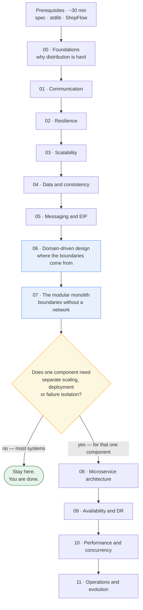

A step-by-step, example-driven course in microservices, distributed system patterns, and
enterprise integration patterns — built to be *worked through*, not skimmed.

Every pattern is taught the same way: the problem that creates it, an analogy that
explains the mechanism, precise technical detail, working pseudo-code in a consistent
notation, the failure modes it introduces, the alternatives, and an honest accounting of
what it costs you.

---

## Start here

1. **[The pseudo-code spec](/spec/PSEUDOCODE-SPEC)** — the notation every example uses. ~15 min.
2. **[The standard library](/spec/STDLIB)** — the `Store`, `Queue`, `Topic`, `Client` primitives. ~10 min.
3. **[ShopFlow](/domain/RUNNING-EXAMPLE)** — the e-commerce system that every lesson builds on. ~10 min.
4. **[The curriculum](/CURRICULUM)** — all 67 lessons, and which order to take them in.

Then: [Module 00 — Foundations](/modules/foundations/README).

---

## The learning path

The course is one line with one fork in it. The fork is the decision the whole thing is
organised around — whether your system needs a network between its components at all.



Read as four parts:

| Part | Modules | What it gives you |
|---|---|---|
| **I · Why it's hard** | 00 | The physics and the vocabulary. Nothing works without this |
| **II · The mechanics of distribution** | 01–05 | What a network costs you, and every pattern that pays it back |
| **III · Where the boundaries go** | 06–08 | Model the domain, contain it in modules, distribute only on evidence |
| **IV · Running it** | 09–11 | Surviving failure, meeting a latency budget, changing it safely |

Part II is deliberately in front of Part III. By the time you reach the fork you have spent
five modules learning what distribution costs — so [07-01](/modules/modular-monolith/01-why-a-modular-monolith-first)'s
accounting of what distribution buys and charges reads as a summary of what you have seen
rather than a provocation.

### Which route is yours

Few people read a 67-lesson course front to back. These are the entry points:

| If you are… | Start at | Then |
|---|---|---|
| Designing a new system | [06](/modules/domain-driven-design/README) → [07](/modules/modular-monolith/README) | Stop. Return when the fork's test says yes |
| Firefighting a fragile system | [00-02](/modules/foundations/02-fallacies-of-distributed-computing), [00-03](/modules/foundations/03-failure-models-and-partial-failure) | All of [02](/modules/resilience/README), then [11-01](/modules/operations-and-evolution/01-observability) |
| Splitting a monolith | [00-01](/modules/foundations/01-why-distributed-systems) | [06](/modules/domain-driven-design/README) → [07](/modules/modular-monolith/README) → [08](/modules/microservice-architecture/README) |
| Suffering from microservices | [07-01](/modules/modular-monolith/01-why-a-modular-monolith-first) | [07-05](/modules/modular-monolith/05-extracting-a-module-into-a-service) in reverse |
| Integrating a legacy system | [01-02](/modules/communication/02-asynchronous-messaging) | [05](/modules/messaging-and-eip/README) → [08-05](/modules/microservice-architecture/05-strangler-fig), [08-06](/modules/microservice-architecture/06-anti-corruption-layer) |
| Chasing a specific symptom | [Decision guide](/reference/DECISION-GUIDE) | It maps symptoms to lessons directly |

The full set, with reasons, is in [the curriculum](/CURRICULUM#suggested-paths).

---

## What this covers

| Module | Topic | Lessons |
|---|---|---|
| [00](/modules/foundations/README) | Foundations — why it's hard | 5 |
| [01](/modules/communication/README) | Communication — how services talk | 5 |
| [02](/modules/resilience/README) | Resilience — surviving dependency failure | 8 |
| [03](/modules/scalability/README) | Scalability — serving more, not slower | 6 |
| [04](/modules/data-and-consistency/README) | Data and consistency across services | 7 |
| [05](/modules/messaging-and-eip/README) | Messaging and enterprise integration | 7 |
| [06](/modules/domain-driven-design/README) | Domain-driven design — where boundaries come from | 6 |
| [07](/modules/modular-monolith/README) | The modular monolith — boundaries without a network | 5 |
| [08](/modules/microservice-architecture/README) | Microservice architecture and boundaries | 6 |
| [09](/modules/availability-and-dr/README) | Availability and disaster recovery | 4 |
| [10](/modules/performance-and-concurrency/README) | Performance and concurrency | 4 |
| [11](/modules/operations-and-evolution/README) | Operations and evolution | 4 |

**Why the numbering starts at 00.** Module 00 contains no patterns — it is the physics, the
vocabulary and the failure taxonomy that the other eleven modules assume. Numbering it 00
marks it as prerequisite rather than as the first topic, the same way a book numbers its
front matter differently from Chapter 1. Lessons are two-digit and zero-padded
(`03-04-partitioning-and-sharding.md`) so that files sort correctly in any directory listing
and every reference is a fixed width: `04-02` is always a saga, in prose, in a filename and
in a link.

---

## How each lesson is structured

Twelve fixed sections, always in the same order — so you can jump straight to §8 for the
trade-offs or §6 for the failure modes without reading the prose.

1. The problem · 2. In plain language · 3. How it works · 4. Pseudo-code ·
5. Knobs and variants · 6. Challenges and failure modes · 7. Alternatives ·
8. Trade-offs · 9. Complexity introduced · 10. Related concepts · 11. Exercises · 12. References

The full contract is in [the lesson template](/spec/LESSON-TEMPLATE).

---

## Why pseudo-code

Real code teaches a framework. Pseudo-code teaches a pattern.

The notation used here ([DSPL](/spec/PSEUDOCODE-SPEC)) is deliberately close to typed
Python: indentation blocks, `async`/`await`, `Result<T,E>` for expected failure,
exceptions for infrastructural failure, and first-class `Duration` literals so that every
timeout is visible in the code rather than buried in a config file.

Two rules make the examples honest:

- **Every network call shows its timeout**, or a comment explaining why it doesn't need one.
- **Every trap is marked `# TRAP:`** — the line where the double charge, the lost update,
  or the split brain actually happens.

---

## Repository layout

```
.
├── README.md                    you are here
├── CURRICULUM.md                all 67 lessons, ordered, with reading paths
├── GLOSSARY.md                  terms → the lesson that teaches them
├── spec/
│   ├── PSEUDOCODE-SPEC.md       the DSPL language
│   ├── STDLIB.md                built-in primitives + mapping to real technology
│   └── LESSON-TEMPLATE.md       the structure every lesson follows
├── domain/
│   └── RUNNING-EXAMPLE.md       ShopFlow: services, types, events, traffic numbers
├── modules/
│   ├── 00-foundations/          … 11-operations-and-evolution/
│   └── <NN>-<name>/
│       ├── README.md            module overview, what breaks without it
│       └── NN-MM-<lesson>.md
└── reference/
    ├── PATTERN-INDEX.md         A–Z pattern lookup
    ├── DDD-REFERENCE.md         the complete DDD catalogue
    ├── DECISION-GUIDE.md        symptom → pattern
    └── BIBLIOGRAPHY.md          sources
```

---

## How to actually learn this

Reading a pattern catalogue produces the illusion of competence. Three habits break it:

**Do the §11 exercises, especially "Break it".** Every lesson ends with a challenge to find
the input or the timing that defeats the code shown. The bug is always there. Finding it is
the lesson.

**Argue with §8 before you read §7.** Given the problem statement and the mechanism, try to
predict the trade-offs and the alternatives yourself. Then check.

**Apply each pattern to a system you actually work on.** After each module, write three
sentences: where in your system this failure mode exists, whether the pattern is present,
and what it would cost to add. Patterns learned in the abstract do not transfer.

---

## Learning goals this course serves

Resilience under failure (Module 02) · horizontal scalability (03) · seamless integration
(01, 05) · flexibility through decoupling (06, 07, 08) · consistency across services (04) ·
availability and DR (09) · performance under load (10) · enterprise-scale integration (05)
· evolution and continuous improvement (11).

**Start with 06 and 07 if you are designing a new system.** Modules 06 and 07 stand alone as
complete references on domain-driven design and the modular monolith, and between them they
answer the question the other ten modules assume you have already settled: where do the
boundaries go, and do they need a network between them?

---

**Next:** [Read the pseudo-code spec →](/spec/PSEUDOCODE-SPEC)
