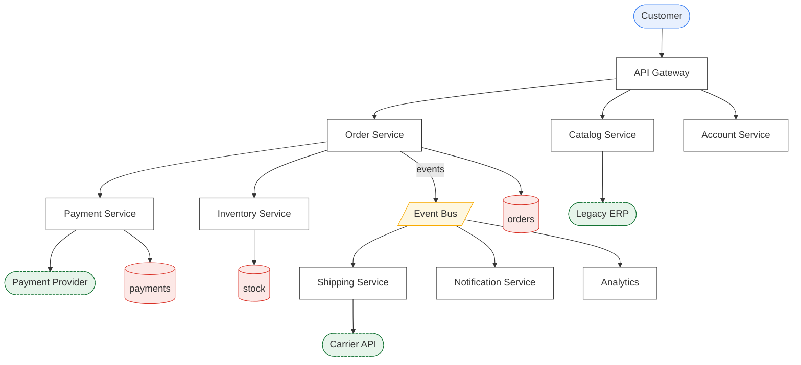
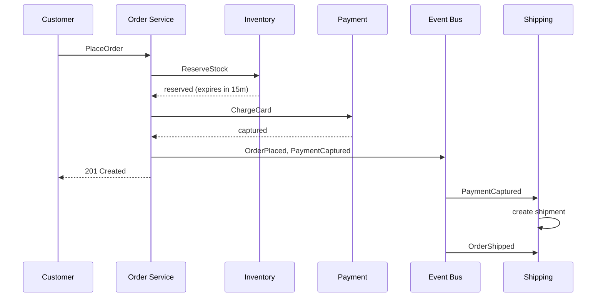
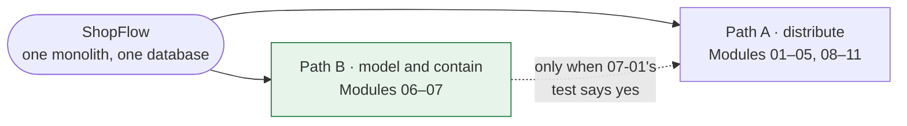

Every lesson in this course uses one system. You will watch it grow from a single process,
and you will feel each pattern arrive because something broke without it.

It grows down **two paths**: distributed (most of the course) and modelled-then-contained
(Modules 06–07). Those are alternatives for the same business, not stages of one history —
see [How ShopFlow evolves](#how-shopflow-evolves) before you read Module 06.

Keeping one domain across 67 lessons is deliberate: the interesting part of distributed
systems is not any single pattern but how patterns *interact*. You cannot see that with a
fresh example every chapter.

---

## The business

ShopFlow is an online retailer. A customer browses a catalogue, adds items to a basket,
places an order, pays, and receives a parcel. Behind that, a warehouse picks stock, a
carrier ships it, finance reconciles payments, and a 20-year-old ERP system nobody wants
to touch owns the master product data.

That last sentence is why this course includes enterprise integration patterns.

---

## Services



| Service | Owns | Notes |
|---|---|---|
| **API Gateway** | nothing | Auth, routing, rate limiting, response shaping |
| **Order Service** | orders, order lines | The orchestrator. Most lessons live here |
| **Catalog Service** | product view | Read-heavy; master data comes from the ERP |
| **Inventory Service** | stock levels, reservations | Strongly consistent; the contention hotspot |
| **Payment Service** | payments, refunds | Wraps an external PSP. Money = no lost updates |
| **Shipping Service** | shipments | Talks to slow, flaky carrier APIs |
| **Notification Service** | nothing durable | Email/SMS. Best-effort, at-least-once |
| **Account Service** | customers, addresses | Low traffic, high sensitivity |
| **Analytics** | read models | Eventually consistent by design |

**External systems** are drawn with a dashed border because you cannot change them,
cannot make them faster, and cannot make them stop failing. Everything in Module 02 exists
because of them.

---

## Core types

These are used verbatim throughout the course.

```
type OrderId    = String
type CustomerId = String
type Sku        = String
type PaymentId  = String

record Money:
  amount: Int          # minor units — cents. Never a Float.
  currency: String

record OrderLine:
  sku: Sku
  qty: Int
  unit_price: Money

record Order:
  id: OrderId
  customer_id: CustomerId
  lines: List<OrderLine>
  total: Money
  status: OrderStatus
  placed_at: Instant
  version: Int

enum OrderStatus:
  DRAFT | PENDING_PAYMENT | PAID | PICKING | SHIPPED | DELIVERED | CANCELLED | REFUNDED

record Reservation:
  id: UUID
  order_id: OrderId
  sku: Sku
  qty: Int
  expires_at: Instant

record Customer:
  id: CustomerId
  email: String
  tier: BRONZE | SILVER | GOLD
```

## Core messages

```
command PlaceOrder:
  request_id: UUID              # client-supplied idempotency key
  customer_id: CustomerId
  lines: List<OrderLine>

command ReserveStock:
  order_id: OrderId
  lines: List<OrderLine>

command ChargeCard:
  order_id: OrderId
  customer_id: CustomerId
  amount: Money
  idempotency_key: UUID

event OrderPlaced:      order_id, customer_id, total, occurred_at
event StockReserved:    order_id, reservation_ids, occurred_at
event StockRejected:    order_id, missing: List<Sku>, occurred_at
event PaymentCaptured:  order_id, payment_id, amount, occurred_at
event PaymentFailed:    order_id, reason, occurred_at
event OrderShipped:     order_id, tracking_number, carrier, occurred_at
event OrderCancelled:   order_id, reason, occurred_at
```

---

## The happy path



Read that diagram again and note how many places it can go wrong. Reserve succeeds but
charge times out. Charge succeeds but the response is lost. The event is published but the
order row was rolled back. Shipping receives `PaymentCaptured` twice. The reservation
expires while the payment provider is retrying.

**Every single lesson in Modules 02, 04 and 05 is a fix for one of those sentences.**

---

## Traffic and constraints

Concrete numbers, so trade-offs have units.

| | |
|---|---|
| Catalogue reads | 12,000 req/s peak, 95% of all traffic |
| Order placement | 120 req/s peak, 600 req/s on sale days |
| Order → payment latency budget | 2s p99 end to end |
| Payment provider | 300ms p50, 4s p99, ~0.5% error rate, 50 req/s contractual cap |
| Carrier API | 2s p50, occasionally down for hours |
| Legacy ERP | batch export every 15 minutes, no API |
| Data | 40M orders, 200k SKUs, 8M customers |
| Availability target | 99.95% for checkout (≈ 22 min/month) |

The payment provider's 50 req/s cap versus 600 req/s of sale-day orders is not an
oversight. It is [Module 02](/modules/resilience/README).

The ERP's 15-minute batch export versus a catalogue that must serve 12,000 req/s is not an
oversight either. It is [Module 05](/modules/messaging-and-eip/README).

---

## How ShopFlow evolves

The course runs ShopFlow down **two paths through the same domain**, and it is worth knowing
which one you are reading at any moment. They are not sequential stages of one history; they
are alternatives, and the whole argument of Modules 06–07 is that the second is where most
systems should stop.



### Path A — ShopFlow distributed

The main line of the course. Nine services, and every consequence of that choice.

| Module | ShopFlow at the end of it |
|---|---|
| 00 | One monolith, one database. Works fine until it doesn't |
| 01 | Split into services that call each other; contracts and discovery appear |
| 02 | The payment provider degrades and checkout survives it |
| 03 | Handles 12,000 req/s of catalogue traffic: caching, replicas, load balancing. The order store stays on one machine — see the note below |
| 04 | Order + payment + stock stay consistent without distributed transactions |
| 05 | The legacy ERP is integrated without anyone modifying the ERP |
| 08 | The boundaries are principled rather than accidental |
| 09 | Survives losing an entire region |
| 10 | Meets its p99 budget under contention |
| 11 | Can be changed on a Friday afternoon |

**A note on sharding.** [03-04](/modules/scalability/04-partitioning-and-sharding)
uses ShopFlow to work through partition-key choice, and the
[capstone](/modules/operations-and-evolution/04-capstone-designing-a-system)
*rejects* sharding for ShopFlow because 40M orders × 2KB = 80GB fits comfortably on one
machine. Both are deliberate: the lesson teaches the technique against a familiar domain, and
the capstone shows the arithmetic that says not to use it. ShopFlow's canonical order store is
**not sharded**. Treat 03-04's ShopFlow examples as a worked hypothetical.

### Path B — the same domain, had it started here

**A counterfactual, not a later stage.** Modules 06 and 07 rewind to the same business and ask
what it would look like if the modelling had come first and the network had been declined.

| Module | ShopFlow at the end of it |
|---|---|
| 06 | The model has a language. "Product" stops meaning four things; the aggregates and their invariants are explicit |
| 07 | Six enforced modules in **one deployable**, one database, schema per module. No sagas, no outbox, no network — and the catalogue extracted when, and only when, 12,000 req/s makes it arithmetic |

Read the two tables against each other. Path B reaches most of Path A's *structural* goals —
ownership, boundaries, comprehensible components — without Modules 02 and 04 applying at all.
What it does not reach is independent deployment and independent scaling, which is precisely
the trade [07-01](/modules/modular-monolith/01-why-a-modular-monolith-first) asks
you to price.

**The two paths converge at [07-05](/modules/modular-monolith/05-extracting-a-module-into-a-service).**
Extracting a module is how a Path B system becomes a Path A system, one component at a time,
on evidence — which is the route this course recommends over starting at Path A.

---

**See also:** [Language spec](/spec/PSEUDOCODE-SPEC) · [Stdlib](/spec/STDLIB) · [Curriculum](/CURRICULUM)
