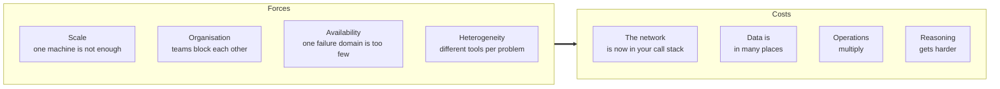

> Distribution is not an achievement. It is a cost you pay to buy something you could not
> otherwise have — and you should be able to name the something.

| | |
|---|---|
| **Module** | [00 — Foundations](/modules/foundations/README) |
| **Prerequisites** | none |
| **Also known as** | "should we do microservices?" |
| **Category** | Structure |

---

## 1. The problem

ShopFlow is one process talking to one database. It works. Then:

- A Black Friday sale needs 20× the checkout capacity, but the only way to get it is to run
  20 copies of *everything*, including the analytics jobs that don't need it.
- The catalogue team wants to ship twice a day. The payments team needs a two-week
  compliance review per release. They share a deploy pipeline, so everyone ships every two
  weeks.
- A memory leak in report generation takes down checkout, because they are the same
  process.
- The recommendation team wants to use a language with good ML libraries. They can't.
- A single database in one datacentre means a datacentre outage is a company outage.

The observable symptom is not technical. It is that **the time from "we decided" to "it is
live" keeps growing**, and no amount of hiring shortens it.

## 2. In plain language

A single restaurant kitchen is wonderfully efficient: one fridge, one pass, everyone hears
everyone. Then it gets popular. You cannot make one kitchen twice as fast by hiring twice
the chefs — they collide at the same fridge. So you open a second location. Now you can
serve twice as many people, and the pastry chef can rebuild her station without closing
the restaurant.

But you have also created problems that did not exist. Which fridge has the last of the
truffles? If a delivery goes to one site, does the other know? If the phone line between
them drops, do you keep taking orders and risk promising food you cannot cook, or refuse
orders you could have cooked?

**Where the analogy breaks down:** restaurants can phone each other and get a human answer.
Services get silence, and silence has two meanings — see [00-03](/modules/foundations/03-failure-models-and-partial-failure).

## 3. How it works

There are exactly four forces that justify distribution. If none applies, don't.



**Scale.** Vertical scaling has a ceiling and a price curve that goes vertical near it.
Beyond that ceiling, more capacity means more machines, which means coordination.

**Organisation.** Conway's Law, run forwards: system structure mirrors communication
structure. If four teams share one deployable, they share one release cadence and one
blast radius. Splitting the deployable is how you split the calendar. *This is the most
common real reason, and the least often stated.*

**Availability.** A single instance has a single failure domain. Redundancy requires more
than one of the thing, and more than one of the thing is a distributed system —
even if you only wanted a hot standby ([09-01](/modules/availability-and-dr/01-redundancy-and-failover)).

**Heterogeneity.** Different workloads want different tools: a search index, a graph store,
a GPU box. Integration between them is distribution.

And one force that is not a reason: **résumé-driven development**. It is real, it is
common, and it produces the worst systems in this course.

### The bill

| You gain | You pay |
|---|---|
| Independent scaling | A network between every component, with the properties in [00-02](/modules/foundations/02-fallacies-of-distributed-computing) |
| Independent deployment | Version skew: two incompatible versions running at once, forever ([01-04](/modules/communication/04-serialization-and-schema-evolution)) |
| Fault isolation | Partial failure: the "don't find out" outcome ([00-03](/modules/foundations/03-failure-models-and-partial-failure)) |
| Technology choice | N runtimes, N build pipelines, N sets of CVEs |
| Team autonomy | No cross-service transactions, joins, or foreign keys ([08-03](/modules/microservice-architecture/03-database-per-service)) |
| Per-component redundancy | Debugging a request that touched 14 services ([11-01](/modules/operations-and-evolution/01-observability)) |

## 4. Pseudo-code

**Before — the monolith.** One process. Note what is *absent*: no timeouts, no retries, no
idempotency keys, no partial state.

```
service ShopFlowMonolith:
  uses db: Store<Any, Any>

  handler place_order(cmd: PlaceOrder) -> Result<Order, OrderError>:
    atomically:                                 # one database, one transaction
      stock = db.get("stock:" + cmd.lines[0].sku)
      if stock.qty < cmd.lines[0].qty:
        return Err(OutOfStock)
      db.put("stock:" + cmd.lines[0].sku, stock with { qty: stock.qty - cmd.lines[0].qty })
      receipt = charge_card_in_process(cmd)     # local call: returns or throws. No third case.
      order = Order(id: uuid(), status: PAID, ...)
      db.put("order:" + order.id, order)
    return Ok(order)
```

Correct, atomic, and impossible to scale checkout without also scaling reporting.

**After — the same logic, distributed.** Every line that changed is a line where the
network entered.

```
service OrderService:
  uses inventory: Client<InventoryService>      # <- network
  uses payments: Client<PaymentService>         # <- network
  uses orders: Store<OrderId, Order>            # <- only THIS is transactional now

  @timeout(3s)
  handler place_order(cmd: PlaceOrder) -> Result<Order, OrderError>:

    reservation = await inventory.reserve(cmd.lines) timeout 500ms
    # TRAP: if this times out, stock may or may not be reserved. We cannot know.

    receipt = await payments.charge(cmd) timeout 800ms
    # TRAP: if this times out, the customer may or may not have been charged.

    order = Order(id: uuid(), status: PAID, ...)
    orders.put(order.id, order)
    # TRAP: if the process dies here, money moved and no order exists.

    return Ok(order)
```

Three lines, three new failure modes that the monolith did not have. The rest of this
course is the disciplined removal of those three `# TRAP` comments — see
[02-01](/modules/resilience/01-timeouts-and-deadlines),
[04-02](/modules/data-and-consistency/02-saga),
[04-03](/modules/data-and-consistency/03-transactional-outbox).

## 5. Knobs and variants

| Choice | When it's right | When it bites |
|---|---|---|
| **Monolith** | Small team, unproven domain, <100 req/s | When deploy contention starts costing weeks |
| **Modular monolith** | You want boundaries but not networks. Almost always the right first step | When one module genuinely needs different scaling or availability |
| **Service-oriented (coarse)** | 3–10 services aligned to teams | When a "service" grows five unrelated responsibilities |
| **Microservices (fine)** | Many teams, mature ops platform | Below ~20 engineers the ops tax exceeds the benefit |
| **Serverless functions** | Spiky, embarrassingly parallel work | Cold starts, per-invocation cost, no place for local state |

**The default recommendation is a modular monolith.** It gives you the boundary discipline
of services with none of the network. Extract a service when you can name which of the four
forces is pushing, and the boundary has stopped moving.

## 6. Challenges and failure modes

- **The distributed monolith.** Services that must deploy together, share a database, and
  call each other synchronously in a chain. All the costs, none of the benefits. It is the
  single most common outcome of a badly-motivated split. Diagnostic: can you deploy service
  B without coordinating with team A? ([08-01](/modules/microservice-architecture/01-decomposition-and-bounded-contexts))
- **Boundaries drawn too early.** Extracting a service freezes a boundary. If the domain is
  still being learned, you will freeze the wrong one, and moving a boundary across a network
  is 50× the work of moving one across a package.
- **Availability arithmetic.** Chaining services *multiplies* their availability. Five
  services at 99.9% each, called synchronously in sequence, yields 99.5% — from 43 minutes
  of downtime a month to 3.6 hours. Distribution makes you *less* available by default;
  Module 02 is how you get the availability back.
- **Latency arithmetic.** Same problem for the tail: see [10-04](/modules/performance-and-concurrency/04-tail-latency-and-hedged-requests).
- **The ops floor.** Services need CI, deploy, service discovery, tracing, secrets,
  on-call. That platform costs roughly the same whether you have 3 services or 30, which is
  why 3 services usually isn't worth it.

## 7. Alternatives

- **Do nothing.** Most systems are not at any of the four limits. Being slower to distribute
  than your peers is not a failure.
- **Scale vertically.** A modern single machine handles a shocking amount of load. Buying a
  bigger box is often cheaper than an engineering quarter.
- **Modular monolith.** Enforce boundaries at compile time. Cheapest possible boundary.
- **Extract only the hotspot.** Pull out the one component that needs different scaling
  (image resizing, report generation) and leave the rest alone.
- **Read replicas.** If the pressure is read traffic, [replication](/modules/scalability/05-replication)
  buys a lot without any decomposition at all.

## 8. Trade-offs

| Advantage | Disadvantage |
|---|---|
| Components scale independently to their own demand | Every call between them can now fail in a third way |
| Teams deploy on their own cadence | Two versions of everything coexist in production, permanently |
| A failure can be contained to one component | A failure can also *cascade* through components ([02-04](/modules/resilience/04-bulkhead)) |
| Right tool per job | Every tool needs operating, patching, and staffing |
| Clear ownership boundaries | Cross-boundary changes need negotiation and versioned contracts |
| Redundancy becomes possible | Consistency becomes hard ([Module 04](/modules/data-and-consistency/README)) |

## 9. Complexity introduced

- **Operational.** Service discovery, distributed tracing, per-service dashboards and
  alerts, deployment orchestration, certificate rotation, N on-call rotations. Assume a
  dedicated platform investment before the fifth service.
- **Cognitive.** No engineer can hold the whole system in their head. Understanding one
  request requires reading code in several repositories, which is why
  [tracing](/modules/operations-and-evolution/01-observability) stops being optional.
- **Failure surface.** Network partitions, partial failures, version skew, cascading
  failure, retry storms, clock skew, hot partitions — none of which existed before.
- **Testing.** Integration testing now needs either a full environment or
  [contract tests](/modules/communication/04-serialization-and-schema-evolution).
  "It works on my machine" becomes literally true and completely useless.

## 10. Related concepts

- **Builds on:** nothing — this is the entry point
- **Composes with:** [00-04 capacity estimation](/modules/foundations/04-latency-throughput-and-back-of-envelope) (is one machine really not enough?)
- **Conflicts with / tension:** simplicity; every lesson after this one is a tax
- **Contrast with:** [08-01 bounded contexts](/modules/microservice-architecture/01-decomposition-and-bounded-contexts) — *whether* to split versus *where* to cut
- **Leads to:** [00-02 fallacies](/modules/foundations/02-fallacies-of-distributed-computing), [Module 01](/modules/communication/README)

## 11. Exercises

1. **Trace it.** Take the "After" pseudo-code. The `payments.charge` call times out at
   800ms, but the payment provider actually captured the money at 820ms. Write down what
   the customer sees, what the database contains, and what the payment provider's ledger
   contains. Now write the sentence you would put in a postmortem.
2. **Extend it.** ShopFlow's five services each have 99.9% availability and checkout calls
   four of them synchronously. Compute checkout's availability. Then compute it again
   assuming two of those calls are made asynchronously via a queue. Which single change
   bought the most?
3. **Break it.** Argue the strongest possible case that ShopFlow should *not* be split,
   given the numbers in [the running example](/domain/RUNNING-EXAMPLE). Which of
   the four forces survives your own argument?

## 12. References

- Sam Newman, *Building Microservices*, 2nd ed. — Ch. 1–3 on coupling and cohesion.
- Martin Fowler, "MonolithFirst" and "Microservice Trade-Offs".
- Melvin Conway, "How Do Committees Invent?" (1968) — the original of Conway's Law.
- Werner Vogels, "A Conversation with Werner Vogels" (ACM Queue, 2006) — the Amazon split.
- Martin Kleppmann, *Designing Data-Intensive Applications* — Ch. 1.

---

**Up:** [Module 00](/modules/foundations/README) · **Next:** [00-02 The fallacies of distributed computing →](/modules/foundations/02-fallacies-of-distributed-computing)
