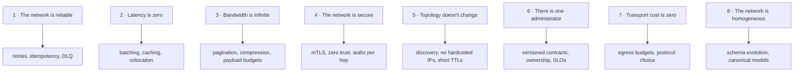

> Eight assumptions that every engineer makes by default, all of which are false, each of
> which has caused a production outage this week somewhere.

| | |
|---|---|
| **Module** | [00 — Foundations](/modules/foundations/README) |
| **Prerequisites** | [00-01 Why distributed systems](/modules/foundations/01-why-distributed-systems) |
| **Also known as** | Deutsch's fallacies (Peter Deutsch, Sun Microsystems, 1994) |
| **Category** | Foundations |

---

## 1. The problem

A local function call has properties so reliable that we stopped noticing them: it always
returns, it takes nanoseconds, it cannot be read by a third party, and it never partially
succeeds. Remote calls look identical in code — `payments.charge(order)` — and share none of
those properties.

The symptom is an outage whose postmortem contains a sentence like "we assumed the call
would either succeed or fail quickly." Every such sentence is one of the eight fallacies.

## 2. In plain language

Posting a letter feels like handing someone a note across a table, if you never think about
it. But the letter can be lost, delayed by a week, opened, arrive after the letter you sent
later, or arrive twice because you posted a copy when you got worried. It costs money per
letter. The address may have changed. The postal service is run by someone you cannot phone.

Programming a remote call as if it were a local call is writing "hand this to Bob" on your
to-do list and being surprised when Bob doesn't have it three seconds later.

**Where the analogy breaks down:** with a letter you *know* it might be lost. The whole
danger of a remote call is that the syntax hides it.

## 3. How it works



### 1. The network is reliable

Packets are lost, connections reset, load balancers drop idle sockets, a cable is
unplugged. Cloud providers publish ~99.99% availability *per link*, and you traverse many
links.

*Consequence:* every remote call needs a [timeout](/modules/resilience/01-timeouts-and-deadlines),
a decision about [retrying](/modules/resilience/02-retries-backoff-and-jitter), and —
because retries duplicate — an [idempotency](/modules/communication/03-delivery-guarantees-and-idempotency) story.

### 2. Latency is zero

A local call is ~1ns. A call within a datacentre is ~0.5ms. Across a continent, ~40ms.
Across the world, ~150ms, and physics will not improve it. Chatty interfaces that were free
in-process become the dominant cost.

*Consequence:* coarse-grained APIs, batching, [caching](/modules/scalability/03-caching),
[BFFs](/modules/microservice-architecture/02-api-gateway-and-backend-for-frontend) that
collapse N calls into one, and a hard look at [tail latency](/modules/performance-and-concurrency/04-tail-latency-and-hedged-requests).

### 3. Bandwidth is infinite

The "just return the whole object" habit costs nothing locally. Over the wire, a 2MB
response at 600 req/s is 1.2 GB/s.

*Consequence:* pagination, field selection, compression, [payload budgets](/modules/communication/04-serialization-and-schema-evolution),
and never putting a blob in a message when a pointer to a blob will do (EIP: *Claim Check*).

### 4. The network is secure

The internal network is not a trust boundary. One compromised pod can call every service.

*Consequence:* mTLS between services, authentication and *authorisation* on every hop
(often via a [sidecar](/modules/microservice-architecture/04-sidecar-and-service-mesh)),
secrets that rotate, and no "internal-only" endpoint that skips authz.

### 5. Topology doesn't change

Instances are created and destroyed continuously. IP addresses are ephemeral. An autoscaler
changes the topology while you are reading this.

*Consequence:* [service discovery](/modules/communication/05-service-discovery), health
checking, connection draining, and never caching a resolved address longer than its TTL.

### 6. There is one administrator

The service you call is owned by another team, or another company. They will deploy during
your peak, deprecate a field, change a limit, or have an incident you learn about from your
own dashboards.

*Consequence:* versioned contracts, explicit SLOs, [anti-corruption layers](/modules/microservice-architecture/06-anti-corruption-layer),
and defensive resilience around anything you don't control.

### 7. Transport cost is zero

Serialization burns CPU. Cross-AZ and cross-region traffic is billed per gigabyte. A chatty
service mesh can cost more than the compute it coordinates.

*Consequence:* efficient encodings, awareness of which hops cross a billing boundary, and
[data locality](/modules/availability-and-dr/02-multi-region-architecture) as a cost
decision, not only a latency one.

### 8. The network is homogeneous

Different languages, protocols, encodings, character sets, date formats, and a mainframe
that speaks fixed-width EBCDIC on a Tuesday.

*Consequence:* explicit schemas with [evolution rules](/modules/communication/04-serialization-and-schema-evolution)
and, at enterprise scale, a [canonical data model](/modules/messaging-and-eip/04-message-translator-and-canonical-data-model).

## 4. Pseudo-code

**Before — code that believes all eight fallacies.**

```
service CheckoutService:
  uses catalog: Client<CatalogService>

  handler get_basket_view(ids: List<Sku>) -> BasketView:
    items = []
    for id in ids:                       # fallacy 2: N round-trips, ~40ms each
      items.append(await catalog.get_full_product(id))
      # fallacy 3: get_full_product returns 300KB of description, images, reviews
    return BasketView(items)             # fallacy 1: no timeout, no error path at all
```

With 20 basket lines across a region: 20 × 40ms = 800ms of pure latency, 6MB transferred,
and one dropped packet hangs the request forever.

**After — the same intent, disbelieving each fallacy.**

```
service CheckoutService:
  uses catalog: Client<CatalogService>
    with timeout(300ms),                                  # 1: bounded
         retry(max: 2, backoff: exponential(base: 20ms, jitter: full)),
         circuit_breaker(threshold: 10, cooldown: 15s)
  uses cache: Cache<Sku, ProductSummary>

  @timeout(1s)
  handler get_basket_view(ids: List<Sku>) -> Result<BasketView, Error>:

    hits = [cache.get(id) for id in ids where present]    # 2: avoid the network entirely
    misses = ids - keys(hits)

    if misses.is_empty():
      return Ok(BasketView(hits))

    try:
      # 2 + 3: one batched call, summary projection only (~2KB/item, not 300KB)
      fresh = await catalog.get_summaries(misses, fields: [sku, name, price, thumb_url])
    catch TimeoutError, CircuitOpenError:
      # 1 + 6: the dependency is someone else's; degrade rather than fail
      return Ok(BasketView(hits, degraded: misses))       # see 02-07

    for p in fresh:
      cache.put(p.sku, p, ttl: 5m + jitter(30s))          # 5: short TTL, jittered

    return Ok(BasketView(hits + fresh))
```

Nothing about the business logic changed. Everything about its behaviour under failure did.

## 5. Knobs and variants

| Fallacy | Cheapest useful mitigation | The expensive full answer |
|---|---|---|
| 1 Reliable | A timeout on every call | Retries + idempotency + DLQ + reconciliation |
| 2 Zero latency | Batch the obvious N+1 | Caching tiers, BFF, colocation, hedging |
| 3 Infinite bandwidth | Paginate | Field selection, compression, claim check |
| 4 Secure | Authn on internal endpoints | mTLS everywhere, per-request authz, mesh policy |
| 5 Fixed topology | Use DNS names, not IPs | Registry + health checks + graceful drain |
| 6 One admin | Write down the contract | Versioning, consumer-driven contract tests, ACL |
| 7 Free transport | Know your egress bill | Protocol choice, locality-aware routing |
| 8 Homogeneous | One schema registry | Canonical model + translators at the edge |

## 6. Challenges and failure modes

- **The fallacies are believed by *frameworks*, not just engineers.** ORMs with lazy loading
  produce N+1 remote calls invisibly. A generated client with a 60-second default timeout
  believes fallacy 1 on your behalf.
- **They fail together.** A latency spike (2) fills connection pools (3, 7), causing
  timeouts (1), causing retries that amplify the load, causing more latency. This feedback
  loop is the shape of most large outages. See [02-02](/modules/resilience/02-retries-backoff-and-jitter).
- **Mitigations have their own fallacies.** A cache assumes staleness is acceptable. A retry
  assumes the operation is idempotent. Each mitigation is a new assumption to write down.
- **Fallacy 6 is organisational and cannot be fixed with code.** No amount of resilience
  makes another team's breaking change safe. Only contracts do.

## 7. Alternatives

There is no alternative to disbelieving them. There are two ways to *pay* for the
disbelief:

- **In application code.** Explicit timeouts, retries, breakers per call site. Maximum
  control, maximum duplication, and it drifts between services.
- **In infrastructure.** A [service mesh](/modules/microservice-architecture/04-sidecar-and-service-mesh)
  or API gateway applies the same policies uniformly, out of the application. Less control,
  no drift, one more system to operate — and it cannot make an operation idempotent for you.

Most mature systems use both: mesh for the mechanical mitigations, code for the semantic
ones (idempotency, fallback, degradation).

## 8. Trade-offs

| Advantage of taking them seriously | Disadvantage |
|---|---|
| Failures become bounded and diagnosable | Every call site grows configuration |
| Latency and cost become visible design inputs | Batching and caching complicate the data model |
| Security posture survives one compromised host | mTLS and authz add operational machinery |
| The system tolerates other teams' changes | Contracts slow down cross-team iteration |

## 9. Complexity introduced

- **Operational.** Timeout/retry/breaker settings become a tuning surface with real
  incidents behind bad values. Certificates expire. Schema registries need running.
- **Cognitive.** Every call site now has visible policy. A reader must understand *why* a
  timeout is 300ms and not 3s. Document the budget ([02-01](/modules/resilience/01-timeouts-and-deadlines)).
- **Failure surface.** Mitigations add failure modes: a cache serves stale prices, a breaker
  trips on a false signal, a retry duplicates a charge.
- **Testing.** You must now test the failure paths, which means fault injection —
  [chaos engineering](/modules/availability-and-dr/04-chaos-engineering) exists because
  these paths are otherwise never executed until an incident executes them.

## 10. Related concepts

- **Builds on:** [00-01 Why distributed systems](/modules/foundations/01-why-distributed-systems)
- **Composes with:** all of [Module 02](/modules/resilience/README) — it is the fallacies, answered one at a time
- **Contrast with:** [00-03 failure models](/modules/foundations/03-failure-models-and-partial-failure) — the fallacies are the *assumptions*, failure models are the *taxonomy*
- **Leads to:** [01-01 Synchronous request/response](/modules/communication/01-synchronous-request-response)

## 11. Exercises

1. **Trace it.** Take the "Before" code with 20 basket lines. Assume 40ms per call, one call
   in twenty times out after the client default of 60s. What is the p50 and the p99 of
   `get_basket_view`? What does the user's browser do at p99?
2. **Extend it.** The "After" version caches for 5 minutes. A merchandiser changes a price.
   Write the mechanism by which the change reaches the cache in under 10 seconds, and name
   the new fallacy your mechanism assumes away.
3. **Break it.** Find the fallacy still believed in the "After" code. (Hint: what happens to
   `cache` when the process restarts, and what happens to `catalog` when 200 instances
   restart at the same moment?)

## 12. References

- Peter Deutsch and James Gosling, "The Eight Fallacies of Distributed Computing" (1994/1997).
- Arnon Rotem-Gal-Oz, "Fallacies of Distributed Computing Explained".
- Jim Waldo et al., "A Note on Distributed Computing" (Sun, 1994) — the argument that local
  and remote calls must not look alike.
- Michael Nygard, *Release It!*, 2nd ed. — Ch. 4, "Stability Antipatterns".

---

**Up:** [Module 00](/modules/foundations/README) · **Previous:** [← 00-01](/modules/foundations/01-why-distributed-systems) · **Next:** [00-03 Failure models →](/modules/foundations/03-failure-models-and-partial-failure)
