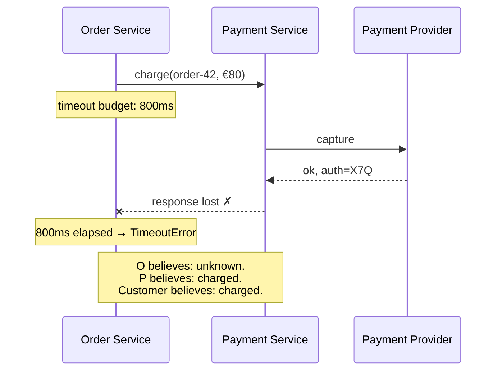

> In a single process a call returns or throws. Across a network there is a third outcome:
> you never find out. Almost everything difficult follows from that one fact.

| | |
|---|---|
| **Module** | [00 — Foundations](/modules/foundations/README) |
| **Prerequisites** | [00-02 Fallacies](/modules/foundations/02-fallacies-of-distributed-computing) |
| **Also known as** | partial failure, the two generals problem, ambiguous outcomes |
| **Category** | Foundations |

---

## 1. The problem

ShopFlow's Order Service calls Payment Service. After 800ms, nothing has come back.

What happened? Enumerate honestly:

1. The request never left. Nothing happened.
2. The request arrived; Payment crashed before charging. Nothing happened.
3. Payment charged the card, then crashed before replying. **Money moved.**
4. Payment charged and replied; the reply was lost. **Money moved.**
5. Everything worked and the reply arrives at 810ms, after you gave up. **Money moved.**

From the caller's position these five are *indistinguishable*. The observable symptom in
production is a customer with two charges and one order, or one charge and no order, and a
support ticket that takes an engineer four hours to reconstruct.

## 2. In plain language

Two generals on opposite hills must attack at the same time to win. They can only
communicate by messenger through the enemy valley, where messengers are sometimes captured.
General A sends "attack at dawn." Did it arrive? He needs an acknowledgement. B sends one —
but did *that* arrive? A must acknowledge the acknowledgement. This never terminates. No
finite number of messages makes both generals *certain* the other will attack.

They can still win. Not by achieving certainty, but by agreeing in advance on a rule that is
safe under uncertainty: "if you receive no cancellation by dawn, attack." That move — from
"know the truth" to "behave correctly without knowing it" — is the whole of distributed
systems engineering.

**Where the analogy breaks down:** generals can't retry cheaply. You can, thousands of times
a second, which is why [idempotency](/modules/communication/03-delivery-guarantees-and-idempotency)
does the work certainty cannot.

## 3. How it works

### The taxonomy of failure

Ordered from easiest to hardest to tolerate.

| Model | What the component does | Detectable? | Typical cause |
|---|---|---|---|
| **Fail-stop** | Halts, and everyone is reliably told | Yes | Idealised; assumed in textbooks |
| **Crash** | Halts silently | Only by timeout — indistinguishable from slow | Process kill, OOM, power loss |
| **Omission** | Drops some messages, keeps running | Partially | Packet loss, full queue, dropped connection |
| **Timing** | Responds, but too late to be useful | By deadline | GC pause, CPU steal, clock skew |
| **Byzantine** | Responds *incorrectly*, possibly maliciously | Only with redundancy + voting | Corruption, bugs, compromise |

Most business systems design for crash and omission, treat timing failures as crashes, and
ignore Byzantine faults (they are the domain of blockchains, avionics, and aerospace).

**The critical entry is "crash": it is indistinguishable from slow.** No timeout can tell
you which. This is not an engineering gap — it is a proof. A perfect failure detector is
impossible in an asynchronous network.

### The gray failure

Worse than a crash: a node that is *up*, passes health checks, accepts connections, and
serves 40% of requests at 30 seconds. A crashed node is removed from the load balancer. A
gray-failing node stays in it and poisons the pool. See
[02-08](/modules/resilience/08-health-checks-and-self-healing) and
[03-02](/modules/scalability/02-load-balancing).

### The ambiguity, drawn



Three parties, three different beliefs, no shared truth. The system must still behave
correctly.

### The three responses to ambiguity

There are only three, and every pattern in this course is one of them.

1. **Make the retry harmless** — [idempotency](/modules/communication/03-delivery-guarantees-and-idempotency).
   Ask again with the same key; you cannot be charged twice.
2. **Make the outcome discoverable** — reconciliation. Ask the provider later "what happened
   to key K?" and repair state to match.
3. **Make the ambiguity undoable** — [compensation](/modules/data-and-consistency/02-saga).
   Accept that both happened, then refund.

Almost all real systems use all three: idempotency for the fast path, reconciliation for the
5%, compensation for the 0.1%.

## 4. Pseudo-code

**Before — the code that creates the support ticket.**

```
handler place_order(cmd: PlaceOrder) -> Result<Order, OrderError>:
  try:
    receipt = await payments.charge(cmd.order_id, cmd.total) timeout 800ms
  catch TimeoutError:
    return Err(PaymentFailed)      # TRAP: this is a LIE. It may have succeeded.
  ...
```

Returning "payment failed" on a timeout is the single most common correctness bug in
distributed systems. A timeout is not a negative answer. It is *no answer*.

**The pattern — a three-valued outcome, and a state for it.**

```
enum ChargeOutcome:
  Captured(payment_id: PaymentId)
  Declined(reason: String)
  Unknown(idempotency_key: UUID)     # <- the outcome that must exist

service OrderService:
  uses payments: Client<PaymentService>
  uses orders: Store<OrderId, Order>
  uses pending: Store<UUID, OrderId>       # things awaiting reconciliation

  @timeout(3s)
  handler place_order(cmd: PlaceOrder) -> Result<Order, OrderError>:
    key = cmd.request_id                    # stable across every retry of this order
    order = Order(id: uuid(), status: PENDING_PAYMENT, total: total_of(cmd.lines), ...)
    orders.put(order.id, order)             # WHY: durable BEFORE the risky call, so a
                                            # crash can't lose the fact that we tried

    outcome = await try_charge(order, key)

    match outcome:
      case Captured(pid):
        orders.put(order.id, order with { status: PAID })
        return Ok(order)

      case Declined(reason):
        orders.put(order.id, order with { status: CANCELLED })
        return Err(PaymentDeclined(reason))

      case Unknown(k):
        # We do not know. We say so — to our own state, and to the user.
        pending.put(k, order.id)
        return Ok(order)                     # status stays PENDING_PAYMENT
                                             # UI: "we're confirming your payment"

  async fn try_charge(order: Order, key: UUID) -> ChargeOutcome:
    try:
      res = await payments.charge(order.id, order.total, idempotency_key: key) timeout 800ms
      return res.captured ? Captured(res.payment_id) : Declined(res.reason)
    catch TimeoutError, NetworkError:
      return Unknown(key)                    # honest, not pessimistic

  # Response 2: make the outcome discoverable.
  every 30s:
    for (key, order_id) in pending.scan():
      # Idempotent lookup by the same key — the provider knows what really happened.
      status = await payments.lookup(idempotency_key: key) timeout 2s
      match status:
        case Captured(pid): orders.update(order_id, status: PAID);      pending.delete(key)
        case Declined(_):   orders.update(order_id, status: CANCELLED); pending.delete(key)
        case StillUnknown:  pass                    # try again next tick
        # after N ticks: escalate to a human queue. Some ambiguity is not automatable.
```

**In use.** Note what the customer experiences: not an error, but "confirming your
payment," resolved within 30 seconds in the overwhelming majority of cases. Ambiguity
became a *product state* instead of a bug.

## 5. Knobs and variants

| Decision | Options | Consequence |
|---|---|---|
| Default on ambiguity | Assume success / assume failure / assume unknown | "Failure" double-charges on retry; "success" ships unpaid goods; "unknown" is correct but needs a state machine |
| Reconciliation interval | seconds ↔ hours | Short = load on the provider; long = customers wait |
| Reconciliation attempts | fixed N then escalate | Never loop forever; ambiguity that survives N tries is a human's problem |
| Where the key comes from | client-generated / server-generated on first attempt | Client-generated survives client retries too — strictly better |
| Ambiguity visibility | hidden / surfaced in UI | Surfacing it removes an entire class of duplicate-order support tickets |

## 6. Challenges and failure modes

- **Timeouts are guesses.** Too short and you create ambiguity that didn't exist; too long
  and you hold resources. The [deadline](/modules/resilience/01-timeouts-and-deadlines)
  is a resource decision, not a correctness one — correctness comes from idempotency.
- **Reconciliation needs an idempotent lookup on the other side.** If the provider has no
  "what happened to key K?" API, response 2 is unavailable and you are left with
  compensation. Check this *before* choosing a provider.
- **The pending set can grow unboundedly** during a provider outage. It is a queue, so it
  needs [backpressure](/modules/resilience/06-load-shedding-and-backpressure) and an
  alert on its depth.
- **Crash between "risky call" and "record the key".** Solved by writing the intent durably
  first, as the code above does — the general form is the
  [outbox](/modules/data-and-consistency/03-transactional-outbox).
- **Gray failure defeats timeouts entirely.** Every call succeeds at 4.9 seconds against a
  5-second timeout. Nothing trips. Everything is slow. Detect with latency percentiles, not
  error rates.
- **Clock skew** makes timing failures worse: two nodes disagree about whether a lease has
  expired, so both act. Fixed with [fencing tokens](/modules/performance-and-concurrency/01-concurrency-control),
  not with better NTP.

## 7. Alternatives

- **Two-phase commit** ([04-01](/modules/data-and-consistency/01-distributed-transactions-and-two-phase-commit))
  genuinely removes the ambiguity — by blocking until it is resolved, which converts an
  availability problem into a bigger availability problem.
- **Consensus** ([04-07](/modules/data-and-consistency/07-consensus-and-leader-election))
  gives a group of nodes an agreed answer. It works, and it costs a round-trip to a quorum
  on every decision. Reserve it for the small set of facts that truly need agreement.
- **Synchronous confirmation with the user.** "We couldn't confirm — please check your
  statement." Honest, cheap, and terrible.
- **Accept and detect.** Let duplicates happen, catch them in nightly reconciliation. Legal
  in low-value domains, unacceptable where money moves.

## 8. Trade-offs

| Advantage of modelling ambiguity explicitly | Disadvantage |
|---|---|
| No lying to the user or to your own database | Every risky operation needs a third state and a state machine |
| Retries become safe, so they become useful | Idempotency keys must be generated, propagated and stored |
| Failures resolve automatically instead of via support tickets | A reconciliation loop is a new background system to run and monitor |
| The unresolvable residue is small and visible | Someone has to own the human escalation queue |

## 9. Complexity introduced

- **Operational.** A reconciliation loop, an alert on pending depth and age, an escalation
  queue with an owner, and a runbook for manual resolution.
- **Cognitive.** Engineers must internalise "timeout ≠ failure". This is the single most
  common misunderstanding in code review; make it a checklist item.
- **Failure surface.** The reconciler itself can fail, lag, or double-resolve. It must be
  idempotent too, and it needs its own [leader election](/modules/data-and-consistency/07-consensus-and-leader-election)
  if you run more than one instance.
- **Testing.** Requires deliberately injecting the ambiguous case: succeed downstream,
  drop the response. Almost no test suite does this by default; see
  [chaos engineering](/modules/availability-and-dr/04-chaos-engineering).

## 10. Related concepts

- **Builds on:** [00-02 Fallacies](/modules/foundations/02-fallacies-of-distributed-computing)
- **Composes with:** [01-03 Delivery guarantees and idempotency](/modules/communication/03-delivery-guarantees-and-idempotency), [04-03 Outbox](/modules/data-and-consistency/03-transactional-outbox), [04-04 Idempotent consumer](/modules/data-and-consistency/04-idempotent-consumer-and-inbox)
- **Conflicts with / tension:** [04-01 2PC](/modules/data-and-consistency/01-distributed-transactions-and-two-phase-commit) — the other way to resolve ambiguity, at the cost of availability
- **Contrast with:** [02-01 Timeouts](/modules/resilience/01-timeouts-and-deadlines) — timeouts *bound* ambiguity, they do not remove it
- **Leads to:** [00-05 Consistency models](/modules/foundations/05-consistency-models-cap-and-pacelc)

## 11. Exercises

1. **Trace it.** Payment Service is charged at 790ms but the reply arrives at 830ms; the
   client retries with the same `request_id`. Walk both the pseudo-code and the provider's
   ledger through five failure scenarios in §1. In which does the customer get charged
   twice, and which line of code prevents it?
2. **Extend it.** The reconciliation loop has been running for 10 minutes and one key is
   still `StillUnknown`. Write the escalation path: what state does the order enter, what
   does the customer see, and what does the human operator get?
3. **Break it.** The `every 30s` reconciler runs on all 8 instances of Order Service
   simultaneously. Describe what happens to the payment provider at 08:00 on a sale day,
   and name two different patterns from later modules that fix it.

## 12. References

- Jim Gray, "Notes on Data Base Operating Systems" (1978) — the two generals framing.
- Fischer, Lynch, Paterson, "Impossibility of Distributed Consensus with One Faulty Process" (1985).
- Chandra & Toueg, "Unreliable Failure Detectors for Reliable Distributed Systems" (1996).
- Huang et al., "Gray Failure: The Achilles' Heel of Cloud-Scale Systems" (Microsoft, HotOS 2017).
- Kyle Kingsbury, the *Jepsen* analyses — what real systems do under partition.

---

**Up:** [Module 00](/modules/foundations/README) · **Previous:** [← 00-02](/modules/foundations/02-fallacies-of-distributed-computing) · **Next:** [00-04 Latency, throughput and back-of-envelope →](/modules/foundations/04-latency-throughput-and-back-of-envelope)
