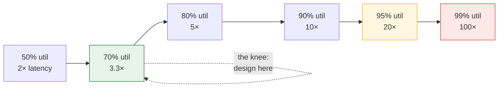

> Architecture arguments without numbers are aesthetics. This lesson gives you the numbers
> and the three formulas that turn opinions into estimates.

| | |
|---|---|
| **Module** | [00 — Foundations](/modules/foundations/README) |
| **Prerequisites** | [00-02 Fallacies](/modules/foundations/02-fallacies-of-distributed-computing) |
| **Also known as** | capacity estimation, napkin math, Little's Law |
| **Category** | Foundations |

---

## 1. The problem

"Should we cache the catalogue?" "Do we need to shard?" "Is 20 threads enough?" These get
answered by seniority instead of arithmetic, and the answers are wrong in both directions:
teams shard databases holding 4GB, and teams run a single instance behind a 12,000 req/s
endpoint.

The symptom: latency is fine in staging and terrible in production at exactly 70% CPU, and
nobody predicted it because nobody computed it.

## 2. In plain language

A supermarket checkout. **Throughput** is customers per hour. **Latency** is how long *your*
trip takes. They are not the same, and the relationship between them is not linear.

With one till and a customer every 90 seconds, taking 60 seconds each, there is never a
queue. Speed up arrivals to one every 65 seconds — still under capacity — and a queue
appears anyway, because arrivals are *bursty*. At 95% utilisation the queue is enormous and
the till is still not "full". The last 5% of capacity costs more waiting than the first 80%
combined.

**Where the analogy breaks down:** supermarket customers leave when the queue is long.
Software clients retry, which makes the queue longer — see
[02-02](/modules/resilience/02-retries-backoff-and-jitter).

## 3. How it works

### Numbers every engineer should know

Order of magnitude is what matters; memorise the shape, not the digits.

| Operation | Time | Relative |
|---|---:|---|
| L1 cache reference | 1 ns | 1× |
| Main memory reference | 100 ns | 100× |
| Compress 1 KB | 2 µs | 2,000× |
| Read 1 MB from memory | 50 µs | 50,000× |
| SSD random read | 100 µs | 100,000× |
| Round trip within a datacentre | 500 µs | 500,000× |
| Read 1 MB from SSD | 1 ms | |
| Disk seek (spinning) | 10 ms | |
| Round trip, same continent | 40 ms | |
| Round trip, intercontinental | 150 ms | 150,000,000× |

**The lesson in one line:** a datacentre network round trip costs about the same as reading 10 MB from
memory. Chattiness, not computation, is what makes distributed systems slow.

### Formula 1 — Little's Law

```
L = λ × W
concurrency = arrival_rate × latency
```

Rearranged, it answers most sizing questions:

- *How many threads/connections do I need?* `concurrency = req/s × seconds_per_req`.
  600 req/s at 50ms → 30 concurrent. Size the pool at ~2× for headroom.
- *What throughput can this pool sustain?* `λ = L / W`. A 20-connection pool with 200ms
  queries caps at 100 req/s, no matter how many application instances you run.
- *Why did latency explode when the dependency slowed?* `W` went from 50ms to 500ms, so `L`
  needed to be 300. The pool has 40. Everything queues. This is
  [10-03](/modules/performance-and-concurrency/03-resource-pooling).

### Formula 2 — queueing delay

For a single server at utilisation ρ, the wait time multiplier is roughly:

```
W_total ≈ W_service × 1 / (1 - ρ)
```

| Utilisation | Latency multiplier |
|---|---|
| 50% | 2× |
| 70% | 3.3× |
| 80% | 5× |
| 90% | 10× |
| 95% | 20× |
| 99% | 100× |

**Design for 60–70% peak utilisation.** Above that, small load increases produce large
latency increases, and your capacity headroom is what absorbs a failed replica.



The last 5% of capacity costs more waiting than the first 80% combined. This is why "we're
only at 85% CPU" is not reassurance, and why an autoscaler targeting 90% produces a service
that is technically up and practically unusable.

### Formula 3 — tail amplification

If a request fans out independently to N services, each with a p99 of T, the probability that
*at least one* is slow is `1 - 0.99^N`.

| Fan-out N | Chance of hitting a p99 |
|---|---|
| 1 | 1% |
| 10 | 10% |
| 50 | 39% |
| 100 | 63% |

For independent calls, the p99 of the maximum maps to the `0.99^(1/N)` percentile of an
individual dependency: about p99.9 at N=10, and p99.98 at N=50. That identifies which part
of each distribution dominates the page; it does **not** let you calculate the page's latency
from a dependency p99 alone. This is why
[tail latency](/modules/performance-and-concurrency/04-tail-latency-and-hedged-requests)
is a first-class concern in fan-out architectures, and why averages are useless: an average
hides exactly the requests that matter.

### Percentiles

Report p50, p95, p99, p99.9 — never the mean. At 12,000 req/s, p99.9 is 12 requests every
second. "The average is 40ms" and "1% of
customers wait 4 seconds" are both true simultaneously.

## 4. Pseudo-code

**Sizing a pool with Little's Law, and enforcing the result.**

```
# ShopFlow catalogue: 12,000 req/s peak, 8ms p50 service time.
#   L = 12000 × 0.008 = 96 concurrent requests.
#   With 20 instances: ~5 concurrent per instance. Trivial.
#
# ShopFlow checkout: 600 req/s peak, 800ms because it waits on the PSP.
#   L = 600 × 0.8 = 480 concurrent requests in flight.
#   That is 480 threads or 480 async slots, NOT 20.

service OrderService:
  # COST: each in-flight request holds ~2KB of state + one PSP connection slot
  state pool: Bulkhead(size: 60)          # per instance × 10 instances = 600 capacity

  @timeout(2s)
  handler place_order(cmd: PlaceOrder) -> Result<Order, OrderError>:
    if not pool.try_enter():
      # WHY: refusing at the door is better than 480 requests each waiting 4s.
      return Err(Overloaded)              # see 02-06 Load shedding
    with pool:
      ...
```

**Measuring the things the formulas need.**

```
service AnyService:
  handler serve(req):
    start = now()
    metrics.gauge("inflight", pool.in_use())                # L
    metrics.increment("requests")                           # λ
    try:
      return handle(req)
    finally:
      metrics.histogram("latency_ms", now() - start)        # W  (percentiles, not mean)
      metrics.gauge("utilisation", pool.in_use() / pool.size)  # ρ
```

If you record `λ`, `W`, `L` and `ρ`, every capacity question becomes arithmetic on data you
already have. Most teams record only `λ` and the *mean* of `W`, which answers nothing.

## 5. Knobs and variants

| Quantity | Rule of thumb | Failure if ignored |
|---|---|---|
| Target peak utilisation | 60–70% | Latency cliff; no headroom for a lost replica |
| Pool size | `λ × W` × 2 | Too small: artificial throughput ceiling. Too large: you queue in the *dependency* instead, and hide the problem |
| Timeout | ~p99.9 of the dependency, not p50 | Too tight: you fail healthy requests. Too loose: you hold slots |
| Batch size | Increase until latency budget is spent | Large batches trade p99 for throughput |
| Instance count | ceil(peak λ / per-instance capacity) + 1 | The "+1" is what survives a deploy or an AZ loss |

## 6. Challenges and failure modes

- **Averages lie by construction.** A bimodal distribution (cache hit 2ms, miss 200ms) has
  an average nobody experiences.
- **Coordinated omission.** Load generators that wait for a response before sending the next
  request under-report latency catastrophically during a stall — the slow requests that
  *would* have been sent are never counted. Use an open-loop generator.
- **Utilisation is measured on the wrong resource.** CPU at 30% while the connection pool is
  at 100% looks healthy on every dashboard and is completely saturated.
- **Capacity is not additive across dependencies.** Ten instances behind a database that
  caps at 100 connections have the database's capacity, not ten times their own.
- **Retries multiply λ exactly when W is worst**, which is the feedback loop behind most
  large outages.
- **Estimates rot.** Payload sizes grow, dependencies get slower, traffic shifts. Re-derive
  once a quarter.

## 7. Alternatives

- **Load testing.** Measures reality rather than a model — but only for the scenarios you
  thought to test, and it cannot tell you *why*. Use both: math to predict, load test to
  falsify.
- **Autoscaling.** Removes some sizing decisions, and adds a control loop with its own
  latency; it cannot scale a database's connection cap.
- **Overprovisioning.** Buying 3× the machines is often cheaper than a week of engineering.
  A legitimate and underused answer.
- **Profiling in production.** Continuous profilers answer "where did the 800ms go?" better
  than any estimate.

## 8. Trade-offs

| Advantage of doing the math | Disadvantage |
|---|---|
| Turns design debates into arithmetic | Models assume distributions reality doesn't have |
| Catches the ceiling before production does | Requires instrumenting L, λ, W, ρ up front |
| Sizes pools, timeouts and instances from evidence | False precision: two-significant-figure answers get quoted as facts |
| Explains *why* something is slow, not just that it is | Says nothing about correctness |

## 9. Complexity introduced

- **Operational.** Percentile metrics cost more to store and compute than counters;
  histograms need bucket choices, and aggregating percentiles across instances is
  mathematically invalid unless you aggregate the histograms themselves.
- **Cognitive.** Little's Law is easy; knowing which resource is the constraint is not.
- **Failure surface.** Sizing to a model that is wrong gives false confidence. Always leave
  headroom.
- **Testing.** Open-loop load generation and coordinated-omission-free measurement need real
  tooling.

## 10. Related concepts

- **Builds on:** [00-02 Fallacies](/modules/foundations/02-fallacies-of-distributed-computing) (latency is not zero)
- **Composes with:** [10-03 Resource pooling](/modules/performance-and-concurrency/03-resource-pooling), [02-06 Load shedding](/modules/resilience/06-load-shedding-and-backpressure), [11-01 Observability](/modules/operations-and-evolution/01-observability)
- **Contrast with:** [10-04 Tail latency](/modules/performance-and-concurrency/04-tail-latency-and-hedged-requests) — this lesson gives the arithmetic, that one gives the countermeasures
- **Leads to:** [00-05 Consistency models](/modules/foundations/05-consistency-models-cap-and-pacelc)

## 11. Exercises

1. **Trace it.** ShopFlow checkout: 600 req/s peak, 800ms p50. Ten instances, each with a
   60-slot bulkhead. The PSP degrades from 300ms to 3s. Compute required concurrency, what
   the bulkhead does, and what the customer sees. Then compute it without the bulkhead.
2. **Extend it.** The catalogue is 200k SKUs × 2KB. Estimate the memory to cache all of it,
   the hit rate needed to keep origin load under 500 req/s given 12,000 req/s, and whether
   a single Redis instance can serve it.
3. **Break it.** Find the flaw in this reasoning: "Our p99 is 100ms and we fan out to 30
   services, each with p99 of 100ms, so our p99 will still be about 100ms."

## 12. References

- Jeff Dean, "Numbers Everyone Should Know" / "Building Software Systems at Google Scale" (2009).
- Dean & Barroso, "The Tail at Scale" (CACM, 2013).
- John Little, "A Proof for the Queuing Formula L = λW" (1961).
- Gil Tene, "How NOT to Measure Latency" — coordinated omission, essential viewing.
- Neil Gunther, *Guerrilla Capacity Planning* — the Universal Scalability Law.

---

**Up:** [Module 00](/modules/foundations/README) · **Previous:** [← 00-03](/modules/foundations/03-failure-models-and-partial-failure) · **Next:** [00-05 Consistency models, CAP and PACELC →](/modules/foundations/05-consistency-models-cap-and-pacelc)
