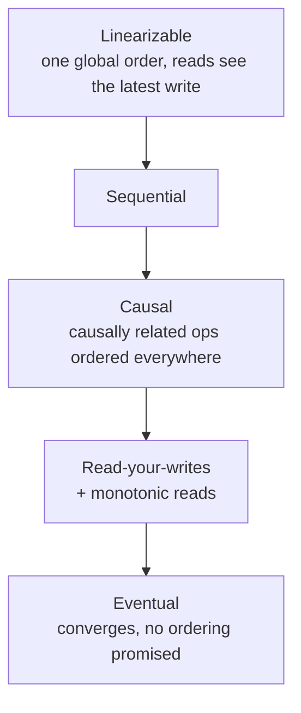
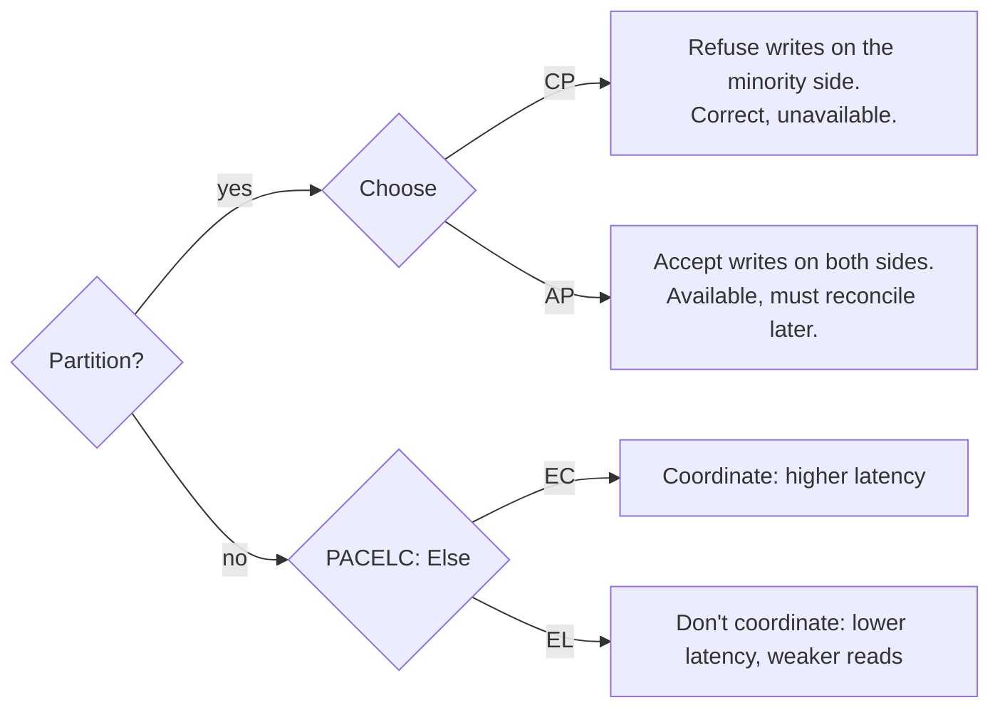

> "Eventually consistent" is not a level of quality. It is a precise statement about what a
> reader may observe, and this lesson is how to say it precisely enough to design with.

| | |
|---|---|
| **Module** | [00 — Foundations](/modules/foundations/README) |
| **Prerequisites** | [00-03 Failure models](/modules/foundations/03-failure-models-and-partial-failure) |
| **Also known as** | Brewer's theorem, consistency/availability trade-off |
| **Category** | Consistency |

---

## 1. The problem

A customer updates their shipping address, sees "saved", clicks through to checkout, and the
old address is shown. Nothing crashed. No error was logged. The write went to the leader and
the read went to a follower that was 40ms behind.

Meanwhile inventory shows 1 unit left. Two customers buy it. Both succeed. One gets an
apology email.

Both bugs come from the same missing decision: **nobody stated what a read is allowed to
return.**

## 2. In plain language

A group chat where messages take a random amount of time to arrive at each phone.

- **Strong (linearizable):** everyone's phone shows exactly the same messages at the same
  moment. Achievable only by making everyone wait for the slowest phone.
- **Eventual:** all phones end up identical, but right now yours might be missing three
  messages. No waiting, occasional confusion.
- **Causal:** you never see a reply before the message it replies to. Ordering that matters
  is preserved; ordering that doesn't is not.
- **Read-your-writes:** you always see *your own* messages immediately, even if you don't
  yet see everyone else's. Usually the cheapest thing that makes a product feel correct.

Most systems don't need everyone to agree instantly. They need *nobody to see something
impossible* — that is causal consistency, and it is far cheaper than strong.

**Where the analogy breaks down:** phones can't refuse to display a message to preserve
correctness. Databases can, and that refusal is what "unavailable" means in CAP.

## 3. How it works

### The ladder

Strongest at the top. Each level costs less and permits more anomalies.



| Model | Guarantee | Cost | ShopFlow use |
|---|---|---|---|
| **Linearizable** | Every read sees the most recent completed write, globally | Consensus per write; latency ≥ quorum round trip | Stock decrement for the last unit |
| **Sequential** | One global order, not necessarily real-time | Slightly cheaper | Rare in practice |
| **Causal** | If A caused B, nobody sees B without A | Track dependencies (vector clocks); no coordination | Order timeline, comment threads |
| **Read-your-writes** | You see your own writes | Sticky routing or write-through | Address change, profile edit |
| **Monotonic reads** | You never go backwards in time | Session pinning | Any paginated list |
| **Eventual** | Replicas converge, given no new writes | Asynchronous replication only | Product view counts, recommendations |

### CAP, stated correctly

CAP says: **when a network partition occurs**, a system must choose between remaining
available and remaining consistent (linearizable).

What CAP does *not* say:

- It is not "pick 2 of 3". Partitions are not a choice; they happen to you.
- It is not a property of a database. It is a property of an *operation*, and one system can
  make different choices per operation.
- "AP" does not mean unreliable, and "CP" does not mean slow.



### PACELC — the more useful formulation

> **If** there is a **P**artition, choose **A**vailability or **C**onsistency;
> **E**lse choose **L**atency or **C**onsistency.

The "else" branch is the one you live in 99.99% of the time. A system that coordinates on
every write pays a quorum round trip on every write forever, partition or not. This is
usually the decision that actually matters, and CAP alone never surfaces it.

| System style | Classification |
|---|---|
| Single-leader RDBMS with sync replication | PC / EC |
| Single-leader RDBMS with async replicas | PC / EL |
| Dynamo-style (Cassandra, defaults) | PA / EL |
| Spanner, etcd, ZooKeeper | PC / EC |

### Choosing per operation

This is the practical skill. Ask: *what does a stale or conflicting read actually cost?*

| ShopFlow operation | Model needed | Why |
|---|---|---|
| Read product description | Eventual | Stale by 5 min: nobody notices |
| Read price at checkout | Read-your-writes on the merchant's session; bounded staleness for shoppers | Legal exposure if it changes mid-checkout |
| Decrement last unit of stock | Linearizable | Overselling costs money and trust |
| Order status timeline | Causal | "Shipped" must never appear before "Paid" |
| Recommendations | Eventual | Wrong is fine, slow is not |
| Account balance / refunds | Linearizable | Money |

Very few operations in any system are in the top row. Buying linearizability for all of them
is the most common source of unnecessary latency and unnecessary unavailability.

## 4. Pseudo-code

**The bug: an unstated consistency assumption.**

```
handler update_address(cmd: UpdateAddress) -> Result<Unit, Error>:
  accounts_leader.put(cmd.customer_id, cmd.address)     # write goes to leader
  return Ok(unit)

handler get_checkout_page(id: CustomerId) -> CheckoutView:
  addr = accounts_replica.get(id)     # TRAP: a read replica, ~40ms behind.
  return CheckoutView(addr, ...)      # The user sees their OLD address. "It didn't save."
```

**Fix 1 — read-your-writes via a session token.** Cheap, and covers the complaint.

```
service AccountService:
  uses leader: Store<CustomerId, Address>
  uses replica: Store<CustomerId, Address>        # @eventually_consistent(lag: ~40ms)

  handler update_address(cmd: UpdateAddress) -> Result<WriteToken, Error>:
    version = leader.put(cmd.customer_id, cmd.address)
    return Ok(WriteToken(customer_id: cmd.customer_id, version: version))
    # The token travels back in the client's session/cookie.

  handler get_address(id: CustomerId, seen: Option<WriteToken>) -> Address:
    if seen is Some(t):
      v = replica.version_of(id)
      if v < t.version:
        return leader.get(id)        # COST: one leader read, only for users who just wrote
    return replica.get(id)           # everyone else stays cheap
```

**Fix 2 — linearizable where it is genuinely required.** Note that only *one* operation in
ShopFlow pays this price.

```
service InventoryService:
  # This operation needs an atomic, multi-SKU reservation transaction. Per-SKU CAS
  # prevents an oversell on one SKU, but cannot undo a previous line if a later one fails.
  uses stock: Store<Sku, StockLevel>
  uses reservations: Store<ReservationId, Reservation>  # both stores share one local database

  @timeout(500ms)
  handler reserve(cmd: ReserveStock) -> Result<Reservation, StockError>:
    atomically:
      for line in cmd.lines:
        current = stock.get(line.sku)  # transaction isolation protects this read until commit
        if current.available < line.qty:
          return Err(OutOfStock(line.sku))
        next = current with { available: current.available - line.qty }
        stock.put(line.sku, next)
      reservation = Reservation.new(cmd)
      reservations.put(reservation.id, reservation)
    return Ok(reservation)

  # WHY availability is sacrificed here on purpose:
  # during a partition, the minority side refuses reservations rather than overselling.
```

**Fix 3 — causal ordering for a timeline that must not lie.**

```
event OrderStatusChanged:
  order_id: OrderId
  status: OrderStatus
  version: Int                 # monotonic per order — the causal token

service TimelineProjector:
  uses view: Store<OrderId, Timeline>

  on event OrderStatusChanged(e):
    t = view.get(e.order_id)
    if e.version <= t.version:
      return                   # already applied, or a duplicate. Idempotent.
    if e.version > t.version + 1:
      buffer(e)                # TRAP without this: "Shipped" renders before "Paid"
      return                   # wait for the gap to fill
    view.put(e.order_id, t.apply(e))
    drain_buffer(e.order_id)
```

## 5. Knobs and variants

| Knob | Options | Consequence |
|---|---|---|
| Read source | leader / follower / quorum | Leader = fresh + hot; follower = cheap + stale |
| Write quorum W, read quorum R | `R + W > N` guarantees read/write overlap; semantics still depend on the protocol | Higher quorums = higher latency, lower availability |
| Staleness bound | unbounded / bounded (e.g. ≤5s) | Bounded staleness is often the sweet spot |
| Session guarantees | none / RYW / monotonic / both | Cheap, and fixes most *perceived* bugs |
| Conflict resolution | LWW / vector clocks / CRDT / application merge | LWW silently loses writes; CRDTs constrain the data model |
| Scope | per-system / per-operation | Per-operation is almost always the right answer |

## 6. Challenges and failure modes

- **Last-write-wins loses data silently.** With clock skew, "last" is whichever node's clock
  was ahead. No error is raised. It is the default in more systems than you would like.
- **Eventual consistency has no bound by default.** "Eventually" can mean hours if a
  replication stream is stuck. Alert on replication lag, not just on errors.
- **Read-your-writes breaks across devices.** Write on your phone, read on your laptop:
  session guarantees are per-session.
- **Sticky sessions leak into scaling.** Pinning users to an instance for RYW conflicts with
  [stateless horizontal scaling](/modules/scalability/01-stateless-services-and-horizontal-scaling).
- **Caches are replicas.** Adding a cache silently downgrades an operation's consistency,
  usually without anyone recording that decision ([03-03](/modules/scalability/03-caching)).
- **"CP" systems are unavailable in ways teams don't rehearse.** A leader election takes
  seconds during which writes fail. If your client has no retry, the user sees an error.
- **Cross-service consistency is not a database setting.** Two strongly-consistent databases
  in two services still give you no atomicity between them — that is
  [Module 04](/modules/data-and-consistency/README).

## 7. Alternatives

- **Avoid the problem: single writer.** If one service owns a piece of data and all writes go
  through it, most of this disappears. The best consistency strategy is usually a boundary
  decision ([08-03](/modules/microservice-architecture/03-database-per-service)).
- **CRDTs.** Data types that merge without coordination (counters, sets, sequences). Strong
  eventual consistency with no conflicts — at the cost of a constrained data model and
  metadata growth.
- **Design the anomaly out of the product.** Overselling is a business decision: airlines
  oversell deliberately and compensate. Sometimes "allow the conflict, handle it commercially"
  is right.
- **Escrow / reservation.** Rather than a linearizable global counter, hand out reservations
  that expire. Converts a coordination problem into a leasing problem.

## 8. Trade-offs

| Advantage of choosing per operation | Disadvantage |
|---|---|
| Pay for coordination only where it is needed | Engineers must reason per endpoint, not once per system |
| Latency stays low on the 99% of paths that don't need it | Mixed models in one codebase confuse newcomers |
| Availability is preserved for reads during a partition | Anomalies become part of the product spec and must be tested |
| Explicit staleness bounds are testable | Requires monitoring lag as a first-class SLI |

## 9. Complexity introduced

- **Operational.** Replication lag becomes a paging metric. Quorum configuration becomes a
  production-affecting setting. Leader elections become an event you must observe.
- **Cognitive.** "Which store do I read from, and is that allowed here?" becomes a question
  on every code review.
- **Failure surface.** Stale reads, lost updates under LWW, causal violations in UIs,
  split-brain during partition, session pinning failures on deploy.
- **Testing.** Anomalies require deterministic injection of lag and partition. Jepsen-style
  testing exists because normal test suites never observe these.

## 10. Related concepts

- **Builds on:** [00-03 Failure models](/modules/foundations/03-failure-models-and-partial-failure)
- **Composes with:** [03-05 Replication](/modules/scalability/05-replication), [04-07 Consensus](/modules/data-and-consistency/07-consensus-and-leader-election), [03-03 Caching](/modules/scalability/03-caching)
- **Conflicts with / tension:** [00-04 Latency](/modules/foundations/04-latency-throughput-and-back-of-envelope) — coordination costs round trips, always
- **Contrast with:** ACID isolation levels, which are about concurrency within one node, not replication across nodes
- **Leads to:** [Module 04 — Data and consistency](/modules/data-and-consistency/README)

## 11. Exercises

1. **Trace it.** A partition splits ShopFlow's inventory cluster 2 nodes / 3 nodes with
   N=5, W=3, R=3. Which side accepts reservations? What does the other side return? Now set
   W=1, R=1 and describe the overselling scenario concretely.
2. **Extend it.** Classify all nine ShopFlow services from [the running example](/domain/RUNNING-EXAMPLE)
   under PACELC, and for each write one sentence justifying the "else" branch.
3. **Break it.** Fix 1 (read-your-writes via token) has a hole. Find the sequence of two
   writes and one read where the user still sees stale data. What would you add?

## 12. References

- Eric Brewer, "Towards Robust Distributed Systems" (PODC 2000) and "CAP Twelve Years Later" (2012).
- Daniel Abadi, "Consistency Tradeoffs in Modern Distributed Database System Design" — PACELC.
- Werner Vogels, "Eventually Consistent" (ACM Queue, 2008).
- Peter Bailis et al., "Highly Available Transactions: Virtues and Limitations" (VLDB 2014).
- Martin Kleppmann, *Designing Data-Intensive Applications* — Ch. 5, 9.
- Shapiro et al., "Conflict-free Replicated Data Types" (2011).

---

**Up:** [Module 00](/modules/foundations/README) · **Previous:** [← 00-04](/modules/foundations/04-latency-throughput-and-back-of-envelope) · **Next:** [Module 01 — Communication →](/modules/communication/README)
