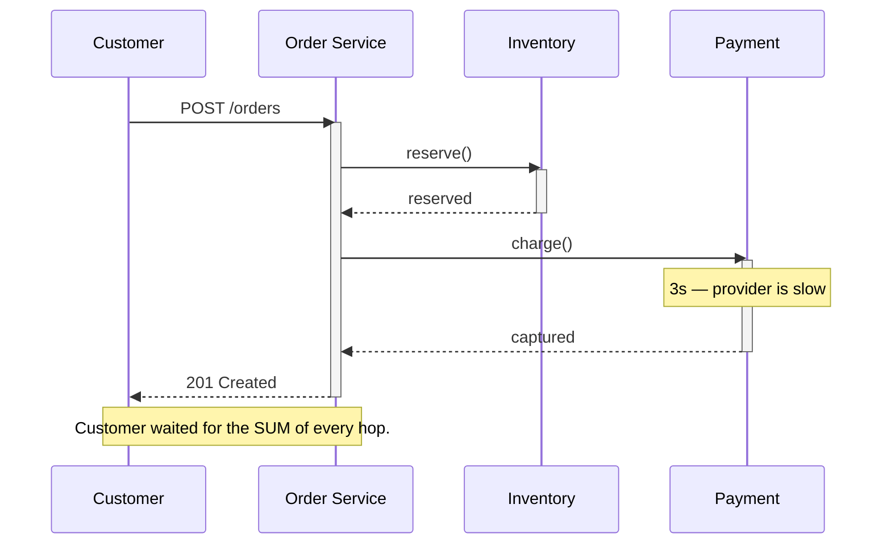

> The caller waits. That single property gives you a simple mental model and hands you
> temporal coupling, latency chains, and multiplied unavailability.

| | |
|---|---|
| **Module** | [01 — Communication](/modules/communication/README) |
| **Prerequisites** | [00-02 Fallacies](/modules/foundations/02-fallacies-of-distributed-computing), [00-04 Latency](/modules/foundations/04-latency-throughput-and-back-of-envelope) |
| **Also known as** | RPC, REST, gRPC, request/reply (EIP) |
| **Category** | Integration |

---

## 1. The problem

ShopFlow's checkout must tell the customer, in the same HTTP response, whether their order
was accepted. To do that it needs to know whether stock exists and whether the card cleared.
Those facts live in other services. There is no way to answer the customer without asking
them and waiting.

So far so reasonable. The problem appears when the pattern spreads: the order page calls
Catalog, which calls the ERP adapter, which calls a pricing service, which calls a currency
service. Now the customer's latency is the *sum* of five services, and their availability is
the *product* of five services. One slow link at the bottom of the chain stalls every thread
at the top.

Symptom: "the site is down" while every individual service dashboard is green.

## 2. In plain language

Phoning someone versus texting them. On a call you get an answer immediately and can ask
follow-ups — but you must both be free at the same moment, and if they put you on hold you
are stuck holding, doing nothing else.

Now imagine your caller has phoned *you* for the answer, and you must phone a third person
to get it, who phones a fourth. Everyone in that chain is holding a phone and doing nothing.
The person at the end going for a coffee blocks four people.

**Where the analogy breaks down:** you would hang up after two minutes. A default HTTP client
holds for 60 seconds, and it holds a thread and a connection while it does — which is why
the whole system falls over rather than just one request.

## 3. How it works

The caller sends a request, blocks (or awaits) until a response or an error arrives, then
continues. The transport is irrelevant to the pattern — HTTP/JSON, gRPC, GraphQL, Thrift,
or a plain TCP protocol all have identical structural consequences.



### The three consequences

**1. Temporal coupling.** Both parties must be up *simultaneously*. Availability multiplies:
four dependencies at 99.9% give 99.6%.

**2. Latency chains.** End-to-end latency is the sum of the path, and end-to-end p99 is worse
than the sum of p99s ([00-04](/modules/foundations/04-latency-throughput-and-back-of-envelope)).

**3. Resource occupation.** Every in-flight call holds a thread, a socket, and memory on
*every* hop. Little's Law says a dependency slowing 10× requires 10× the concurrency to
sustain the same throughput. You don't have it, so you queue, and then you fall over.

### Where synchronous is genuinely correct

- The caller cannot proceed without the answer (stock availability at checkout).
- The answer must be reflected in a user-facing response *now*.
- The operation is a query, and the data is owned elsewhere.
- The failure of the callee should genuinely fail the caller (authorisation).

### Where it is chosen out of habit

- Sending an email. Writing an audit record. Updating a search index. Recalculating
  recommendations. Notifying a warehouse. None of these need to happen before the customer
  sees a response — see [01-02](/modules/communication/02-asynchronous-messaging).

**Rule of thumb: if the caller ignores the response, it should not have been synchronous.**

## 4. Pseudo-code

**Before — the naive chain.** Five things done in sequence, four of which the customer does
not need to wait for.

```
service OrderService:
  uses inventory: Client<InventoryService>
  uses payments: Client<PaymentService>
  uses email: Client<NotificationService>
  uses search: Client<SearchService>
  uses analytics: Client<AnalyticsService>

  handler place_order(cmd: PlaceOrder) -> Result<Order, OrderError>:
    reservation = await inventory.reserve(cmd.lines)      # 50ms   — needed
    receipt     = await payments.charge(cmd)              # 800ms  — needed
    order       = save(cmd, reservation, receipt)         # 5ms    — needed
    await email.send_confirmation(order)                  # 300ms  — NOT needed
    await search.index(order)                             # 120ms  — NOT needed
    await analytics.record(order)                         # 80ms   — NOT needed
    return Ok(order)
    # p50 = 1355ms, and availability = product of FIVE services.
    # An email provider outage now fails checkout.
```

**The pattern — synchronous only where the answer is required.**

```
service OrderService:
  uses inventory: Client<InventoryService>
    with timeout(300ms), retry(max: 2, backoff: exponential(base: 20ms, jitter: full))
  uses payments: Client<PaymentService>
    with timeout(1s), circuit_breaker(threshold: 5, cooldown: 30s)
    # WHY no retry on payments: charging is not safely retryable without the
    # idempotency key handling in 01-03. See that lesson before adding one.
  uses orders: Store<OrderId, Order>
  uses bus: Topic<OrderEvent>

  @timeout(2s)                              # the customer-facing budget
  handler place_order(cmd: PlaceOrder) -> Result<Order, OrderError>:

    with deadline(now() + 2s):              # propagates to every downstream call

      # Independent calls run concurrently: 300ms + 1s becomes max(300ms, 1s).
      parallel:
        reservation = inventory.reserve(cmd.lines)
        limit_ok    = payments.check_limit(cmd.customer_id, total_of(cmd.lines))

      if reservation.is_err():
        return Err(OutOfStock(reservation.error.skus))

      receipt = await payments.charge(cmd.order_id, total_of(cmd.lines),
                                      idempotency_key: cmd.request_id)?

      order = Order(id: cmd.order_id, status: PAID, ...)

      atomically:
        orders.put(order.id, order)
        bus.publish(OrderPlaced(order.id, order.total, now()))

      # TRAP: those two lines are the DUAL-WRITE BUG, shown here because this
      # lesson is about call style and fixing it needs machinery you have not met
      # yet. A broker is not part of the database transaction: a crash between
      # the commit and the publish loses the event silently. The fix is to write
      # the event to an outbox table in the same transaction (04-03). Do not copy
      # these two lines.
      #
      # TRAP: there is a second window above. `payments.charge` may succeed and
      # this process may die before the commit — money taken, no order. That is
      # the ambiguous outcome of 00-03, and it needs the reconciler in 01-03 §4.

      return Ok(order)
      # p50 ≈ 850ms. Email, search and analytics happen off the request path,
      # and their outages can no longer fail checkout.
```

**In use — the caller side, showing what a synchronous contract owes its callers.**

```
service ApiGateway:
  uses orders: Client<OrderService> with timeout(2.5s)   # caller budget > callee budget

  handler post_orders(req: HttpRequest) -> HttpResponse:
    cmd = PlaceOrder(request_id: req.header("Idempotency-Key") ?? uuid(), ...)
    match await orders.place_order(cmd):
      case Ok(order):              return 201(order)
      case Err(OutOfStock(skus)):  return 409(skus)
      case Err(PaymentDeclined(r)):return 402(r)
      case Err(Overloaded):        return 503 with Retry-After: 2s   # see 02-06
      # TRAP: TimeoutError is NOT mapped to a failure code. See 00-03 — we return
      # 202 Accepted with an order id in PENDING state instead.
```

## 5. Knobs and variants

| Choice | Options | Consequence |
|---|---|---|
| Protocol | HTTP/JSON · gRPC · GraphQL · Thrift | JSON: debuggable, verbose. gRPC: fast, typed, streaming, harder to inspect. GraphQL: one round trip for varied shapes, complex caching |
| Granularity | chatty ↔ coarse | Chatty gives clean models and N× the latency. Coarse gives fewer round trips and over-fetching |
| Call layout | sequential ↔ `parallel` | Independent calls should always be concurrent; the code above turns 1.3s into 1s |
| Timeout | per call and per request budget | Both. A per-call timeout without a total budget can still blow the SLA |
| Streaming | unary ↔ server-streaming | Streaming holds a connection but delivers first byte sooner |
| Async request/reply | correlate a reply over a queue | Removes temporal coupling but keeps the request/reply shape ([05-01](/modules/messaging-and-eip/01-channels-and-endpoints)) |

## 6. Challenges and failure modes

- **Cascading failure.** A slow leaf fills thread pools all the way up the chain. The pattern
  is that the *top* service falls over first, and the actual cause is four hops down. This is
  why [bulkheads](/modules/resilience/04-bulkhead) and
  [breakers](/modules/resilience/03-circuit-breaker) exist.
- **Chained timeouts that don't shrink.** If every hop uses "3 seconds", the deepest hop is
  still working on a request the top already abandoned. Budgets must *decrease* down the
  chain ([02-01](/modules/resilience/01-timeouts-and-deadlines)).
- **N+1 across the network.** An innocuous loop becomes 20 round trips. Batch endpoints or a
  [BFF](/modules/microservice-architecture/02-api-gateway-and-backend-for-frontend).
- **Retry amplification.** Each layer retrying 3× turns one request into 27 at the bottom
  ([02-02](/modules/resilience/02-retries-backoff-and-jitter)).
- **The distributed monolith.** Synchronous chains that must deploy together. If deploying
  service D requires coordinating with A, B and C, the split bought you nothing
  ([08-01](/modules/microservice-architecture/01-decomposition-and-bounded-contexts)).
- **Circular calls.** A calls B calls A. Deadlocks under load, invisible in code review, and
  only findable in a [trace](/modules/operations-and-evolution/01-observability).

## 7. Alternatives

- **[Asynchronous messaging](/modules/communication/02-asynchronous-messaging).** The main alternative. Removes
  temporal coupling; costs you immediate answers and introduces duplicates.
- **Async request/reply.** Send a command on a queue with a `reply_to` and `correlation_id`.
  Request/reply semantics, no temporal coupling, much more machinery.
- **Data replication / local read model.** Instead of asking, keep a local copy fed by events
  ([04-06 CQRS](/modules/data-and-consistency/06-cqrs)). Turns a network call into a local
  read. Costs staleness.
- **Poll for status.** Return `202 Accepted` with a status URL. Excellent for long operations,
  and honest about what is happening.
- **Do it in the caller.** If the callee is a thin wrapper over data you could own, the call
  may be a boundary mistake rather than a communication one.

## 8. Trade-offs

| Advantage | Disadvantage |
|---|---|
| Simple mental model: call, get answer, handle error | Temporal coupling: availability multiplies |
| Immediate consistency of the result you were told | Latency accumulates along the chain |
| Errors surface at the call site, in context | Resources are held for the whole call |
| Easy to debug: one stack, one trace, one timeline | Cascading failure is the default behaviour |
| No message broker to run | Retries and idempotency become your problem anyway |

## 9. Complexity introduced

- **Operational.** Timeout/retry/breaker configuration per call site; connection pool sizing;
  a latency budget that must be documented and enforced.
- **Cognitive.** Every call site must answer: what happens on timeout, is this retryable, what
  do I return to my caller.
- **Failure surface.** Cascades, retry storms, pool exhaustion, chained-timeout waste,
  ambiguous outcomes ([00-03](/modules/foundations/03-failure-models-and-partial-failure)).
- **Testing.** Needs a fake or contract test per dependency, plus explicit tests for the slow
  and timing-out cases — which are the ones that actually break production.

## 10. Related concepts

- **Builds on:** [00-02 Fallacies](/modules/foundations/02-fallacies-of-distributed-computing), [00-04 Latency](/modules/foundations/04-latency-throughput-and-back-of-envelope)
- **Composes with:** every pattern in [Module 02](/modules/resilience/README); [01-05 Service discovery](/modules/communication/05-service-discovery); [08-02 API gateway](/modules/microservice-architecture/02-api-gateway-and-backend-for-frontend)
- **Conflicts with / tension:** [01-02 Asynchronous messaging](/modules/communication/02-asynchronous-messaging) — the opposite default
- **Contrast with:** async request/reply, which looks synchronous and is not
- **Leads to:** [01-03 Delivery guarantees](/modules/communication/03-delivery-guarantees-and-idempotency)

## 11. Exercises

1. **Trace it.** In the "Before" code, the email provider starts taking 30 seconds. Order
   Service has 200 threads and receives 120 req/s. Using Little's Law, compute how long until
   the service stops accepting new requests entirely.
2. **Extend it.** Add a fourth dependency to the "pattern" version: a fraud check that takes
   200ms and must complete before charging, but whose failure should *not* block the order for
   customers under €50. Write the code.
3. **Break it.** The gateway's timeout is 2.5s and Order Service's is 2s. Inventory's is
   300ms and Payment's is 1s. Find the request that takes 2.5s and produces a customer-visible
   error while every service reports success.

## 12. References

- Waldo, Wyant, Wollrath, Kendall, "A Note on Distributed Computing" (Sun, 1994).
- Sam Newman, *Building Microservices*, 2nd ed. — Ch. 4, communication styles.
- Michael Nygard, *Release It!*, 2nd ed. — Ch. 4–5, cascading failure and the integration point.
- Hohpe & Woolf, *Enterprise Integration Patterns* — Request-Reply, Return Address.
- Google, gRPC documentation on deadlines and cancellation propagation.

---

**Up:** [Module 01](/modules/communication/README) · **Previous:** [← Module 00](/modules/foundations/README) · **Next:** [01-02 Asynchronous messaging →](/modules/communication/02-asynchronous-messaging)
