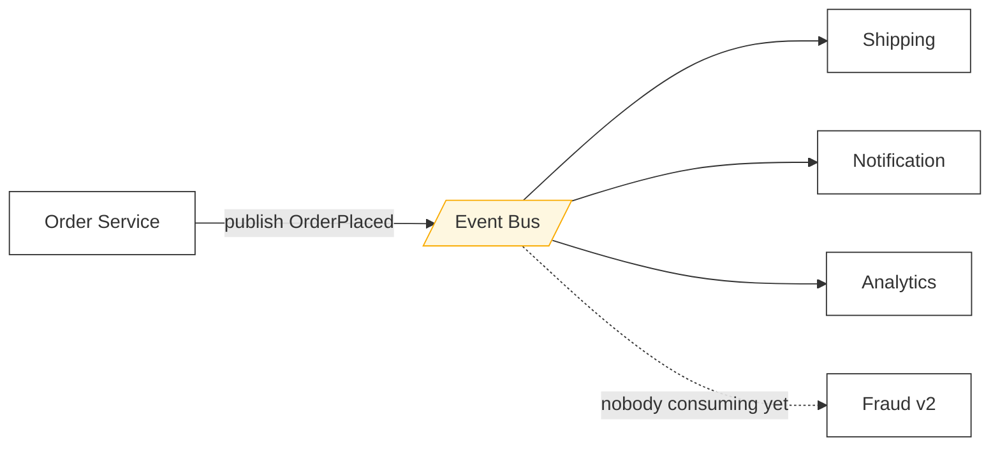

> The sender hands off a message and moves on. You trade "I know it worked" for "it will
> work eventually, and my availability no longer depends on yours."

| | |
|---|---|
| **Module** | [01 — Communication](/modules/communication/README) |
| **Prerequisites** | [01-01 Synchronous request/response](/modules/communication/01-synchronous-request-response) |
| **Also known as** | message-oriented middleware, event-driven communication, queues and logs |
| **Category** | Integration |

---

## 1. The problem

ShopFlow's checkout works. Then the Notification Service's email provider has a bad hour.
Checkout fails, because it waits for the confirmation email before responding. A customer
cannot buy shoes because a mail server is unwell.

Separately: on sale days, orders arrive at 600/s but the warehouse system can only accept
50/s. Synchronous calls to it fail 92% of requests, and the fix — retrying — makes it worse.

Both problems have the same shape: **the sender's fate is tied to the receiver's current
condition**, when the business does not require it to be.

## 2. In plain language

The difference between phoning someone and putting a note in their pigeonhole.

The pigeonhole works when they are at lunch. It absorbs a burst — you can drop twenty notes
in during a rush and they'll work through them at their own pace. It lets you leave and get
on with your day. It lets you copy the note to four pigeonholes at no extra effort.

What you give up: you don't know when it will be read, you don't get an answer, and if you
panic and drop a second copy of the same note in, they might do the task twice. If the note
is ambiguous there is nobody to ask, so it sits in a "problems" tray until someone notices.

**Where the analogy breaks down:** pigeonhole notes arrive in the order you put them in.
Distributed message systems reorder freely unless you specifically pay for ordering, and
even then only within a partition.

## 3. How it works

The sender writes to a broker; the broker durably stores the message; a consumer reads it,
processes it, and acknowledges. If the consumer dies before acknowledging, the message is
redelivered.



The Order Service does not know Shipping exists. Adding Fraud v2 requires no change to Order
Service at all. That property — **the sender does not know the receivers** — is the whole
reason for the pattern, and it is also the reason nobody can tell you what happens when you
change a message shape ([01-04](/modules/communication/04-serialization-and-schema-evolution)).

### Queue versus log

Two different substrates, routinely confused.

| | **Queue** (RabbitMQ, SQS) | **Log** (Kafka, Kinesis, Pulsar) |
|---|---|---|
| Consumption | Message is removed when acked | Message stays; consumer tracks an offset |
| Consumers | Compete — each message to one | Independent — each group reads everything |
| Replay | No; once acked, it's gone | Yes; rewind the offset |
| Ordering | Per queue, lost with concurrency | Total order per partition |
| Adding a consumer later | Sees only new messages | Can read from the beginning |
| Retention | Until consumed | Time or size based (e.g. 7 days) |
| Natural fit | Work distribution, commands | Event streams, [event sourcing](/modules/data-and-consistency/05-event-sourcing), [CQRS](/modules/data-and-consistency/06-cqrs) |

**Choose a queue for work to be done. Choose a log for facts that happened.**

### Commands versus events

The distinction from [the spec](/spec/PSEUDOCODE-SPEC#3-data-declarations) matters
operationally:

- **Command** (`ShipOrder`) — imperative, one intended handler, may be rejected, sender knows
  the receiver. Belongs on a queue.
- **Event** (`OrderPlaced`) — a past-tense fact, zero or more listeners, cannot be rejected
  (it already happened), sender does not know the receivers. Belongs on a topic or log.

Publishing a command as an event ("`ShipOrderRequested`") to seem more event-driven is
cargo cult; the coupling is still there, now undocumented.

### What you inherit, always

1. **Duplicates.** At-least-once is the practical default. Consumers must be idempotent
   ([01-03](/modules/communication/03-delivery-guarantees-and-idempotency), [04-04](/modules/data-and-consistency/04-idempotent-consumer-and-inbox)).
2. **Reordering.** Unless you partition by key and consume single-threaded per partition.
3. **Eventual consistency.** The read model lags the write ([00-05](/modules/foundations/05-consistency-models-cap-and-pacelc)).
4. **The dual-write problem.** Saving to the database and publishing to the broker are two
   systems; a crash between them loses the event. This is why
   [the outbox](/modules/data-and-consistency/03-transactional-outbox) exists, and it is
   not optional.

## 4. Pseudo-code

**Before — synchronous fan-out. Three optional side effects on the critical path.**

```
handler place_order(cmd: PlaceOrder) -> Result<Order, OrderError>:
  order = charge_and_save(cmd)?
  await email.send_confirmation(order)     # TRAP: mail outage → checkout outage
  await search.index(order)                # TRAP: +120ms for zero customer value
  await warehouse.create_pick_list(order)  # TRAP: warehouse caps at 50/s, we do 600/s
  return Ok(order)
```

**The pattern — publish once, let interested parties react.**

```
event OrderPlaced:
  order_id: OrderId
  customer_id: CustomerId
  lines: List<OrderLine>
  total: Money
  occurred_at: Instant
  schema_version: Int = 1

service OrderService:
  uses orders: Store<OrderId, Order>
  uses outbox: Store<UUID, OutboxRecord>
  uses bus: Topic<OrderEvent>

  @timeout(2s)
  handler place_order(cmd: PlaceOrder) -> Result<Order, OrderError>:
    # Charges the card and returns an unsaved Order. The save is below, so that
    # the order and its event commit together — and so this helper's name does
    # not claim a write it does not do.
    # Elided: the charge's own ambiguous-outcome handling (00-03) and the
    # idempotency key that makes it retryable (01-03).
    order = charge(cmd)?

    # WHY atomically: the state change and the announcement of it must not diverge.
    # Publishing directly to `bus` here would be the dual-write bug. See 04-03.
    atomically:
      orders.put(order.id, order)
      outbox.append(OrderPlaced(order.id, order.customer_id, order.lines,
                                order.total, now()))

    return Ok(order)          # p50 drops from 1355ms to ~850ms

  every 200ms:
    for record in outbox.unpublished(limit: 100):
      bus.publish(record.event, key: record.event.order_id)   # key = ordering guarantee
      outbox.mark_published(record.id)
```

**In use — three consumers, three different correctness requirements.**

```
service NotificationService:
  uses sent: Store<UUID, Instant>                # the inbox; see 04-04

  @at_least_once
  on event OrderPlaced(e):
    key = "confirmation:" + e.order_id
    if sent.put_if_absent(key, now()) == false:
      return                                     # TRAP without this: duplicate emails
    await email.send(e.customer_id, template: "order_confirmed", order: e) timeout 5s
    # If this raises, the message is nacked and redelivered — and the guard above
    # is now WRONG, because we recorded 'sent' before sending. See §6.


service ShippingService:
  uses shipments: Store<OrderId, Shipment>

  @at_least_once
  on event OrderPlaced(e):
    # Idempotent by construction: keyed insert, not append. Reprocessing is harmless.
    shipments.put_if_absent(e.order_id, Shipment(order_id: e.order_id, status: PENDING))


service WarehouseAdapter:
  uses work: Queue<PickList>                     # a queue: this is WORK, not a fact
  uses warehouse: Client<LegacyWarehouse>
  state limiter: RateLimiter(rate: 45/s)         # below the warehouse's 50/s ceiling

  on event OrderPlaced(e):
    work.send(PickList(e.order_id, e.lines))     # absorb the 600/s burst

  every 20ms:
    d = work.receive()
    if d is None: return
    limiter.acquire()                            # drain at the pace the legacy system allows
    try:
      await warehouse.submit(d.body) timeout 5s
      d.ack()
    catch TimeoutError:
      d.retry(after: 30s * d.attempt)            # backoff; see 02-02
    catch ValidationError as err:
      d.dead_letter(err)                         # unfixable by retry; see 05-06
```

Note the shape: **the queue is the shock absorber between a 600/s world and a 50/s world.**
No amount of resilience patterns on a synchronous call achieves that.

## 5. Knobs and variants

| Knob | Options | Consequence |
|---|---|---|
| Substrate | queue / topic / log | Determines replay, fan-out, and ordering |
| Ordering | none / per-key / total | Per-key is nearly always the right answer; total order caps throughput at one partition |
| Delivery | at-most-once / at-least-once | At-least-once + idempotent consumers, essentially always |
| Consumer concurrency | 1 per partition / N per queue | Concurrency destroys ordering. Choose consciously |
| Payload | full state / thin event with id | Thin events avoid stale data but cause a callback storm on the producer |
| Retention (log) | hours ↔ forever | Long retention enables replay and new consumers; costs storage and GDPR headaches |
| Backpressure | block / shed / spill | See [02-06](/modules/resilience/06-load-shedding-and-backpressure) |

**Thin versus fat events** is the most consequential choice here. A fat event (`OrderPlaced`
carrying all lines and totals) lets consumers act without calling back — decoupled, but the
payload is a contract and the data can be stale. A thin event (`OrderPlaced{order_id}`)
forces every consumer to call the producer, which reintroduces synchronous coupling and can
stampede the producer on a burst. Default to fat events with the fields consumers actually
need, versioned properly.

## 6. Challenges and failure modes

- **The dual-write problem.** Covered above; the fix is
  [the outbox](/modules/data-and-consistency/03-transactional-outbox). Any code that does
  `db.save(); bus.publish();` outside a transaction is broken and will lose events.
- **The `NotificationService` bug above.** It marks "sent" *before* sending. On a send
  failure, the message is redelivered and skipped — the customer never gets the email. Moving
  the marker after the send instead risks duplicate emails. There is no local fix: you must
  choose which failure you prefer, or make the email provider idempotent with a key.
  **This dilemma is the practical content of "exactly-once is impossible."**
- **Poison messages.** One malformed message that always fails blocks its partition forever
  (log) or loops forever (queue). Needs a [dead letter channel](/modules/messaging-and-eip/06-dead-letter-channel-and-poison-messages).
- **Consumer lag.** The system looks healthy — no errors — while the read model is four hours
  behind. Alert on lag, not just errors.
- **Silent loss of a consumer.** Nobody notices a stopped consumer for days because nothing
  errors. Alert on "expected consumer group absent."
- **Debugging is genuinely harder.** No stack trace crosses a broker. Correlation IDs and
  [tracing](/modules/operations-and-evolution/01-observability) are mandatory, not nice.
- **The broker becomes a single point of failure** — and a stateful one, which is the hardest
  kind to operate.
- **Schema changes break invisible consumers.** You cannot grep for who reads your event.
  [Schema registry with compatibility checks](/modules/communication/04-serialization-and-schema-evolution).

## 7. Alternatives

- **[Synchronous calls](/modules/communication/01-synchronous-request-response)** when the answer is needed now.
- **Async request/reply.** Send a command with `reply_to` and `correlation_id`; keeps the
  answer, drops the temporal coupling.
- **Polling / batch.** For legacy systems with no eventing, poll a table or ingest a nightly
  file. Unfashionable, extremely robust, and the right answer for ShopFlow's ERP
  ([Module 05](/modules/messaging-and-eip/README)).
- **Change data capture.** Read the database's replication log and turn it into events. No
  application change; couples consumers to your schema unless you translate.
- **Shared database.** Both services read one table. Cheapest, and the tightest possible
  coupling ([08-03](/modules/microservice-architecture/03-database-per-service)).

## 8. Trade-offs

| Advantage | Disadvantage |
|---|---|
| No temporal coupling — the sender survives the receiver's outage | No immediate answer; the caller learns nothing about success |
| Absorbs bursts; the queue is a buffer between mismatched rates | The buffer hides pressure until it is very deep |
| New consumers added with zero producer change | You cannot tell who consumes your events |
| Fan-out is free | Duplicates and reordering become your problem, permanently |
| Natural retry and dead-lettering | Requires a broker: another stateful system to run |
| Producer's latency drops to a local write | End-to-end latency becomes unbounded and only observable via lag |

## 9. Complexity introduced

- **Operational.** A broker cluster to run, patch and capacity-plan. Consumer lag dashboards,
  DLQ monitoring and a replay procedure. Partition counts that are painful to change later.
- **Cognitive.** Engineers must think in terms of eventual state. "Where does this get
  handled?" has no answer findable by grep.
- **Failure surface.** Duplicates, reordering, poison messages, lag, DLQ growth, offset
  resets, rebalancing storms, and the dual-write bug if the outbox is skipped.
- **Testing.** Tests must cover duplicate delivery, out-of-order delivery, and consumer
  restart mid-batch. Most teams discover these in production instead.

## 10. Related concepts

- **Builds on:** [01-01 Synchronous request/response](/modules/communication/01-synchronous-request-response)
- **Composes with:** [01-03 Delivery guarantees](/modules/communication/03-delivery-guarantees-and-idempotency), [04-03 Outbox](/modules/data-and-consistency/03-transactional-outbox), [04-04 Idempotent consumer](/modules/data-and-consistency/04-idempotent-consumer-and-inbox), all of [Module 05](/modules/messaging-and-eip/README)
- **Conflicts with / tension:** immediate consistency; anything with a user waiting on it
- **Contrast with:** [04-05 Event sourcing](/modules/data-and-consistency/05-event-sourcing) — events as *communication* versus events as *the source of truth*. Different patterns, constantly conflated
- **Leads to:** [01-03 Delivery guarantees and idempotency](/modules/communication/03-delivery-guarantees-and-idempotency)

## 11. Exercises

1. **Trace it.** `WarehouseAdapter` receives 600 `OrderPlaced` events/s for 10 minutes and
   drains at 45/s. Compute the queue depth at the end, and how long after the burst the last
   order reaches the warehouse. Is that acceptable? What would you change?
2. **Extend it.** Fix `NotificationService` so that no customer misses an email *and* no
   customer gets two. State the assumption your fix places on the email provider, and what
   happens if that assumption is false.
3. **Break it.** `bus.publish(record.event, key: record.event.order_id)` guarantees ordering
   per order. Find the sequence where Shipping still processes `OrderCancelled` before
   `OrderPlaced`. (Hint: what is the outbox publisher doing, and how many instances of it are
   running?)

## 12. References

- Hohpe & Woolf, *Enterprise Integration Patterns* — Ch. 1–3; Message Channel, Message, Event Message.
- Martin Kleppmann, *Designing Data-Intensive Applications* — Ch. 11, stream processing.
- Jay Kreps, "The Log: What every software engineer should know about real-time data's unifying abstraction" (2013).
- Chris Richardson, *Microservices Patterns* — Ch. 3.
- Confluent, "Transactions in Apache Kafka" — what "exactly-once" does and does not mean.

---

**Up:** [Module 01](/modules/communication/README) · **Previous:** [← 01-01](/modules/communication/01-synchronous-request-response) · **Next:** [01-03 Delivery guarantees and idempotency →](/modules/communication/03-delivery-guarantees-and-idempotency)
