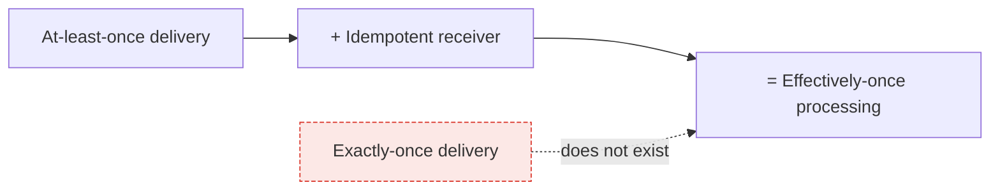

> There are two honest delivery guarantees and one marketing term. Pick at-least-once, make
> the operation idempotent, and stop worrying about the third.

| | |
|---|---|
| **Module** | [01 — Communication](/modules/communication/README) |
| **Prerequisites** | [00-03 Failure models](/modules/foundations/03-failure-models-and-partial-failure), [01-02 Asynchronous messaging](/modules/communication/02-asynchronous-messaging) |
| **Also known as** | message delivery semantics, deduplication, idempotency keys |
| **Category** | Consistency |

---

## 1. The problem

A customer is charged €80 twice for one order.

The trace shows one `POST /orders`. The customer clicked once. What happened: the gateway's
call to Order Service timed out at 2s; the gateway retried; the original request was still
running and completed; so did the retry. Two charges, one order id, one very unhappy
customer and a chargeback fee.

The same problem appears in every asynchronous path: a consumer processes a message, crashes
before acknowledging, and the broker redelivers. If the consumer's work was "add €80 to the
ledger", it happens twice.

## 2. In plain language

You post a cheque to a supplier. It doesn't clear, so you post another. Then both clear. You
paid twice.

The fix banks actually use: write a **cheque number** on it. The bank records numbers it has
already honoured. Send the same cheque number ten times and it is honoured once. You no
longer need to know whether the first one arrived — you can send as many as you like.

Notice what changed. You did not achieve certainty about delivery. You made *repetition
harmless*, which is strictly easier and strictly more useful.

**Where the analogy breaks down:** the bank must remember every cheque number forever. Real
systems keep dedup records for a bounded window, and everything interesting is in choosing
that window.

## 3. How it works

### The three semantics

| Guarantee | Mechanism | Failure mode | Use when |
|---|---|---|---|
| **At-most-once** | Send, never retry (or ack before processing) | Message lost on any failure | Loss is cheaper than duplication: metrics samples, telemetry, cache invalidation |
| **At-least-once** | Retry until acknowledged; ack after processing | Duplicates on any ambiguous outcome | Almost everything |
| **"Exactly-once"** | — | Impossible as a *delivery* guarantee | — |

**Why exactly-once delivery is impossible:** the receiver must acknowledge, the ack can be
lost, so the sender must retry, so the receiver may see it twice. No protocol removes this;
it is the two generals problem ([00-03](/modules/foundations/03-failure-models-and-partial-failure)).

**What is achievable — and what vendors mean —** is *exactly-once processing*, or more
precisely **effectively-once**: at-least-once delivery plus a deduplicating, idempotent
receiver. The message may arrive five times; the effect happens once.



### The four ways to be idempotent

Ordered by preference — the earlier ones require no bookkeeping at all.

**1. Naturally idempotent operations.** `set status = SHIPPED` is idempotent. `increment
count` is not. Reformulating a mutation as an assignment removes the problem entirely and
costs nothing. Always try this first.

**2. Keyed insert.** `put_if_absent(order_id, shipment)` — the key makes repetition a no-op.

**3. Conditional update with a version.** `compare_and_swap(id, expected: v3, value: v4)`.
The second attempt fails the condition and is skipped. Also solves lost updates
([10-01](/modules/performance-and-concurrency/01-concurrency-control)).

**4. Explicit deduplication store.** Record the key, check it before acting. Necessary when
the effect is external (charging a card, sending an email) and cannot be made naturally
idempotent.

### Where the key comes from

**The client generates it, at the origin of the intent.** If the server generates it, a
client retry produces a new key and defeats the whole mechanism.

```
Browser → gateway:  Idempotency-Key: 7f3a...   (generated once, on button click)
gateway → orders:   request_id: 7f3a...        (propagated, never regenerated)
orders  → payments: idempotency_key: 7f3a...   (propagated again)
```

The key must be **stable across retries** and **unique across intents**. A key derived from
content (`hash(customer, lines, minute)`) is a common compromise, and it is wrong when a
customer genuinely wants to buy the same thing twice in a minute.

## 4. Pseudo-code

**Before — the double charge.**

```
service PaymentService:
  uses ledger: Store<PaymentId, Payment>
  uses psp: Client<PaymentProvider>

  handler charge(cmd: ChargeCard) -> Result<Receipt, ChargeError>:
    receipt = await psp.capture(cmd.amount, card: cmd.card) timeout 3s
    ledger.put(uuid(), Payment(cmd.order_id, cmd.amount, receipt.auth_code))
    return Ok(receipt)
    # TRAP: called twice with the same intent → two captures, two ledger rows,
    # two different payment ids, and no way to tell them apart afterwards.
```

**The pattern — an idempotency barrier around the effect.**

```
record IdempotencyRecord:
  key: UUID
  order_id: OrderId
  state: IN_PROGRESS | COMPLETED
  request_fingerprint: String      # guards against key reuse with different content
  response: Option<Receipt | Declined>
  created_at: Instant

service PaymentService:
  uses idem: Store<UUID, IdempotencyRecord>
  uses ledger: Store<PaymentId, Payment>
  uses psp: Client<PaymentProvider>

  @idempotent(key: idempotency_key)
  @timeout(5s)
  handler charge(cmd: ChargeCard) -> Result<Receipt, ChargeError>:
    fp = fingerprint(cmd.order_id, cmd.amount, cmd.card_token)

    # 1. Claim the key atomically. Only one caller wins this race.
    claimed = idem.put_if_absent(cmd.idempotency_key,
                IdempotencyRecord(cmd.idempotency_key, cmd.order_id, IN_PROGRESS, fp, None, now()))

    if not claimed:
      existing = idem.get(cmd.idempotency_key)

      # 2. Same key, different request = a client bug. Refuse loudly.
      if existing.request_fingerprint != fp:
        return Err(IdempotencyKeyReuse)

      match existing.state:
        case COMPLETED:
          return Ok(existing.response)        # replay the original answer
        case IN_PROGRESS:
          # The first attempt may still be running — or its process may have died
          # mid-charge. We cannot tell from here, and we must not proceed in
          # parallel either way. The reconciler in step 6 is what unsticks it.
          return Err(ConcurrentRequest)       # client retries; 409 with Retry-After

    # 3. Do the effect exactly once, passing the key downstream so the PSP
    #    can dedupe too — belt and braces, because our record could be lost.
    try:
      receipt = await psp.capture(cmd.amount, card: cmd.card_token,
                                  idempotency_key: cmd.idempotency_key) timeout 3s
    catch TimeoutError:
      # We do not know. Leave the record IN_PROGRESS: it blocks a blind retry
      # and the reconciler (00-03) will resolve it by asking the PSP.
      raise

    payment = Payment(id: uuid(), order_id: cmd.order_id, amount: cmd.amount,
                      auth: receipt.auth_code)

    # 4. Record the effect and the answer together. A crash between these
    #    two writes is exactly the bug we are preventing.
    atomically:
      ledger.put(payment.id, payment)
      idem.put(cmd.idempotency_key,
               IdempotencyRecord(cmd.idempotency_key, cmd.order_id, COMPLETED, fp, receipt, now()))

    return Ok(receipt)

  # 5. Bounded memory. The window must exceed the longest possible client retry.
  every 1h:
    idem.delete_where(created_at < now() - 7d)

  # 6. THE CRASH WINDOW — the recovery path this pattern does not work without.
  #
  # Look again at step 3 and step 4. Between them the PSP may have captured the
  # money and we may have died before committing anything locally. There is no
  # timeout involved and no exception was raised: the process simply stopped.
  # The record is IN_PROGRESS, the customer has been charged, our ledger is
  # empty, and every retry from here returns ConcurrentRequest — forever.
  #
  # A timeout and a crash leave IDENTICAL state. One reconciler resolves both.
  every 1m:
    if lease = election.campaign(role: "payment-reconciler"):     # 04-07
      for rec in idem.query(state: IN_PROGRESS,
                            created_at_lt: now() - 2m,            # older than any
                            limit: 100):                          # in-flight attempt
        # Ask the only system that knows. This is why the key was passed to the
        # PSP in step 3 — so this question is answerable at all.
        match await psp.lookup(idempotency_key: rec.key) timeout 5s:
          case Captured(receipt):
            # It happened. Complete the record we never got to write.
            atomically:
              ledger.put_if_absent(receipt.payment_id,
                                   Payment(receipt.payment_id, rec.order_id, ...))
              idem.update(rec.key, {state: COMPLETED, response: receipt})

          case NotFound:
            # The PSP never saw it. Safe to release the key for a genuine retry.
            idem.delete(rec.key)

          case Declined(reason):
            idem.update(rec.key, {state: COMPLETED, response: declined(reason)})

          case Unknown:
            # The PSP cannot tell us yet. Leave it; try again next tick.
            if now() - rec.created_at > 24h:
              alert_human("payment stuck in doubt", key: rec.key, order: rec.order_id)
```

**Without step 6 the pattern is incomplete, and incomplete in the worst direction:** a customer
whose money was taken, whose order does not exist, and whose retries are refused by the very
mechanism that was supposed to protect them. Any implementation of this pattern needs a
reconciler and a `psp.lookup` equivalent — which is a question to ask a payment provider
*before* choosing one ([00-03 §6](/modules/foundations/03-failure-models-and-partial-failure)).

**In use — the cheapest version, when the operation can be made naturally idempotent.**

```
service ShippingService:
  uses shipments: Store<OrderId, Shipment>

  @at_least_once
  on event PaymentCaptured(e):
    # No dedup store, no keys, no cleanup job. The data model does the work.
    shipments.put_if_absent(e.order_id, Shipment(order_id: e.order_id, status: PENDING))

  @at_least_once
  on event OrderShipped(e):
    # Assignment, not increment. Reapplying is a no-op by construction.
    shipments.update(e.order_id, { status: SHIPPED, tracking: e.tracking_number })
```

**Compare the two blocks above.** The first is 40 lines and needs a cleanup job. The second
is four lines. Whenever you can move an operation from category 4 to category 1, do.

## 5. Knobs and variants

| Knob | Options | Consequence |
|---|---|---|
| Key source | client / gateway / content hash | Client is correct; gateway misses client-side retries; content hash breaks legitimate repeats |
| Dedup window | minutes ↔ months | Must exceed max retry horizon *and* the DLQ replay horizon. Too long = unbounded storage |
| Concurrent duplicate | reject / block / return in-progress | Rejecting with `Retry-After` is simplest and safest |
| Storage | same DB as the effect / separate | Same DB lets you commit atomically — a huge simplification. Separate store needs a saga |
| Scope of the key | per endpoint / global | Per endpoint avoids accidental collisions across services |
| Response replay | store the response / recompute | Storing is the point: the client must get an identical answer |

## 6. Challenges and failure modes

- **The dedup record and the effect are in different systems.** If you dedup in Redis and
  write to Postgres, a crash between them leaves you deduped-but-not-done — you have built
  at-most-once and called it exactly-once. Put them in the same transactional store, or
  accept and reconcile.
- **Recording "done" before doing it** (the Notification bug in
  [01-02](/modules/communication/02-asynchronous-messaging)) converts duplicates into losses. Record *after*,
  and accept that a crash in the gap causes a duplicate — that is why the effect itself must
  also be idempotent.
- **The window expires before the retry.** A message sits in a DLQ for 10 days, is replayed,
  and the 7-day dedup record is gone. Duplicate. Align the windows.
- **Key reuse with different content.** A buggy client reuses a key for a different order and
  silently gets the old response. The fingerprint check above catches this; without it, the
  bug is undetectable.
- **Non-idempotent side effects downstream.** Your handler is idempotent, but it calls a
  third party that isn't. Propagate the key; if the third party won't accept one, you need
  reconciliation or compensation.
- **Idempotency is not commutativity.** Applying the same message twice is safe; applying two
  *different* messages out of order is a separate problem, solved by versions or sequence
  numbers ([00-05](/modules/foundations/05-consistency-models-cap-and-pacelc)).
- **The dedup store becomes a hotspot.** Every request touches it. Size it like the primary
  path, because it is one.

## 7. Alternatives

- **At-most-once.** Genuinely correct when duplication costs more than loss. Sampling
  telemetry, ephemeral cache invalidation, presence pings.
- **Transactional messaging (Kafka transactions).** Gives exactly-once *within* the
  read-process-write cycle of one system. It does not extend to an external side effect like
  charging a card, which is where the difficulty actually lives.
- **Reconciliation instead of prevention.** Let duplicates through, detect and refund nightly.
  Rational for low-value, high-volume operations.
- **Natural idempotency by design.** Model state transitions as assignments and identities as
  deterministic. The best answer, always available at design time, rarely available at
  retrofit time.

## 8. Trade-offs

| Advantage | Disadvantage |
|---|---|
| Retries become safe, so failures become recoverable automatically | Every stateful endpoint needs a key, a store, and a cleanup job |
| The client gets a consistent answer no matter how many times it asks | The dedup store is on the critical path of every write |
| Enables at-least-once messaging, which enables everything in Module 05 | Windows must be reasoned about and kept aligned across systems |
| Turns ambiguous outcomes into non-events | Concurrent duplicates need an explicit policy, and the naive one deadlocks |

## 9. Complexity introduced

- **Operational.** Dedup table growth and TTL cleanup; alerting on `IdempotencyKeyReuse`
  (always a client bug); coordinating the window with DLQ retention.
- **Cognitive.** Every engineer must ask "what if this runs twice?" for every handler. It is
  the single most valuable review question in this course.
- **Failure surface.** Deduped-but-not-done, stuck `IN_PROGRESS` records, expired windows,
  collisions between key scopes.
- **Testing.** Deliver every message twice in integration tests, by default. If a test suite
  never duplicates messages, it is not testing an at-least-once system.

## 10. Related concepts

- **Builds on:** [00-03 Failure models](/modules/foundations/03-failure-models-and-partial-failure), [01-02 Asynchronous messaging](/modules/communication/02-asynchronous-messaging)
- **Composes with:** [02-02 Retries](/modules/resilience/02-retries-backoff-and-jitter) (retries are *only* safe with this), [04-04 Idempotent consumer](/modules/data-and-consistency/04-idempotent-consumer-and-inbox), [04-02 Saga](/modules/data-and-consistency/02-saga)
- **Conflicts with / tension:** stateless design — the dedup store is state on the fast path
- **Contrast with:** [10-01 Concurrency control](/modules/performance-and-concurrency/01-concurrency-control) — idempotency is about the *same* operation repeated, concurrency control is about *different* operations colliding
- **Leads to:** [01-04 Serialization and schema evolution](/modules/communication/04-serialization-and-schema-evolution)

## 11. Exercises

1. **Trace it.** Two requests with the same key arrive 5ms apart at two different instances
   of Payment Service. Walk both through the code. Which line makes this safe, and what
   property must `idem` have for that line to work?
2. **Extend it.** A record is stuck `IN_PROGRESS` because the process died mid-charge. Write
   the recovery: how do you decide whether to complete or release the key, and what must the
   PSP support for your answer to be correct?
3. **Break it.** The dedup window is 7 days. A message lands in the DLQ, is fixed, and
   replayed on day 10. Describe the resulting duplicate charge, then find a *second*
   independent bug in the same code that also produces a duplicate.

## 12. References

- Stripe, "Idempotent Requests" — the reference implementation of the HTTP pattern.
- IETF draft, "The Idempotency-Key HTTP Header Field".
- Pat Helland, "Idempotence Is Not a Medical Condition" (ACM Queue, 2012).
- Pat Helland, "Life Beyond Distributed Transactions" (2007).
- Confluent, "Exactly-Once Semantics Are Possible: Here's How Kafka Does It" — and the fine print about external effects.

---

**Up:** [Module 01](/modules/communication/README) · **Previous:** [← 01-02](/modules/communication/02-asynchronous-messaging) · **Next:** [01-04 Serialization and schema evolution →](/modules/communication/04-serialization-and-schema-evolution)
