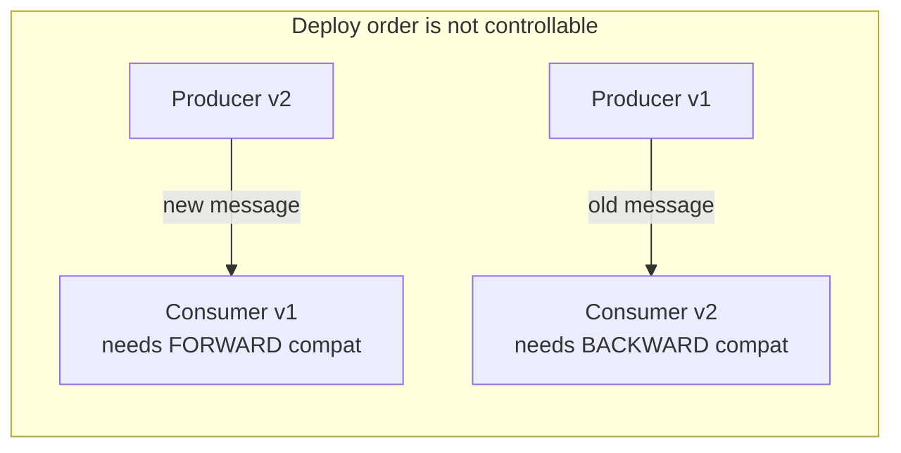

> Independent deployment means two versions of every contract run at once, forever. Schema
> evolution is the discipline that makes that survivable instead of an outage.

| | |
|---|---|
| **Module** | [01 — Communication](/modules/communication/README) |
| **Prerequisites** | [01-02 Asynchronous messaging](/modules/communication/02-asynchronous-messaging) |
| **Also known as** | wire formats, contract versioning, forward/backward compatibility |
| **Category** | Integration |

---

## 1. The problem

The Order team renames `total` to `total_amount` and deploys. Shipping Service, deployed
last Tuesday, deserializes `OrderPlaced`, finds no `total`, throws, nacks the message,
retries, throws again. Within four minutes the DLQ has 12,000 messages and no parcels are
being created.

Nobody did anything obviously wrong. There was no compile error, no failing test, no
reviewer who could have known — the field is read by a consumer in a different repository
that no one on the Order team has heard of.

The general form: **in a distributed system you cannot deploy a change atomically**, so
every change must work while old and new coexist.

## 2. In plain language

A paper form used by three departments. You want to add a "delivery instructions" box.

If you *add* a box, old forms still work — they just have it blank. Fine.
If you *remove* the "phone number" box, the department that reads phone numbers breaks.
If you *rename* "total" to "total amount", every department reading "total" breaks, even
though nothing about the meaning changed.
If you *reuse* the "phone" box for "fax", the worst case: nobody errors, and phone calls go
to fax machines for six months.

The rule that falls out: **only add optional boxes; never remove, rename, or repurpose one
until you are certain nobody reads it.** Everything below is that rule, made precise.

## 3. How it works

### Two directions of compatibility

Distinguishing these carefully is most of the skill.

- **Backward compatible** — *new code can read old data*. Needed when you deploy a new
  consumer against a stream of existing messages.
- **Forward compatible** — *old code can read new data*. Needed when a producer deploys
  first and consumers lag. This is the one people forget, and it is the one that causes the
  outage above.
- **Full** — both. What you want for events, which are read by consumers you cannot enumerate.



### The rules

| Change | Safe? | Notes |
|---|---|---|
| Add an **optional** field with a default | ✅ Always | The only universally safe change |
| Add a **required** field | ❌ | Old producers don't send it. Add optional, backfill, then tighten — never in one step |
| Remove an **optional** field nobody reads | ⚠️ | Only after proving no consumer reads it. Deprecate first |
| Remove a **required** field | ❌ | Breaks every reader |
| Rename a field | ❌ | It is a remove + an add. Do both steps separately, over two releases |
| Change a type (`Int` → `String`) | ❌ | Add a new field instead |
| Widen a type (`Int32` → `Int64`) | ⚠️ | Safe in Protobuf/Avro, not in JSON consumers doing strict parsing |
| Add an enum value | ⚠️ | Safe only if every consumer has an `UNKNOWN`/default branch. Design this in from day one |
| Change the meaning of a field | ❌❌ | The worst change: no error, silent corruption |
| Make an optional field required | ❌ | Same as adding required |

### Wire formats

| Format | Schema | Evolution | Size | Human-readable | Good for |
|---|---|---|---|---|---|
| **JSON** | none / JSON Schema | By convention only — nothing enforces it | Large | Yes | Public APIs, debugging, low volume |
| **Protobuf** | `.proto`, field numbers | Excellent; numbers are the identity, names are cosmetic | Small | No | gRPC, internal high-volume RPC |
| **Avro** | schema stored with data / in a registry | Excellent; explicit reader and writer schemas | Small | No | Kafka, data lakes, long retention |
| **MessagePack / CBOR** | none | Same as JSON | Medium | No | Binary JSON, low-effort size win |

**Field numbers are the key insight in Protobuf.** The wire carries `3: 8000`, not
`"total": 8000`. Renaming `total` → `total_amount` while keeping field number 3 is a
*no-op on the wire*. That is why the outage in §1 happens in JSON systems and not in
Protobuf ones. Never reuse a retired field number — `reserved 3;`.

**Avro's reader/writer schema pair** is the key insight for logs: the writer's schema is
stored with (or referenced by) the data, and the reader supplies its own. The library
resolves between them. This is what makes a 2-year-old Kafka topic readable by today's code.

### Versioning strategies for events

1. **Never break — additive only.** Cheapest. Schemas accrete fields. Works longer than you
   expect.
2. **Version the type.** `OrderPlaced.v2` as a distinct message; producers publish both for a
   transition window; consumers migrate; v1 is retired when its consumer count hits zero.
3. **Upcasting.** Store raw old events; transform old → new on read. Essential in
   [event sourcing](/modules/data-and-consistency/05-event-sourcing), where you cannot
   rewrite history.

For synchronous APIs, the same idea appears as URL versioning (`/v2/orders`), media-type
versioning, or header versioning. The mechanism matters less than the commitment: you now
run two versions and must decide when the old one dies.

## 4. Pseudo-code

**Before — the change that caused the outage.**

```
# v1
event OrderPlaced:
  order_id: OrderId
  total: Money

# v2 — deployed on a Tuesday afternoon
event OrderPlaced:
  order_id: OrderId
  total_amount: Money         # TRAP: renamed. Every existing consumer breaks.
```

**The pattern — expand, migrate, contract.** Three deployments, never one.

```
# ---- Step 1: EXPAND. Add the new field. Write both. Break nobody. ----
event OrderPlaced:
  order_id: OrderId
  total: Money                 # @deprecated(since: v2, remove_after: 2026-11-01)
  total_amount: Option<Money>  # new, optional
  schema_version: Int = 2

service OrderService:
  fn emit(order: Order) -> OrderPlaced:
    return OrderPlaced(
      order_id: order.id,
      total: order.total,          # keep writing the old field
      total_amount: Some(order.total),
      schema_version: 2)

# ---- Step 2: MIGRATE. Every consumer prefers the new field, tolerates its absence. ----
service ShippingService:
  on event OrderPlaced(e):
    amount = e.total_amount ?? e.total        # forward AND backward compatible
    ...

# ---- Step 3: CONTRACT. Only after proving no consumer reads `total`. ----
event OrderPlaced:
  order_id: OrderId
  total_amount: Money           # now required
  schema_version: Int = 3
  # reserved: "total"           # never reuse the name or the field number
```

**Proving nobody reads the old field** — the step teams skip, and the reason the contract
step causes outages:

```
service ShippingService:
  on event OrderPlaced(e):
    if e.total_amount is None:
      metrics.increment("deprecated_field_read", tags: {field: "total", consumer: "shipping"})
    amount = e.total_amount ?? e.total
    # Retire the field when this counter has been zero across every consumer
    # for longer than the longest replay window. Not before.
```

**Defensive consumption — the rules a consumer must follow to be evolvable.**

```
service AnyConsumer:
  on event OrderPlaced(e):
    # 1. Ignore unknown fields silently. Strict parsing is a self-inflicted outage.
    #    (Protobuf/Avro do this by default; JSON parsers often must be configured to.)

    # 2. Every enum needs a default branch — a new value WILL arrive.
    match e.status:
      case PAID:      handle_paid(e)
      case CANCELLED: handle_cancelled(e)
      case _:
        # WHY: producers add enum values without asking. Log, don't crash.
        log.warn("unknown status", status: e.status, order: e.order_id)
        metrics.increment("unknown_enum_value")
        return                    # skip, do not dead-letter: it may be valid and irrelevant

    # 3. Read only the fields you need. Reading a field creates a contract you now own.
```

**Contract enforcement in CI — where this actually gets prevented.**

```
# Producer pipeline, before deploy:
compatibility = registry.check(subject: "OrderPlaced", schema: new_schema,
                               mode: FULL_TRANSITIVE)
if not compatibility.ok:
  fail_build(compatibility.violations)
# FULL_TRANSITIVE: compatible with EVERY previous version, not just the last one.
# Required whenever a log retains messages longer than one release cycle.
```

## 5. Knobs and variants

| Knob | Options | Consequence |
|---|---|---|
| Compatibility mode | none / backward / forward / full / full-transitive | Full-transitive for long-retention logs; backward is often enough for RPC |
| Format | JSON / Protobuf / Avro | JSON's flexibility is exactly what lets the outage happen |
| Registry | none / central schema registry | Without one, "who consumes this?" is unanswerable |
| Version marker | field / topic name / header | A `schema_version` field costs nothing and helps every debugging session |
| Deprecation period | weeks ↔ years | Must exceed max message retention + max consumer lag + replay horizon |
| Unknown field policy | ignore / reject | Ignore. Rejecting means every producer change is a breaking change |

## 6. Challenges and failure modes

- **Semantic changes pass every compatibility check.** Changing `total` from
  tax-inclusive to tax-exclusive keeps the type, the name, and the schema. Every automated
  check passes and every downstream number is wrong. Only a new field name prevents this.
- **You cannot enumerate consumers.** The core difficulty of events. Mitigations: a registry
  with consumer registration, tracking read patterns, and organisational convention.
- **Replay resurrects old schemas.** A DLQ message from three months ago arrives at today's
  consumer. Backward compatibility must extend to the oldest replayable message, which is
  why full-transitive exists.
- **Deploy order is not controllable.** Rolling deploys, canaries, and rollbacks mean old and
  new run simultaneously in both directions. Design for both, not for "we'll deploy consumers
  first."
- **Rollback breaks forward compatibility.** You deploy v2 producers, something else breaks,
  you roll back to v1 — now v2 messages are being read by v1 code. If v2 added a required
  field, the rollback is the outage.
- **Enum expansion.** The most common silent breakage after renames. Every consumer needs a
  default branch *before* the producer needs to add a value.
- **Optional fields accumulate.** After three years the schema has 40 optional fields, half
  unused, none removable because nobody can prove they are unread. This is the cost of the
  additive-only strategy, and it is usually worth paying.

## 7. Alternatives

- **Shared library of types.** Producers and consumers import the same generated classes.
  Excellent type safety, and it recreates the deployment coupling you split the services to
  avoid. Acceptable within a team, dangerous across teams.
- **No schema (schemaless JSON, duck typing).** Fast to start, and the failure mode is a
  runtime error in production instead of a build error.
- **Tolerant reader** (Postel's law). Consumers extract only what they need and ignore
  everything else. Cheap, effective, and puts all the responsibility on consumers.
- **Consumer-driven contract tests.** Each consumer publishes the shape it needs; the
  producer's build fails if it breaks any of them. The strongest available guarantee, and it
  requires organisational buy-in more than tooling.
- **[Anti-corruption layer](/modules/microservice-architecture/06-anti-corruption-layer).**
  Translate at the boundary so an upstream change touches one file instead of a codebase.

## 8. Trade-offs

| Advantage of disciplined evolution | Disadvantage |
|---|---|
| Producers and consumers deploy independently, in any order | Every change takes three releases instead of one |
| Rollback is safe | Deprecated fields linger for months |
| Old messages remain readable, so replay works | A registry and CI checks must exist and be enforced |
| Breakage is caught in CI rather than in the DLQ | Schemas grow monotonically and get ugly |

## 9. Complexity introduced

- **Operational.** A schema registry to run and back up; compatibility gates in every
  pipeline; deprecation tracking; metrics per deprecated field.
- **Cognitive.** Engineers must think about three coexisting versions and about rollback,
  not just about "the new shape".
- **Failure surface.** Registry unavailability blocks producers; a wrong compatibility mode
  gives false confidence; semantic changes remain undetectable by machines.
- **Testing.** Needs cross-version tests: v1 producer → v2 consumer *and* v2 producer → v1
  consumer, plus a replay test against archived messages.

## 10. Related concepts

- **Builds on:** [01-02 Asynchronous messaging](/modules/communication/02-asynchronous-messaging)
- **Composes with:** [11-02 Deployment strategies](/modules/operations-and-evolution/02-deployment-strategies) (expand/contract is the same idea applied to databases), [05-04 Canonical data model](/modules/messaging-and-eip/04-message-translator-and-canonical-data-model)
- **Conflicts with / tension:** velocity — three releases per rename is a real tax
- **Contrast with:** [08-06 Anti-corruption layer](/modules/microservice-architecture/06-anti-corruption-layer) — evolution manages *your* contract, an ACL defends against *someone else's*
- **Leads to:** [01-05 Service discovery](/modules/communication/05-service-discovery)

## 11. Exercises

1. **Trace it.** ShopFlow deploys the v3 (contract) schema while one Analytics consumer is
   still on v1 and 30 minutes of unprocessed `OrderPlaced` messages sit in a topic. Write
   exactly what happens, message by message.
2. **Extend it.** `OrderStatus` gains a `PARTIALLY_SHIPPED` value. List every consumer in
   [ShopFlow](/domain/RUNNING-EXAMPLE) and state what each does on receiving it today,
   and what it should do. Which consumers must change *before* the producer ships?
3. **Break it.** Find a change to `OrderPlaced` that passes `FULL_TRANSITIVE` compatibility
   checks and still corrupts every downstream financial report. Then propose a process
   control that catches it, since no tool will.

## 12. References

- Martin Kleppmann, *Designing Data-Intensive Applications* — Ch. 4, "Encoding and Evolution". The definitive treatment.
- Google, Protocol Buffers documentation — "Updating A Message Type".
- Apache Avro specification — schema resolution rules.
- Confluent, "Schema Evolution and Compatibility" — the compatibility modes explained.
- Martin Fowler, "TolerantReader" and "Consumer-Driven Contracts".
- Pact documentation — consumer-driven contract testing in practice.

---

**Up:** [Module 01](/modules/communication/README) · **Previous:** [← 01-03](/modules/communication/03-delivery-guarantees-and-idempotency) · **Next:** [01-05 Service discovery →](/modules/communication/05-service-discovery)
