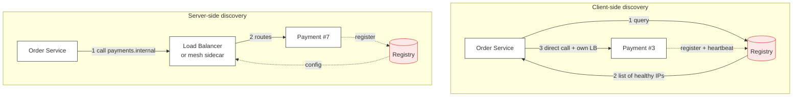

> Instances appear and disappear every few minutes. Discovery is how a caller finds a
> healthy one — and how it avoids the one that died four seconds ago.

| | |
|---|---|
| **Module** | [01 — Communication](/modules/communication/README) |
| **Prerequisites** | [01-01 Synchronous request/response](/modules/communication/01-synchronous-request-response) |
| **Also known as** | service registry, client-side vs server-side discovery |
| **Category** | Structure |

---

## 1. The problem

Order Service needs to call Payment Service. Payment Service runs as 12 containers whose IP
addresses change on every deploy, every autoscale event, and every node replacement — which
is to say, several times an hour.

The naive answers all fail:

- **Hardcoded IPs** — wrong within minutes.
- **A config file with a list** — needs a redeploy of every caller whenever the callee scales.
- **DNS with a low TTL** — better, and DNS has no idea whether a host is healthy, caches
  aggressively at layers you don't control, and often returns one A record regardless.

Symptom: after a deploy, 8% of requests fail for 90 seconds with connection-refused, and the
dashboard shows the *caller* as unhealthy.

## 2. In plain language

A large office where people move desks constantly. Three ways to find someone:

1. **Memorise their desk number.** Fast, and wrong after they move.
2. **Ask reception** (client-side discovery). Reception keeps a live list. You ask, you get a
   desk number, you walk there. You now decide which of the four people who do that job to
   visit — you can pick the closest.
3. **Send it to the department's inbox** (server-side discovery). You don't know or care who
   handles it; someone at the department's front desk routes it. Simpler for you, and the
   front desk becomes a bottleneck and a single point of failure.

The subtlety is **staleness**. Reception's list is updated when people report a move. Someone
who leaves suddenly stays on the list until reception notices. You will be sent to an empty
desk. Every discovery system has this window; the design question is how short it is and what
the caller does when it happens.

## 3. How it works

Three moving parts: **registration** (an instance announces itself), **health checking**
(the registry removes dead ones), and **resolution** (a caller obtains addresses).



| | Client-side | Server-side |
|---|---|---|
| Who chooses the instance | The caller | The proxy/LB |
| Extra network hop | No | Yes (~0.5ms) |
| Load-balancing intelligence | Caller-side, can use local latency data | Centralised, uniform |
| Client complexity | A discovery library per language | None — just use a DNS name |
| Failure domain | Registry outage → callers use stale cache and survive | LB outage → total outage for that path |
| Typical implementation | Consul + Ribbon, Eureka, gRPC name resolver | Kubernetes Service, AWS ALB, Envoy sidecar |

**Kubernetes is server-side discovery** with the registry (etcd + the API server) hidden
behind a stable DNS name and a virtual IP. **A service mesh
([08-04](/modules/microservice-architecture/04-sidecar-and-service-mesh)) is client-side
discovery** where the "client library" is a sidecar proxy — which is why it gets client-side
load balancing without needing a library per language.

### Registration

- **Self-registration** — the instance calls the registry on start and heartbeats. Simple;
  couples application code to the registry; a hung process may keep heartbeating while being
  useless.
- **Third-party registration** — the orchestrator registers on the instance's behalf, based
  on its own health checks. The app stays ignorant. This is what Kubernetes does, and it is
  the better default.

### Health and the removal window

The registry must remove dead instances, and it always removes them *late*: detection
interval + failure threshold + propagation + client cache TTL. Ten seconds is a good outcome;
60 seconds is common. **Callers must therefore expect to be handed a dead address**, which
means retrying on connection failure against a *different* instance is not optional — see
[02-02](/modules/resilience/02-retries-backoff-and-jitter).

Removal is only half of it. Graceful shutdown is the other half, and it is the part teams
get wrong: an instance must *deregister first*, keep serving for the propagation window, then
stop accepting new connections, then drain in-flight ones, then exit.

## 4. Pseudo-code

**Before — the config file.**

```
service OrderService:
  uses payments: Client<PaymentService> at "10.0.3.14:8443"
  # TRAP: that container was replaced during last night's deploy.
```

**The pattern — client-side discovery with a cache that survives registry failure.**

```
record Instance:
  id: String
  address: String
  zone: String
  healthy: Bool
  registered_at: Instant

service DiscoveryClient:
  uses registry: Client<Registry>
  state cache: Map<String, List<Instance>> = {}
  state last_ok: Map<String, Instant> = {}

  fn resolve(service_name: String) -> List<Instance>:
    return cache.get(service_name) ?? []      # never blocks on the registry

  # Refreshed in the background, off the request path.
  every 5s:
    for name in cache.keys():
      try:
        fresh = await registry.healthy_instances(name) timeout 2s
        if fresh.is_empty():
          # TRAP: an empty result is almost always a registry bug, not a true zero.
          # Treating it as truth causes a total outage. Keep the last good list.
          metrics.increment("discovery.empty_result", tags: {service: name})
          continue
        cache.put(name, fresh)
        last_ok.put(name, now())
      catch TimeoutError, NetworkError:
        # WHY: stale routing beats no routing. Callers retry elsewhere on failure.
        age = now() - last_ok.get(name)
        metrics.gauge("discovery.staleness_s", age, tags: {service: name})
        if age > 5m:
          log.error("discovery data critically stale", service: name, age: age)
```

**Choosing an instance — zone-aware, with the dead-address case handled.**

```
service OrderService:
  uses discovery: DiscoveryClient
  state failed: Cache<String, Instant>        # short-lived local ejection list

  async fn call_payment(req: ChargeCard) -> Result<Receipt, ChargeError>:
    candidates = discovery.resolve("payment-service")
      .filter(i => failed.get(i.id) is None)  # skip ones that just failed us

    if candidates.is_empty():
      candidates = discovery.resolve("payment-service")   # all ejected: try anyway

    # Prefer same zone: cross-AZ hops cost latency AND money (fallacy 7).
    local = candidates.filter(i => i.zone == MY_ZONE)
    pool  = local.is_empty() ? candidates : local

    for attempt in 1..3:
      target = pick_two_choices(pool)         # see 03-02 Load balancing
      try:
        return await target.charge(req) timeout 800ms
      catch ConnectionRefused, ConnectionReset:
        # A dead-but-registered instance. Eject locally and try a DIFFERENT one.
        failed.put(target.id, now(), ttl: 30s)
        pool = pool - target
        continue                              # safe: no request was processed
      catch TimeoutError:
        # TRAP: NOT safe to blindly retry — the charge may have happened.
        # Only retry if the call is idempotent (01-03). It is: we pass a key.
        raise
    return Err(NoHealthyInstance)
```

**Graceful shutdown — the half that prevents deploy-time errors.**

```
service PaymentService:
  on start:
    registry.register(Instance(id: INSTANCE_ID, address: MY_ADDR, zone: MY_ZONE))

  every 3s:
    registry.heartbeat(INSTANCE_ID)

  on shutdown_signal:
    registry.deregister(INSTANCE_ID)          # 1. tell the registry first
    health.set(NOT_READY)                     # 2. fail readiness probes
    sleep(15s)                                # 3. wait out caches and LB propagation
                                              #    WHY: callers still hold our address
    stop_accepting_new_connections()          # 4. then close the door
    await drain_inflight(max: 30s)            # 5. finish what we started
    exit(0)
    # Skipping step 3 is the single most common cause of "errors during every deploy".
```

## 5. Knobs and variants

| Knob | Typical | Consequence of getting it wrong |
|---|---|---|
| Heartbeat interval | 3–10s | Too long: dead instances linger. Too short: registry load |
| Unhealthy threshold | 2–3 consecutive failures | 1 causes flapping on a single GC pause |
| Client cache TTL | 5–30s | Long TTL survives registry outages, routes to corpses longer |
| Shutdown grace period | ≥ 2 × (cache TTL + propagation) | Too short = errors on every deploy |
| Empty-result policy | keep last good list | Trusting an empty result = self-inflicted total outage |
| Zone preference | prefer local, fall back | No preference = latency and cross-AZ egress cost |
| DNS TTL (if DNS-based) | 5–30s | Many resolvers and JVMs cache far longer than the TTL says |

## 6. Challenges and failure modes

- **The registry is a critical dependency.** If callers block on it, its outage is a total
  outage. Always cache, always serve stale, never block on the request path — as above.
- **The empty-result cascade.** A registry glitch returns zero instances; every client
  believes it; the whole system stops. Historically a real, repeated cause of large outages.
  Never trust an empty result.
- **Registered but not healthy.** Self-registration keeps heartbeating from a process whose
  thread pool is exhausted. Health checks must exercise the real path
  ([02-08](/modules/resilience/08-health-checks-and-self-healing)).
- **DNS caching lies to you.** Some runtimes cache DNS forever by default. TTL is a
  suggestion, not a contract.
- **Thundering herd on registry restart.** Every client re-registers and re-resolves at once.
  Jitter the retry ([02-02](/modules/resilience/02-retries-backoff-and-jitter)).
- **Long-lived connections defeat discovery.** HTTP/2 and gRPC multiplex over one connection
  that stays pinned to one instance; new instances get no traffic until connections are
  recycled. Set a max connection age.
- **Stale routing after scale-in.** The instance is gone but cached; expect connection
  refused and retry elsewhere. This is *normal*, not an incident.

## 7. Alternatives

- **DNS only.** Simplest. Adequate for stable topologies; weak health semantics and
  unreliable TTL honouring.
- **Kubernetes Services.** Server-side, built in, sufficient for the overwhelming majority of
  systems. If you are on Kubernetes, start here and add nothing.
- **[Service mesh](/modules/microservice-architecture/04-sidecar-and-service-mesh).**
  Client-side discovery plus load balancing, retries, mTLS and telemetry, with zero
  application code. The heaviest option operationally.
- **Static configuration.** Genuinely correct for a fixed set of external endpoints —
  ShopFlow's payment provider is one hostname and does not need discovery.
- **Message broker.** Consumers subscribe; nobody addresses anybody. Discovery disappears as
  a problem — one more reason [asynchronous messaging](/modules/communication/02-asynchronous-messaging)
  simplifies topology.

## 8. Trade-offs

| Advantage | Disadvantage |
|---|---|
| Instances scale, move and restart without touching callers | A new distributed, stateful component to run |
| Unhealthy instances are removed automatically | Removal is always late; callers must still handle dead addresses |
| Enables zone-aware and latency-aware routing | Client-side discovery needs a library per language |
| Deploys stop causing connection errors — if drain is done right | Graceful shutdown is subtle and usually implemented wrong |

## 9. Complexity introduced

- **Operational.** A registry cluster (or reliance on the orchestrator's), health-check
  tuning, staleness monitoring, and a documented drain procedure.
- **Cognitive.** "Which instance served this?" becomes a real question; debugging requires
  correlating instance ids in [traces](/modules/operations-and-evolution/01-observability).
- **Failure surface.** Stale routing, empty results, flapping, registration storms, split
  registry views, connection pinning.
- **Testing.** Must cover: instance disappears mid-request, registry unavailable, empty
  result, and deploy-time drain. Almost never covered by default.

## 10. Related concepts

- **Builds on:** [01-01 Synchronous request/response](/modules/communication/01-synchronous-request-response)
- **Composes with:** [03-02 Load balancing](/modules/scalability/02-load-balancing) (discovery finds candidates, LB picks one), [02-08 Health checks](/modules/resilience/08-health-checks-and-self-healing), [08-04 Service mesh](/modules/microservice-architecture/04-sidecar-and-service-mesh)
- **Conflicts with / tension:** long-lived connections and sticky sessions
- **Contrast with:** [01-02 Asynchronous messaging](/modules/communication/02-asynchronous-messaging), where addressing is replaced by subscription
- **Leads to:** [Module 02 — Resilience](/modules/resilience/README)

## 11. Exercises

1. **Trace it.** A Payment Service instance is SIGKILLed (no graceful shutdown). Heartbeat
   interval 3s, threshold 3, client cache TTL 10s. Compute the worst-case window during which
   callers are handed the dead address, and how many requests that is at 600 req/s.
2. **Extend it.** Add locality-aware failover: prefer same zone, spill to another zone only
   when local healthy capacity drops below 30%. What new failure mode does the spill create
   during a zone-wide brownout?
3. **Break it.** The `resolve` cache never expires entries for services that stop appearing
   in the registry. Construct the scenario where this causes traffic to be sent to a service
   that was decommissioned a month ago, and fix it without reintroducing the empty-result
   cascade.

## 12. References

- Chris Richardson, *Microservices Patterns* — Ch. 3, service discovery patterns.
- HashiCorp Consul documentation — health checking and DNS interface.
- Kubernetes documentation — Services, EndpointSlices, readiness gates, termination lifecycle.
- Envoy documentation — service discovery types (EDS) and outlier detection.
- Netflix Tech Blog, "Eureka at Netflix" — and its self-preservation mode, which exists purely to prevent the empty-result cascade.

---

**Up:** [Module 01](/modules/communication/README) · **Previous:** [← 01-04](/modules/communication/04-serialization-and-schema-evolution) · **Next:** [Module 02 — Resilience →](/modules/resilience/README)
