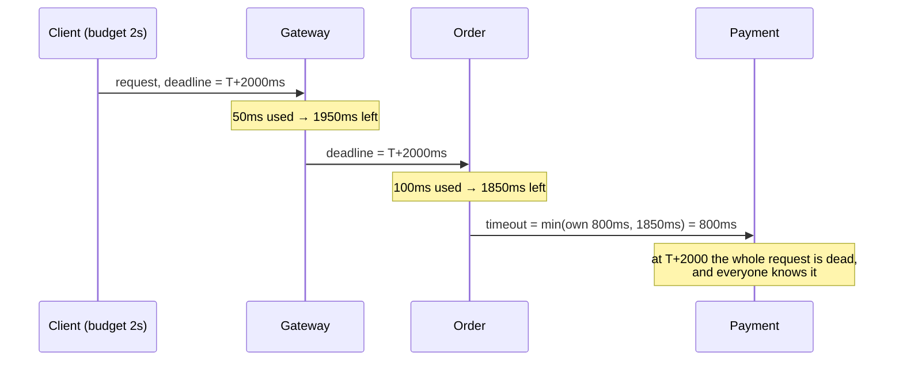

> The most important pattern in this course. Every other resilience pattern assumes calls
> terminate, and only a timeout makes that true.

| | |
|---|---|
| **Module** | [02 — Resilience](/modules/resilience/README) |
| **Prerequisites** | [00-03 Failure models](/modules/foundations/03-failure-models-and-partial-failure), [00-04 Latency](/modules/foundations/04-latency-throughput-and-back-of-envelope) |
| **Also known as** | deadline propagation, request budgets, cancellation |
| **Category** | Resilience |

---

## 1. The problem

ShopFlow's payment provider stops responding — not with errors, which would be easy, but by
accepting connections and never replying.

Order Service has 200 worker threads and receives 120 req/s. Each request calls the provider
and waits. The default client timeout is 60 seconds. After 1.7 seconds every thread is
blocked. After that, *no request is served at all* — including requests that never touch
payments. The health check, which uses the same thread pool, stops responding, so the load
balancer removes the instance, sending its traffic to the other instances, which fall over
in the same way.

Symptom: total outage of a service whose only broken dependency is used by 20% of its
requests.

## 2. In plain language

You call a supplier and they put you on hold. You have one phone line and eight customers
waiting. If you hold for an hour, all eight leave — not because the supplier is broken, but
because you gave your only phone line to a supplier who wasn't going to answer.

A timeout is the decision "I hang up after 90 seconds." The important part is not the number.
It is that **you decided in advance**, because you cannot decide well while holding.

Now the subtle bit. Your customer is only willing to wait five minutes. If you have already
spent four minutes on other suppliers, hanging up at 90 seconds is pointless — you should
hang up at 60, because that is all the time you have left. **The budget belongs to the
customer's request, not to the supplier's phone line.** That distinction is the difference
between a timeout and a deadline.

**Where the analogy breaks down:** hanging up on a supplier stops their work. Cancelling a
network call usually does not — the remote side keeps going. See §6.

## 3. How it works

### Timeout vs deadline

- A **timeout** is a duration attached to one call: "give up after 800ms."
- A **deadline** is an absolute instant attached to the *request*: "everything must be done by
  10:15:32.400." It propagates to every downstream call, and each hop's effective timeout is
  `deadline - now()`.

Timeouts alone are insufficient because they don't compose. Three hops with 3s timeouts each
can take 9 seconds against a 3-second SLA. Worse, the third hop happily works for 3 seconds
on a request the client abandoned 6 seconds ago — burning capacity for a result no one will
read.



### Choosing the number

Not "a round number that feels safe." Derive it:

1. Measure the dependency's latency distribution.
2. Set the timeout near **p99.9**, not p50 or p99 — you want to cut off the pathological
   tail, not healthy-but-slow requests.
3. Check it fits the caller's budget. If p99.9 is 4s and your budget is 2s, you do not have
   a timeout problem, you have an architecture problem: that call cannot be synchronous.
4. Recheck quarterly. Dependencies get slower.

**Total budget must exceed the sum of what you allow downstream**, or your own timeout fires
first and you never see the downstream error. And a caller's timeout should exceed its
callee's, so the callee gets a chance to return a proper error rather than being cut off.

### Cancellation

A deadline that fires should *cancel* downstream work, not just abandon it. HTTP/2 and gRPC
propagate cancellation natively; HTTP/1.1 requires closing the connection and hoping the
server notices. Databases need explicit statement timeouts — an abandoned query keeps
consuming the database until it finishes, which is how a client timeout turns into a
database outage.

## 4. Pseudo-code

**Before — the outage in §1.**

```
service OrderService:
  uses payments: Client<PaymentService>       # no timeout: library default is 60s

  handler place_order(cmd: PlaceOrder) -> Result<Order, OrderError>:
    receipt = await payments.charge(cmd)      # TRAP: unbounded. One thread, gone for a minute.
    ...
```

**The pattern — a budget that propagates and shrinks.**

```
record RequestContext:
  trace_id: String
  deadline: Instant
  idempotency_key: UUID

fn remaining(ctx: RequestContext) -> Duration:
  return max(ctx.deadline - now(), 0ms)

service ApiGateway:
  uses orders: Client<OrderService>

  handler post_orders(req: HttpRequest) -> HttpResponse:
    # The key comes from the CLIENT and is never minted here. A gateway-generated
    # key would be different on every retry — and with several gateway instances,
    # a client's retry would land on a different one and become a NEW intent,
    # which is precisely the duplicate that 01-03 exists to prevent.
    key = req.header("Idempotency-Key")
    if key is None:
      return 400("Idempotency-Key header required for unsafe methods")

    # The budget is set ONCE, at the edge, from the product requirement.
    ctx = RequestContext(trace_id: uuid(), deadline: now() + 2s, idempotency_key: key)

    try:
      return 201(await orders.place_order(ctx, cmd))
    catch DeadlineExceeded:
      # 00-03: a deadline is NOT a failure of the operation. Say what is true.
      #
      # TRAP: do NOT point at /orders/{id}. We timed out, so Order Service may
      # never have received the request and that order may not exist — the
      # client would poll a 404 and conclude the order failed, which we do not
      # know. Point at the one identifier that certainly exists: their own key.
      return 202("processing", status_url: "/requests/" + key)

  # The status endpoint must distinguish "no such request" from "not finished",
  # and must never 404 a key it simply has not seen commit yet.
  handler get_request_status(key: UUID) -> HttpResponse:
    match await orders.lookup_by_idempotency_key(key) timeout 500ms:
      case Ok(Completed(order)): return 200({status: "completed", order: order})
      case Ok(InProgress):       return 200({status: "processing"})
      case Ok(NotFound):
        # Genuinely unknown: either never arrived, or arrived and is not yet
        # durable. Both mean "keep asking", not "it failed".
        return 200({status: "unknown", retry_after: 2})


service OrderService:
  uses inventory: Client<InventoryService>
  uses payments: Client<PaymentService>

  handler place_order(ctx: RequestContext, cmd: PlaceOrder) -> Result<Order, OrderError>:

    if remaining(ctx) < 200ms:
      # WHY: don't start work we certainly cannot finish. Free the slot immediately.
      return Err(DeadlineExceeded)

    # Each call gets min(its own sane maximum, what's actually left).
    inv_budget = min(300ms, remaining(ctx))
    reservation = await inventory.reserve(ctx, cmd.lines) timeout inv_budget

    pay_budget = min(800ms, remaining(ctx) - 100ms)   # reserve 100ms to finish up
    if pay_budget < 100ms:
      return Err(DeadlineExceeded)

    try:
      receipt = await payments.charge(ctx, cmd) timeout pay_budget
    catch TimeoutError:
      # TRAP: ambiguous outcome. Do NOT report failure. See 00-03.
      spawn reconcile_later(cmd.order_id, ctx.idempotency_key)
      return Ok(order_pending(cmd))

    return Ok(...)


service PaymentService:
  uses psp: Client<PaymentProvider>
  uses db: Store<PaymentId, Payment>

  handler charge(ctx: RequestContext, cmd: ChargeCard) -> Result<Receipt, ChargeError>:
    # Cancellation must reach the resources, not just the call stack.
    db.set_statement_timeout(remaining(ctx))
    # COST: without this, an abandoned request keeps a DB connection AND a
    # database worker busy for as long as the query takes. Client timeouts
    # that don't cancel server work are how a slow query becomes an outage.

    with deadline(ctx.deadline):
      return await psp.capture(cmd.amount, idempotency_key: ctx.idempotency_key)
```

**In use — the budget table that must exist somewhere a human can read.**

```
# ShopFlow checkout budget — total 2000ms (product requirement: p99 < 2s)
#
#   gateway overhead              50ms
#   order service overhead        50ms
#   inventory.reserve            300ms   (p99.9 = 210ms)
#   payments.charge              800ms   (p99.9 = 740ms)
#   persistence + publish        150ms
#   slack for retries + GC       650ms
#                              ------
#                               2000ms
#
# Rules:
#   - the sum of the maxima must be <= the budget
#   - every entry is p99.9 of the dependency, measured, not guessed
#   - if a dependency's p99.9 rises above its line, it is an SLO breach for THEM
```

## 5. Knobs and variants

| Knob | Guidance | Failure if wrong |
|---|---|---|
| Connect timeout | 100–500ms; much shorter than read timeout | Too long: dead hosts hold slots for seconds |
| Read/request timeout | ≈ dependency p99.9 | Too short: healthy requests fail, load increases. Too long: resource exhaustion |
| Total request budget | From the product requirement | Absent: per-call timeouts sum past the SLA |
| Caller vs callee timeout | Caller's > callee's | Reversed: caller never sees a real error |
| Idle/keepalive timeout | 30–120s | Too long: dead connections in the pool |
| DB statement timeout | ≤ remaining budget | Absent: cancelled requests still burn the database |
| Timeout on a retry | Use *remaining* budget, not a fresh one | Fresh budget per attempt = 3× the intended wait |

## 6. Challenges and failure modes

- **Cancellation doesn't propagate by default.** The client gives up; the server, the
  database and the third party keep working. Under overload this is catastrophic: you have
  100% of the load and 0% of the value. Explicit statement timeouts and context cancellation
  are mandatory.
- **The retry–timeout interaction.** Three attempts at 800ms is 2.4s, not 800ms. Retry logic
  must consume the *remaining* budget.
- **Timeouts that are too aggressive cause the outage they prevent.** Cutting p95 kills 5% of
  healthy requests; those clients retry; load rises; latency rises; more timeouts. A
  self-reinforcing collapse triggered by a "safety" measure.
- **Clock skew across services.** An absolute deadline is meaningless if two machines differ
  by 400ms. Propagate a *remaining duration* rather than an absolute instant when you can't
  trust clocks, or rely on monotonic clocks locally.
- **GC pauses and CPU steal.** A 400ms stop-the-world pause blows a 300ms timeout with no
  fault anywhere. Budget for it, or expect a mysterious error floor.
- **Health checks sharing the pool.** The classic amplifier: the check fails because the pool
  is full, the LB ejects a recoverable instance, the remaining ones die faster
  ([02-08](/modules/resilience/08-health-checks-and-self-healing)).
- **Timeouts hide slowness.** A dependency degrading from 50ms to 750ms against an 800ms
  timeout shows zero errors and consumes 15× the concurrency. Alert on latency percentiles,
  not just on timeout counts.

## 7. Alternatives

- **Asynchronous processing.** If the work doesn't need an answer now, move it to a queue and
  the timeout problem disappears ([01-02](/modules/communication/02-asynchronous-messaging)).
- **Adaptive timeouts.** Derive the value from a live percentile estimate. Self-tuning, and it
  can drift upward during a slow degradation — exactly when you want it not to.
- **Hedged requests.** Instead of waiting for the timeout, send a second request at p95 and
  take the first answer ([10-04](/modules/performance-and-concurrency/04-tail-latency-and-hedged-requests)).
  Costs extra load; superb for read-heavy tail latency.
- **Bounded queues instead of time bounds.** Limit concurrency rather than duration
  ([02-04](/modules/resilience/04-bulkhead), [02-06](/modules/resilience/06-load-shedding-and-backpressure)). Complementary,
  not a substitute.

## 8. Trade-offs

| Advantage | Disadvantage |
|---|---|
| Resource consumption per request is bounded | Requires measuring dependencies and maintaining the numbers |
| Failures become fast and local instead of slow and global | Too-aggressive values fail healthy requests and amplify load |
| Enables every other resilience pattern to function | Ambiguous outcomes must now be handled explicitly |
| Deadline propagation stops wasted downstream work | Needs context plumbing through every layer |

## 9. Complexity introduced

- **Operational.** A documented latency budget per user-facing operation, alerts on timeout
  rate *and* on latency percentiles, periodic revalidation as dependencies change.
- **Cognitive.** Every engineer must know that timeout ≠ failure, and must plumb context
  through code that would rather not have it.
- **Failure surface.** Premature timeouts, budget exhaustion mid-flight, clock skew,
  ambiguity requiring reconciliation.
- **Testing.** Requires injecting latency, not just errors — a slow dependency behaves
  completely differently from a failing one, and only one of those is in your test suite.

## 10. Related concepts

- **Builds on:** [00-03 Failure models](/modules/foundations/03-failure-models-and-partial-failure), [00-04 Latency](/modules/foundations/04-latency-throughput-and-back-of-envelope)
- **Composes with:** [02-02 Retries](/modules/resilience/02-retries-backoff-and-jitter), [02-03 Circuit breaker](/modules/resilience/03-circuit-breaker), [02-04 Bulkhead](/modules/resilience/04-bulkhead) — all of which require bounded calls to work
- **Conflicts with / tension:** [10-04 Hedged requests](/modules/performance-and-concurrency/04-tail-latency-and-hedged-requests), which acts *before* the timeout would
- **Contrast with:** [02-06 Load shedding](/modules/resilience/06-load-shedding-and-backpressure) — timeouts bound an accepted request, shedding refuses it up front
- **Leads to:** [02-02 Retries, backoff and jitter](/modules/resilience/02-retries-backoff-and-jitter)

## 11. Exercises

1. **Trace it.** Order Service: 200 threads, 120 req/s, 30% of requests call payments.
   Payments goes from 200ms to hanging. With a 60s timeout, how long until every thread is
   consumed? With 800ms? With 800ms plus a 40-slot bulkhead?
2. **Extend it.** Add a retry (max 2) to `payments.charge` in the pattern code such that the
   2-second budget is never exceeded. Write the code that computes each attempt's timeout.
3. **Break it.** Every service in ShopFlow uses a 3-second timeout, uniformly. Draw the
   call chain from the gateway to the payment provider and find the request that consumes
   12 seconds of resources across four services to produce a result the customer stopped
   waiting for at second 3.

## 12. References

- Michael Nygard, *Release It!*, 2nd ed. — "Integration Points", "Blocked Threads".
- Google SRE Book — Ch. 22, "Addressing Cascading Failures".
- gRPC documentation — "Deadlines" and deadline propagation semantics.
- Marc Brooker (AWS), "Timeouts, retries and backoff with jitter".
- Go `context` package documentation — the canonical deadline-propagation API.

---

**Up:** [Module 02](/modules/resilience/README) · **Previous:** [← Module 01](/modules/communication/README) · **Next:** [02-02 Retries, backoff and jitter →](/modules/resilience/02-retries-backoff-and-jitter)
