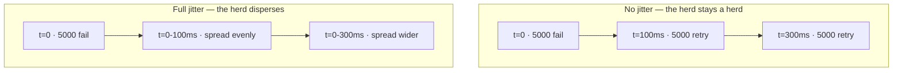

> Retrying is how transient failures stop reaching users. It is also how a two-second blip
> becomes a two-hour outage. The difference is entirely in the details.

| | |
|---|---|
| **Module** | [02 — Resilience](/modules/resilience/README) |
| **Prerequisites** | [02-01 Timeouts](/modules/resilience/01-timeouts-and-deadlines), [01-03 Idempotency](/modules/communication/03-delivery-guarantees-and-idempotency) |
| **Also known as** | exponential backoff, retry storm, thundering herd, token-bucket retry |
| **Category** | Resilience |

---

## 1. The problem

Two problems, opposite in direction.

**Without retries:** the payment provider drops one connection in 200. Every 200th customer
sees "payment failed" for a fault that would have vanished on a second attempt 50ms later.

**With naive retries:** the provider slows down under load. Every client retries three times
immediately. Load triples at the exact moment the provider can least afford it. It slows
further, so more requests time out, so more retry. The provider never recovers — it is now
serving 3× traffic and 0% successfully. Even after the original trigger is gone, the
retry-generated load keeps it down. This is a **metastable failure**: the system stays broken
after its cause has been removed.

Symptom: a dependency's error rate goes from 0.5% to 100% in under a minute, and stays there
after you fix what caused the initial 0.5%.

## 2. In plain language

A busy phone line. Ringing back once after a few seconds is sensible. Ringing back
immediately, ten times, makes the line busier.

Now imagine 5,000 people all trying to buy concert tickets. The site stumbles for one second.
All 5,000 redial *at the same instant*, because they all started at the same instant and all
waited the same amount. The site stumbles again. They all wait the same doubled interval and
redial together again. The synchronised herd, not the original stumble, is what keeps the
site down.

The fix has two halves: **wait longer each time** (backoff), and **wait a random amount**
(jitter) so the herd disperses. Jitter, not backoff, is the part that actually breaks the
synchronisation — and it is the part most implementations omit.

**Where the analogy breaks down:** people give up. Software retries forever unless you make it
stop, which is why retry budgets exist.

## 3. How it works

### What may be retried

| Failure | Retry? | Why |
|---|---|---|
| Connection refused / reset before send | ✅ Yes, immediately, on another instance | The request never ran |
| Timeout | ⚠️ Only if idempotent | Ambiguous — it may have succeeded ([00-03](/modules/foundations/03-failure-models-and-partial-failure)) |
| 503 / 429 with `Retry-After` | ✅ Yes, honour the header | The server told you when |
| 500 | ⚠️ Careful | May be a bug that will recur identically; may have partially applied |
| 400 / 422 validation error | ❌ Never | It will fail identically forever |
| 401 / 403 | ❌ Never (except once after a token refresh) | Retrying is pointless load |
| 404 | ❌ Usually not | Unless you know it's a replication lag read |
| Circuit open | ❌ Never | The breaker exists to stop you |

**The default should be "do not retry" and retryability should be explicit** — the reverse of
what most HTTP clients do.

### Backoff strategies

For attempt *n*, base *b*, cap *c*:

| Strategy | Formula | Verdict |
|---|---|---|
| Immediate | 0 | Amplification machine. Never |
| Fixed | `b` | Keeps the herd synchronised |
| Exponential | `min(c, b × 2ⁿ)` | Good, still synchronised |
| Exponential + full jitter | `random(0, min(c, b × 2ⁿ))` | **The default. Use this** |
| Exponential + equal jitter | `h + random(0, h)` where `h = min(c,b×2ⁿ)/2` | Slightly more predictable |
| Decorrelated jitter | `min(c, random(b, prev × 3))` | Best for very high contention |

AWS measured these: full jitter minimises both total work and completion time under
contention. The intuition is that without jitter, retries from all clients land in the same
narrow windows regardless of how long those windows are.



### Retry amplification

The killer property in a call chain. If every layer retries 3×:

```
gateway 3 × order 3 × payment 3 = 27 requests at the provider for ONE user click
```

**Rules that prevent it:**

1. **Retry at one layer only.** Usually the layer closest to the failure, or the edge — never
   both.
2. **Do not retry again in an outer layer after an inner layer has spent its retry budget.**
   Propagate a "retry budget consumed" marker so only one layer owns retries.
3. **Use a retry budget**, not a per-request count: allow retries to be at most ~10% of total
   requests, system-wide. When the budget is exhausted, fail fast. This is the single most
   effective control, because it bounds *aggregate* amplification rather than per-request
   amplification.

## 4. Pseudo-code

**Before — the amplifier.**

```
async fn charge_with_retry(cmd: ChargeCard) -> Result<Receipt, ChargeError>:
  for attempt in 1..3:
    try:
      return await psp.capture(cmd) timeout 3s
    catch Error:
      continue          # TRAP 1: immediate retry, no wait
                        # TRAP 2: retries validation errors that will never succeed
                        # TRAP 3: no idempotency key → up to 3 charges
                        # TRAP 4: 3 × 3s = 9s against a 2s request budget
  return Err(Unavailable)
```

**The pattern — retryability, budget, backoff, jitter, and deadline awareness.**

```
record RetryPolicy:
  max_attempts: Int = 3
  base: Duration = 50ms
  cap: Duration = 2s
  retry_on: List<ErrorKind> = [ConnectionError, TimeoutError, ServiceUnavailable, TooManyRequests]

# A PER-INSTANCE budget: retries may be at most 10% of the primary requests
# THIS process sees. `state` is process-local, so this is an approximation of a
# system-wide limit, not the thing itself.
#
# That approximation is usually the right trade. Every instance observes the
# same dependency and converges on the same decision, and the alternative — a
# shared counter — puts a network call and a new dependency on the failure path,
# exactly where you least want one (02-05 §3 makes the same argument for rate
# limiters). If you need a true global budget, sync usage periodically rather
# than checking centrally per retry.
state retry_budget: TokenBucket(rate: 0.1 * observed_request_rate, burst: 100)

async fn call_with_retry<T>(ctx: RequestContext,
                            policy: RetryPolicy,
                            idempotent: Bool,
                            op: () => Result<T, Error>) -> Result<T, Error>:

  for attempt in 1..policy.max_attempts:
    started = now()
    try:
      # Each attempt is bounded by what's LEFT of the request budget (02-01).
      return await op() timeout remaining(ctx)

    catch e:
      # 1. Is it retryable at all?
      if e.kind not in policy.retry_on:
        return Err(e)                         # 4xx: fail immediately, don't add load

      # 2. Is it SAFE to retry? A timeout may mean the work was done.
      if e.kind == TimeoutError and not idempotent:
        return Err(e)                         # see 01-03; without a key this is a duplicate

      # 3. Is this the last attempt?
      if attempt == policy.max_attempts:
        return Err(e)

      # 4. Can the SYSTEM afford a retry right now? The most important check.
      if not retry_budget.try_acquire():
        metrics.increment("retry.budget_exhausted")
        return Err(e)                         # WHY: during a broad outage, retrying at all
                                              # is what prevents recovery

      # 5. How long to wait — honour the server if it told us.
      delay = e.retry_after ?? random(0, min(policy.cap, policy.base * 2^attempt))
                                              # full jitter

      # 6. Will the retry fit in the remaining budget? If not, don't bother.
      if delay + estimated_duration > remaining(ctx):
        return Err(DeadlineExceeded)

      metrics.increment("retry.attempt", tags: {attempt: attempt, kind: e.kind})
      sleep(delay)

  return Err(Exhausted)
```

**In use — declaring policy at the dependency, once.**

```
service OrderService:
  # Idempotent read: retry freely.
  uses catalog: Client<CatalogService>
    with timeout(300ms),
         retry(max: 3, backoff: exponential(base: 20ms, cap: 200ms, jitter: full))

  # Idempotent by key: retry is safe BECAUSE of 01-03, not despite it.
  uses payments: Client<PaymentService>
    with timeout(800ms),
         retry(max: 2, backoff: exponential(base: 100ms, cap: 1s, jitter: full),
               retry_on: [ConnectionError, ServiceUnavailable]),
                                       # note: NOT TimeoutError, even though we're
                                       # idempotent — see the reconciler in 00-03
         circuit_breaker(threshold: 5, cooldown: 30s)

  # Downstream retries here. So this service does NOT retry. One layer only.
  uses inventory: Client<InventoryService>
    with timeout(300ms), retry(max: 0)
```

**Consumer-side retry — the asynchronous equivalent, where time is cheap.**

```
service WarehouseAdapter:
  uses work: Queue<PickList>

  every 20ms:
    d = work.receive()
    if d is None: return
    try:
      await warehouse.submit(d.body) timeout 5s
      d.ack()
    catch TimeoutError, ConnectionError:
      if d.attempt >= 8:
        d.dead_letter("exhausted after 8 attempts")   # see 05-06
      else:
        # Async retries can be far more patient: seconds to minutes, not milliseconds.
        d.retry(after: random(0, min(30m, 1s * 2^d.attempt)))
    catch ValidationError as e:
      d.dead_letter(e)                                # never retryable
```

## 5. Knobs and variants

| Knob | Guidance | Failure if wrong |
|---|---|---|
| Max attempts | 2–3 synchronous; 5–10 asynchronous | High counts amplify; low counts surface transients |
| Base delay | ~p50 of the dependency | Too small: retries land before recovery |
| Cap | ≤ remaining request budget | Uncapped exponential exceeds the SLA |
| Jitter | **full**, always | Without it, the herd never disperses |
| Retry budget | ~10% of request rate | Absent: unbounded aggregate amplification |
| Which layer retries | exactly one | Multiple layers multiply |
| `Retry-After` | always honour | Ignoring it fights a server that is telling you the answer |

## 6. Challenges and failure modes

- **Metastable failure.** The system stays down after the trigger is removed, because retry
  load alone sustains the overload. Recovery requires *reducing* load — shedding, or
  restarting clients. Retry budgets and circuit breakers are the prevention.
- **Retrying non-idempotent operations.** Duplicate charges, duplicate orders, duplicate
  emails. Always ask [01-03](/modules/communication/03-delivery-guarantees-and-idempotency)'s
  question first.
- **Retry × timeout blowout.** 3 attempts × 3s is 9s, not 3s. Budget-aware retries only.
- **Retrying a 4xx.** Pure waste, and it hides a client bug behind an error rate.
- **Layered retries.** The 27× amplification above. Audit the whole chain, not one service.
- **Retry after a partial write.** The first attempt wrote three of five rows; the retry
  starts from scratch. Retries assume atomicity that may not exist — see
  [04-02](/modules/data-and-consistency/02-saga).
- **Client libraries retry by default.** Many HTTP and database clients retry silently. Your
  "one layer" may already be three. Check the defaults.
- **Retries mask a real problem.** A dependency at 20% error rate looks fine to users and is
  one bad day from collapse. Alert on retry *rate*, not only on final error rate.

## 7. Alternatives

- **Fail fast and let the caller decide.** Push the retry decision up to where the business
  context lives. Often correct.
- **[Circuit breaker](/modules/resilience/03-circuit-breaker).** When the dependency is definitely down,
  don't retry at all. Retries and breakers are complements: retry transients, break on
  sustained failure.
- **Queue the work.** Move it off the request path and retry over minutes instead of
  milliseconds ([10-02](/modules/performance-and-concurrency/02-asynchronous-processing-and-work-queues)).
- **[Hedged requests](/modules/performance-and-concurrency/04-tail-latency-and-hedged-requests).**
  A *proactive* second request rather than a reactive one. Fixes tail latency; adds constant
  load rather than load-under-stress.
- **[Fallback](/modules/resilience/07-fallback-and-graceful-degradation).** Return a cached or degraded
  answer instead of trying again.

## 8. Trade-offs

| Advantage | Disadvantage |
|---|---|
| Transient faults never reach the user | Amplifies load exactly when the system is weakest |
| Cheap to add; often a config change | Requires idempotency to be safe — a much bigger change |
| Backoff + jitter demonstrably reduce total work under contention | Adds latency to the failing path |
| Retry budgets bound the worst case | Another parameter set to get wrong |

## 9. Complexity introduced

- **Operational.** Metrics for retry rate, budget exhaustion, and attempt distribution; alerts
  when retries exceed ~10% of traffic; auditing every layer's client defaults.
- **Cognitive.** "Is this idempotent?" and "does anything below me already retry?" become
  mandatory review questions.
- **Failure surface.** Storms, amplification, duplicate side effects, budget starvation of a
  healthy dependency sharing the budget.
- **Testing.** Needs a dependency that fails intermittently and one that fails persistently;
  the correct behaviours are opposite, and only one is usually tested.

## 10. Related concepts

- **Builds on:** [02-01 Timeouts](/modules/resilience/01-timeouts-and-deadlines), [01-03 Idempotency](/modules/communication/03-delivery-guarantees-and-idempotency)
- **Composes with:** [02-03 Circuit breaker](/modules/resilience/03-circuit-breaker), [02-05 Rate limiting](/modules/resilience/05-rate-limiting-and-throttling), [05-06 Dead letter channel](/modules/messaging-and-eip/06-dead-letter-channel-and-poison-messages)
- **Conflicts with / tension:** [02-06 Load shedding](/modules/resilience/06-load-shedding-and-backpressure) — one adds load, the other removes it; the retry budget is where they meet
- **Contrast with:** [10-04 Hedged requests](/modules/performance-and-concurrency/04-tail-latency-and-hedged-requests) — proactive duplication vs reactive
- **Leads to:** [02-03 Circuit breaker](/modules/resilience/03-circuit-breaker)

## 11. Exercises

1. **Trace it.** Gateway retries 3×, Order retries 3×, Payment retries 3×. The provider
   returns 503 for 30 seconds at 120 user req/s. How many requests does the provider receive?
   Now add a 10% retry budget at each layer and recompute.
2. **Extend it.** Implement decorrelated jitter and argue when you would prefer it to full
   jitter. What measurement would settle the argument?
3. **Break it.** The retry budget is shared across all dependencies of Order Service. The
   catalogue has a bad minute and drains the budget. Describe what happens to payment retries,
   and redesign the budget to prevent it. (The fix is in [02-04](/modules/resilience/04-bulkhead).)

## 12. References

- Marc Brooker (AWS), "Exponential Backoff And Jitter" (AWS Architecture Blog, 2015) — the measurements.
- Google SRE Book — Ch. 22, retry budgets and "Addressing Cascading Failures".
- Bronson, Aghayev, Abd-El-Malek, Zhu, "Metastable Failures in Distributed Systems" (HotOS 2021).
- Michael Nygard, *Release It!*, 2nd ed. — "Retry Storm".
- gRPC documentation — retry policy, hedging, and `retryThrottling`.

---

**Up:** [Module 02](/modules/resilience/README) · **Previous:** [← 02-01](/modules/resilience/01-timeouts-and-deadlines) · **Next:** [02-03 Circuit breaker →](/modules/resilience/03-circuit-breaker)
