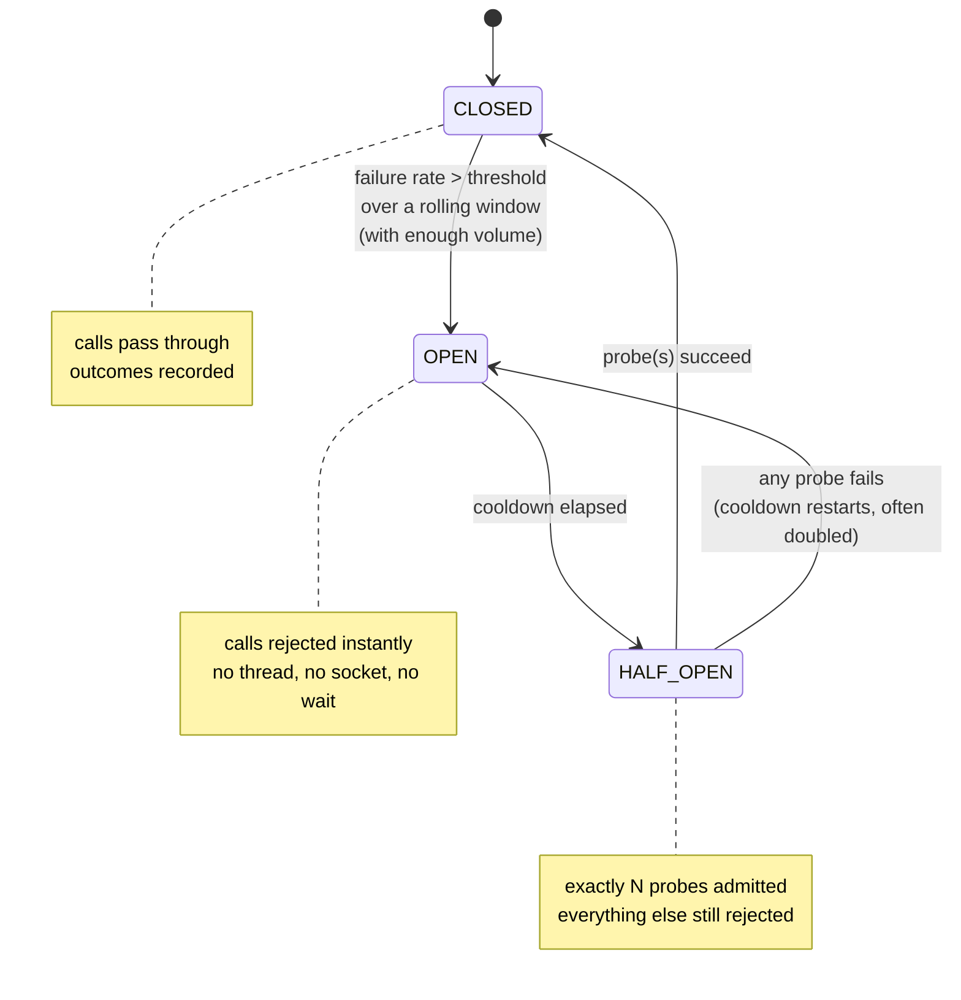

> When a dependency is definitely broken, calling it is not optimism — it is spending your
> own capacity to make its recovery slower.

| | |
|---|---|
| **Module** | [02 — Resilience](/modules/resilience/README) |
| **Prerequisites** | [02-01 Timeouts](/modules/resilience/01-timeouts-and-deadlines), [02-02 Retries](/modules/resilience/02-retries-backoff-and-jitter) |
| **Also known as** | fail-fast, breaker, outlier ejection (at the LB layer) |
| **Category** | Resilience |

---

## 1. The problem

The payment provider is completely down. Every call takes 800ms (the timeout) and then
fails. Order Service still makes every call.

Consequences, all bad:

- Each doomed request holds a thread for 800ms. At 120 req/s that is 96 threads permanently
  occupied producing nothing.
- The customer waits 800ms — or 2.4s with retries — to be told something we already knew
  after the first failure.
- The provider, if it is *recovering* rather than dead, receives full traffic the instant it
  comes back and falls over again.

Timeouts bound the damage per request. Retries make transient faults invisible. Neither
notices that **a thousand consecutive failures have already told us the answer.**

## 2. In plain language

An electrical circuit breaker doesn't protect the appliance — it protects the house. When it
detects sustained excess current it opens, and everything downstream loses power
immediately. That is the point: a fast, total, local disconnection is much better than wiring
that heats up for an hour and burns the building down.

Then the important part. After you reset it, it doesn't just close and hope. If the fault is
still there, it trips again immediately. A software breaker does the same thing
deliberately: after a cooldown it lets *one* request through as a probe. One success closes
it; one failure re-opens it for another cooldown. You test the water with a toe, not by
diving in with a thousand requests.

**Where the analogy breaks down:** an electrical breaker protects against too much current.
A software breaker most often trips on *slowness*, and slowness is much harder to define
than amperage.

## 3. How it works

A three-state machine wrapped around a call.



| State | Behaviour | Cost per call |
|---|---|---|
| **CLOSED** | Normal. Record outcomes in a rolling window | Normal |
| **OPEN** | Reject immediately with `CircuitOpenError` | ~0 — no network, no thread held |
| **HALF_OPEN** | Admit N probes; reject the rest | Normal for the probes only |

### What counts as a failure

The most consequential design decision, and usually gotten wrong.

**Should count:** connection errors, timeouts, 5xx, and — critically — **slowness**. A
dependency answering successfully at 3× its normal latency will exhaust your concurrency just
as thoroughly as one that errors. Modern implementations trip on a *slow call rate* as well
as an error rate.

**Should not count:** 4xx validation errors (the dependency is working; you sent rubbish),
401/403, business-level rejections like `PaymentDeclined`. Counting these means one bad
client trips the breaker for everyone.

### Thresholds need volume

`failure_rate > 50%` on a window containing 2 requests trips on one blip. Every breaker needs
a **minimum call volume** before the rate is meaningful — typically 20 calls or a
10-second window, whichever is larger.

### Scope

**One breaker per dependency, not per service and not global.** If Order Service calls
Payment and Catalog, they need separate breakers; otherwise a catalogue problem stops
payments. Finer still: per endpoint, or per (endpoint, instance) — the latter is what
"outlier ejection" in a load balancer does, and it is strictly better because it can eject
the one bad instance out of twelve.

## 4. Pseudo-code

**Before — no breaker.**

```
handler place_order(cmd) -> Result<Order, OrderError>:
  receipt = await payments.charge(cmd) timeout 800ms
  # Provider is down. This costs 800ms and one thread, 120 times a second,
  # to learn something we learned 4000 requests ago.
```

**The pattern.**

```
enum BreakerState: CLOSED | OPEN | HALF_OPEN

service CircuitBreaker:
  # --- configuration ---
  failure_rate_threshold: Float = 0.5
  slow_call_threshold: Duration = 500ms
  slow_call_rate_threshold: Float = 0.5      # slowness trips it too
  minimum_calls: Int = 20                    # no verdict below this volume
  window: Duration = 10s
  cooldown: Duration = 30s
  half_open_probes: Int = 3

  # --- state ---
  # A breaker is shared mutable state read and written by every concurrent
  # request. Every transition below MUST be inside the lock, or the machine
  # is only correct at a concurrency of one. See §6.
  state lock: Mutex
  state current: BreakerState = CLOSED
  state outcomes: RollingWindow<(Instant, Bool, Duration)> = []
  state opened_at: Option<Instant> = None
  state probes_left: Int = 0
  state consecutive_opens: Int = 0

  fn allow() -> Bool:
    with lock:                                # one critical section, no I/O inside
      match current:
        case CLOSED:
          return true

        case OPEN:
          # Exponentially longer cooldowns if it keeps failing: don't hammer a
          # dead thing.
          effective = min(cooldown * 2^consecutive_opens, 5m)
          if now() - opened_at.unwrap() >= effective:
            # TRAP without the lock: every request that arrives after the
            # cooldown expires sees OPEN, all of them transition, and all of
            # them reset probes_left — admitting hundreds of probes instead of
            # three. That is the half-open stampede in §6, caused by the
            # breaker itself.
            transition_to(HALF_OPEN)
            probes_left = half_open_probes - 1  # this caller consumes one probe
            return true                         # (the old code forgot to, and
          return false                          #  admitted probes + 1)

        case HALF_OPEN:
          if probes_left > 0:
            probes_left -= 1
            return true
          return false                        # everything else still fails fast

  fn record(success: Bool, elapsed: Duration):
    slow = elapsed > slow_call_threshold
    with lock:                                # same lock as allow(): the window
      outcomes.append((now(), success and not slow, elapsed))   # and the state
      outcomes.evict_older_than(window)       # must move together

      match current:
        case HALF_OPEN:
          if not success:
            consecutive_opens += 1
            transition_to(OPEN); opened_at = Some(now())   # one failure re-opens
          elif probes_left == 0 and all_probes_succeeded():
            consecutive_opens = 0
            outcomes.clear()                                # WHY: don't re-trip on
            transition_to(CLOSED)                           # pre-outage history
        case CLOSED:
          if outcomes.count() < minimum_calls:
            return                                          # not enough evidence
          if failure_rate() > failure_rate_threshold
             or slow_rate() > slow_call_rate_threshold:
            consecutive_opens += 1
            transition_to(OPEN); opened_at = Some(now())
        case OPEN:
          pass

# The lock is held for a few field reads and writes and never across the call it
# guards — `allow()` returns, THEN the request happens, THEN `record()` is
# called. A lock-free version using compare-and-swap on `current` works equally
# well; what does not work is no synchronisation at all.

  fn transition_to(s: BreakerState):
    log.warn("breaker transition", from: current, to: s, dependency: name)
    metrics.increment("breaker.transition", tags: {to: s, dep: name})
    current = s
```

**In use — wrapping a call, and deciding what to do when it's open.**

```
service OrderService:
  state pay_breaker: CircuitBreaker(name: "payments")
  state cat_breaker: CircuitBreaker(name: "catalog")     # separate. Always separate.

  async fn charge(ctx: RequestContext, cmd: ChargeCard) -> Result<Receipt, ChargeError>:
    if not pay_breaker.allow():
      metrics.increment("payments.rejected_open")
      return Err(Unavailable)              # 0ms, 0 threads, 0 sockets

    started = now()
    try:
      r = await payments.charge(ctx, cmd) timeout 800ms
      pay_breaker.record(success: true, elapsed: now() - started)
      return Ok(r)

    catch PaymentDeclined as e:
      # TRAP: a decline is the dependency WORKING. Counting it would let a run of
      # stolen cards trip the breaker and stop all payments.
      pay_breaker.record(success: true, elapsed: now() - started)
      return Err(e)

    catch TimeoutError, ConnectionError, ServiceUnavailable as e:
      pay_breaker.record(success: false, elapsed: now() - started)
      return Err(e)

  @timeout(2s)
  handler place_order(ctx, cmd) -> Result<Order, OrderError>:
    match await charge(ctx, cmd):
      case Ok(receipt): return Ok(paid_order(cmd, receipt))
      case Err(Unavailable):
        # The breaker gave us the budget to do something better than erroring:
        # accept the order, charge it later. See 02-07 and 04-02.
        order = pending_order(cmd)
        atomically:
          orders.put(order.id, order)
          # TRAP if these are two separate writes: a crash between them leaves a
          # PENDING_PAYMENT order that nobody will ever charge — the dual-write
          # bug (04-03), reproduced inside a resilience pattern. The deferred
          # charge is an intent, so it commits with the state it belongs to.
          outbox.append(ChargeCard(order.id, ...,
                                   idempotency_key: cmd.request_id,   # 01-03
                                   not_before: now() + 60s))
        return Ok(order)
      case Err(e): return Err(e)
```

The last block is the point people miss: **the breaker's value is not "fail faster", it is
"fail fast enough that you have time to do something else."**

## 5. Knobs and variants

| Knob | Typical | Failure if wrong |
|---|---|---|
| Failure rate threshold | 50% | Too low: trips on normal error rates. Too high: never trips |
| Minimum volume | 20 calls / 10s | Absent: trips on 1-of-2 during quiet periods |
| Slow-call threshold | ~p99 of healthy | Absent: brownouts never trip it — the most common gap |
| Cooldown | 10–60s, growing | Too short: probes hammer a recovering dependency. Too long: slow recovery |
| Half-open probes | 1–5 | Too many: a thundering herd on a fragile recovery |
| Scope | per dependency, ideally per instance | Too coarse: one bad endpoint stops everything |
| Distributed vs local | local per instance | Distributed state adds a dependency to your resilience mechanism |

**Local, per-instance breakers are the right default.** Sharing state via Redis makes the
breaker depend on Redis — and now Redis's failure can prevent your breaker from working, or
trip every breaker at once.

## 6. Challenges and failure modes

- **Counting business failures.** A run of declined cards trips the breaker and stops all
  payments including valid ones. Classify errors explicitly.
- **No slow-call detection.** The dependency degrades to 3× latency with zero errors. The
  breaker never trips, and your concurrency is consumed anyway. Brownouts are more common
  than blackouts.
- **The half-open stampede.** Admitting 100 probes at once re-kills a recovering dependency.
  Admit a handful, ideally rate-limited.
- **Breaker flapping.** Open/closed/open every 30 seconds during a partial degradation.
  Fixed by growing cooldowns and by clearing the window on close.
- **All instances trip simultaneously.** Independent local breakers observing the same
  dependency converge on the same decision at the same moment — which is usually correct, but
  makes recovery synchronised. Jitter the cooldown.
- **Nothing to do when open.** If the only response to `CircuitOpenError` is to return 500,
  the breaker changed a slow failure into a fast one and nothing more. Pair it with
  [fallback](/modules/resilience/07-fallback-and-graceful-degradation).
- **Hiding a partial failure.** 3 of 12 instances are broken. A service-level breaker sees a
  25% error rate and either trips (blocking the 9 healthy ones) or doesn't (leaving 25%
  failing). The right answer is per-instance ejection at the load balancer
  ([03-02](/modules/scalability/02-load-balancing)).
- **Untested open path.** The `Err(Unavailable)` branch runs a few minutes per year and is
  therefore the least-tested code in the service, executed only during incidents.

## 7. Alternatives

- **[Bulkhead](/modules/resilience/04-bulkhead).** Bound concurrency instead of detecting failure. Simpler,
  no state machine, no thresholds — and doesn't fail fast. Often the better first move.
- **Outlier ejection / passive health checking** at the load balancer or mesh. Per-instance,
  no application code, and it can route around one bad host instead of giving up on the
  service ([08-04](/modules/microservice-architecture/04-sidecar-and-service-mesh)).
- **[Load shedding](/modules/resilience/06-load-shedding-and-backpressure)** on the *server* side — the
  dependency protecting itself, which is more effective than every client protecting itself
  separately.
- **Adaptive concurrency limits** (Netflix's `concurrency-limits`, TCP Vegas-style): infer the
  right concurrency from latency gradients. Self-tuning, no thresholds, harder to reason
  about.
- **Do nothing.** With a good timeout and a bulkhead, a breaker sometimes adds little. Measure
  before adding.

## 8. Trade-offs

| Advantage | Disadvantage |
|---|---|
| Failing calls cost ~0 instead of a full timeout | A state machine with 6+ parameters per dependency |
| Gives a struggling dependency room to recover | Wrong thresholds cause outages the dependency didn't |
| Frees capacity for a fallback or degraded path | Useless unless something better exists to do |
| Trips on slowness, which timeouts alone don't surface | Can mask a partial failure that should be routed around |
| Local state — no coordination needed | Every instance decides independently; behaviour is not uniform |

## 9. Complexity introduced

- **Operational.** Breaker state must be a first-class metric and, arguably, an alert. Every
  transition needs to be visible in [dashboards](/modules/operations-and-evolution/01-observability).
  Thresholds need revisiting as dependencies change.
- **Cognitive.** Engineers must understand three states, error classification, and the
  interaction with retries (retries feed the breaker; a tripped breaker must stop retries).
- **Failure surface.** False trips, flapping, stampedes on recovery, and the untested open
  path.
- **Testing.** Requires driving the dependency to sustained failure *and* sustained slowness,
  then verifying the recovery path. Both are usually missing.

## 10. Related concepts

- **Builds on:** [02-01 Timeouts](/modules/resilience/01-timeouts-and-deadlines), [02-02 Retries](/modules/resilience/02-retries-backoff-and-jitter)
- **Composes with:** [02-04 Bulkhead](/modules/resilience/04-bulkhead), [02-07 Fallback](/modules/resilience/07-fallback-and-graceful-degradation) — a breaker without a fallback is half a pattern
- **Conflicts with / tension:** [02-02 Retries](/modules/resilience/02-retries-backoff-and-jitter) — retries must stop when the breaker opens, or they fight each other
- **Contrast with:** [02-05 Rate limiting](/modules/resilience/05-rate-limiting-and-throttling) — a breaker protects *the caller* from a failing callee; a rate limiter protects *the callee* from callers
- **Leads to:** [02-04 Bulkhead](/modules/resilience/04-bulkhead)

## 11. Exercises

1. **Trace it.** Threshold 50%, minimum 20 calls, window 10s, cooldown 30s, 3 probes. The
   provider fails 100% for 5 minutes then recovers instantly. At 120 req/s, how many requests
   reach it? How many would without a breaker? How long after recovery until the breaker
   closes?
2. **Extend it.** Add per-instance breakers so that 3 unhealthy instances out of 12 are
   ejected while traffic continues to the other 9. What information do you need that the
   current code does not have?
3. **Break it.** The provider starts returning HTTP 200 with `{"status":"declined"}` for
   every request because of an expired merchant certificate. Every payment fails; the breaker
   never trips. Explain why, and describe a detection mechanism that would catch it.

## 12. References

- Michael Nygard, *Release It!*, 2nd ed. — the pattern's original formulation.
- Martin Fowler, "CircuitBreaker" (2014).
- Resilience4j documentation — the reference modern implementation, including slow-call rate.
- Netflix Tech Blog, "Fault Tolerance in a High Volume, Distributed System" (Hystrix).
- Envoy documentation — outlier detection and circuit breaking at the proxy layer.

---

**Up:** [Module 02](/modules/resilience/README) · **Previous:** [← 02-02](/modules/resilience/02-retries-backoff-and-jitter) · **Next:** [02-04 Bulkhead →](/modules/resilience/04-bulkhead)
