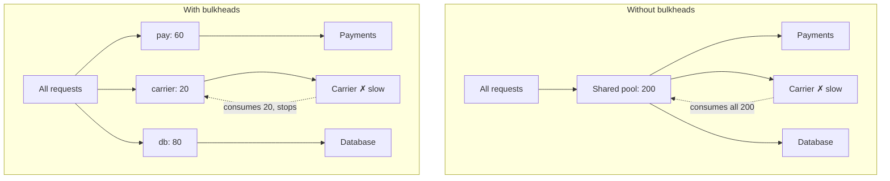

> A ship survives a hull breach because the flooding is confined to one compartment. Your
> process survives a sick dependency for exactly the same reason.

| | |
|---|---|
| **Module** | [02 — Resilience](/modules/resilience/README) |
| **Prerequisites** | [02-01 Timeouts](/modules/resilience/01-timeouts-and-deadlines), [00-04 Little's Law](/modules/foundations/04-latency-throughput-and-back-of-envelope) |
| **Also known as** | resource isolation, compartmentalisation, thread pool isolation, cell-based architecture |
| **Category** | Resilience |

---

## 1. The problem

Order Service handles three kinds of request: checkout (calls Payment), order history (calls
the database), and order tracking (calls Shipping). They share one thread pool of 200 and one
connection pool of 50.

The carrier API degrades to 4 seconds. Tracking requests are 5% of traffic — 6 req/s. By
Little's Law they now need `6 × 4 = 24` concurrent slots, up from 1.2. That is fine.

Then the carrier goes to 30 seconds. Tracking needs 180 slots. It takes them, from a shared
pool of 200. Checkout — which does not depend on the carrier at all — now has 20 slots for
120 req/s and collapses.

**A feature used by 5% of traffic, depending on a system that has nothing to do with buying,
has stopped people buying.** Timeouts bound each request; they do not stop one class of
request from consuming everything.

## 2. In plain language

A ship's hull is divided into watertight compartments. A breach floods one compartment and
the ship stays afloat, slightly down at the bow. Without bulkheads, one hole sinks the vessel.

The trade is deliberate and worth stating: **the compartments make the ship less efficient.**
You cannot use the empty space in compartment 4 to store cargo that belongs in compartment 2.
You have given up utilisation to buy containment. Every bulkhead in software makes the same
trade — you will have idle capacity in one pool while another queues.

**Where the analogy breaks down:** ships' bulkheads are fixed at build time. Software pools
can be resized at runtime, and adaptive limits do exactly that.

## 3. How it works

Partition a shared resource so that exhaustion in one partition cannot affect another. The
resource is usually one of: threads, connections, memory, or in-flight request slots.



### Levels of isolation

From cheapest to strongest:

| Level | Mechanism | Isolates | Cost |
|---|---|---|---|
| **Semaphore** | A counter per dependency | Concurrency | ~0 |
| **Thread pool** | A separate pool per dependency | Concurrency + the caller's thread | Context switching, memory |
| **Connection pool** | Separate pools per dependency/database | Connections | Idle connections |
| **Process** | Separate services | Everything in-process (memory, GC, CPU) | Deployment, network |
| **Cell / shard** | Separate full stacks per customer group | Everything, including data | Multiplied infrastructure |

**Semaphores are usually the right choice.** In an async runtime, a slow call holds an
awaiting task rather than a thread, so a counter is sufficient and costs nothing. Thread-pool
isolation matters when the client library is blocking, because then the *caller's* thread is
held and only a separate pool protects it.

### Sizing

Little's Law, from [00-04](/modules/foundations/04-latency-throughput-and-back-of-envelope):

```
slots = expected_rate × expected_latency × headroom
```

Tracking: 6 req/s × 0.3s × 2 = 4 slots. Give it 10.
Checkout: 120 req/s × 0.85s × 1.5 = 153 slots — which does not fit in 200 alongside
everything else, and that discovery is itself valuable: it means you are one dependency
slowdown away from having no headroom at all.

The sum of bulkheads may exceed the total pool (overcommit) if you accept that simultaneous
saturation is possible, or must be less than it (strict) if you want a hard guarantee. Strict
is safer; overcommit at ~1.5× is common and reasonable.

### Cell-based architecture

The extreme form: run N complete, independent copies of the whole stack and assign each
customer to one cell. A poison-pill request, a bad deploy, or a hot tenant damages 1/N of
customers. AWS and Slack both use this; it is the strongest available blast-radius control
and the most expensive.

## 4. Pseudo-code

**Before — one pool, everything shares it.**

```
service OrderService:
  state pool: ThreadPool(size: 200)         # TRAP: shared by all three call paths

  handler checkout(cmd):        return await payments.charge(cmd) timeout 800ms
  handler order_history(id):    return await db.query(id) timeout 200ms
  handler tracking(id):         return await carrier.track(id) timeout 3s
```

**The pattern — a compartment per dependency, sized from its own numbers.**

```
service Bulkhead:
  name: String
  size: Int
  queue_size: Int = 0            # 0 = reject immediately; >0 = brief queue

  state in_use: Int = 0
  state queued: Int = 0

  fn try_enter(wait: Duration = 0ms) -> Bool:
    if in_use < size:
      in_use += 1
      return true
    if queued < queue_size and wait > 0ms:
      queued += 1
      ok = await_slot(wait)      # bounded wait — an unbounded queue is not a bulkhead
      queued -= 1
      if ok: in_use += 1
      return ok
    metrics.increment("bulkhead.rejected", tags: {name: name})
    return false

  fn exit():
    in_use -= 1

  # Saturation is the signal that matters: it means the dependency is degrading.
  every 10s:
    metrics.gauge("bulkhead.utilisation", in_use / size, tags: {name: name})


service OrderService:
  # Sized from rate × latency × headroom, per dependency. Sum = 190 < 200.
  state pay_bh   = Bulkhead(name: "payments", size: 100, queue_size: 20)
  state db_bh    = Bulkhead(name: "orders_db", size: 60)
  state track_bh = Bulkhead(name: "carrier",  size: 10)   # 5% of traffic, 5% of capacity

  @timeout(2s)
  handler checkout(ctx, cmd) -> Result<Order, OrderError>:
    if not pay_bh.try_enter(wait: 50ms):
      return Err(Overloaded)                # 503 + Retry-After. See 02-06.
    try:
      return await payments.charge(ctx, cmd) timeout 800ms
    finally:
      pay_bh.exit()                         # TRAP: forgetting this leaks slots and the
                                            # bulkhead becomes a permanent outage

  @timeout(3.5s)
  handler tracking(ctx, id) -> Result<Tracking, Error>:
    if not track_bh.try_enter():
      # The carrier can hurt at most 10 in-flight requests. Everything else is fine.
      return Err(TrackingUnavailable)       # 02-07: degrade this feature only
    try:
      return await carrier.track(ctx, id) timeout 3s
    finally:
      track_bh.exit()
```

**In use — bulkheading by *caller*, not only by dependency.** The other axis, and the one
that protects you from a single misbehaving client.

```
service CatalogService:
  # One tenant's traffic spike must not consume every slot.
  state per_tenant: Map<TenantId, Bulkhead> = defaults_to(Bulkhead(size: 50))
  state global: Bulkhead(size: 800)

  handler search(ctx, q) -> Result<Results, Error>:
    if not global.try_enter():        return Err(Overloaded)
    tenant_bh = per_tenant.get(ctx.tenant_id)
    if not tenant_bh.try_enter():
      global.exit()
      return Err(TenantQuotaExceeded) # a noisy neighbour hits its own ceiling first
    try:
      return await do_search(q)
    finally:
      tenant_bh.exit(); global.exit()
```

**Connection pools are bulkheads you already have — and usually mis-sized.**

```
service OrderService:
  uses orders_db: Store<OrderId, Order>   with pool(size: 40)
  uses reports_db: Store<Any, Any>        with pool(size: 5)   # same physical database!
  # WHY separate: a slow analytics query must not consume the connections that
  # checkout needs. Same server, two pools, completely different blast radius.
```

## 5. Knobs and variants

| Knob | Guidance | Failure if wrong |
|---|---|---|
| Size | `rate × latency × 1.5–2` | Too small: throughput ceiling under normal load. Too large: no isolation |
| Queue depth | 0 or small (≤ 20% of size) | Deep queues reintroduce unbounded latency ([02-06](/modules/resilience/06-load-shedding-and-backpressure)) |
| Queue wait | ≤ 10% of the request budget | Long waits burn the deadline before the call starts |
| Partition axis | dependency · caller/tenant · operation criticality | Wrong axis leaves the actual noisy neighbour unbounded |
| Strict vs overcommit | strict for critical paths | Overcommit can still exhaust the process under simultaneous stress |
| Isolation level | semaphore → pool → process → cell | Higher levels cost more and isolate more |

## 6. Challenges and failure modes

- **Leaked slots.** An early return or an exception path that skips `exit()` permanently
  shrinks the bulkhead until it reaches zero. Always `finally`, or a scoped `with`.
- **Sizing from guesses.** Bulkheads sized by intuition either throttle healthy traffic or
  provide no isolation. Derive them, then verify under load.
- **Isolation with nothing behind it.** If a rejected request just becomes a 500, you have
  converted "everything slow" into "5% instantly broken". That is usually better — but pair
  it with a [fallback](/modules/resilience/07-fallback-and-graceful-degradation).
- **The bulkhead is not where the resource actually is.** You limit concurrency to 10 but the
  HTTP client has a shared 200-connection pool underneath; the isolation is fictional. Verify
  at every layer.
- **Utilisation loss.** Static partitions leave capacity stranded. At high cost sensitivity,
  adaptive limits reclaim it — at the price of predictability.
- **In-process isolation cannot contain everything.** A dependency that causes memory pressure
  or GC pressure hurts every compartment regardless. Only process- or cell-level isolation
  helps there.
- **Missing the caller axis.** Perfect per-dependency bulkheads still let one tenant's 10,000
  req/s consume every slot in the *right* compartment.

## 7. Alternatives

- **[Circuit breaker](/modules/resilience/03-circuit-breaker).** Detect and stop instead of contain. A
  breaker reacts to sustained failure; a bulkhead needs no detection and works instantly and
  continuously. Use both — bulkhead for containment, breaker for fail-fast.
- **Separate processes/services.** The strongest in-datacentre isolation. If a dependency is
  dangerous enough, put the code that calls it in its own deployable.
- **[Adaptive concurrency limits](/modules/resilience/06-load-shedding-and-backpressure).** Infer the right
  limit from observed latency rather than configuring it. Removes the sizing problem, adds a
  control loop.
- **[Rate limiting](/modules/resilience/05-rate-limiting-and-throttling).** Bounds *rate* rather than
  *concurrency*. Concurrency is the better control when latency is variable, which is exactly
  when you need it.
- **Cell-based architecture.** Whole-stack isolation per customer group. The endgame.

## 8. Trade-offs

| Advantage | Disadvantage |
|---|---|
| One failing dependency cannot consume the process | Static partitions strand capacity |
| Blast radius equals the compartment | Every dependency needs a sizing decision |
| No detection, no thresholds, no state machine — it just works | Sizing requires measurement you may not have |
| Saturation is an excellent early warning signal | In-process bulkheads don't isolate memory or GC |
| Composes with everything else in this module | Leaked slots degrade silently until total failure |

## 9. Complexity introduced

- **Operational.** Per-bulkhead utilisation and rejection metrics; alerts on sustained
  saturation; resizing as traffic patterns change.
- **Cognitive.** "Which compartment does this call belong to?" becomes a design question for
  every new dependency.
- **Failure surface.** Leaked slots, undersized compartments rejecting healthy traffic,
  false isolation when the real resource is shared deeper down.
- **Testing.** Requires a load test where one dependency is slowed while others are healthy,
  asserting that the healthy paths keep their latency. Rarely done, and it is the only test
  that proves the bulkhead works.

## 10. Related concepts

- **Builds on:** [00-04 Little's Law](/modules/foundations/04-latency-throughput-and-back-of-envelope), [02-01 Timeouts](/modules/resilience/01-timeouts-and-deadlines)
- **Composes with:** [02-03 Circuit breaker](/modules/resilience/03-circuit-breaker), [02-06 Load shedding](/modules/resilience/06-load-shedding-and-backpressure), [10-03 Resource pooling](/modules/performance-and-concurrency/03-resource-pooling)
- **Conflicts with / tension:** utilisation and cost efficiency
- **Contrast with:** [02-05 Rate limiting](/modules/resilience/05-rate-limiting-and-throttling) — concurrency vs rate; bulkheads protect *you*, rate limits protect *them*
- **Leads to:** [02-05 Rate limiting and throttling](/modules/resilience/05-rate-limiting-and-throttling)

## 11. Exercises

1. **Trace it.** Order Service, 200 threads, no bulkheads. Traffic: checkout 120/s at 850ms,
   history 60/s at 50ms, tracking 6/s at 300ms. The carrier degrades to 30s. Compute when
   checkout starts failing. Now add the bulkheads from the pattern code and recompute.
2. **Extend it.** Add a fourth path — a bulk export endpoint used twice a day that runs
   90-second queries against the same database as order history. Size its bulkhead and
   justify the number.
3. **Break it.** All three bulkheads are correctly sized and enforced with semaphores, but the
   underlying HTTP client has a global connection pool of 50. Show how the carrier's slowdown
   still takes down checkout, and state the fix.

## 12. References

- Michael Nygard, *Release It!*, 2nd ed. — the Bulkhead pattern.
- Netflix Tech Blog, "Performance Under Load" — adaptive concurrency limits.
- AWS Well-Architected / Builders' Library, "Workload isolation using shuffle sharding" and cell-based architecture.
- Resilience4j — `Bulkhead` and `ThreadPoolBulkhead`.
- Slack Engineering, "Cell-based architecture" — a large real-world implementation.

---

**Up:** [Module 02](/modules/resilience/README) · **Previous:** [← 02-03](/modules/resilience/03-circuit-breaker) · **Next:** [02-05 Rate limiting and throttling →](/modules/resilience/05-rate-limiting-and-throttling)
