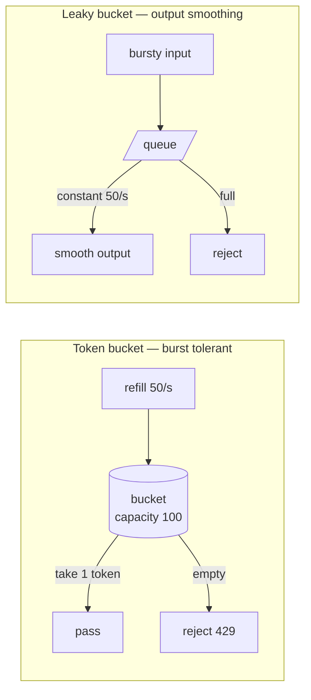

> Every other pattern in this module protects the caller. This one protects the callee — from
> its callers, and from the one caller that is having a bad day.

| | |
|---|---|
| **Module** | [02 — Resilience](/modules/resilience/README) |
| **Prerequisites** | [02-04 Bulkhead](/modules/resilience/04-bulkhead) |
| **Also known as** | throttling, quotas, admission control, token bucket, leaky bucket |
| **Category** | Resilience |

---

## 1. The problem

Three versions of the same thing:

**Protecting a downstream.** ShopFlow's payment provider allows 50 req/s by contract. On sale
days ShopFlow generates 600 orders/s. Exceeding the cap gets requests rejected and, after
repeated violation, the account suspended.

**Protecting yourself from a client.** A partner integration has a bug and calls
`GET /catalog/search` in a tight loop at 40,000 req/s. The catalogue serves them
successfully, and no one else gets served at all.

**Fairness.** One large tenant's nightly batch job consumes the entire API for twenty
minutes. Nine hundred other tenants see timeouts.

In all three, the system is *working*. Nothing has failed. It is being consumed faster than
it can serve, and without a limiter the consequence falls on whoever happens to arrive next.

## 2. In plain language

A nightclub with a capacity of 300 and a doorman.

Without a doorman, 800 people enter, the fire exits are blocked, and everyone has a terrible
time — including the 300 who would have been fine. The doorman doesn't improve the club; he
prevents the club from being destroyed by its own popularity.

Two refinements that map exactly onto the technical design. First, a **queue at the door**
lets a brief surge in — people arriving in a clump are admitted as space allows, rather than
turned away. That is the "burst" allowance. Second, **the doorman knows the regulars**: one
stag party doesn't get to bring 200 people while everyone else waits. That is per-client
quota, and without it a single caller consumes the whole allowance.

**Where the analogy breaks down:** rejected clubbers go home. Rejected API clients retry
immediately, which is why the `429` response must say *when* to come back
([02-02](/modules/resilience/02-retries-backoff-and-jitter)).

## 3. How it works

### The algorithms

| Algorithm | Mechanism | Burst | Memory | Verdict |
|---|---|---|---|---|
| **Fixed window** | Count per calendar minute | Up to 2× at boundaries | 1 counter | Simple, and the boundary spike is real |
| **Sliding log** | Timestamp of every request | Exact | O(requests) | Precise, too expensive at scale |
| **Sliding window counter** | Weighted blend of current + previous window | Smooth | 2 counters | Good approximation, cheap |
| **Token bucket** | Tokens refill at rate *r*, bucket holds *b* | Yes, up to *b* | 2 numbers | **The default. Use this** |
| **Leaky bucket** | Requests drain at a constant rate | No | Queue | Smooths output — good for protecting a fragile downstream |

**Token bucket vs leaky bucket** is the choice that matters. Token bucket allows bursts (good
for user-facing APIs — real traffic is bursty and rejecting a legitimate clump is user-hostile).
Leaky bucket produces a perfectly smooth output rate (good for feeding a downstream with a
hard cap, like ShopFlow's 50 req/s provider).



### Where to enforce

| Location | Sees | Good for |
|---|---|---|
| **Client-side** (before calling out) | Its own rate only | Respecting a downstream's contractual cap |
| **API gateway / edge** | All traffic for a service | Per-client quotas, abuse protection, cheapest rejection |
| **Per-service** | Its own load | Self-protection, defence in depth |
| **Per-instance** | 1/N of traffic | Local, no coordination, imprecise |

**Reject as early as possible.** A request rejected at the edge costs a few microseconds; the
same request rejected after authentication, deserialization, and two downstream calls has
already consumed most of what it would have cost to serve.

### Distributed rate limiting

A single global limit across 40 instances requires shared state, and shared state on the
request path is a latency and availability problem.

Three practical approaches:

1. **Local limits at `global / N`.** No coordination, no dependency. Imprecise under uneven
   load balancing, and wrong whenever N changes. Usually good enough.
2. **Shared counter** (Redis with atomic increment or a Lua script). Accurate, adds ~1ms and a
   hard dependency to every request. Must fail *open* — a Redis outage must not stop all
   traffic.
3. **Approximate with periodic sync.** Each instance limits locally and reconciles its usage
   with a central view every second. Nearly accurate, no per-request dependency. What most
   large systems actually do.

### Quotas and fairness

A single global limit is not fairness. Under a global limit, the fastest client wins
everything. Fairness requires per-client accounting:

- **Per-client quota** — each client gets its own bucket.
- **Weighted fair queueing** — clients get a share proportional to their tier.
- **Cost-based limiting** — a search costing 50× a key lookup consumes 50 tokens. Essential
  where request cost varies wildly.

## 4. Pseudo-code

**Token bucket — the core primitive.**

```
service TokenBucket:
  rate: Float                  # tokens per second
  capacity: Float              # burst allowance

  state tokens: Float
  state last_refill: Instant

  fn try_acquire(cost: Float = 1.0) -> Bool:
    refill()
    if tokens >= cost:
      tokens -= cost
      return true
    return false

  fn retry_after(cost: Float = 1.0) -> Duration:
    # Tell the client exactly when to come back — this is what prevents retry storms.
    return max(0s, (cost - tokens) / rate * 1s)

  fn refill():
    elapsed = now() - last_refill
    tokens = min(capacity, tokens + elapsed.seconds * rate)
    last_refill = now()
    # WHY lazy refill: no background timer, O(1), and correct after any pause.
```

**Server-side: per-client quotas with a global ceiling.**

```
service CatalogService:
  state global: TokenBucket(rate: 12000, capacity: 20000)
  state per_client: Map<ClientId, TokenBucket> = defaults_to(TokenBucket(rate: 100, capacity: 200))
  state tiers = {BRONZE: 100, SILVER: 500, GOLD: 2000}     # req/s

  handler search(ctx: RequestContext, q: Query) -> Result<Results, Error>:
    # Cost-based: a wildcard search is not the same as a key lookup.
    cost = estimate_cost(q)                   # 1 for a lookup, up to 50 for a deep scan

    client_bucket = per_client.get_or_create(ctx.client_id,
                      TokenBucket(rate: tiers[ctx.tier], capacity: tiers[ctx.tier] * 2))

    if not client_bucket.try_acquire(cost):
      metrics.increment("ratelimit.client", tags: {client: ctx.client_id})
      return Err(TooManyRequests(retry_after: client_bucket.retry_after(cost),
                                 limit: tiers[ctx.tier],
                                 scope: "client"))

    # The global ceiling is the last line of defence, checked second so that a
    # well-behaved client isn't blamed for the system being globally hot.
    if not global.try_acquire(cost):
      client_bucket.refund(cost)
      metrics.increment("ratelimit.global")
      return Err(TooManyRequests(retry_after: global.retry_after(cost), scope: "global"))

    return Ok(await do_search(q))
```

**Client-side: respecting someone else's contractual cap.** This is where a *leaky* bucket is
right — the downstream wants smooth input, not bursts.

```
service PaymentGatewayAdapter:
  uses psp: Client<PaymentProvider>          # contractual cap: 50 req/s
  uses pending: Queue<ChargeCard>
  state limiter: LeakyBucket(rate: 45/s)     # 10% below the cap: headroom for retries

  handler charge(ctx, cmd: ChargeCard) -> Result<Receipt, ChargeError>:
    if limiter.try_acquire():
      return await psp.capture(ctx, cmd) timeout 800ms

    # Over the cap. We do NOT reject the customer — we defer the charge.
    # The queue absorbs the sale-day burst that the provider cannot.
    pending.send(cmd)
    return Err(Deferred(estimated: pending.depth() / 45.0 * 1s))

  every 22ms:                                 # ≈ 45/s
    d = pending.receive()
    if d is None: return
    limiter.acquire()
    try:
      # Idempotency key makes this safe to have queued and retried (01-03).
      await psp.capture(d.body, idempotency_key: d.body.idempotency_key) timeout 800ms
      d.ack()
    catch TimeoutError:
      d.retry(after: random(0, 30s))
```

**The response the client needs.** A `429` without headers is a retry storm waiting to happen.

```
fn to_http(e: TooManyRequests) -> HttpResponse:
  return 429 with headers {
    "Retry-After":            e.retry_after.seconds,
    "RateLimit-Limit":        e.limit,
    "RateLimit-Remaining":    e.remaining,
    "RateLimit-Reset":        e.reset_at,
    "RateLimit-Policy":       "\"client\";q=" + e.limit + ";w=1"
  }
  # WHY: a client that knows when to return doesn't guess, and doesn't stampede.
```

## 5. Knobs and variants

| Knob | Guidance | Failure if wrong |
|---|---|---|
| Limit | ~70% of measured capacity | At 100% you have no headroom for a lost instance |
| Burst capacity | 2–5× the rate | Too small: legitimate clumps rejected. Too large: the downstream sees the burst |
| Identity key | API key > user > IP | IP breaks behind NAT and CDNs; punishes shared networks |
| Cost model | uniform / per-endpoint / estimated | Uniform lets one expensive endpoint bypass the limit |
| Enforcement point | edge > service > instance | Late enforcement wastes the work you were protecting |
| Distributed strategy | local `/N` → sync → shared counter | Shared counter adds a dependency to every request |
| Failure mode | **fail open** | Failing closed makes the limiter an outage source |
| Response | 429 + `Retry-After` | Without it, clients guess and stampede |

## 6. Challenges and failure modes

- **Fail closed.** The Redis holding the counters is unavailable; the limiter rejects
  everything; a 100% outage caused by the thing protecting you. **Always fail open**, and
  alert loudly.
- **Fixed-window boundary spikes.** 100/minute allows 100 at 11:59:59 and 100 at 12:00:00 —
  200 in one second. Sliding window or token bucket.
- **Global limit without per-client quotas.** The fastest, most aggressive client consumes the
  entire allowance. This is a fairness bug that looks like a capacity bug.
- **IP-based limiting.** A corporate NAT means 5,000 employees share one limit; a mobile
  carrier means a limit is shared across a city. Use authenticated identity where possible.
- **Uniform cost.** A `GET /health` and a full-text search across 200k SKUs consume one token
  each. Attackers find the expensive one.
- **Retry amplification against the limiter.** Rejected clients retry immediately, so the
  limiter is now doing 3× the work rejecting requests. `Retry-After` plus client-side
  backoff, or reject at the cheapest possible layer.
- **Limits that are never revisited.** Set at launch, still there after 5× capacity growth,
  silently capping the business.
- **Rate limiting the wrong dimension.** ShopFlow's provider caps *requests*, but the real
  constraint might be concurrent connections or data volume. Limit what actually breaks.

## 7. Alternatives

- **[Bulkhead](/modules/resilience/04-bulkhead) / concurrency limiting.** Bound in-flight requests rather
  than rate. Strictly better when latency varies, because concurrency directly reflects
  resource usage while rate does not.
- **[Load shedding](/modules/resilience/06-load-shedding-and-backpressure).** Reject based on *current
  health* (queue depth, latency) rather than a fixed number. Adaptive, no configuration to
  outgrow.
- **Queueing instead of rejecting.** As the payment adapter above: don't refuse, defer. Only
  works when the caller can tolerate delay.
- **Autoscaling.** Add capacity instead of refusing. Minutes too slow to be a defence, and
  useless when the constraint is a third party's contract.
- **Pricing.** Charge for usage and the problem partly solves itself.

## 8. Trade-offs

| Advantage | Disadvantage |
|---|---|
| One caller cannot consume everyone's capacity | Legitimate bursts get rejected |
| Protects a downstream with a hard contractual cap | Limits must be tuned and re-tuned as capacity changes |
| Cheap rejection at the edge preserves capacity for real work | Distributed accuracy costs latency or a dependency |
| Enables tiered service levels as a product feature | Per-client state grows with the client count |
| Rejection is fast and predictable | Fail-closed implementations become outage sources |

## 9. Complexity introduced

- **Operational.** Per-client and global rejection metrics; alerts when a legitimate client is
  being limited; a process for granting exceptions; state storage if distributed.
- **Cognitive.** Engineers and support must be able to answer "why was I rate limited?", which
  requires the scope and remaining quota to be observable.
- **Failure surface.** Fail-closed outages, boundary spikes, unfair allocation, limiter state
  growth, cost-model bypasses.
- **Testing.** Needs burst tests, sustained-overload tests, and an explicit test that the
  limiter fails *open* when its backing store is down.

## 10. Related concepts

- **Builds on:** [02-04 Bulkhead](/modules/resilience/04-bulkhead)
- **Composes with:** [02-06 Load shedding](/modules/resilience/06-load-shedding-and-backpressure), [08-02 API gateway](/modules/microservice-architecture/02-api-gateway-and-backend-for-frontend), [02-02 Retries](/modules/resilience/02-retries-backoff-and-jitter)
- **Conflicts with / tension:** [02-02 Retries](/modules/resilience/02-retries-backoff-and-jitter) — rejected requests come straight back unless `Retry-After` is honoured
- **Contrast with:** [02-03 Circuit breaker](/modules/resilience/03-circuit-breaker) — the breaker is the caller refusing to call; the limiter is the callee refusing to be called
- **Leads to:** [02-06 Load shedding and backpressure](/modules/resilience/06-load-shedding-and-backpressure)

## 11. Exercises

1. **Trace it.** Token bucket, rate 45/s, capacity 200, starting full. 600 orders/s arrive for
   60 seconds. How many pass immediately? What is the queue depth at t=60s, and when does the
   last order reach the provider?
2. **Extend it.** Add cost-based limiting to the payment adapter: a refund costs 3 tokens and a
   charge costs 1, because refunds are heavier for the provider. What breaks if a client sends
   only refunds?
3. **Break it.** The catalogue limits per `client_id` from a JWT. Find two ways a single
   misbehaving integration can still consume the whole global allowance, and fix both.

## 12. References

- Google SRE Book — Ch. 21, "Handling Overload"; Ch. 22 on graceful degradation.
- Stripe Engineering, "Scaling your API with rate limiters".
- Cloudflare, "How we built rate limiting capable of scaling to millions of domains".
- IETF draft — `RateLimit` header fields for HTTP.
- Figma Engineering, "Keeping Figma fast" — cost-based limiting in practice.

---

**Up:** [Module 02](/modules/resilience/README) · **Previous:** [← 02-04](/modules/resilience/04-bulkhead) · **Next:** [02-06 Load shedding and backpressure →](/modules/resilience/06-load-shedding-and-backpressure)
