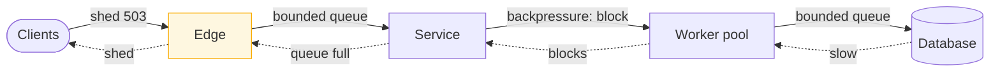

> A system that accepts every request it is given fails completely. A system that refuses
> some requests serves the rest. Refusing work is a feature.

| | |
|---|---|
| **Module** | [02 — Resilience](/modules/resilience/README) |
| **Prerequisites** | [02-05 Rate limiting](/modules/resilience/05-rate-limiting-and-throttling), [00-04 Little's Law](/modules/foundations/04-latency-throughput-and-back-of-envelope) |
| **Also known as** | admission control, brownout, adaptive concurrency, flow control |
| **Category** | Resilience |

---

## 1. The problem

Traffic doubles unexpectedly. Order Service accepts every request, because that is what
servers do.

Queues grow. Latency rises from 200ms to 8s. Clients time out at 2s — but the server keeps
working on those requests, because nothing told it to stop. It is now doing 100% of the work
and delivering 0% of the value. Clients retry, doubling the load again. Memory fills with
queued requests. The garbage collector starts running constantly, which makes everything
slower, which lengthens the queue.

**Goodput — useful work completed — collapses to near zero while the machines run at 100%
CPU.** This is congestion collapse, and it is not recoverable by waiting. The system must be
made to do *less*.

## 2. In plain language

A restaurant kitchen on a Saturday night. The waiters keep taking orders because turning
people away feels wrong. The kitchen falls behind. Meals come out 90 minutes late, cold, and
to customers who have already left. Every meal is cooked, and almost none is eaten. The
kitchen worked at 100% and served nobody.

The correct move is uncomfortable and obviously right: at the door, tell people the wait is
two hours. Some leave. The ones who stay eat hot food on time.

**Backpressure** is the kitchen shouting "stop taking orders" back to the waiters, who stop
taking orders from the door, who tell people to wait. The signal travels *backwards* along
the chain to the origin of the work.

**Load shedding** is what happens when there is nowhere to push back to — a customer at the
door cannot be slowed down, only turned away.

**Where the analogy breaks down:** turned-away diners go elsewhere. Turned-away clients
retry, which is why shed responses must carry `Retry-After` and why clients must have
[backoff](/modules/resilience/02-retries-backoff-and-jitter).

## 3. How it works

### Backpressure vs load shedding

| | Backpressure | Load shedding |
|---|---|---|
| Mechanism | Slow the producer down | Drop requests |
| Requires | A producer that can be slowed | Nothing |
| Work is | Delayed | Lost |
| Applies to | Internal pipelines, queue consumers, streams | External clients, user requests |
| Signal | Blocking write, TCP window, consumer lag | 429/503 response |

Prefer backpressure when the producer is under your control. Use shedding at the edge, where
the producer is a human with a browser.

**The rule that connects them: an unbounded queue converts a throughput problem into a
latency problem and hides it.** Every queue must be bounded, and every bounded queue must
have a policy for what happens when it is full. That policy is either backpressure (block) or
shedding (drop).



The pressure propagates backwards until it reaches something that can be told "no" — and that
something is always the edge.

### What to shed, and in what order

Shedding randomly is much worse than shedding by priority. Classify requests:

| Priority | Example in ShopFlow | Shed at |
|---|---|---|
| **Critical** | Complete a payment; check out | Never, until the very last |
| **High** | Add to basket; view order status | 90% utilisation |
| **Normal** | Browse catalogue; search | 80% |
| **Low** | Recommendations; recently-viewed; analytics beacons | 70% |

Shed the cheapest thing that loses the least value. Also prefer to shed **new** requests over
**in-flight** ones — work already half done is worth more than work not started.

**Shed retries before first attempts.** A request marked as a retry is, statistically, from a
client that is already contributing to the overload.

### Detecting overload

Do not use CPU. CPU is a lagging, noisy, and often misleading signal.

The good signals, in order:

1. **Queue depth / wait time.** How long a request waited before a worker picked it up. The
   single best signal: it rises before latency does.
2. **Concurrency vs a limit.** In-flight requests over the bulkhead size.
3. **Latency gradient.** Current p50 divided by the best-observed p50. When it exceeds ~2, you
   are past the knee of the curve.
4. **Error rate from downstream.** Reactive, but real.

### Adaptive concurrency limits

The most elegant version: rather than configuring a limit, infer it. Borrowed directly from
TCP congestion control (Vegas):

- Track the minimum observed latency `RTT_min` — the latency with no queueing.
- Track the current latency `RTT_now`.
- The estimated queue length is `limit × (1 - RTT_min / RTT_now)`.
- If the queue is small, increase the limit. If it is large, decrease it.

The system finds its own capacity and re-finds it when the machine, the code, or the
dependencies change. No number to outgrow.

## 4. Pseudo-code

**Before — accept everything.**

```
service OrderService:
  state queue: Channel<Request> = Channel(capacity: UNBOUNDED)   # TRAP

  handler serve(req):
    queue.send(req)              # never blocks, never rejects, always accepts
    return await response_of(req)
    # Under overload: queue grows without limit, latency grows without limit,
    # memory grows without limit, and every response arrives after the client left.
```

**The pattern — bounded queue, priority shedding, and a deadline check at pickup.**

```
enum Priority: CRITICAL | HIGH | NORMAL | LOW

record Admitted:
  req: Request
  priority: Priority
  enqueued_at: Instant
  deadline: Instant

service AdmissionController:
  state queue: Channel<Admitted> = Channel(capacity: 500)     # bounded. Always.
  state inflight: Int = 0
  state limit: Int = 100                                      # adapted below
  state rtt_min: Duration = 1s
  state shed_threshold: Map<Priority, Float> = {LOW: 0.7, NORMAL: 0.8, HIGH: 0.9, CRITICAL: 1.0}

  fn admit(req: Request, p: Priority) -> Result<Admitted, Rejected>:
    utilisation = inflight / limit

    # 1. Shed by priority, cheapest work first.
    if utilisation >= shed_threshold[p]:
      metrics.increment("shed", tags: {priority: p})
      return Err(Rejected(retry_after: estimate_recovery()))

    # 2. Shed retries harder than first attempts.
    if req.is_retry and utilisation > 0.6:
      return Err(Rejected(retry_after: estimate_recovery()))

    # 3. Queue depth is the real signal. Full queue = no more promises.
    if not queue.try_send(Admitted(req, p, now(), req.deadline)):
      metrics.increment("shed", tags: {reason: "queue_full"})
      return Err(Rejected(retry_after: 1s))

    return Ok(...)

  # Workers: the deadline check here is what stops wasted work.
  fn worker_loop():
    while true:
      a = queue.receive()
      wait = now() - a.enqueued_at
      metrics.histogram("queue_wait_ms", wait)

      if now() >= a.deadline:
        # TRAP if omitted: we spend full CPU on requests whose clients gave up.
        # This single check is the difference between recovery and collapse.
        metrics.increment("dropped_expired")
        continue

      inflight += 1
      try:    handle(a.req)
      finally: inflight -= 1
```

**Adaptive limit — no configured capacity number.**

```
service AdaptiveLimit:
  state limit: Float = 20
  state rtt_min: Duration = 10s          # the best latency ever seen (no queueing)

  # Called on every completed request.
  fn observe(rtt: Duration, in_flight: Int, dropped: Bool):
    rtt_min = min(rtt_min, rtt)

    if dropped:
      limit = max(4, limit * 0.7)        # multiplicative decrease: back off hard
      return

    # Estimated requests sitting in a queue rather than being served.
    queue_size = in_flight * (1 - rtt_min / rtt)

    threshold = sqrt(limit)              # Vegas-style: tolerate ~sqrt(limit) queued
    if queue_size < threshold:
      limit = limit + 1                  # additive increase: probe for more capacity
    elif queue_size > 2 * threshold:
      limit = max(4, limit - 1)

  every 30s:
    rtt_min = min(rtt_min * 1.05, observed_p50)   # WHY: let rtt_min drift up slowly,
                                                  # or a one-off fast request pins it
                                                  # forever and the limit never grows
```

**Backpressure in an internal pipeline — the producer is slowed, not refused.**

```
service EventProcessor:
  uses source: Log<OrderEvent>
  state pipeline: Channel<OrderEvent> = Channel(capacity: 1000)

  every 10ms:
    # The bounded channel IS the backpressure. When downstream is slow, `send`
    # blocks, so we stop reading from the log, so consumer lag grows visibly,
    # so the alert fires. Nothing is lost; the pressure is just made observable.
    batch = source.read(from: offset, limit: 100)
    for e in batch:
      pipeline.send(e)                    # blocks when full — this is the mechanism
    offset += batch.size

  # TRAP: replacing `send` with `try_send` here converts backpressure into silent
  # data loss. In an internal pipeline that is almost never what you want.
```

## 5. Knobs and variants

| Knob | Guidance | Failure if wrong |
|---|---|---|
| Queue capacity | ~1–2 seconds of work at peak rate | Deep queues = long waits and doomed work |
| Shed thresholds per priority | 70 / 80 / 90 / never | Uniform thresholds shed checkout to protect recommendations |
| Deadline check at pickup | always | Without it, capacity goes to abandoned requests |
| Limit strategy | adaptive > static | Static limits are wrong after any change |
| Decrease factor | 0.5–0.8 | Too gentle: no recovery. Too harsh: oscillation |
| Shed response | 503 + `Retry-After` | Bare 503 causes immediate retry storms |
| Where to shed | edge, before auth/parsing | Late shedding costs nearly as much as serving |

## 6. Challenges and failure modes

- **Unbounded queues anywhere in the chain** defeat everything. Audit thread pool queues,
  channel capacities, HTTP server accept backlogs, and client-side buffers. The default in
  most frameworks is unbounded.
- **Shedding causes retries which cause shedding.** Without `Retry-After` and client backoff,
  a shedding system is a retry amplifier. Shedding retries preferentially breaks the loop.
- **Priority inversion.** A low-priority request holds a lock or a connection that a critical
  one needs. Shedding low-priority work at the door does not release what it already holds.
- **Oscillation.** Aggressive adaptive limits swing between 10 and 200. Damp the increase,
  smooth the signal.
- **Shedding masks the cause.** The system is "healthy" at 40% shed rate. Alert on shed rate,
  not only on latency and errors.
- **Fairness under shedding.** Random shedding hurts all clients equally, which sounds fair
  and means every client sees a 40% error rate. Per-client shedding lets most clients be fine
  and a few be blocked — usually better ([02-05](/modules/resilience/05-rate-limiting-and-throttling)).
- **Backpressure that reaches a human too late.** In a long pipeline, pressure can take
  minutes to propagate to the edge. Monitor at every stage.
- **`try_send` in place of `send`** silently converts backpressure to data loss. A one-word
  change with a very large consequence.

## 7. Alternatives

- **Autoscaling.** Add capacity instead of refusing. Correct over minutes; useless over
  seconds, and it cannot scale a fixed downstream. Shedding covers the gap while scaling
  happens — they are complements.
- **[Rate limiting](/modules/resilience/05-rate-limiting-and-throttling).** Static, predictable, per-client.
  Shedding is dynamic and health-based. Use both: limits for fairness and contracts, shedding
  for actual overload.
- **Queueing everything asynchronously.** If the work can be deferred, a durable queue absorbs
  the burst instead of shedding it ([10-02](/modules/performance-and-concurrency/02-asynchronous-processing-and-work-queues)).
- **[Degradation](/modules/resilience/07-fallback-and-graceful-degradation).** Serve everyone a cheaper
  answer rather than serving some and refusing others. Often the better user experience.
- **Overprovisioning.** Buy 3× the capacity. Legitimate, and it delays rather than removes
  the need for admission control.

## 8. Trade-offs

| Advantage | Disadvantage |
|---|---|
| Goodput stays high under overload instead of collapsing | Some users are refused service |
| Latency stays bounded for admitted requests | Priority classification must be designed and maintained |
| The system recovers on its own once load drops | Shedding can hide a growing problem |
| Adaptive limits need no capacity tuning | Control loops can oscillate and are hard to reason about |
| Protects against congestion collapse, which nothing else does | Every queue in the system must be audited and bounded |

## 9. Complexity introduced

- **Operational.** Shed rate per priority as a top-level dashboard metric and alert; queue
  wait time as an SLI; understanding that a healthy system can be shedding.
- **Cognitive.** Engineers must classify every endpoint's priority and understand that
  "accepted" is now a decision rather than a default.
- **Failure surface.** Oscillation, priority inversion, over-shedding on a bad signal, silent
  loss where backpressure was intended.
- **Testing.** Requires overload testing — sustained load at 2–3× capacity, verifying goodput
  stays flat rather than collapsing. Almost nobody does this, and it is the single most
  informative load test available.

## 10. Related concepts

- **Builds on:** [02-05 Rate limiting](/modules/resilience/05-rate-limiting-and-throttling), [02-04 Bulkhead](/modules/resilience/04-bulkhead)
- **Composes with:** [02-07 Fallback](/modules/resilience/07-fallback-and-graceful-degradation), [10-02 Work queues](/modules/performance-and-concurrency/02-asynchronous-processing-and-work-queues), [11-01 Observability](/modules/operations-and-evolution/01-observability)
- **Conflicts with / tension:** [02-02 Retries](/modules/resilience/02-retries-backoff-and-jitter) — retries add exactly the load shedding removes
- **Contrast with:** [02-05 Rate limiting](/modules/resilience/05-rate-limiting-and-throttling) — a limiter enforces a *contract*; shedding responds to *current health*
- **Leads to:** [02-07 Fallback and graceful degradation](/modules/resilience/07-fallback-and-graceful-degradation)

## 11. Exercises

1. **Trace it.** Capacity 500 req/s, arrival 1200 req/s for 3 minutes, unbounded queue, client
   timeout 2s. Compute queue depth and latency at t=60s, and the fraction of completed work
   that any client actually receives. Now add a 500-deep queue with a deadline check and
   recompute goodput.
2. **Extend it.** Add priority-aware shedding to ShopFlow's API gateway. Classify all
   endpoints from [the running example](/domain/RUNNING-EXAMPLE) and justify each
   threshold.
3. **Break it.** The adaptive limit uses `rtt_min` as its baseline. A deploy makes the service
   genuinely 3× slower for legitimate reasons. Describe what the limit does over the next
   hour, and fix it.

## 12. References

- Google SRE Book — Ch. 21, "Handling Overload" and "Load Shedding and Graceful Degradation".
- Netflix Tech Blog, "Performance Under Load: Adaptive concurrency limits" (2018).
- Jeff Dean & Luiz Barroso, "The Tail at Scale" (CACM, 2013).
- Brondolin & Ferroni, "Congestion collapse" — and the original TCP Vegas paper (Brakmo & Peterson, 1995).
- AWS Builders' Library, "Using load shedding to avoid overload".

---

**Up:** [Module 02](/modules/resilience/README) · **Previous:** [← 02-05](/modules/resilience/05-rate-limiting-and-throttling) · **Next:** [02-07 Fallback and graceful degradation →](/modules/resilience/07-fallback-and-graceful-degradation)
