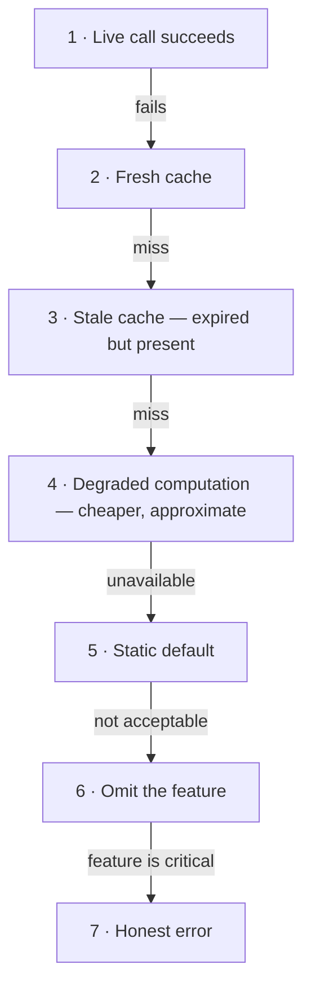

> Every other pattern in this module makes failure cheap. This one makes failure *invisible*
> — by deciding, in advance, what a worse-but-acceptable answer looks like.

| | |
|---|---|
| **Module** | [02 — Resilience](/modules/resilience/README) |
| **Prerequisites** | [02-03 Circuit breaker](/modules/resilience/03-circuit-breaker), [02-06 Load shedding](/modules/resilience/06-load-shedding-and-backpressure) |
| **Also known as** | brownout, degraded mode, feature tiering, static stability |
| **Category** | Resilience |

---

## 1. The problem

The recommendation service is down. ShopFlow's product page calls it to render a
"Customers also bought" strip at the bottom of the page.

The page returns a 500. A product page with a working title, price, images, description,
reviews and Add to Basket button is not shown at all, because a strip almost nobody scrolls
to could not be rendered.

The general shape: **the availability of the whole is the availability of its least important
part**, because no one decided which parts were important.

Second version of the same problem: the payment provider is down for 20 minutes. ShopFlow
rejects every order. The alternative — accept orders, tell customers "payment confirming",
charge when the provider returns — was always available and nobody had built it.

## 2. In plain language

A restaurant runs out of salmon. Two possible responses:

1. Close the restaurant.
2. Cross salmon off the menu and keep serving.

Every restaurant picks (2), and nobody considers it clever. Software picks (1) constantly.

The reason software picks (1) is that (2) requires a decision made *in advance*: which dishes
are essential and which are garnish. Under pressure, at 3am, nobody can make that call — so
the system does the only thing it can, which is fail. Degradation is not a runtime technique;
it is a design-time ranking that the runtime can then act on.

**Where the analogy breaks down:** the restaurant tells you the salmon is off. Degraded
software often silently shows worse data, which can be much worse than an honest error — a
stale *price* is a legal problem, a stale recommendation is nothing.

## 3. How it works

### The ranking

Before any code, produce a table. This is the actual deliverable of the pattern.

| Tier | Meaning | ShopFlow | Behaviour when its dependency fails |
|---|---|---|---|
| **0 — Critical** | Without it there is no product | Add to basket, checkout, payment capture | Never degrade. Everything else is sacrificed for these |
| **1 — Important** | Meaningfully worse without it | Stock levels, order status, search | Serve stale; degrade quality |
| **2 — Enhancing** | Nice to have | Personalised prices, reviews, ratings | Serve cached or generic |
| **3 — Optional** | Barely noticed | Recommendations, recently viewed, banners | Omit entirely, silently |

### The fallback ladder

For any one call, the responses in order of preference:



Most systems implement 1 and 7 and nothing in between. Steps 3 and 6 are the cheapest to add
and buy the most.

### Static stability

The strongest form: **the system's behaviour during a dependency failure is identical to its
behaviour normally, because it was never depending on that call in the request path.**

Example: instead of calling the pricing service per request, every instance holds a full
price table refreshed every 60 seconds. If pricing dies, ShopFlow serves prices up to 60
seconds stale — indefinitely — and *nothing changes* about the request path. No fallback code
runs, so no fallback code can be broken.

This is the highest-value idea in the lesson. The best fallback is the one that never
executes because there was no dependency to fall back from.

### Failing open vs failing closed

Every fallback has a direction, and it must be chosen per dependency:

| Dependency down | Fail open (allow) | Fail closed (deny) |
|---|---|---|
| Fraud check | Accept the order, review later | Reject all orders |
| Authorisation | ❌ Never | ✅ Always |
| Recommendations | Show nothing | — |
| Inventory check | Accept and risk overselling | Refuse to sell |

**Security fails closed. Everything else usually fails open.** Getting this backwards is
either a breach or a self-inflicted outage.

## 4. Pseudo-code

**Before — one optional dependency, total failure.**

```
handler product_page(sku: Sku) -> Result<PageView, Error>:
  product = await catalog.get(sku)?
  stock   = await inventory.level(sku)?
  reviews = await reviews.for_sku(sku)?
  recs    = await recommender.similar(sku)?      # TRAP: `?` propagates the error.
  return Ok(PageView(product, stock, reviews, recs))
  # Recommender down → no product page → no sales.
```

**The pattern — tiered fallbacks with explicit staleness.**

```
record PageView:
  product: Product
  stock: StockDisplay
  reviews: Option<Reviews>
  recs: List<Sku>
  degraded: List<String>          # WHY: the response says what it lacks, so the
                                  # UI can adapt and monitoring can measure it

service ProductPageService:
  uses catalog: Client<CatalogService>
  uses inventory: Client<InventoryService>
  uses reviews: Client<ReviewService>
  uses recommender: Client<RecommendationService>
  uses cache: Cache<String, Any>
  state popular: List<Sku>        # refreshed hourly, held in memory — static stability

  @timeout(800ms)
  handler product_page(ctx, sku: Sku) -> Result<PageView, Error>:
    degraded = []

    # --- Tier 0: without this there is no page. No fallback exists. ---
    product = match await get_with_cache(sku, ttl: 60s, allow_stale: 10m):
      case Ok(p): p
      case Err(e): return Err(ProductUnavailable)   # honest 503; nothing else to show

    # --- Tier 1: important. Degrade the PRECISION, not the presence. ---
    stock = match await inventory.level(ctx, sku) timeout 200ms:
      case Ok(n) if n > 20: StockDisplay("In stock")
      case Ok(n) if n > 0:  StockDisplay("Only " + n + " left")
      case Ok(0):           StockDisplay("Out of stock")
      case Err(_):
        degraded.append("stock")
        # WHY vague rather than absent: "Usually in stock" sets expectations and
        # keeps the buy button live. Claiming a precise number would be a lie.
        StockDisplay("Usually in stock")

    # --- Tier 2 and 3 run concurrently; neither can fail the page. ---
    parallel:
      reviews_r = reviews.for_sku(ctx, sku) timeout 300ms
      recs_r    = recommender.similar(ctx, sku) timeout 150ms

    reviews_v = match reviews_r:
      case Ok(r): Some(r)
      case Err(_):
        degraded.append("reviews")
        cache.get_stale("reviews:" + sku)     # stale reviews are perfectly fine
                                              # (returns None if nothing cached)

    recs_v = match recs_r:
      case Ok(r): r
      case Err(_):
        degraded.append("recs")
        popular.take(6)      # static stability: in-memory, refreshed hourly,
                             # cannot fail at request time. Generic beats empty.

    metrics.increment("page.degraded", tags: {features: degraded})
    return Ok(PageView(product, stock, reviews_v, recs_v, degraded))
```

**Stale-while-revalidate — the highest-leverage seven lines in this lesson.**

```
async fn get_with_cache<T>(key: String, ttl: Duration, allow_stale: Duration)
    -> Result<T, Error>:
  entry = cache.get_entry(key)

  if entry is Some(e) and e.age < ttl:
    return Ok(e.value)                        # fresh

  try:
    fresh = await origin.get(key) timeout 200ms
    cache.put(key, fresh, ttl: ttl)
    return Ok(fresh)
  catch Error as err:
    if entry is Some(e) and e.age < allow_stale:
      metrics.increment("cache.served_stale", tags: {key_kind: kind_of(key), age: e.age})
      return Ok(e.value)                      # TRAP if omitted: a cache that only
                                              # helps when the origin is healthy is
                                              # a performance tool, not a resilience one
    return Err(err)
```

**Degrading the write path — the harder and more valuable case.**

```
service OrderService:
  state pay_breaker: CircuitBreaker(name: "payments")

  @timeout(2s)
  handler place_order(ctx, cmd: PlaceOrder) -> Result<Order, OrderError>:
    if pay_breaker.allow():
      match await payments.charge(ctx, cmd) timeout 800ms:
        case Ok(r):
          # Persist BEFORE returning. Charging and then returning without a
          # durable order is the same money-taken-no-order bug the degraded
          # path below is careful to avoid.
          order = Order(id: cmd.order_id, status: PAID, payment_id: r.payment_id, ...)
          atomically:
            orders.put(order.id, order)
            outbox.append(OrderPlaced(order.id, ...))        # 04-03
          return Ok(order)
        case Err(PaymentDeclined(why)): return Err(PaymentDeclined(why))   # real answer
        case Err(_): pass                    # fall through to degraded mode

    # Degraded checkout. The customer still buys; we charge when we can.
    # This is only acceptable because of the constraints below.
    if total_of(cmd.lines) > DEFERRED_CHARGE_LIMIT:      # e.g. €200
      return Err(Unavailable)                # WHY: cap the financial exposure of
                                             # accepting orders we cannot yet charge
    if customer_risk(cmd.customer_id) == HIGH:
      return Err(Unavailable)

    order = Order(id: cmd.order_id, status: PENDING_PAYMENT, ...)
    atomically:
      orders.put(order.id, order)
      deferred.append(ChargeCard(order.id, ..., idempotency_key: cmd.request_id))

    metrics.increment("checkout.degraded")
    return Ok(order)     # UI: "Order received — we'll confirm your payment shortly"
```

## 5. Knobs and variants

| Knob | Guidance | Failure if wrong |
|---|---|---|
| Tier assignment | Explicit table, owned by product + engineering | Without it, engineers guess at 3am |
| Max stale age | Per data type: prices 60s, reviews 7d | Uniform staleness serves a week-old price |
| Fail direction | Closed for security, open for the rest | Backwards = breach or self-inflicted outage |
| Visibility | Tell the user when it matters | Silent degradation of *prices* is a legal problem |
| Degraded write limits | Cap value and risk | Unlimited deferred charges = unbounded exposure |
| Automatic vs manual | Automatic for tiers 2–3; manual kill switch for tier 0–1 | Automatic degradation of critical paths is frightening |

## 6. Challenges and failure modes

- **Untested fallback paths.** They run for minutes per year and are the least-exercised code
  in the system. Fallbacks fail during incidents *constantly*. Exercise them in production
  regularly ([09-04](/modules/availability-and-dr/04-chaos-engineering)) or accept that they
  do not work.
- **The fallback depends on the thing that failed.** A cache in the same failure domain, or a
  "static" list loaded from the service that is down. Audit the dependency graph of every
  fallback.
- **Silent degradation.** Nobody notices the recommender has been down for three weeks because
  the page looks fine. Always emit a `degraded` metric and alert on it.
- **Degrading into a lie.** Showing a stale price the customer can transact on is worse than
  an error. Distinguish *display* staleness from *transactional* staleness.
- **Fallback stampede.** The primary fails, every instance falls back to the cache, the cache
  gets 12,000 req/s it was never sized for, and it dies too. Size fallbacks for full traffic.
- **Recovery thrash.** The dependency flaps; the system oscillates between full and degraded
  every few seconds, producing inconsistent user experience. Hysteresis: degrade fast, recover
  slowly.
- **Degraded mode becomes permanent.** It works well enough that nobody fixes the real
  problem. Alert on time-spent-degraded, not just on entering it.

## 7. Alternatives

- **Fail fast and honestly.** For tier-0 operations this is correct. A clear error beats a
  wrong answer where money or safety is involved.
- **[Load shedding](/modules/resilience/06-load-shedding-and-backpressure).** Serve some users fully rather
  than all users partially. Sometimes the better choice — a checkout that half-works may be
  worse than one that's clearly unavailable.
- **Static stability by default.** Remove the request-path dependency entirely. Strictly
  better than any fallback; costs memory and accepts bounded staleness always, not only
  during failures.
- **Asynchronous completion.** Accept the request, return `202`, do the work when possible.
  The deferred-charge path above is this.
- **Redundant providers.** A second payment provider, a second carrier. Expensive, and the
  only true fallback for a tier-0 external dependency.

## 8. Trade-offs

| Advantage | Disadvantage |
|---|---|
| A non-critical failure stops being a user-visible failure | Fallback code is rarely exercised and often broken |
| Availability of the whole exceeds the availability of its parts | The system can serve wrong or stale data |
| Forces an explicit, valuable conversation about what matters | Requires product agreement, not just engineering |
| Degraded mode buys time to fix the real problem | Degraded mode can silently become the normal mode |
| Static stability removes whole classes of failure | Costs memory and accepts constant bounded staleness |

## 9. Complexity introduced

- **Operational.** A `degraded` metric per feature, alerts on entering and on *remaining* in
  degraded mode, and a documented ladder so responders know what should have happened.
- **Cognitive.** Every feature now has two or more behaviours. Reasoning about the system
  requires knowing which mode it is in.
- **Failure surface.** Broken fallbacks, stale data presented as fresh, fallback stampedes,
  thrash, and unbounded exposure on degraded writes.
- **Testing.** Every fallback path needs a test, and the tests must run regularly against
  production-like conditions. This is the pattern most likely to be "implemented" and not
  actually work.

## 10. Related concepts

- **Builds on:** [02-03 Circuit breaker](/modules/resilience/03-circuit-breaker) (the breaker gives you the time budget to degrade), [03-03 Caching](/modules/scalability/03-caching)
- **Composes with:** [02-06 Load shedding](/modules/resilience/06-load-shedding-and-backpressure), [11-03 Feature flags](/modules/operations-and-evolution/03-configuration-and-feature-flags) (the manual kill switch)
- **Conflicts with / tension:** correctness — a degraded answer is by definition less correct
- **Contrast with:** [09-01 Failover](/modules/availability-and-dr/01-redundancy-and-failover) — failover restores full function elsewhere; degradation reduces function here
- **Leads to:** [02-08 Health checks and self-healing](/modules/resilience/08-health-checks-and-self-healing)

## 11. Exercises

1. **Trace it.** The review service is down and its cache was cold (deployed 2 minutes ago).
   Walk `product_page` through and state exactly what the customer sees, what the `degraded`
   list contains, and what metric fires.
2. **Extend it.** Write the ranking table for all of ShopFlow from
   [the running example](/domain/RUNNING-EXAMPLE): every feature, its tier, its
   fallback, and its maximum acceptable staleness.
3. **Break it.** The degraded checkout path accepts orders up to €200 while payments are
   down. The outage lasts 6 hours at 120 orders/s. Compute the exposure. Then find the second
   problem: what happens to all of those deferred charges the moment the provider recovers?

## 12. References

- Google SRE Book — Ch. 22, "Graceful Degradation"; Ch. 21 on brownout.
- AWS Builders' Library, "Static stability using Availability Zones" — the definitive treatment.
- Michael Nygard, *Release It!*, 2nd ed. — "Fail Fast", "Decoupling Middleware".
- Netflix Tech Blog, "Fault Tolerance in a High Volume, Distributed System" — fallback tiers in Hystrix.
- Facebook/Meta engineering on "brownout" and load-shedding-driven feature disabling.

---

**Up:** [Module 02](/modules/resilience/README) · **Previous:** [← 02-06](/modules/resilience/06-load-shedding-and-backpressure) · **Next:** [02-08 Health checks and self-healing →](/modules/resilience/08-health-checks-and-self-healing)
