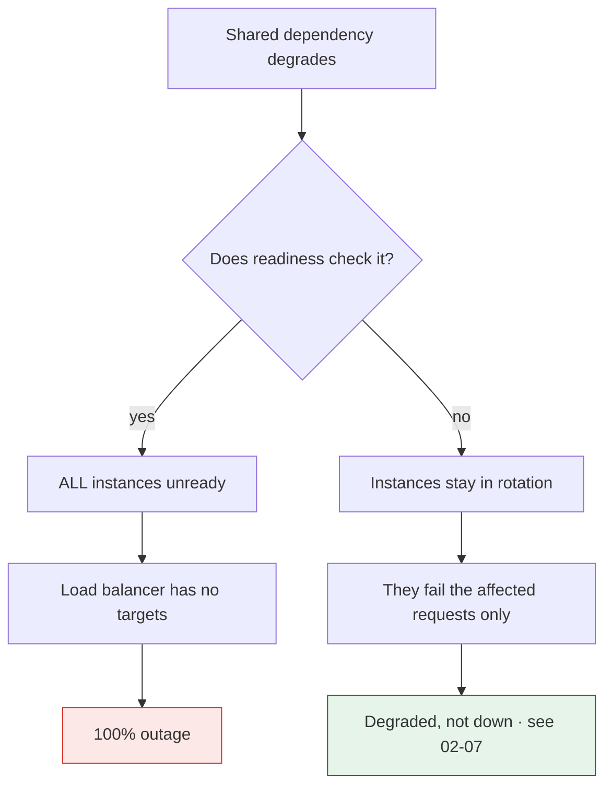

> A health check decides which instances receive traffic and which get restarted. A badly
> designed one turns a recoverable slowdown into a total outage — and does it automatically.

| | |
|---|---|
| **Module** | [02 — Resilience](/modules/resilience/README) |
| **Prerequisites** | [01-05 Service discovery](/modules/communication/05-service-discovery), [02-01 Timeouts](/modules/resilience/01-timeouts-and-deadlines) |
| **Also known as** | liveness and readiness probes, outlier detection, self-healing |
| **Category** | Resilience |

---

## 1. The problem

Two failures, and they are opposites.

**The check is too shallow.** `GET /health` returns `200 OK` unconditionally. The instance's
database connection pool has been exhausted for ten minutes. It passes every check, receives
its full share of traffic, and fails 100% of it. The load balancer is confidently routing to
a corpse.

**The check is too deep.** `GET /health` verifies the database, the payment provider, the
cache and the message broker. The payment provider has a bad minute. *Every* instance of
*every* service that checks it fails its health check simultaneously. The orchestrator
restarts all of them at once. The system, which was 90% functional, becomes 0% functional —
and the restarts prevent it from recovering.

The second failure is worse, more common, and almost always self-inflicted.

## 2. In plain language

A doctor deciding whether a worker can work today.

Ask "are you breathing?" and you'll clear someone who cannot stand up. Ask "are your suppliers
healthy, is the motorway open, and did your colleague in another city sleep well?" and you
will send home a whole workforce that could have worked, because of something none of them
control and none of them can fix by going home.

The right question is narrow: **"Can *you* do *your* job right now?"** Not "is the world
fine", and not "are you technically alive".

And a second question, distinct from the first: **"Are you so broken that being replaced would
help?"** Losing your keys means you shouldn't take today's shift. It does not mean you should
be fired and replaced by a new hire, which is what a restart is.

**Where the analogy breaks down:** a worker knows when they're struggling. A process whose
thread pool is exhausted often has no thread available to notice.

## 3. How it works

### The three probes

Conflating these is the source of most health-check outages.

| Probe | Question | Failure action | Should check |
|---|---|---|---|
| **Liveness** | Is this process irrecoverably stuck? | **Restart the container** | Almost nothing. Deadlock or a wedged event loop only |
| **Readiness** | Can this instance serve traffic *now*? | **Remove from the load balancer** | Own resources: pool health, warm caches, local queue depth |
| **Startup** | Has initialisation finished? | Wait; restart if it never completes | Migrations, cache warming, connection establishment |

**Liveness must be nearly trivial.** The only thing a restart fixes is corrupted in-process
state. If a restart wouldn't fix it, liveness must not fail on it. A liveness probe that
checks a database is a distributed restart bomb.

**Readiness carries the nuance.** It is reversible, cheap, and local: fail readiness, stop
receiving traffic, recover, resume. But it must check only *this instance's* ability to
serve — not shared dependencies, or all instances fail together.

### The critical asymmetry



**Rule: never fail a health check on a dependency shared by all instances.** If every
instance would fail simultaneously, removing them from rotation achieves nothing except
turning partial failure into total failure. Handle shared-dependency failure with
[breakers](/modules/resilience/03-circuit-breaker) and [degradation](/modules/resilience/07-fallback-and-graceful-degradation)
instead.

Conversely: *do* fail readiness on something specific to this instance — its own pool
exhausted, its own disk full, its own cache cold — because then traffic moves to healthy
peers, which is exactly the right outcome.

### Fail-open at the load balancer

The last defence: if *all* instances are unhealthy, most good load balancers route to all of
them anyway. A trickle of failing requests beats a guaranteed zero. Kubernetes has no
built-in equivalent, which is why the "don't check shared dependencies" rule matters more
there.

### Self-healing

Automated remediation, ordered by blast radius. Never skip a level.

1. **Retry** the request ([02-02](/modules/resilience/02-retries-backoff-and-jitter)).
2. **Route elsewhere** — readiness failure or [outlier ejection](/modules/scalability/02-load-balancing).
3. **Restart the process** — liveness failure. Fixes leaks and deadlocks.
4. **Replace the instance** — new machine. Fixes bad hosts and noisy neighbours.
5. **Fail over the zone/region** ([09-01](/modules/availability-and-dr/01-redundancy-and-failover)).

Every level needs a **rate limit**. Unlimited automatic restarts during a bad deploy will
cheerfully restart your entire fleet into an outage. Cap at, say, 20% of instances per 10
minutes, and page a human when the cap is hit.

## 4. Pseudo-code

**Before — both classic mistakes at once.**

```
service OrderService:
  handler GET_health() -> HttpResponse:
    return 200("OK")                       # TRAP 1: proves only that a socket is open

  handler GET_health_deep() -> HttpResponse:
    await db.ping()
    await payments.ping()                  # TRAP 2: shared dependency.
    await cache.ping()                     # A payment blip unreadies the whole fleet.
    await broker.ping()
    return 200("OK")
```

**The pattern — three probes with correctly scoped checks.**

```
service OrderService:
  state ready: Bool = false
  state last_successful_work: Instant = now()
  state shutting_down: Bool = false

  # --- STARTUP: has initialisation finished? Generous budget. ---
  handler GET_startup() -> HttpResponse:
    if not migrations_applied():   return 503("migrations pending")
    if not db_pool.is_initialised(): return 503("pool warming")
    if price_table.is_empty():     return 503("cache warming")   # static stability, 02-07
    ready = true
    return 200("started")

  # --- LIVENESS: would a restart help? Almost never. ---
  handler GET_live() -> HttpResponse:
    # The event loop is responsive because THIS handler ran. That is most of it.
    if now() - last_successful_work > 5m and inflight_requests > 0:
      # Requests are in flight but nothing has completed in 5 minutes: a real
      # deadlock. A restart genuinely fixes this and nothing else does.
      return 503("deadlocked")
    return 200("alive")
    # TRAP if you add a dependency check here: a dependency blip restarts every
    # container in the fleet, losing all in-flight work and all warm caches,
    # which makes the incident dramatically worse.

  # --- READINESS: can THIS instance serve? Local resources only. ---
  handler GET_ready() -> HttpResponse:
    if shutting_down:
      return 503("draining")                     # 01-05: deregister before dying

    if not ready:
      return 503("starting")

    # This instance's own pool. Instance-specific → other instances can take over.
    if db_pool.available() == 0 and db_pool.wait_time_p50() > 1s:
      return 503("db pool exhausted on this instance")

    # This instance's own work backlog.
    if local_queue.depth() > local_queue.capacity * 0.9:
      return 503("local queue saturated")

    if disk_free_percent() < 5:
      return 503("disk nearly full")

    # NOT checked, deliberately, with the reason written down:
    #   payments   — shared by all instances; a failure here would unready everyone.
    #                Handled by the circuit breaker + degraded checkout (02-03, 02-07).
    #   broker     — shared; publishing is via the outbox and survives broker outages (04-03).
    #   cache      — shared; misses fall through to the origin.
    return 200("ready")
```

**Deep health as observation, not as control.** The information is valuable; wiring it to an
automatic action is what causes the outage.

```
service OrderService:
  # Exposed for dashboards and humans. Nothing automated consumes this.
  handler GET_health_detail() -> HttpResponse:
    checks = {
      "db":       probe(() => db.ping(), timeout: 500ms),
      "payments": probe(() => payments.ping(), timeout: 500ms),
      "broker":   probe(() => broker.ping(), timeout: 500ms),
      "breakers": {name: b.state for b in all_breakers},
      "pool":     {available: db_pool.available(), waiting: db_pool.waiting()},
    }
    return 200(checks)          # ALWAYS 200 — a monitoring endpoint, not a probe
```

**Rate-limited self-healing.**

```
service Supervisor:
  state restarts: SlidingWindow<Instant> = []
  total_instances: Int

  fn on_liveness_failure(instance: Instance):
    restarts.evict_older_than(10m)

    # WHY: a bad deploy fails liveness everywhere. Without this cap, the supervisor
    # restarts the entire fleet in a loop and the outage becomes unrecoverable.
    if restarts.count() >= max(1, total_instances * 0.2):
      page_human("restart budget exhausted — likely systemic, not instance-local")
      return

    restarts.append(now())
    restart(instance)
```

**Graceful shutdown, restated because it is half of health checking.**

```
service OrderService:
  on shutdown_signal:
    shutting_down = true        # 1. readiness now fails → LB stops sending new work
    registry.deregister(INSTANCE_ID)
    sleep(15s)                  # 2. wait out LB and client cache propagation (01-05)
    stop_accepting()            # 3. close the door
    await drain_inflight(max: 30s)
    exit(0)
```

## 5. Knobs and variants

| Knob | Typical | Failure if wrong |
|---|---|---|
| Liveness scope | process-local only | Dependency checks = fleet-wide restart storms |
| Readiness scope | instance-local resources | Shared checks = simultaneous unreadiness |
| Probe interval | 5–10s | Too frequent: load. Too rare: slow reaction |
| Failure threshold | 3 consecutive | 1 flaps on a single GC pause |
| Probe timeout | ≪ interval, ~1s | Long timeouts pile up probes |
| Liveness initial delay | > worst-case startup | Too short: restart loop that never boots |
| Restart budget | ≤ 20% per 10 min | Unlimited restarts turn a bad deploy into an outage |
| Probe resource pool | separate from request pool | Shared: probes fail *because* you are busy |

That last row deserves emphasis. If the health endpoint uses the same thread pool as
requests, then under saturation the probe fails, the instance is ejected, its traffic moves
to peers, which saturate faster. **The health check becomes the amplifier of the outage.**
Give probes a dedicated thread or a separate port.

## 6. Challenges and failure modes

- **The shared-dependency cascade.** Described above. The single most damaging health-check
  mistake.
- **Probes competing with traffic.** Fixed by a dedicated probe pool.
- **Shallow checks hiding real failure.** A process alive but useless stays in rotation.
  Readiness must check something that actually correlates with serving.
- **Restart loops.** Liveness fails during a slow start; the container is killed; it restarts
  and starts slowly again. Startup probes exist precisely for this.
- **Restarts destroying evidence.** Automatic restarts remove the heap, the goroutine dump,
  and the logs that would explain the fault. Capture diagnostics before restarting.
- **Readiness flapping.** In/out of rotation every few seconds, causing connection churn and
  uneven load. Hysteresis: unready fast, ready slowly.
- **Restarting hides a leak.** A memory leak restarted every 6 hours never gets fixed. Alert
  on restart *rate*, not only on availability.
- **Draining not implemented.** Every deploy produces a burst of connection errors, and
  everyone accepts it as normal. It is not normal; it is a missing `sleep`.

## 7. Alternatives

- **Passive health checking / outlier ejection.** Judge instances by the outcomes of *real*
  traffic rather than synthetic probes. No probe load, no synthetic/real divergence, and it
  reacts to exactly the failures that matter ([03-02](/modules/scalability/02-load-balancing)).
  Strictly better as a supplement; can't detect a fully idle broken instance.
- **[Circuit breakers](/modules/resilience/03-circuit-breaker) instead of readiness for dependencies.** The
  correct tool for shared-dependency failure. Health checks are for instance health.
- **Client-side health.** Callers track per-instance success rates and route away
  independently. Fast and decentralised, and every client must implement it.
- **No automatic remediation.** Alert a human. Slower, and it never turns a partial failure
  into a total one at 3am.

## 8. Trade-offs

| Advantage | Disadvantage |
|---|---|
| Broken instances stop receiving traffic automatically | Badly scoped checks eject healthy instances |
| Deploys and scale events become invisible to users | Requires correct draining, which is subtle |
| Genuinely stuck processes recover without a human | Restarts destroy diagnostic evidence |
| Startup probes prevent traffic to half-initialised instances | Three probe types is three chances to misconfigure |
| Automated remediation reduces MTTR for common faults | Automated remediation can amplify a systemic fault |

## 9. Complexity introduced

- **Operational.** Three endpoints per service; probe tuning; restart-rate alerting; a
  documented rule for what may and may not appear in each probe.
- **Cognitive.** The liveness/readiness distinction is genuinely subtle and is got wrong by
  experienced engineers constantly. Make it a review checklist item.
- **Failure surface.** Cascading unreadiness, restart loops and storms, probe-induced
  saturation, flapping.
- **Testing.** Must test: instance-local failure (should eject), shared-dependency failure
  (should *not* eject), slow startup (should not restart), and graceful shutdown under load
  (should produce zero errors).

## 10. Related concepts

- **Builds on:** [01-05 Service discovery](/modules/communication/05-service-discovery), [02-01 Timeouts](/modules/resilience/01-timeouts-and-deadlines)
- **Composes with:** [03-02 Load balancing](/modules/scalability/02-load-balancing), [11-02 Deployment strategies](/modules/operations-and-evolution/02-deployment-strategies), [09-01 Failover](/modules/availability-and-dr/01-redundancy-and-failover)
- **Conflicts with / tension:** [02-07 Degradation](/modules/resilience/07-fallback-and-graceful-degradation) — an instance that can serve a *degraded* response is ready, not unready
- **Contrast with:** [02-03 Circuit breaker](/modules/resilience/03-circuit-breaker) — breakers judge dependencies, health checks judge instances. Swapping them causes outages
- **Leads to:** [Module 03 — Scalability](/modules/scalability/README)

## 11. Exercises

1. **Trace it.** ShopFlow has 20 Order Service instances whose readiness probes check the
   payment provider. The provider returns 503 for 90 seconds. Probe interval 5s, threshold 3.
   Write the timeline: when does each instance leave rotation, what does the load balancer do
   at t=60s, and what do customers browsing the catalogue experience?
2. **Extend it.** Add a readiness condition that correctly handles this case: the instance's
   connection to *its own* database shard is broken while other instances' shards are fine.
   Why is this safe to check when `payments` is not?
3. **Break it.** The liveness probe checks `now() - last_successful_work > 5m`. Find the
   normal, healthy situation that trips it and restarts a perfectly good instance. (Hint:
   consider ShopFlow at 4am.)

## 12. References

- Kubernetes documentation — "Configure Liveness, Readiness and Startup Probes"; pod termination lifecycle.
- Google SRE Book — Ch. 22, and the discussion of health-check-induced cascading failure.
- Envoy documentation — active vs passive health checking, `panic threshold` (fail-open).
- AWS Builders' Library, "Implementing health checks" — the definitive treatment of the shallow/deep trade-off.
- Cindy Sridharan, "Health checks and graceful degradation in distributed systems".

---

**Up:** [Module 02](/modules/resilience/README) · **Previous:** [← 02-07](/modules/resilience/07-fallback-and-graceful-degradation) · **Next:** [Module 03 — Scalability →](/modules/scalability/README)
