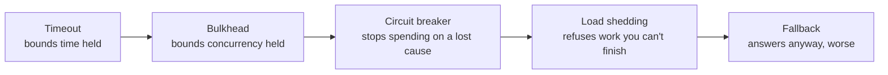

> Your dependencies will fail. This module is how your service stays useful while they do.
> It is the densest module in the course and the one with the highest return per hour spent.

## What you will be able to do

- Give every remote call a bounded, propagating deadline.
- Retry without turning a blip into an outage.
- Fail fast against a dependency that is certainly broken.
- Contain one sick dependency so it cannot consume the whole process.
- Refuse work deliberately instead of collapsing under it.
- Serve a degraded answer instead of an error.

## Lessons

| # | Lesson | The failure it prevents |
|---|---|---|
| 02-01 | [Timeouts and deadlines](/modules/resilience/01-timeouts-and-deadlines) | Unbounded waits; resource exhaustion |
| 02-02 | [Retries, backoff and jitter](/modules/resilience/02-retries-backoff-and-jitter) | Transient errors reaching the user; retry storms |
| 02-03 | [Circuit breaker](/modules/resilience/03-circuit-breaker) | Queueing behind a dependency that is definitely down |
| 02-04 | [Bulkhead](/modules/resilience/04-bulkhead) | One slow dependency starving every other request |
| 02-05 | [Rate limiting and throttling](/modules/resilience/05-rate-limiting-and-throttling) | One caller consuming everyone's capacity |
| 02-06 | [Load shedding and backpressure](/modules/resilience/06-load-shedding-and-backpressure) | Accepting more work than you can ever finish |
| 02-07 | [Fallback and graceful degradation](/modules/resilience/07-fallback-and-graceful-degradation) | A non-essential failure becoming a total failure |
| 02-08 | [Health checks and self-healing](/modules/resilience/08-health-checks-and-self-healing) | Traffic to instances that cannot serve it |

## The one idea

**A distributed system does not fail because a component broke. It fails because a broken
component was allowed to consume resources belonging to everything else.**

Every pattern here is a way of denying resources to a failure:

## The order they must be applied

They are not independent, and applying them in the wrong order produces systems that are
worse than doing nothing.

1. **Timeouts first.** Without a bound on time, nothing else works — a breaker never trips
   because calls never complete, a bulkhead fills and never drains.
2. **Idempotency before retries.** A retry without
   [idempotency](/modules/communication/03-delivery-guarantees-and-idempotency) is a
   duplicate-charge machine.
3. **Bulkheads before breakers.** Isolation limits damage while the breaker is still
   deciding.
4. **Shedding before autoscaling.** Scaling takes minutes; shedding takes microseconds.
5. **Fallbacks last.** A fallback over an unbounded call is a slower failure, not a better
   one.

## ShopFlow at the end of this module

The payment provider degrades from 300ms to 8s and starts erroring. Checkout notices within
five seconds, stops calling it, tells customers "we'll confirm your payment shortly,"
continues to accept orders in a `PENDING_PAYMENT` state, reconciles them when the provider
recovers, and never exhausts a thread pool. The catalogue, which does not depend on
payments, is entirely unaffected.

That is the whole point of the module: **the blast radius of the failure equals the
component that failed.**

---

**Up:** [Curriculum](/CURRICULUM) · **Previous:** [← Module 01](/modules/communication/README) · **Next:** [02-01 Timeouts and deadlines →](/modules/resilience/01-timeouts-and-deadlines)
