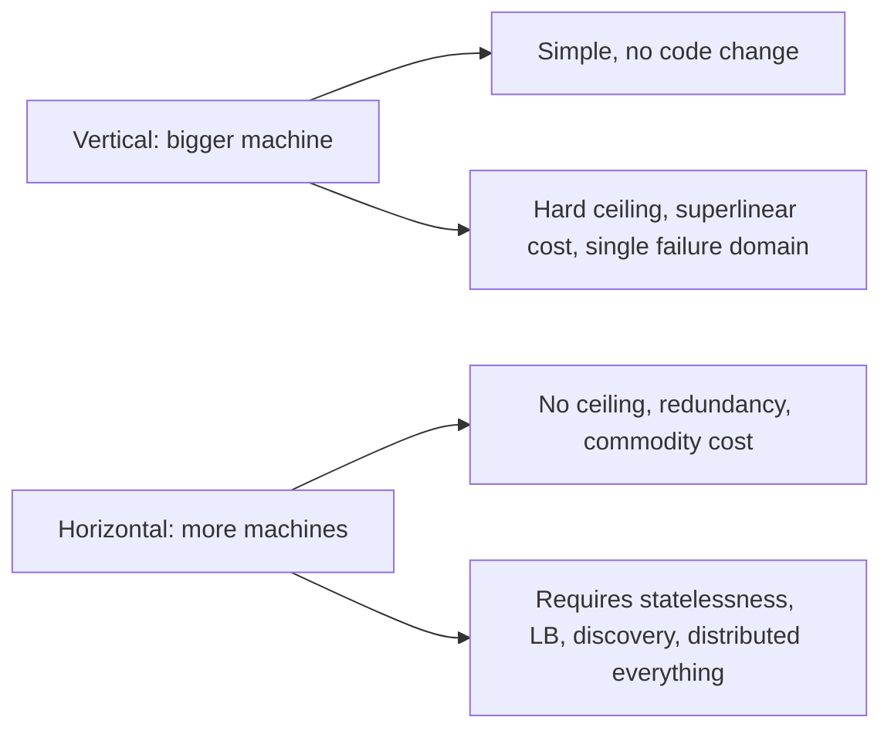

> An instance you can kill without consequence is an instance you can add without ceremony.
> Statelessness is what makes capacity a configuration value.

| | |
|---|---|
| **Module** | [03 — Scalability](/modules/scalability/README) |
| **Prerequisites** | [00-04 Little's Law](/modules/foundations/04-latency-throughput-and-back-of-envelope), [01-05 Service discovery](/modules/communication/05-service-discovery) |
| **Also known as** | share-nothing, cattle not pets, twelve-factor processes |
| **Category** | Scalability |

---

## 1. The problem

ShopFlow's catalogue runs on four instances and needs to handle 12,000 req/s. Adding
instances should be trivial. It isn't, because:

- Sessions are held in each instance's memory, so a user routed to a different instance is
  logged out. The load balancer therefore uses sticky sessions, so load is uneven and a
  restart logs out everyone on that instance.
- A `@Scheduled` job runs on every instance, so the nightly price import runs four times.
- Uploaded product images are written to local disk, so an image is visible only from the
  instance that received it.
- An in-memory rate limiter allows 4× the intended rate.

Every one of these is a piece of state that lives in the wrong place. The symptom: scaling
out makes the system *less* correct.

## 2. In plain language

A bank branch where each teller keeps their own customer files in their own drawer. You must
see the same teller every time. If they're on holiday, your file is locked in a drawer. If
they're busy, you queue — even though three tellers are idle.

Move the files to a central records room and every teller becomes interchangeable. Any queue
is served by any teller. A teller can go home mid-shift and you won't notice. Hiring a new
teller adds capacity immediately, with no handover.

The files did not disappear. They moved to a place designed to hold them, which is a shared
system that is harder to build and easier to reason about. **Statelessness never removes
state; it relocates it.**

**Where the analogy breaks down:** the records room is now a bottleneck and a single point of
failure — which is why the rest of this module exists.

## 3. How it works

A service is stateless if **any request can be served correctly by any instance**, and
killing an instance loses nothing but in-flight requests.

### Where state goes

| State | Wrong home | Right home |
|---|---|---|
| Session / login | Instance memory | Signed token in a cookie, or a shared session store |
| User uploads | Local disk | Object storage (S3 and friends) |
| Cached computations | Local memory (if correctness depends on it) | Shared cache — or local, if it is *only* an optimisation |
| Scheduled jobs | Every instance | One elected leader ([04-07](/modules/data-and-consistency/07-consensus-and-leader-election)) or an external scheduler |
| Rate limiter counters | Instance memory | Shared store, or local at `limit/N` ([02-05](/modules/resilience/05-rate-limiting-and-throttling)) |
| WebSocket connections | Inherently instance-local | Accept it; add a pub/sub fan-out so any instance can reach any connection |
| In-flight request state | Instance memory | Fine — it dies with the request, which is acceptable |

**Local caches are fine.** The test is not "is there anything in memory" but "does
correctness depend on which instance I hit". A local cache that can be rebuilt from the
origin is an optimisation; a local session that cannot be rebuilt is state.

### Horizontal vs vertical



Vertical scaling is underrated and should usually be tried first — it is a purchase order,
not a project. Horizontal scaling is what you do when vertical runs out, and it brings the
whole of this course with it.

### Amdahl and USL — the ceiling

If a fraction *s* of the work is serialised, speedup is capped at `1/s`. Five percent
serialised means 20× maximum, no matter how many machines.

The Universal Scalability Law adds a second, worse term: coordination between nodes costs
`O(n²)`. Throughput rises, peaks, and then **declines** as you add machines. If adding
instances is making things slower, you have found the coherency term, and the answer is to
remove coordination, not to add hardware.

## 4. Pseudo-code

**Before — four kinds of misplaced state.**

```
service CatalogService:
  state sessions: Map<SessionId, Session> = {}          # TRAP: instance-local
  state rate_counts: Map<ClientId, Int> = {}            # TRAP: 4 instances = 4× the limit

  handler login(cmd) -> Result<SessionId, Error>:
    sid = uuid()
    sessions.put(sid, Session(cmd.user_id, now()))      # only THIS instance knows
    return Ok(sid)

  handler upload_image(sku, bytes) -> Result<Url, Error>:
    write_file("/var/data/images/" + sku, bytes)        # TRAP: local disk
    return Ok("/images/" + sku)

  every 1d at 02:00:
    import_prices_from_erp()                            # TRAP: runs on all 4 instances
```

**The pattern — state relocated, instances interchangeable.**

```
service CatalogService:
  uses sessions: Store<SessionId, Session>       # shared, or use a signed token
  uses blobs: ObjectStore
  uses limiter: RateLimiter                      # shared counters, or local at rate/N
  uses election: Election
  state local_cache: Cache<Sku, Product>         # OK: pure optimisation, rebuildable

  handler login(cmd) -> Result<SessionToken, Error>:
    # Best option: no server-side session at all. The token IS the state, and it
    # travels with the request, so every instance can validate it independently.
    token = sign({user_id: cmd.user_id, exp: now() + 30m, ver: user.token_version})
    return Ok(token)
    # COST: revocation is now hard. `ver` lets you invalidate by bumping a counter
    # in the user record — a small shared read, on logout-sensitive paths only.

  handler upload_image(sku, bytes) -> Result<Url, Error>:
    url = await blobs.put("images/" + sku, bytes) timeout 5s
    return Ok(url)                               # any instance can serve it afterwards

  # Scheduled work runs ONCE, on whichever instance holds the lease.
  every 1m:
    if lease = election.campaign(role: "price-importer"):
      with lease:
        import_prices_from_erp()
    # WHY a lease and not "instance 0": there is no stable instance 0. See 04-07.

  on shutdown_signal:
    # Statelessness is what makes this safe: nothing is lost but in-flight work.
    drain_and_exit()
```

**Autoscaling — the payoff.**

```
service Autoscaler:
  target_utilisation: Float = 0.65        # 00-04: the latency cliff starts near 70%
  min_instances: Int = 4                  # survive losing one AZ of three
  cooldown: Duration = 3m

  every 30s:
    # Scale on a signal that reflects the actual constraint. CPU is often not it.
    signal = max(cpu_utilisation(), concurrency() / concurrency_limit(),
                 queue_wait_p50() / queue_wait_target())

    desired = ceil(current_instances * signal / target_utilisation)
    desired = clamp(desired, min_instances, max_instances)

    if desired > current_instances:
      scale_to(desired)                   # scale UP fast
    elif desired < current_instances and now() - last_change > cooldown:
      scale_to(current_instances - 1)     # scale DOWN slowly, one at a time
      # WHY asymmetric: scaling up late costs an outage; scaling down late costs money.
```

**The check that proves it.** If this test passes, the service is stateless.

```
# For any sequence of requests in a user's session, route each one to a
# RANDOMLY chosen instance. The observable behaviour must be identical.
#
# Then: kill a random instance mid-test. The only acceptable loss is the
# requests that were in flight on that instance.
```

## 5. Knobs and variants

| Knob | Guidance | Failure if wrong |
|---|---|---|
| Session strategy | Signed token > shared store > sticky sessions | Sticky sessions defeat load balancing and lose data on restart |
| Token lifetime | Short (15–60m) with refresh | Long tokens can't be revoked; short ones hammer the auth path |
| Min instances | ≥ 3, spanning failure domains | 2 instances means one failure is 50% capacity loss |
| Scale-up trigger | Concurrency or queue wait | CPU misses IO-bound saturation entirely |
| Scale-down cooldown | 3–10 min | Fast scale-down causes thrash and cold caches |
| Startup time | < 30s | Slow starts make autoscaling useless during a spike |
| Local cache | Allowed, if only an optimisation | Correctness-bearing local cache = hidden statefulness |

## 6. Challenges and failure modes

- **Hidden state.** Sticky-session config "temporarily" added two years ago; a static variable
  holding a counter; an in-memory feature-flag override. The random-routing test above is the
  only reliable way to find these.
- **Scheduled jobs multiplying.** Every instance running the nightly job. Needs leader
  election or an external scheduler.
- **Cold start after scale-out.** New instances have empty caches and cold connection pools;
  they serve slowly and can even fail. Warm up before signalling readiness
  ([02-08](/modules/resilience/08-health-checks-and-self-healing)).
- **Scale-out shifting the bottleneck.** 40 instances × 50 connections = 2,000 connections to
  a database that allows 500. Horizontal scaling of a stateless tier moves the pressure to the
  stateful tier, every time ([10-03](/modules/performance-and-concurrency/03-resource-pooling)).
- **Autoscaling reacting too slowly.** Detection + provisioning + startup is often 3–5 minutes.
  A traffic spike lasting 90 seconds is over before capacity arrives. Shedding covers the gap
  ([02-06](/modules/resilience/06-load-shedding-and-backpressure)).
- **Scaling into a stampede.** New instances have cold caches and hammer the origin, which is
  already struggling — which is why you scaled ([03-03](/modules/scalability/03-caching)).
- **Scaling on the wrong metric.** CPU stays at 20% while the thread pool is at 100%. The
  autoscaler sees a healthy system that cannot serve a request.
- **Amdahl's ceiling.** Beyond some point, adding instances does nothing, then makes things
  worse. Measure throughput per instance as you scale; if it's falling, find the shared thing.

## 7. Alternatives

- **Vertical scaling.** Try it first. Often cheaper than an engineering quarter, and modern
  machines are enormous.
- **Stateful services done properly.** Some things must be stateful — databases, brokers,
  WebSocket gateways. Scale them with [partitioning](/modules/scalability/04-partitioning-and-sharding) and
  [replication](/modules/scalability/05-replication), not by pretending they aren't stateful.
- **Sticky sessions.** Legitimate for WebSockets and long-lived streams. Accept the trade,
  bound it, and make failure recoverable rather than fatal.
- **Serverless.** Statelessness enforced by the platform, scaling to zero. Cold starts and
  per-invocation cost; excellent for spiky, independent work.
- **Queue-based work distribution.** Instead of balancing requests, let workers pull from a
  queue. Self-balancing by construction ([10-02](/modules/performance-and-concurrency/02-asynchronous-processing-and-work-queues)).

## 8. Trade-offs

| Advantage | Disadvantage |
|---|---|
| Capacity becomes a number you change | State moves to a shared tier, which becomes the new bottleneck |
| Any instance can die without user-visible effect | Every request pays a network hop for state it used to have locally |
| Deploys, restarts and autoscaling become routine | Requires a session strategy, object storage, and leader election |
| Redundancy comes free with the instance count | Cold starts and stampedes are new failure modes |
| Commodity hardware, linear-ish cost | Amdahl's ceiling still applies, and finding it takes work |

## 9. Complexity introduced

- **Operational.** Autoscaling policy tuning, minimum-instance floors, warm-up procedures,
  and monitoring throughput *per instance* to detect the scalability ceiling.
- **Cognitive.** "Where does this state live?" becomes a design question for every feature.
- **Failure surface.** Cold-start stampedes, scale-down thrash, downstream connection
  exhaustion, autoscaler lag.
- **Testing.** The random-routing + kill-an-instance test should be part of CI, not folklore.

## 10. Related concepts

- **Builds on:** [00-04 Little's Law](/modules/foundations/04-latency-throughput-and-back-of-envelope), [01-05 Service discovery](/modules/communication/05-service-discovery)
- **Composes with:** [03-02 Load balancing](/modules/scalability/02-load-balancing), [02-08 Health checks](/modules/resilience/08-health-checks-and-self-healing), [04-07 Leader election](/modules/data-and-consistency/07-consensus-and-leader-election)
- **Conflicts with / tension:** local caching and sticky sessions, both of which trade statelessness for latency
- **Contrast with:** [03-04 Partitioning](/modules/scalability/04-partitioning-and-sharding) — how you scale the tier that *must* hold state
- **Leads to:** [03-02 Load balancing](/modules/scalability/02-load-balancing)

## 11. Exercises

1. **Trace it.** ShopFlow's catalogue scales from 4 to 40 instances. Each holds a 50-connection
   pool to a database allowing 500 connections. What happens at instance 11? Give two fixes.
2. **Extend it.** Design session handling for ShopFlow that survives instance loss, supports
   immediate logout-everywhere, and does not add a shared lookup to every request. State what
   you traded.
3. **Break it.** The autoscaler scales on CPU with a 65% target. Find the load pattern where
   the service is completely saturated, users see 10-second latencies, and the autoscaler
   removes instances.

## 12. References

- Adam Wiggins, "The Twelve-Factor App" — factors VI (processes) and VIII (concurrency).
- Gene Amdahl, "Validity of the Single Processor Approach…" (1967).
- Neil Gunther, *Guerrilla Capacity Planning* — the Universal Scalability Law.
- Google SRE Book — Ch. 11 and 22 on load and capacity.
- Martin Kleppmann, *Designing Data-Intensive Applications* — Ch. 1, scalability defined properly.

---

**Up:** [Module 03](/modules/scalability/README) · **Previous:** [← Module 02](/modules/resilience/README) · **Next:** [03-02 Load balancing →](/modules/scalability/02-load-balancing)
