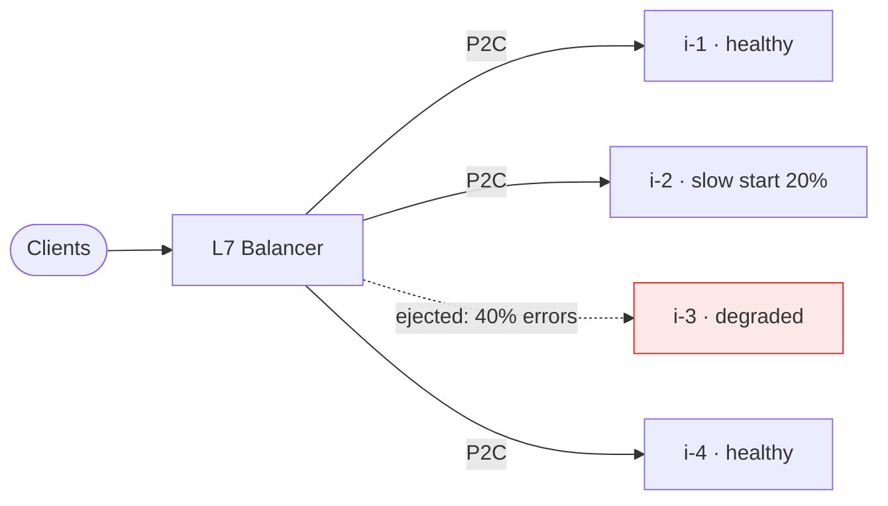

> Twenty instances only give you twenty instances' worth of capacity if the work is spread
> evenly. Round-robin — the default everywhere — does not spread work evenly.

| | |
|---|---|
| **Module** | [03 — Scalability](/modules/scalability/README) |
| **Prerequisites** | [03-01 Stateless services](/modules/scalability/01-stateless-services-and-horizontal-scaling), [01-05 Service discovery](/modules/communication/05-service-discovery) |
| **Also known as** | LB, request routing, power of two choices, outlier ejection |
| **Category** | Scalability |

---

## 1. The problem

ShopFlow's catalogue runs 20 instances behind a round-robin load balancer. Each gets exactly
1/20 of the requests. It should be perfectly balanced. It isn't:

- Instance 7 is on a noisy host and runs 3× slower. It still receives its full share, so its
  queue grows without bound while 19 instances are idle-ish. Its p99 becomes the service's
  p99.
- Instance 12 was just deployed. Its caches are cold and its JIT is unwarmed. It receives full
  traffic immediately and takes 400ms per request instead of 8ms.
- Instance 3 has a broken database connection. It fails instantly, so round-robin sends it
  *more* requests per second than the healthy ones — a fast failure is a fast turnaround.
  It is now a black hole, absorbing 5% of all traffic.

**Requests are not equal, and instances are not equal.** Round-robin assumes both.

## 2. In plain language

A supermarket with twelve tills. Sending every twelfth customer to till 7 is "fair", and it
is a bad idea: till 7's card reader is broken, and the customer at till 3 has a trolley full
of unlabelled produce.

What people actually do is **look at the queues and join a short one**. That is
least-connections. But watching all twelve tills carefully is work, and in a distributed
system "watching" means keeping up-to-date state about every instance, which is expensive
and stale.

The surprising result: **look at two tills at random and join the shorter one.** This is
almost as good as watching all twelve, requires almost no information, and — crucially —
avoids the failure mode where everyone simultaneously spots the same short queue and
stampedes it. That last property is what makes it better than "join the shortest" in a
distributed setting.

**Where the analogy breaks down:** shoppers can see queue lengths for free. A load balancer
has to measure them, and its measurements are always slightly out of date.

## 3. How it works

### The algorithms

| Algorithm | How | Handles slow instances? | Cost |
|---|---|---|---|
| **Round robin** | Next in sequence | ❌ No | Free |
| **Weighted round robin** | Sequence weighted by static capacity | ❌ Only static differences | Free |
| **Random** | Uniform | ❌ No | Free |
| **Least connections** | Fewest in-flight | ✅ Yes | Needs global state |
| **Least response time** | Lowest recent latency | ✅ Yes | Needs measurement |
| **Power of two choices (P2C)** | Pick 2 at random, take the less loaded | ✅ Yes | ~Free |
| **Consistent hashing** | Hash the key to an instance | ❌ (not its job) | Cheap ([03-06](/modules/scalability/06-consistent-hashing)) |

**P2C is the default recommendation for anything with variable latency.** Randomised load
balancing with N choices reduces the maximum load from `O(log n / log log n)` to
`O(log log n / log 2)` — the jump from 1 choice to 2 captures nearly all the benefit, and
going to 3 adds almost nothing.

Why P2C beats "least connections" in practice: with several load balancers, "always pick the
least loaded" makes them all pick the *same* instance simultaneously, which then becomes the
most loaded. Randomisation breaks the synchronisation. This is the same insight as jitter in
[02-02](/modules/resilience/02-retries-backoff-and-jitter).

### Layer 4 vs Layer 7

| | L4 (TCP) | L7 (HTTP) |
|---|---|---|
| Decides on | IP/port | Path, header, method, cookie |
| Sees | Connections | Individual requests |
| Cost | Very low | Higher (parses, may terminate TLS) |
| Problem | With HTTP/2 or gRPC, one connection carries thousands of requests — balancing connections does not balance requests | — |

**HTTP/2 and gRPC break L4 load balancing.** A single long-lived connection multiplexes all
requests, so L4 pins all of a client's traffic to one backend. You need either an L7 balancer
that balances per-request, or client-side balancing with a max-connection-age so connections
get redistributed.

### Health-based routing

Two mechanisms, and you want both:

- **Active health checks** — the balancer probes each instance ([02-08](/modules/resilience/08-health-checks-and-self-healing)).
- **Passive health checks / outlier ejection** — the balancer watches the outcomes of real
  traffic and temporarily ejects instances with elevated errors or latency. This catches gray
  failures that synthetic probes miss, and it is the load-balancer-level equivalent of a
  per-instance [circuit breaker](/modules/resilience/03-circuit-breaker).

**Panic mode / fail-open:** if more than ~50% of instances are ejected, the balancer should
route to all of them anyway. Otherwise a bad deploy or an over-sensitive check produces a
total outage.

### Slow start

A new instance must ramp up over 30–60 seconds rather than receiving full traffic
immediately. Without it, every deploy and every scale-out produces a latency spike, and in
the worst case the new instance falls over before it warms.



## 4. Pseudo-code

**Before — round robin into a black hole.**

```
service LoadBalancer:
  state instances: List<Instance>
  state next: Int = 0

  fn pick() -> Instance:
    i = instances[next % instances.size]
    next += 1
    return i
    # TRAP 1: a slow instance gets the same share as a fast one.
    # TRAP 2: an instantly-failing instance gets MORE requests per second than
    #         healthy ones, because its requests complete faster.
```

**The pattern — P2C with in-flight tracking, ejection and slow start.**

```
record Backend:
  instance: Instance
  inflight: Int = 0
  ewma_latency: Duration = 0ms          # exponentially weighted moving average
  errors: SlidingWindow<Bool> = []
  ejected_until: Option<Instant> = None
  started_at: Instant

service LoadBalancer:
  state backends: List<Backend>
  ejection_error_rate: Float = 0.5
  ejection_duration: Duration = 30s
  slow_start: Duration = 60s
  max_ejected_fraction: Float = 0.5

  fn pick() -> Result<Backend, Error>:
    available = backends.filter(b => b.ejected_until is None or now() > b.ejected_until)

    # PANIC MODE: if we've ejected too many, trust none of our judgements.
    # WHY: a bad deploy or a broken health signal must not cause a 100% outage.
    if available.size < backends.size * (1 - max_ejected_fraction):
      metrics.increment("lb.panic_mode")
      available = backends

    if available.is_empty(): return Err(NoBackends)

    # Power of two choices.
    a = random_choice(available)
    b = random_choice(available)
    return Ok(cost(a) <= cost(b) ? a : b)

  fn cost(b: Backend) -> Float:
    # In-flight × latency ≈ the queue this backend is carrying (Little's Law).
    base = b.inflight * max(b.ewma_latency.ms, 1)

    # Slow start: inflate a new instance's apparent cost so it ramps up.
    age = now() - b.started_at
    if age < slow_start:
      base = base / (age / slow_start)     # at 10% of warmup, looks 10× as loaded
    return base

  fn on_dispatch(b: Backend):
    b.inflight += 1

  fn on_complete(b: Backend, latency: Duration, success: Bool):
    b.inflight -= 1
    b.ewma_latency = 0.8 * b.ewma_latency + 0.2 * latency
    b.errors.append(success); b.errors.evict_older_than(30s)

    # Passive health check: judge by real traffic, not synthetic probes.
    if b.errors.count() >= 20 and b.errors.failure_rate() > ejection_error_rate:
      b.ejected_until = Some(now() + ejection_duration)
      log.warn("ejected backend", instance: b.instance.id, rate: b.errors.failure_rate())
```

**Client-side balancing — required for gRPC/HTTP2, and the reason connection age matters.**

```
service OrderService:
  uses discovery: DiscoveryClient
  state balancer: LoadBalancer

  every 5s:
    balancer.sync(discovery.resolve("catalog-service"))

  async fn get_product(sku: Sku) -> Result<Product, Error>:
    b = balancer.pick()?
    balancer.on_dispatch(b)
    started = now()
    try:
      r = await b.instance.get(sku) timeout 300ms
      balancer.on_complete(b, now() - started, success: true)
      return Ok(r)
    catch e:
      balancer.on_complete(b, now() - started, success: false)
      raise

  # TRAP without this: an HTTP/2 connection lives forever, so instances added
  # after startup receive ZERO traffic. Every scale-out event does nothing.
  uses catalog: Client<CatalogService>
    with max_connection_age(5m + jitter(1m))
```

**Sticky routing, when you genuinely need it.**

```
fn pick_sticky(session_id: String) -> Backend:
  # Consistent hashing (03-06), not modulo: adding an instance must not
  # remap every session.
  primary = ring.node_for(session_id)
  if primary.is_healthy(): return primary
  return ring.next_node_for(session_id)     # deterministic failover target
  # COST: a hot session is now a hot instance, and P2C cannot help it.
```

## 5. Knobs and variants

| Knob | Guidance | Failure if wrong |
|---|---|---|
| Algorithm | P2C for variable latency; RR only for uniform, fast work | RR into a slow instance = tail latency for everyone |
| Ejection threshold | 50% errors over ≥20 requests | Too sensitive: healthy instances ejected during a blip |
| Ejection duration | 30s, growing on repeat | Too short: flapping. Too long: capacity loss |
| Panic threshold | ~50% | Absent: an over-sensitive check causes total outage |
| Slow start | 30–60s | Absent: latency spike on every deploy |
| Max connection age | 5–15 min with jitter | Absent: HTTP/2 pins traffic; scale-out has no effect |
| Zone awareness | Prefer local zone, spill on capacity loss | Absent: cross-AZ latency and egress cost on every call |

## 6. Challenges and failure modes

- **The black hole.** An instance failing instantly receives more traffic under RR and
  least-connections, because failing is fast. Outlier ejection on *error rate* is the fix;
  latency-based cost alone will not catch it.
- **HTTP/2 connection pinning.** Covered above. Scale-out events that change nothing are the
  giveaway.
- **Over-ejection.** A bad deploy makes every instance error; the balancer ejects everything;
  100% outage. Panic mode.
- **Herd behaviour with least-connections.** Multiple balancers converge on the same "least
  loaded" instance. P2C's randomness prevents it.
- **Uneven request cost.** A search costing 50× a lookup makes connection counts meaningless.
  Weight by measured cost, or bulkhead by endpoint.
- **Sticky sessions defeating everything.** With stickiness, no algorithm can rebalance. Use
  it only where the protocol demands it.
- **Balancing on stale membership.** The balancer's instance list lags discovery, so it routes
  to a decommissioned host. Handle connection-refused by retrying elsewhere
  ([01-05](/modules/communication/05-service-discovery)).
- **Cross-zone imbalance.** 3 zones, instance counts 10/10/2, and zone-local routing means the
  third zone's instances get 5× the load. Zone-aware balancing must be capacity-aware too.

## 7. Alternatives

- **Queue-based work distribution.** Workers pull when free. Perfect balance by construction,
  no algorithm needed, and only applicable to work that can be deferred
  ([10-02](/modules/performance-and-concurrency/02-asynchronous-processing-and-work-queues)).
- **[Service mesh](/modules/microservice-architecture/04-sidecar-and-service-mesh).**
  Client-side balancing with P2C, ejection and zone awareness, without writing any of it.
- **DNS round robin.** Free and terrible: no health awareness, client-cached unpredictably.
  Fine as a coarse first tier only.
- **Anycast / global load balancing.** Routes to the nearest region at the network layer.
  Solves a different problem (geography) and composes with everything here.
- **[Consistent hashing](/modules/scalability/06-consistent-hashing).** When cache locality matters more than
  balance, route by key and accept some imbalance — with bounded loads to cap it.

## 8. Trade-offs

| Advantage | Disadvantage |
|---|---|
| Capacity actually scales with instance count | Requires per-backend state and measurement |
| Slow and failing instances stop damaging the tail | Ejection can remove healthy capacity on a false signal |
| Slow start makes deploys invisible | More parameters, each capable of causing an outage |
| Outlier ejection catches gray failures probes miss | Passive detection needs traffic; idle paths stay unmeasured |
| P2C is nearly optimal for nearly no cost | Sticky routing, when required, defeats all of it |

## 9. Complexity introduced

- **Operational.** Per-backend dashboards (in-flight, latency, ejections), alerts on panic mode
  and on sustained ejection, and understanding that ejections are normal in small numbers.
- **Cognitive.** Debugging "why is this one instance slow" requires per-instance data, not
  service-level aggregates.
- **Failure surface.** Over-ejection, herding, connection pinning, stale membership,
  zone imbalance.
- **Testing.** Needs a test where one instance is deliberately slowed and one deliberately
  fails fast, asserting that service-level p99 barely moves. Both cases, because they are
  caught by different mechanisms.

## 10. Related concepts

- **Builds on:** [03-01 Stateless services](/modules/scalability/01-stateless-services-and-horizontal-scaling), [01-05 Service discovery](/modules/communication/05-service-discovery)
- **Composes with:** [02-08 Health checks](/modules/resilience/08-health-checks-and-self-healing), [02-03 Circuit breaker](/modules/resilience/03-circuit-breaker) (ejection is a per-instance breaker), [08-04 Service mesh](/modules/microservice-architecture/04-sidecar-and-service-mesh)
- **Conflicts with / tension:** [03-03 Caching](/modules/scalability/03-caching) — cache locality wants sticky routing, balance wants the opposite
- **Contrast with:** [03-06 Consistent hashing](/modules/scalability/06-consistent-hashing) — routing for *locality* rather than for *balance*
- **Leads to:** [03-03 Caching](/modules/scalability/03-caching)

## 11. Exercises

1. **Trace it.** 20 instances, 12,000 req/s, 8ms each. Instance 7 degrades to 240ms. Compute
   its queue depth and the service p99 under round robin. Recompute under P2C with in-flight
   cost.
2. **Extend it.** Add zone awareness to `pick()`: prefer the local zone, but spill to remote
   zones when local healthy capacity drops below 40%. What happens during a zone-wide brownout
   where instances are up but slow?
3. **Break it.** Outlier ejection at 50% errors over 20 requests, 30s duration, panic at 50%.
   A deploy introduces a bug that fails 60% of requests on the new version, rolling out to 10
   of 20 instances. Walk through the next two minutes.

## 12. References

- Mitzenmacher, "The Power of Two Choices in Randomized Load Balancing" (1996).
- Twitter, "Load Balancing at Twitter" — P2C with peak-EWMA in production.
- Envoy documentation — load balancing algorithms, outlier detection, panic threshold, slow start.
- NGINX, "Load Balancing with NGINX" — and the gRPC/HTTP2 balancing caveats.
- Google SRE Book — Ch. 20, "Load Balancing in the Datacenter".

---

**Up:** [Module 03](/modules/scalability/README) · **Previous:** [← 03-01](/modules/scalability/01-stateless-services-and-horizontal-scaling) · **Next:** [03-03 Caching →](/modules/scalability/03-caching)
