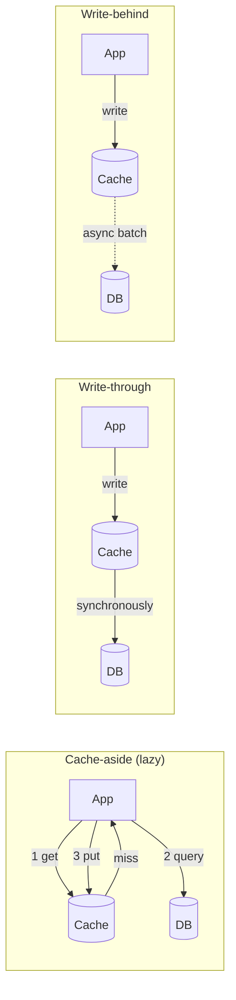

> The cheapest possible optimisation and the richest possible source of subtle bugs. A cache
> is a second copy of your data with none of your database's guarantees.

| | |
|---|---|
| **Module** | [03 — Scalability](/modules/scalability/README) |
| **Prerequisites** | [00-05 Consistency models](/modules/foundations/05-consistency-models-cap-and-pacelc), [03-01 Stateless services](/modules/scalability/01-stateless-services-and-horizontal-scaling) |
| **Also known as** | memoisation, CDN, read-through, cache-aside, materialised view |
| **Category** | Scalability |

---

## 1. The problem

ShopFlow's catalogue serves 12,000 req/s. Each request is a database query taking 8ms. That
is 96 concurrent queries permanently, against a database that starts queueing at 40. The
database is the ceiling, and it is a ceiling you cannot lift by adding application instances.

95% of those requests are for the same 2,000 popular SKUs, whose data changes a few times a
day.

The obvious fix is obvious. The problems it creates are not:

- A merchandiser changes a price. How long until customers see it? Who decides?
- The cache restarts. All 12,000 req/s hit the database at once and it dies — an outage
  *caused* by the thing that was protecting it.
- One popular SKU expires. Two hundred requests miss simultaneously and all 200 query the
  database for the same row.
- A bug caches a personalised price under a shared key. Every customer sees one customer's
  discount.

## 2. In plain language

Keeping a notepad of phone numbers instead of ringing directory enquiries every time.
Enormously faster, and now you have two copies of the truth. When someone changes their
number, your notepad is wrong and nothing tells you.

Three ways to handle it, and they are exactly the three real strategies:

1. **Rewrite the page every Monday** whether or not anything changed (TTL).
2. **Cross out a number when you hear it changed** (invalidation) — requires that you always
   hear.
3. **Update the notepad at the same moment you change the number** (write-through) — only
   works if you are the one making the change.

And the failure that ruins your day: your notepad burns, so you and everyone else in the
office ring directory enquiries simultaneously, and directory enquiries falls over.

**Where the analogy breaks down:** you know your notepad might be stale. Software treats
cached values as fact, which is why staleness bugs are so hard to see.

## 3. How it works

### The layers

Each layer is faster, less consistent, and harder to invalidate than the one below.

| Layer | Latency | Invalidation | Good for |
|---|---|---|---|
| Browser / client | 0 | Impossible once sent — TTL only | Static assets with hashed filenames |
| CDN / edge | 10–50ms | Purge API, slow and global | Images, public pages, API GETs |
| API gateway | ~1ms | Local | Shared computed responses |
| In-process | ~0.1µs | Local only, so N copies drift | Tiny, hot, tolerant-of-staleness data |
| Distributed (Redis) | ~1ms | Central and immediate | Sessions, computed results, shared state |
| Database buffer pool | ~0.1ms | Automatic | Everything (already there, free) |

**A two-tier arrangement — small in-process cache in front of a shared cache — is the
standard high-traffic pattern.** It absorbs the hottest keys locally (removing even the 1ms
network hop) and shares everything else.

### The strategies



| Strategy | Reads | Writes | Risk |
|---|---|---|---|
| **Cache-aside** | App checks cache, falls back to DB, populates | App writes DB, invalidates cache | The window between DB write and invalidation |
| **Read-through** | Cache fetches on miss | — | Same, hidden inside the cache library |
| **Write-through** | Always warm | Write both, synchronously | Slower writes; caches data nobody reads |
| **Write-behind** | Always warm | Write cache, flush to DB later | **Data loss if the cache dies.** Only for tolerant data |
| **Refresh-ahead** | Refresh before expiry | — | Wasted work on unpopular keys |

**Cache-aside is the default.** It is explicit, it degrades correctly (a cache outage means
slow, not broken), and it does not cache things nobody reads.

### Invalidation

The famous hard problem. Three approaches, in increasing order of effort and correctness:

1. **TTL.** Simple, self-healing, and staleness is bounded by the TTL. Always have one, even
   with explicit invalidation, as a backstop against missed invalidations.
2. **Explicit invalidation on write.** Immediate, and only correct if *every* write path
   invalidates. One forgotten path, or one direct SQL update by an admin, and you have a
   permanently stale key.
3. **Event-driven invalidation.** The writer publishes; caches subscribe. Works across
   services and out-of-band writes. Eventually consistent by construction; needs the
   [outbox](/modules/data-and-consistency/03-transactional-outbox) to not miss events.

**Version-stamped keys** sidestep the whole problem: include a version or content hash in the
key (`product:SKU123:v42`). A write creates a *new* key rather than invalidating an old one,
so there is no window and no missed invalidation. Old keys expire naturally. Use this
wherever you can.

### Stampedes

Three named failure modes, three different fixes:

| Problem | Mechanism | Fix |
|---|---|---|
| **Thundering herd** | One hot key expires; N concurrent misses; N identical queries | Single-flight: one loader per key, others wait |
| **Cache stampede** | Many keys expire simultaneously (loaded together) | **Jitter the TTL**: `ttl + random(0, ttl × 0.2)` |
| **Cold start** | Cache restarts or scales out; everything misses at once | Warm before serving; ramp traffic; rate-limit origin fetches |

Also: **cache penetration** — repeated requests for a key that does not exist bypass the cache
entirely, every time. Fix by caching the negative result with a short TTL.

## 4. Pseudo-code

**Before — cache-aside with every classic bug.**

```
handler get_product(sku: Sku) -> Product:
  p = cache.get("product:" + sku)
  if p is Some: return p
  p = db.query(sku)                        # TRAP 1: 200 concurrent misses = 200 queries
  cache.put("product:" + sku, p, ttl: 1h)  # TRAP 2: no jitter — mass expiry
  return p                                 # TRAP 3: a null result is never cached
                                           # TRAP 4: cache down → every request fails
```

**The pattern — single-flight, jitter, negative caching, stale-on-error.**

```
service ProductCache:
  uses l1: Cache<Sku, Product>          # in-process, small, ttl 10s
  uses l2: Cache<String, Product>       # shared (Redis), ttl 1h
  uses db: Store<Sku, Product>
  state inflight: Map<Sku, Future<Product>> = {}     # single-flight registry
  state origin_limit: RateLimiter(rate: 500/s)       # protects the DB during a cold start

  async fn get(sku: Sku) -> Result<Product, Error>:
    # --- L1: in-process. Absorbs the hottest keys with zero network cost. ---
    if p = l1.get(sku): return Ok(p)

    # --- L2: shared. ---
    key = "product:" + sku
    try:
      entry = await l2.get_entry(key) timeout 50ms
      if entry is Some:
        if entry.is_negative: return Err(NotFound)        # cached miss (penetration)
        l1.put(sku, entry.value, ttl: 10s)
        return Ok(entry.value)
    catch TimeoutError, ConnectionError:
      # WHY: a cache outage must degrade latency, never availability.
      metrics.increment("cache.unavailable")
      # fall through to the origin — but see the rate limiter below

    # --- Single-flight: N concurrent misses for one key = ONE query. ---
    # TRAP if written as `if inflight.get(sku) is None: inflight.put(sku, ...)`:
    # that is check-then-act. Two concurrent misses both read None, both start a
    # load, and the stampede this code exists to prevent happens anyway — at
    # exactly the moment the key is hottest.
    #
    # Install a promise ATOMICALLY. Exactly one caller wins; the rest await it.
    mine = Promise<Result<Product, Error>>()
    if not inflight.put_if_absent(sku, mine):
      return await inflight.get(sku)       # someone else won — wait on their load

    try:
      result = await load_from_origin(sku, key)
      mine.complete(result)
      return result
    finally:
      inflight.delete(sku)                 # after completing, so late waiters
                                           # still resolve against `mine`

  async fn load_from_origin(sku: Sku, key: String) -> Result<Product, Error>:
    # Cold-start protection: cap total origin load regardless of miss volume.
    if not origin_limit.try_acquire():
      if stale = l2.get_stale(key): return Ok(stale)     # 02-07: stale beats error
      return Err(Overloaded)

    p = await db.get(sku) timeout 500ms

    if p is None:
      l2.put_negative(key, ttl: 30s)       # short: the SKU may be created any moment
      return Err(NotFound)

    # Jitter: without it, everything loaded in the same minute expires in the same
    # minute, an hour later, and the origin gets the whole load at once.
    l2.put(key, p, ttl: 1h + jitter(12m))
    l1.put(sku, p, ttl: 10s)
    return Ok(p)
```

**Invalidation done three ways — pick per data type.**

```
service CatalogService:
  uses products: Store<Sku, Product>
  uses bus: Topic<CatalogEvent>

  handler update_product(cmd: UpdateProduct) -> Result<Product, Error>:
    p = products.get(cmd.sku)?
    updated = p with { price: cmd.price, version: p.version + 1 }

    atomically:
      products.put(cmd.sku, updated)
      outbox.append(ProductChanged(cmd.sku, updated.version))   # 04-03

    # Best-effort local invalidation for the instance that did the write.
    l2.invalidate("product:" + cmd.sku)
    return Ok(updated)
    # TRAP: this only invalidates the L2 and only from this instance. Every OTHER
    # instance's L1 is stale for up to 10s. That is why L1 TTLs are short, and why
    # L1 must only hold data where 10 seconds of staleness is acceptable.

# Every instance subscribes, so out-of-band writes are covered too.
service ProductCacheInvalidator:
  on event ProductChanged(e):
    l1.invalidate(e.sku)
    l2.invalidate("product:" + e.sku)

# Version-stamped keys: no invalidation needed at all.
fn versioned_key(sku: Sku, version: Int) -> String:
  return "product:" + sku + ":v" + version
  # A write produces a new key. Readers get the version from a small, always-fresh
  # lookup. Old keys expire on their own. No window, no missed invalidation.
```

## 5. Knobs and variants

| Knob | Guidance | Failure if wrong |
|---|---|---|
| TTL | Per data type: prices 60s, descriptions 1h, sessions 30m | Uniform TTL serves a week-old price |
| TTL jitter | ±10–20%, always | Without it, synchronised mass expiry |
| L1 TTL | Very short (5–30s) | Long L1 TTLs mean N instances disagree for that long |
| Negative TTL | 10–60s | Absent: penetration. Too long: newly created items appear missing |
| Eviction | LRU default; LFU for skewed access | Wrong policy evicts hot keys under memory pressure |
| Key design | Include *every* input that affects the value | Missing the currency/tenant/locale = cross-user data leak |
| On cache failure | Fail open to origin, with a rate limit | Fail closed = cache outage becomes service outage |
| Stale-while-revalidate | Enable for tier 1–3 data | Absent: the cache stops helping exactly when needed |

**Key design deserves the emphasis.** `product:SKU123` is wrong if the price depends on
customer tier, currency, or locale. The rule: the key must contain every input the value
depends on. Getting this wrong is how one customer's discount is shown to everyone.

## 6. Challenges and failure modes

- **Cache outage becomes service outage.** Very common. The system was quietly depending on a
  95% hit rate; at 0% the origin has 20× its capacity. Rate-limit origin access and
  [shed](/modules/resilience/06-load-shedding-and-backpressure).
- **Missed invalidation paths.** A batch job or admin tool writes directly to the database. The
  cache never hears. TTLs are the backstop; event-driven invalidation is the fix.
- **The invalidation race.** Thread A reads (miss), thread B writes and invalidates, thread A
  writes its now-stale value into the cache. The stale value persists for a full TTL. Mitigate
  with version checks on write or version-stamped keys.
- **Multi-instance L1 divergence.** Twenty instances, twenty slightly different views. Users see
  values flicker between old and new as they are routed around.
- **Caching sensitive or personalised data under a shared key.** The most damaging cache bug
  there is, and it is always a key-design mistake.
- **Hot key.** One SKU on the front page takes 40% of traffic and saturates one Redis shard.
  Fix with an L1 in front, or by replicating the hot key across shards.
- **Memory pressure and eviction storms.** The cache fills, evicts aggressively, hit rate
  collapses, origin load spikes. Alert on eviction rate, not just hit rate.
- **Caching hides a real problem.** The underlying query takes 4 seconds; nobody notices for
  a year, until the day the cache is cold.

## 7. Alternatives

- **Fix the origin.** An index, a denormalisation, or a better query often beats a cache and
  adds no consistency problems. Try first.
- **[Read replicas](/modules/scalability/05-replication).** More read capacity with the database's own
  consistency semantics and no invalidation logic.
- **[CQRS read models](/modules/data-and-consistency/06-cqrs).** A purpose-built, durable,
  event-updated projection. A cache that never goes cold and is invalidated by construction.
- **Materialised views.** The database maintains the precomputed result. Refresh cost and
  staleness, but no application-level cache at all.
- **[Static stability](/modules/resilience/07-fallback-and-graceful-degradation).** Hold the
  whole dataset in memory, refreshed periodically. For small, hot, slow-changing data
  (price tables, feature flags, currency rates) this is better than a cache in every way.

## 8. Trade-offs

| Advantage | Disadvantage |
|---|---|
| Order-of-magnitude latency and load reduction | A second copy of the truth, with no guarantees |
| Protects a limited origin from read traffic | Becomes a dependency whose failure you must survive |
| Cheap: often a config change and ten lines | Invalidation correctness is genuinely hard |
| Composes with degradation — stale beats error | Introduces stampedes, hot keys, and eviction storms |
| Enables serving traffic the origin could never handle | Hides origin performance problems until the cold day |

## 9. Complexity introduced

- **Operational.** Cache cluster to run; hit rate, eviction rate, memory and hot-key metrics;
  alerts on hit-rate drops; a documented cold-start procedure.
- **Cognitive.** Every read path now has two sources and a staleness contract. "Why is this
  value wrong?" gains a whole new category of answer.
- **Failure surface.** Stampedes, penetration, invalidation races, divergence, hot keys,
  cache-outage-as-service-outage.
- **Testing.** Must test with a cold cache, with the cache unavailable, and with concurrent
  read/write races. Tests that always run against a warm cache prove nothing.

## 10. Related concepts

- **Builds on:** [00-05 Consistency models](/modules/foundations/05-consistency-models-cap-and-pacelc)
- **Composes with:** [02-07 Degradation](/modules/resilience/07-fallback-and-graceful-degradation) (stale-on-error), [02-06 Load shedding](/modules/resilience/06-load-shedding-and-backpressure), [04-03 Outbox](/modules/data-and-consistency/03-transactional-outbox) (reliable invalidation events)
- **Conflicts with / tension:** [03-02 Load balancing](/modules/scalability/02-load-balancing) — locality wants stickiness, balance does not
- **Contrast with:** [04-06 CQRS](/modules/data-and-consistency/06-cqrs) — a durable, event-maintained read model rather than an opportunistic copy
- **Leads to:** [03-04 Partitioning and sharding](/modules/scalability/04-partitioning-and-sharding)

## 11. Exercises

1. **Trace it.** 12,000 req/s, 95% hit rate, 8ms origin queries. The Redis cluster restarts.
   With no protection, compute origin load in the first second. Now apply the 500/s origin
   limiter — what do customers experience, and for how long?
2. **Extend it.** ShopFlow shows tier-based prices (bronze/silver/gold) in 4 currencies across
   9 locales. Design the cache key and compute the number of entries for 200k SKUs. Is that
   viable? If not, what would you restructure?
3. **Break it.** The single-flight registry is per-instance. With 20 instances and one hot key
   expiring, how many origin queries actually happen? Fix it without adding a distributed lock
   to the read path.

## 12. References

- Facebook, "Scaling Memcache at Facebook" (NSDI 2013) — leases, stampedes, and the real-world detail.
- Vattani, Chierichetti, Lowenstein, "Optimal Probabilistic Cache Stampede Prevention" (VLDB 2015).
- Martin Fowler, "TwoHardThings" — on cache invalidation.
- Redis documentation — eviction policies, keyspace notifications.
- Netflix Tech Blog, "EVCache: caching at Netflix scale".

---

**Up:** [Module 03](/modules/scalability/README) · **Previous:** [← 03-02](/modules/scalability/02-load-balancing) · **Next:** [03-04 Partitioning and sharding →](/modules/scalability/04-partitioning-and-sharding)
