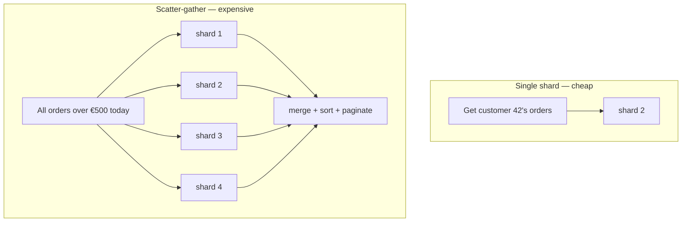

> Replication scales reads. Only partitioning scales writes. And the partition key you pick
> today is the constraint you live with for years.

| | |
|---|---|
| **Module** | [03 — Scalability](/modules/scalability/README) |
| **Prerequisites** | [00-05 Consistency models](/modules/foundations/05-consistency-models-cap-and-pacelc), [03-01 Stateless services](/modules/scalability/01-stateless-services-and-horizontal-scaling) |
| **Also known as** | sharding, horizontal partitioning, data distribution |
| **Category** | Scalability |

---

## 1. The problem

ShopFlow has 40 million orders and takes 600 writes/s at peak. One database server holds it
all. The symptoms arrive in order:

- The working set no longer fits in RAM, so reads hit disk and p99 quadruples.
- Write throughput is capped by one machine's disk and one WAL.
- The nightly backup takes six hours.
- A schema migration on the `orders` table would lock it for 40 minutes.
- Vertical scaling has reached the largest instance the cloud provider sells.

Adding read replicas ([03-05](/modules/scalability/05-replication)) helps reads and does nothing for any of
the above, because **every replica still holds every row and takes every write**.

## 2. In plain language

One filing cabinet for the whole company. It doesn't fit, only one person can open a drawer
at a time, and reorganising it stops all work.

Split it: A–F in one cabinet, G–M in the next, and so on. Four people file simultaneously.
Each cabinet is small enough to search quickly. Reorganising one cabinet doesn't block the
others.

The costs are immediate and permanent. "Find every document mentioning Copenhagen" now means
searching every cabinet and merging the results. Moving a document from cabinet 1 to cabinet 3
is no longer one action. And if half the company has a surname starting with S, one cabinet is
still overflowing while the others are half empty — **your choice of the alphabet as the
splitting rule determined everything, and you made it before you knew the data.**

**Where the analogy breaks down:** you can carry a folder between cabinets in one trip.
Moving data between shards while both are serving live traffic is a project.

## 3. How it works

### Partitioning strategies

| Strategy | Key → shard | Range queries | Hot spots | Rebalancing |
|---|---|---|---|---|
| **Range** | Ordered ranges (`A–F`, `G–M`) | ✅ Efficient | ❌ Sequential keys hammer one shard | Split a range |
| **Hash** | `hash(key) mod N` | ❌ Must scan all | ✅ Even | ❌ Changing N remaps everything |
| **[Consistent hash](/modules/scalability/06-consistent-hashing)** | Position on a ring | ❌ | ✅ | ✅ Only `1/N` moves |
| **Directory** | Explicit lookup table | ✅ | ✅ | ✅ Fully flexible | 
| **Geographic** | By region | ✅ Within region | Depends on population | Hard |

**Directory-based partitioning is underrated.** A lookup service mapping key → shard costs a
small cached read and gives you complete freedom to move any key anywhere, at any time. That
flexibility is worth a lot during the first resharding, which always comes sooner than
expected.

**Hash-mod-N is a trap.** It looks simplest and makes adding a shard a full data migration:
going from 4 to 5 shards moves ~80% of all rows. Use consistent hashing or a directory.

### Choosing the key — the decision that matters

Criteria, in priority order:

1. **High cardinality.** Millions of distinct values, not five.
2. **Even distribution.** No value should account for more than a small fraction of traffic.
3. **Matches the query pattern.** Most queries should be answerable from one shard.
4. **Matches the transaction boundary.** Things that must change atomically should share a
   shard.

ShopFlow options for `orders` — **a worked hypothetical.** ShopFlow's 40M orders are ~80GB
and fit comfortably on one machine, so the
[capstone](/modules/operations-and-evolution/04-capstone-designing-a-system) explicitly
rejects sharding for it. The key choice below is how you *would* decide, and the fact that
ShopFlow does not need it is itself the lesson:

| Key | Distribution | Query fit | Verdict |
|---|---|---|---|
| `order_id` (random) | ✅ Perfect | ❌ "my orders" hits every shard | Good writes, bad reads |
| `customer_id` | ✅ Good | ✅ Order history is single-shard | **Best.** Also matches the natural transaction boundary |
| `created_at` | ❌ All writes hit today's shard | ✅ Time ranges | Classic mistake |
| `status` | ❌ Five values | ❌ | Never |

`customer_id` wins because a customer's orders are the natural aggregate: they are queried
together and updated together. **The partition key should follow the aggregate boundary from
your domain model** ([08-01](/modules/microservice-architecture/01-decomposition-and-bounded-contexts)).

### The two things you give up



**Cross-shard queries.** Latency becomes the *slowest* shard's p99, and with N shards you hit
a p99 with probability `1 - 0.99^N` ([00-04](/modules/foundations/04-latency-throughput-and-back-of-envelope)).
Sorting and paginating across shards requires over-fetching from each.

**Cross-shard transactions.** Gone. Two customers on different shards cannot be updated
atomically. That is [Module 04](/modules/data-and-consistency/README), and it is a much bigger
cost than the query one.

### Hot partitions

Even with a good key, distribution is rarely uniform: one enterprise customer is 15% of
orders; one SKU is on the front page. Remedies:

- **Composite key** — `customer_id:bucket` where bucket is `hash(order_id) mod 10`, splitting
  a whale across ten shards. Costs a scatter-gather for that customer's history.
- **Shuffle sharding** — assign each tenant a random *subset* of shards. Two tenants rarely
  share the same full set, so one bad tenant affects a small, mostly-different group.
- **Dedicated shard** for known whales.
- **Cache in front** ([03-03](/modules/scalability/03-caching)) for read hot spots.

## 4. Pseudo-code

**Before — one store, one ceiling.**

```
service OrderService:
  uses orders: Store<OrderId, Order>       # one database, 40M rows, 600 writes/s
```

**The pattern — a shard router with directory-based mapping.**

```
record ShardMap:
  version: Int
  assignments: Map<ShardKeyRange, ShardId>
  migrating: Map<ShardKeyRange, (ShardId, ShardId)>   # (from, to) during a move

service ShardRouter:
  uses directory: Store<String, ShardMap>
  uses shards: Map<ShardId, Store<OrderId, Order>>
  state map_cache: ShardMap
  state map_version: Int

  every 10s:
    m = directory.get("orders")
    if m.version > map_version:
      map_cache = m; map_version = m.version

  fn shard_for(customer_id: CustomerId) -> ShardId:
    slot = hash(customer_id) mod 4096          # fixed virtual slots, NOT mod(shard_count)
    return map_cache.assignments.lookup(slot)
    # WHY 4096 fixed slots: shard count changes, slot count never does. Rebalancing
    # moves slots between shards; it never re-hashes a key. This is the single most
    # important design choice here.

  # --- Single-shard: the fast, normal path. 95% of queries should be this. ---
  async fn get_customer_orders(cid: CustomerId) -> Result<List<Order>, Error>:
    s = shards[shard_for(cid)]
    return await s.query(customer_id: cid) timeout 200ms

  # --- Scatter-gather: expensive, bounded, and deliberately awkward to call. ---
  @timeout(2s)
  async fn find_orders_over(amount: Money, since: Instant, limit: Int)
      -> Result<List<Order>, Error>:
    # TRAP: to return the global top `limit`, each shard must return `limit`
    # candidates — you cannot ask for limit/N. Over-fetch, then merge.
    parallel:
      results = [s.query(total_gt: amount, since: since, limit: limit)
                 for s in shards.values()] timeout 1.5s

    if any(r.is_err() for r in results):
      # Partial results: say so rather than silently returning an incomplete answer.
      return Ok(merge(results.oks()).take(limit)) with_warning(PartialResults)

    return Ok(merge_sorted(results, by: total, desc: true).take(limit))
```

**Writes, and the transaction boundary the key bought you.**

```
service OrderService:
  uses router: ShardRouter

  handler place_order(ctx, cmd: PlaceOrder) -> Result<Order, OrderError>:
    shard = router.shards[router.shard_for(cmd.customer_id)]

    # Because we sharded by customer, everything about ONE order is on ONE shard,
    # so this stays a local transaction. A different key would have made it a saga.
    atomically on shard:
      order = Order(id: cmd.order_id, customer_id: cmd.customer_id, ...)
      shard.put(order.id, order)
      shard.append_outbox(OrderPlaced(order.id, ...))       # 04-03

    return Ok(order)

  handler transfer_credit(from: CustomerId, to: CustomerId, amt: Money)
      -> Result<Unit, Error>:
    if router.shard_for(from) == router.shard_for(to):
      atomically on router.shards[router.shard_for(from)]:
        debit(from, amt); credit(to, amt)
      return Ok(unit)

    # Different shards: no distributed transaction. This is now a saga (04-02).
    return await credit_transfer_saga(from, to, amt)
```

**Resharding without downtime — dual-write and backfill.**

```
service ShardMigration:
  # Moving slot 1234 from shard A to shard B, live.

  # Phase 1 — dual write. Both shards receive writes; A remains authoritative.
  fn write(key, value):
    match map_cache.migrating.get(slot_of(key)):
      case Some((from, to)):
        shards[from].put(key, value)
        shards[to].put(key, value)      # best effort; backfill will reconcile
      case None:
        shards[shard_for(key)].put(key, value)

  # Phase 2 — backfill historical rows.
  fn backfill(slot, from, to):
    for batch in shards[from].scan(slot, batch: 1000):
      shards[to].put_if_absent_or_newer(batch)      # idempotent: safe to re-run
      throttle(rate: 500/s)                          # don't starve live traffic

  # Phase 3 — verify, then cut over reads.
  fn cut_over(slot, from, to):
    if not checksums_match(from, to, slot): abort("mismatch")
    directory.update(slot -> to, version: map_version + 1)
    sleep(30s)                          # WHY: wait out every router's 10s map cache
    stop_dual_write(slot)
    shards[from].delete_slot(slot)      # only after a retention period, never immediately
```

## 5. Knobs and variants

| Knob | Guidance | Failure if wrong |
|---|---|---|
| Partition key | Follows the aggregate boundary | Wrong key = scatter-gather on the hot path, forever |
| Slot count | Fixed, large (1024–8192) | `mod(shard_count)` makes every rebalance a full migration |
| Shard count | Start with 4–8; grow by splitting slots | Too few: hot shards. Too many: operational burden, worse tails |
| Shard size | ≤ a few hundred GB | Large shards are slow to back up, restore and rebalance |
| Map refresh | 5–30s, with version checks | Stale maps route to the wrong shard during migration |
| Scatter-gather limit | Cap fan-out and total latency | Unbounded fan-out = one slow shard stalls everything |
| Hot-tenant policy | Composite key, shuffle shard, or dedicate | Ignoring it means one customer caps your capacity |

## 6. Challenges and failure modes

- **The wrong key, discovered late.** The most expensive mistake in this course. Changing the
  partition key is a full data migration plus a rewrite of every query. Prototype the key
  against real access patterns *before* committing.
- **Hot partitions.** Even distribution of *keys* is not even distribution of *traffic*. A
  celebrity user, an enterprise tenant, a front-page SKU. Monitor per-shard load, not just
  per-shard size.
- **Cross-shard transactions.** Gone, permanently. Every operation spanning shards becomes a
  saga or an eventual-consistency problem.
- **Scatter-gather tail latency.** With 16 shards, a request touching all of them hits a p99
  on some shard 15% of the time. Cross-shard queries are always slower than the sum suggests.
- **Rebalancing under load.** Backfill competes with live traffic. Throttle it, and expect it
  to take days.
- **Secondary indexes.** An index on a non-partition-key column is either local (must query
  every shard) or global (a distributed index with its own consistency problems).
- **Uneven growth.** Shards sized correctly at launch diverge as some customers grow.
  Rebalancing is not a one-off project; it is an ongoing operation.
- **Referential integrity is gone.** No foreign keys across shards. Orphans must be prevented
  by application logic and detected by reconciliation.

## 7. Alternatives

- **Vertical scaling.** Modern machines handle far more than people assume. Cheaper than
  sharding by a wide margin.
- **[Read replicas](/modules/scalability/05-replication).** If the pressure is reads, this is simpler and
  keeps everything else intact.
- **Functional partitioning.** Split by *table*, not by row: move orders to one database and
  the catalogue to another. Much simpler and often sufficient — and it is what
  [database-per-service](/modules/microservice-architecture/03-database-per-service)
  already gives you.
- **Archival / tiering.** Move rows older than 18 months to cold storage. Often shrinks the
  hot dataset by 90% for a fraction of the effort.
- **Distributed SQL** (Spanner, CockroachDB, Vitess, Citus). The database shards for you and
  keeps cross-shard transactions. Real cost per transaction, real operational burden, and it
  removes the hardest part of this lesson.

## 8. Trade-offs

| Advantage | Disadvantage |
|---|---|
| Write throughput scales with shard count | Cross-shard transactions disappear |
| Working set per shard fits in memory | Cross-shard queries are slow and complicated |
| Backups, restores and migrations are per-shard | Rebalancing is a permanent operational activity |
| Failure of one shard affects `1/N` of customers | Hot partitions cap you well below theoretical capacity |
| Enables per-tenant isolation | The partition key is effectively irreversible |

## 9. Complexity introduced

- **Operational.** N databases to monitor, back up, patch and migrate; a shard map to keep
  consistent; per-shard load dashboards; a rebalancing runbook that has actually been used.
- **Cognitive.** Every query needs a shard key or an explicit scatter-gather. Engineers must
  know which operations are single-shard, and the answer changes the design of features.
- **Failure surface.** Hot shards, stale routing maps, partial results, orphaned rows,
  migration inconsistencies.
- **Testing.** Requires multi-shard test environments, tests for cross-shard behaviour and
  partial failure, and a rehearsed migration.

## 10. Related concepts

- **Builds on:** [00-05 Consistency models](/modules/foundations/05-consistency-models-cap-and-pacelc), [03-01 Stateless services](/modules/scalability/01-stateless-services-and-horizontal-scaling)
- **Composes with:** [03-06 Consistent hashing](/modules/scalability/06-consistent-hashing), [03-05 Replication](/modules/scalability/05-replication) (shard *and* replicate), [05-05 Scatter-gather](/modules/messaging-and-eip/05-splitter-aggregator-and-scatter-gather)
- **Conflicts with / tension:** [04-01 Distributed transactions](/modules/data-and-consistency/01-distributed-transactions-and-two-phase-commit) — sharding is what makes them necessary and expensive
- **Contrast with:** [03-05 Replication](/modules/scalability/05-replication) — replication copies all data everywhere, partitioning splits it. They solve different problems and are usually combined
- **Leads to:** [03-05 Replication](/modules/scalability/05-replication)

## 11. Exercises

1. **Trace it.** ShopFlow shards orders by `customer_id` across 8 shards. Write the shard
   access pattern for: "my last 10 orders", "all orders shipped today", "cancel order X",
   "total revenue this month". Which are cheap and which are not?
2. **Extend it.** One B2B customer generates 15% of all orders. Design a fix, and state what
   it costs in query complexity and which existing queries it breaks.
3. **Break it.** During a slot migration, the routing map version is bumped and dual-writing
   stops 30 seconds later. Find the write that gets lost, and correct the procedure.

## 12. References

- Martin Kleppmann, *Designing Data-Intensive Applications* — Ch. 6, "Partitioning". The best treatment available.
- DeCandia et al., "Dynamo: Amazon's Highly Available Key-value Store" (SOSP 2007).
- Corbett et al., "Spanner: Google's Globally-Distributed Database" (OSDI 2012).
- Vitess documentation — resharding a live MySQL fleet.
- AWS Builders' Library, "Workload isolation using shuffle sharding".

---

**Up:** [Module 03](/modules/scalability/README) · **Previous:** [← 03-03](/modules/scalability/03-caching) · **Next:** [03-05 Replication →](/modules/scalability/05-replication)
