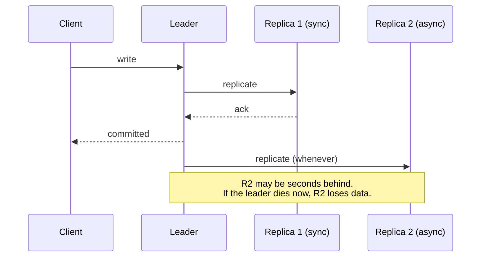

> Keeping the same data on several machines buys read capacity and survivability. It pays
> for them with lag, and lag is a user-visible product decision.

| | |
|---|---|
| **Module** | [03 — Scalability](/modules/scalability/README) |
| **Prerequisites** | [00-05 Consistency models](/modules/foundations/05-consistency-models-cap-and-pacelc), [03-04 Partitioning](/modules/scalability/04-partitioning-and-sharding) |
| **Also known as** | leader/follower, primary/replica, quorum replication, multi-leader |
| **Category** | Scalability |

---

## 1. The problem

ShopFlow's order database handles 600 writes/s and 4,000 reads/s. Two things are wrong:

- Reads and writes contend for the same buffer pool, disk and CPU. Reporting queries make
  checkout slow.
- There is exactly one copy. If that machine dies, ShopFlow is down until it is restored — and
  if the disk is lost, orders are lost.

Replication addresses both. It also introduces the bug from
[00-05](/modules/foundations/05-consistency-models-cap-and-pacelc): a customer updates
their address, is routed to a replica 40ms behind, and sees the old address. "It didn't save."

## 2. In plain language

A master ledger and several photocopies distributed around the office. Anyone can read a
photocopy, so the master isn't a queue. Only the master may be written to, so there is one
truth.

The copies are made continuously, but not instantly. Someone reading a copy sees the world as
it was a few seconds ago. Usually irrelevant. Occasionally catastrophic — if you just wrote
something and immediately read a copy, your own change is missing, and you conclude the system
lost it.

If the master burns down, you promote a photocopy. The obvious question is: **which one, and
what about the entries that were written to the master but not yet copied?** They are gone.
The gap between "written" and "copied" is exactly your data-loss window, and choosing its size
is the central decision of this lesson.

**Where the analogy breaks down:** photocopies can't disagree about which one is the master.
Machines can, and two masters accepting writes simultaneously is called split brain.

## 3. How it works

### Topologies

| Topology | Writes | Reads | Consistency | Use |
|---|---|---|---|---|
| **Single leader** | One node | Any | Strong at the leader, eventual at replicas | The default. Nearly always right |
| **Multi leader** | Several nodes | Any | Conflicts are possible and must be resolved | Multi-region writes, offline clients |
| **Leaderless (quorum)** | Any node | Any node | Tunable via R + W > N | Dynamo-style stores, high availability |

**Single leader unless you can articulate why not.** Multi-leader means concurrent conflicting
writes, and conflict resolution is a domain problem you cannot delegate to the database.

### Synchronous vs asynchronous



| Mode | Durability | Latency | Availability |
|---|---|---|---|
| **Async** | Loses recent writes on leader failure | Fast | Leader unaffected by replica health |
| **Sync (all)** | No loss | Slow: bounded by the slowest replica | One slow replica blocks all writes |
| **Semi-sync (≥1)** | No loss if one sync replica survives | Moderate | **The usual answer** |

Semi-synchronous — wait for at least one replica, let the others lag — gives most of the
durability for a fraction of the latency.

### Quorums

With N replicas, W write acks and R read responses: if `R + W > N`, any read overlaps any
write. That overlap lets a version-aware read discover the newest committed version; it does
not by itself make the operation linearizable.

| N | W | R | Property |
|---|---|---|---|
| 3 | 2 | 2 | Read/write overlap, survives 1 failure. **A common choice** |
| 3 | 3 | 1 | Fast reads, no write availability if any node is down |
| 3 | 1 | 1 | Fast everything, eventual consistency, possible lost updates |
| 5 | 3 | 3 | Survives 2 failures. Higher latency |

Quorums are not magic: `R + W > N` guarantees *overlap*, not linearizability. Concurrent
writes still need conflict resolution, and sloppy quorums with hinted handoff weaken the
guarantee further.

### Failover

Detecting leader failure and promoting a replica is a distributed algorithm with three
problems:

1. **Detection is ambiguous.** Slow ≠ dead ([00-03](/modules/foundations/03-failure-models-and-partial-failure)).
2. **Choosing the successor.** Pick the most up-to-date replica, or lose more data.
3. **Split brain.** The old leader returns and still believes it is leader. Two leaders accept
   conflicting writes. Prevented by [consensus](/modules/data-and-consistency/07-consensus-and-leader-election)
   and [fencing tokens](/modules/performance-and-concurrency/01-concurrency-control), never
   by timeouts alone.

### Session guarantees

The practical fix for the "it didn't save" bug, in order of cost:

- **Read-your-writes** — route a user to the leader for a short window after they write, or
  compare a version token ([00-05](/modules/foundations/05-consistency-models-cap-and-pacelc)).
- **Monotonic reads** — pin a session to one replica so it never goes backwards in time.
- **Bounded staleness** — refuse to serve from a replica lagging more than X.

## 4. Pseudo-code

**Before — the stale-read bug.**

```
handler update_address(cmd) -> Result<Unit, Error>:
  leader.put(cmd.customer_id, cmd.address)
  return Ok(unit)

handler get_profile(id) -> Profile:
  return replica.get(id)      # TRAP: 40ms behind. The user sees their old address.
```

**The pattern — routing that knows about lag and about the user's own writes.**

```
record ReplicaHealth:
  id: String
  lag: Duration
  healthy: Bool

service ReplicaRouter:
  uses leader: Store<K, V>
  uses replicas: List<(Store<K, V>, ReplicaHealth)>
  max_acceptable_lag: Duration = 2s

  every 1s:
    for (r, h) in replicas:
      h.lag = leader.current_position() - r.replication_position()
      h.healthy = h.lag < max_acceptable_lag
      metrics.gauge("replica.lag_ms", h.lag, tags: {replica: h.id})
      # WHY this is a paging metric: replication lag is invisible in error rates.
      # A system with 4-hour lag reports 100% success and serves yesterday's data.

  fn read(key, ctx: RequestContext) -> V:
    # 1. Read-your-writes: this session wrote recently, so it must see the leader.
    if ctx.wrote_at is Some(t) and now() - t < max_acceptable_lag * 2:
      return leader.get(key)

    # 2. Bounded staleness: only healthy replicas serve.
    fresh = replicas.filter(h.healthy)
    if fresh.is_empty():
      metrics.increment("replica.all_lagging")
      return leader.get(key)          # TRAP: a lag incident now becomes leader
                                      # overload. Shed instead if the leader is the
                                      # constraint (02-06).

    # 3. Monotonic reads: pin the session to one replica so time never runs backwards.
    return pick_by_hash(fresh, ctx.session_id).get(key)

  fn write(key, value, ctx: RequestContext) -> Result<Unit, Error>:
    leader.put(key, value)
    ctx.wrote_at = Some(now())        # travels in the session/cookie
    return Ok(unit)
```

**Semi-synchronous commit — the durability decision, made explicit.**

```
service ReplicatedStore:
  replicas: List<Replica>
  min_sync_acks: Int = 1              # semi-sync
  sync_timeout: Duration = 100ms

  async fn put(key, value) -> Result<Unit, Error>:
    entry = wal.append(key, value)             # durable on the leader first

    parallel:
      acks = [r.replicate(entry) for r in replicas] timeout sync_timeout

    if acks.successes() >= min_sync_acks:
      return Ok(unit)

    # Not enough replicas acked. Two choices, and you must pick one deliberately:
    if DURABILITY_OVER_AVAILABILITY:
      wal.rollback(entry)
      return Err(InsufficientReplicas)         # CP: refuse the write
    else:
      metrics.increment("write.unreplicated")  # AP: accept, risk loss on failover
      return Ok(unit)
```

**Failover with fencing — the part that prevents split brain.**

```
service FailoverController:
  uses consensus: Election                   # etcd/ZooKeeper/Raft — NOT a timeout

  fn on_leader_suspected():
    # WHY consensus and not "the monitor decides": a monitor cannot distinguish a
    # dead leader from a partitioned one, and guessing produces two leaders.
    lease = await consensus.campaign(role: "db-leader") timeout 10s
    if lease is None: return                 # someone else is handling it

    candidate = replicas.max_by(r => r.replication_position())
    lost = leader.last_position() - candidate.replication_position()
    if lost > 0:
      log.error("data loss on failover", entries: lost)   # be honest about it

    candidate.promote(fencing_token: lease.token)
    # Every write now carries the token. The old leader, if it returns, has a
    # LOWER token and every storage node rejects it. This is what actually
    # prevents split brain — see 10-01.
    router.point_at(candidate)
```

## 5. Knobs and variants

| Knob | Guidance | Failure if wrong |
|---|---|---|
| Replica count | 3 (survives 1 loss, tolerates 1 in maintenance) | 2 gives no headroom during maintenance |
| Sync mode | Semi-sync with ≥1 ack | Full async loses writes; full sync stalls on any slow replica |
| Max acceptable lag | 1–5s for user data | Unbounded lag serves arbitrarily old data with no signal |
| Failover detection | 10–30s, via consensus | Too fast: flapping. Too slow: long outage. Timeout-only: split brain |
| Read routing | Leader for recent writers, replicas otherwise | All-replica reads produce the "it didn't save" bug |
| Placement | Across AZs | Same-rack replicas share a failure domain |

## 6. Challenges and failure modes

- **Replication lag has no error rate.** Everything reports success while data is hours old.
  Lag must be a first-class SLI with a page attached.
- **Lag spikes under write bursts** — exactly when consistency matters most, e.g. a flash
  sale. Reads become stalest at peak.
- **The "all replicas lagging" fallback overloads the leader**, converting a consistency
  incident into an availability incident. Consider shedding instead.
- **Split brain.** Two leaders, divergent histories, manual reconciliation. Only consensus
  plus fencing prevents it.
- **Failover data loss.** Async replication guarantees some. Know the number and decide
  whether it is acceptable *before* the incident.
- **Read-your-writes across devices.** Session-scoped guarantees don't cover phone-then-laptop.
- **Replicas as backups.** They are not. Replication faithfully copies `DELETE FROM orders`
  to every replica in milliseconds. You still need
  [backups](/modules/availability-and-dr/03-disaster-recovery-rpo-and-rto).
- **Schema migrations and replication.** A migration that runs quickly on the leader can block
  a replica's single-threaded apply thread for an hour, causing enormous lag.
- **Monotonic read violations.** Without session pinning, a user refreshing sees data appear,
  disappear, and reappear as they are routed between replicas.

## 7. Alternatives

- **[Caching](/modules/scalability/03-caching).** Cheaper read scaling with explicitly chosen staleness, and
  no promotion or failover semantics — but no durability benefit at all.
- **[Partitioning](/modules/scalability/04-partitioning-and-sharding).** The answer when *writes* are the
  constraint. Replication does nothing for write throughput.
- **[CQRS](/modules/data-and-consistency/06-cqrs).** A purpose-shaped read model instead of
  a copy of the write model. More work, much better read performance for complex queries.
- **Consensus-replicated stores** (Spanner, CockroachDB, etcd). Strong consistency with no
  lag-management problem, at the cost of a quorum round trip per write.
- **Do nothing.** If reads fit on one machine and you have working backups, replication may be
  premature.

## 8. Trade-offs

| Advantage | Disadvantage |
|---|---|
| Read capacity scales with replica count | Every replica takes every write — no write scaling |
| Survives losing a machine, a rack or an AZ | Failover is a distributed algorithm that can go wrong |
| Reads can be routed near the user | Lag is user-visible and hard to communicate |
| Enables online backups and analytics without touching the leader | Async replication has a real data-loss window |
| Standard, well-understood, built into every database | Session guarantees must be implemented by the application |

## 9. Complexity introduced

- **Operational.** Replica health and lag dashboards, failover procedures that have been
  rehearsed, promotion tooling, and a clear rule about what may be read from a replica.
- **Cognitive.** Every read path needs a decision: leader or replica? Engineers get this wrong
  by default because both work in testing.
- **Failure surface.** Lag, split brain, failover loss, monotonic violations, replica-induced
  leader overload.
- **Testing.** Requires deliberately lagged replicas and rehearsed failovers. A failover that
  has never been practised does not work.

## 10. Related concepts

- **Builds on:** [00-05 Consistency models](/modules/foundations/05-consistency-models-cap-and-pacelc)
- **Composes with:** [03-04 Partitioning](/modules/scalability/04-partitioning-and-sharding) (shard, then replicate each shard), [04-07 Consensus](/modules/data-and-consistency/07-consensus-and-leader-election), [09-01 Failover](/modules/availability-and-dr/01-redundancy-and-failover)
- **Conflicts with / tension:** write latency — every durability guarantee costs a round trip
- **Contrast with:** [03-03 Caching](/modules/scalability/03-caching) — a replica is a complete, maintained copy; a cache is a partial, opportunistic one
- **Leads to:** [03-06 Consistent hashing](/modules/scalability/06-consistent-hashing)

## 11. Exercises

1. **Trace it.** Async replication, 200ms typical lag. A customer updates their address and
   is redirected to a page that reads from a replica. Write the sequence they experience. Now
   apply the `wrote_at` mechanism and rewrite it.
2. **Extend it.** ShopFlow needs analytics queries that must never affect checkout. Design the
   replica topology, the routing rule, and what happens when an analyst runs a query that lags
   the replica by 20 minutes.
3. **Break it.** N=3, W=2, R=2. A network partition isolates replica 3. Writes continue with
   W=2 on the majority side. The partition heals. Describe what replica 3 contains, how it
   catches up, and what a client reading during the catch-up window might observe.

## 12. References

- Martin Kleppmann, *Designing Data-Intensive Applications* — Ch. 5, "Replication". Essential.
- DeCandia et al., "Dynamo: Amazon's Highly Available Key-value Store" (SOSP 2007) — quorums and sloppy quorums.
- Terry et al., "Session Guarantees for Weakly Consistent Replicated Data" (1994).
- Kyle Kingsbury, *Jepsen* analyses — what replication actually does under partition.
- PostgreSQL documentation — streaming replication, `synchronous_commit` levels.

---

**Up:** [Module 03](/modules/scalability/README) · **Previous:** [← 03-04](/modules/scalability/04-partitioning-and-sharding) · **Next:** [03-06 Consistent hashing →](/modules/scalability/06-consistent-hashing)
