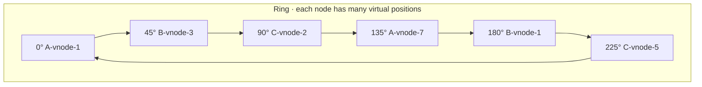

> `hash(key) mod N` means changing N moves nearly all your data. Consistent hashing means it
> moves `1/N` of it. That difference is what makes elastic clusters possible.

| | |
|---|---|
| **Module** | [03 — Scalability](/modules/scalability/README) |
| **Prerequisites** | [03-04 Partitioning](/modules/scalability/04-partitioning-and-sharding) |
| **Also known as** | the hash ring, rendezvous hashing, bounded-load hashing |
| **Category** | Scalability |

---

## 1. The problem

ShopFlow's cache cluster has 4 nodes. Keys are assigned by `hash(key) mod 4`.

One node dies. The cluster is now 3 nodes, so keys are assigned by `hash(key) mod 3`.

**Approximately 75% of all keys now map to a different node.** Not the 25% that lived on the
dead node — three quarters of everything. Every one of those keys is a cache miss. The origin
database, sized for 5% of traffic, receives 75% of 12,000 req/s and falls over.

The same happens on every scale-out. Adding a fifth node to relieve pressure causes an
80% miss rate at the exact moment you needed capacity, so the intervention makes the outage
worse.

## 2. In plain language

Imagine seating guests at numbered tables using "take your ticket number modulo the number of
tables". Add one table and almost every guest has to move. The information about where anyone
was sitting has been destroyed by changing the divisor.

Now arrange the tables around the rim of a circular room, and place each guest at a point on
the rim determined by their name. The rule is: **walk clockwise from where you stand and sit
at the first table you reach.**

Add a table. Only the guests standing between the new table and the previous table clockwise
have to move. Everyone else is untouched. Remove a table and its guests walk on to the next
one; nobody else moves.

The refinement that makes it work in practice: with only four tables placed at four points,
the arcs between them are wildly uneven — one table gets half the room. So each table is given
**many positions around the rim** ("virtual nodes"), which averages the arcs out.

**Where the analogy breaks down:** guests can be politely asked to move. Cache keys just
disappear, and moving persistent data between nodes is a real migration.

## 3. How it works

Map both keys and nodes onto the same circular hash space (0 to 2³²−1). A key belongs to the
first node encountered walking clockwise.



Adding node D inserts its virtual positions around the ring; each one takes over only the arc
immediately counter-clockwise of it. Expected data movement: `K/N` keys for N nodes — the
minimum possible.

### Virtual nodes

With one position per physical node, arc sizes vary by a factor of several; the standard
deviation of load is enormous with fewer than ~100 positions. Use **100–200 virtual nodes per
physical node**. This also enables weighting: a machine with twice the RAM gets twice the
virtual nodes.

### Bounded loads

Consistent hashing distributes *keys* evenly. It does not distribute *traffic* evenly — one
hot key still lands on one node. **Consistent hashing with bounded loads** fixes this: define
a capacity per node (e.g. `1.25 × average`), and if the target node is at capacity, walk
clockwise to the next one. Bounded imbalance, minimal movement.

### Rendezvous hashing (HRW)

An alternative achieving the same goal more simply: for a key, compute `hash(key, node)` for
every node and pick the highest. No ring, no virtual nodes, naturally weighted, and
mathematically optimal movement. Cost is `O(N)` per lookup instead of `O(log N)` — irrelevant
below a few hundred nodes.

**For most systems, rendezvous hashing is simpler and better.** The ring is more common only
because Dynamo made it famous.

### Where it is used

- **Cache clusters** — the canonical use, and the origin of the technique (Karger et al., 1997,
  for web caching).
- **Distributed databases** — Dynamo, Cassandra, Riak assign key ranges to nodes this way.
- **[Load balancing](/modules/scalability/02-load-balancing) with session affinity** — route a session to a
  consistent backend without a shared session store.
- **[Sharding](/modules/scalability/04-partitioning-and-sharding)** — as the slot-to-shard mapping.

Note the relationship to the fixed-slot scheme in [03-04](/modules/scalability/04-partitioning-and-sharding):
a fixed number of slots mapped to a variable number of nodes achieves the same goal with an
explicit, inspectable mapping. For *persistent* data, the explicit map is usually preferable —
you can move slots deliberately. For *ephemeral* data like caches, the ring's automatic
behaviour is exactly what you want.

## 4. Pseudo-code

**Before — modulo.**

```
fn node_for(key: String) -> Node:
  return nodes[hash(key) mod nodes.size]
  # TRAP: nodes.size changes → ~(N-1)/N of all keys remap.
  # 4 → 3 nodes remaps 75% of keys. 4 → 5 remaps 80%.
```

**The pattern — a hash ring with virtual nodes.**

```
record VirtualNode:
  position: Int              # point on the ring, 0 .. 2^32-1
  physical: NodeId

service HashRing:
  vnodes_per_node: Int = 150
  state ring: SortedList<VirtualNode> = []

  fn add_node(id: NodeId, weight: Float = 1.0):
    count = int(vnodes_per_node * weight)     # weighting: bigger machines, more vnodes
    for i in 0..count:
      ring.insert(VirtualNode(position: hash(id + "#" + i), physical: id))

  fn remove_node(id: NodeId):
    ring.remove_where(v => v.physical == id)

  fn node_for(key: String) -> NodeId:
    p = hash(key)
    v = ring.first_at_or_after(p) ?? ring.first()     # wrap around the circle
    return v.physical

  # Replication: the next R DISTINCT physical nodes clockwise.
  fn nodes_for(key: String, replicas: Int) -> List<NodeId>:
    out = []
    for v in ring.iterate_from(hash(key)):
      if v.physical not in out:
        out.append(v.physical)
        if out.size == replicas: break
    return out
    # TRAP if you skip the distinctness check: with 150 vnodes per node, the next
    # three ring positions are frequently the SAME physical node, so all three
    # "replicas" share one machine and one failure domain.
```

**Bounded loads — because even key distribution is not even load distribution.**

```
service BoundedHashRing extends HashRing:
  load_factor: Float = 1.25              # a node may carry 25% above average
  state load: Map<NodeId, Int> = {}

  fn node_for(key: String) -> NodeId:
    capacity = ceil(load_factor * total_load() / node_count())
    for v in ring.iterate_from(hash(key)):
      if load.get(v.physical) < capacity:
        load.increment(v.physical)
        return v.physical
    return ring.first_at_or_after(hash(key)).physical    # all full: place anyway
    # COST: a key's owner now depends on current load, so lookups need shared
    # load state or per-client approximation. Only worth it under real skew.
```

**Rendezvous hashing — same guarantees, much less machinery.**

```
fn weighted_score(key: String, node: Node) -> Float:
  # Standard weighted-HRW transform. This is lesson-local algorithm detail, not DSPL API.
  u = hash_to_unit_interval(key + node.id)  # deterministic uniform value in (0, 1)
  return -natural_log(u) / node.weight

fn node_for(key: String, nodes: List<Node>) -> Node:
  return nodes.min_by(n => weighted_score(key, n))
  # O(N) per lookup, no ring, no virtual nodes, optimal movement on membership
  # change, and weighting falls out naturally. For N < ~500, prefer this.
```

**In use — a cache client that survives node loss.**

```
service CacheClient:
  state ring: HashRing
  uses discovery: DiscoveryClient

  every 5s:
    live = discovery.resolve("cache-cluster")
    for n in live - ring.nodes():   ring.add_node(n.id)
    for n in ring.nodes() - live:   ring.remove_node(n.id)
    # One node lost out of 8 → ~12.5% of keys remap → ~12.5% miss rate spike,
    # not 87.5%. The origin absorbs that; it could not absorb the alternative.

  async fn get(key: String) -> Option<Value>:
    primary = ring.node_for(key)
    try:
      return await nodes[primary].get(key) timeout 50ms
    catch TimeoutError, ConnectionError:
      # Fall to the next node clockwise. It won't have the value (cache miss),
      # but it will populate, so the failure is self-healing.
      backup = ring.nodes_for(key, replicas: 2).last()
      return await nodes[backup].get(key) timeout 50ms
```

## 5. Knobs and variants

| Knob | Guidance | Failure if wrong |
|---|---|---|
| Virtual nodes per node | 100–200 | <20: load imbalance of 30%+ between nodes |
| Hash function | Fast, well-distributed (MurmurHash, xxHash) | Poor distribution clusters positions and skews arcs |
| Replica selection | Next R **distinct** physical nodes | Ignoring distinctness puts all replicas on one machine |
| Load bound | 1.1–1.5× average | Tight bounds cause frequent displacement; loose ones don't help |
| Ring vs rendezvous | Rendezvous below ~500 nodes | Ring's complexity is only justified at large N |
| Membership propagation | Seconds, with a version | Nodes with different ring views disagree about ownership |

## 6. Challenges and failure modes

- **Ring disagreement.** Two clients with different membership views send the same key to
  different nodes. For caches this is a miss; for a database it is a lost write. Persistent
  stores need agreed membership via [consensus](/modules/data-and-consistency/07-consensus-and-leader-election).
- **Hot keys still hot.** Consistent hashing balances keys, not traffic. One SKU on the front
  page still saturates one node. Bounded loads, or a local cache in front.
- **Cascading removal.** A node is overloaded and ejected; its keys move to the next node
  clockwise, which is now overloaded and ejected; and so on around the ring. Bounded loads and
  ejection limits prevent it.
- **Replicas on one machine.** The distinctness bug above. Worse in rack-aware setups where
  the next three distinct nodes may share a rack.
- **Data movement is not free for persistent stores.** Adding a node to a cache is instant.
  Adding a node to Cassandra streams gigabytes and takes hours; the ring only tells you *what*
  to move.
- **Weighted nodes and heterogeneous hardware.** Nodes with different capacities need
  proportional virtual nodes, and getting this wrong silently overloads the small machines.
- **A cold new node.** It immediately owns `1/N` of keys, all of which are misses. Adding a
  node to relieve load briefly increases origin load. Ramp it in.

## 7. Alternatives

- **Explicit slot map** ([03-04](/modules/scalability/04-partitioning-and-sharding)). Fixed slots, an explicit
  slot→node table. Deliberate, inspectable, movable one slot at a time. **Better for
  persistent data**; consistent hashing is better for ephemeral data.
- **Rendezvous hashing.** Simpler, optimal, weighted. Prefer it unless N is large.
- **Range partitioning.** When you need ordered scans. Different problem, different tool.
- **A central directory.** A lookup service with total freedom. Adds a dependency on the read
  path; solved with caching.
- **Client-side replication of everything.** For small datasets, put the whole thing on every
  node. No partitioning problem at all.

## 8. Trade-offs

| Advantage | Disadvantage |
|---|---|
| Membership changes move `1/N` of keys, not `(N-1)/N` | More complex than modulo, and easy to implement subtly wrong |
| Nodes can be added and removed continuously | Balances keys, not load — hot keys need extra work |
| Weighting for heterogeneous hardware is natural | Requires virtual nodes to be even remotely balanced |
| No central coordinator needed | Clients must agree on membership, or they disagree about ownership |
| Deterministic: any client computes the same answer | Ring state must be propagated and versioned |

## 9. Complexity introduced

- **Operational.** Per-node key-count and load monitoring to detect imbalance; membership
  propagation to watch; a ramp-in procedure for new nodes.
- **Cognitive.** "Which node owns this key?" is now a computation rather than a lookup, which
  makes debugging harder — provide a tool that answers it.
- **Failure surface.** Ring disagreement, cascading removal, replicas colocated, hot keys,
  cold-node miss spikes.
- **Testing.** Needs a distribution test (add/remove nodes, assert ≤ `1/N` movement and
  acceptable load variance) and a test that replicas land on distinct physical nodes.

## 10. Related concepts

- **Builds on:** [03-04 Partitioning](/modules/scalability/04-partitioning-and-sharding)
- **Composes with:** [03-03 Caching](/modules/scalability/03-caching), [03-05 Replication](/modules/scalability/05-replication), [03-02 Load balancing](/modules/scalability/02-load-balancing) (as an affinity strategy)
- **Conflicts with / tension:** [03-02 Load balancing](/modules/scalability/02-load-balancing) — key affinity and even load pull in opposite directions; bounded loads are the compromise
- **Contrast with:** explicit slot maps — automatic and implicit versus deliberate and inspectable
- **Leads to:** [Module 04 — Data and consistency](/modules/data-and-consistency/README)

## 11. Exercises

1. **Trace it.** 8 cache nodes, 12,000 req/s, 95% hit rate. One node dies. Compute the origin
   load spike under `mod N` and under consistent hashing. Which of the two does the origin
   survive?
2. **Extend it.** Add rack awareness: `nodes_for(key, 3)` must return three nodes in three
   different racks. Write it, and state what it costs in balance.
3. **Break it.** A ring with 10 virtual nodes per physical node and 4 physical nodes. Estimate
   the ratio between the busiest and least busy node. Then explain why increasing to 150
   vnodes fixes it, in terms of arc lengths.

## 12. References

- Karger et al., "Consistent Hashing and Random Trees" (STOC 1997) — the original.
- DeCandia et al., "Dynamo: Amazon's Highly Available Key-value Store" (SOSP 2007) — virtual nodes in production.
- Mirrokni, Thorup, Zadimoghaddam, "Consistent Hashing with Bounded Loads" (Google, 2016).
- Thaler & Ravishankar, "Using Name-Based Mappings to Increase Hit Rates" (1998) — rendezvous hashing.
- Damian Gryski, "Consistent Hashing: Algorithmic Tradeoffs" — an excellent practical comparison.

---

**Up:** [Module 03](/modules/scalability/README) · **Previous:** [← 03-05](/modules/scalability/05-replication) · **Next:** [Module 04 — Data and consistency →](/modules/data-and-consistency/README)
