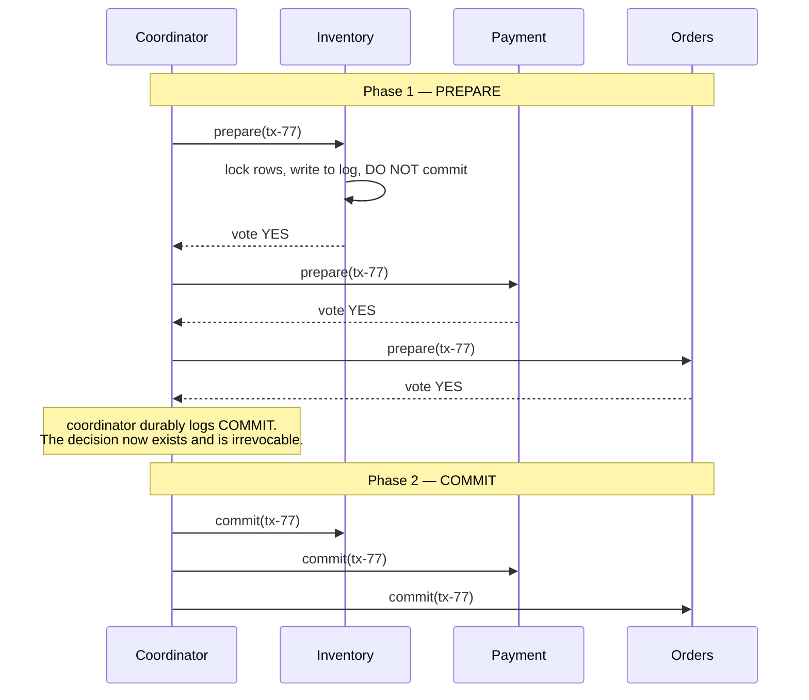

> The obvious solution to cross-service atomicity. Understand it thoroughly, then understand
> exactly why you are usually not going to use it.

| | |
|---|---|
| **Module** | [04 — Data and consistency](/modules/data-and-consistency/README) |
| **Prerequisites** | [00-03 Failure models](/modules/foundations/03-failure-models-and-partial-failure), [00-05 CAP](/modules/foundations/05-consistency-models-cap-and-pacelc) |
| **Also known as** | 2PC, XA transactions, atomic commit, three-phase commit |
| **Category** | Consistency |

---

## 1. The problem

Placing a ShopFlow order must do three things: reserve stock, charge the card, create the
order. They live in three services with three databases.

In the monolith this was one transaction. Now, if the charge succeeds and stock reservation
fails, the customer has paid for something they will not receive. If stock is reserved and
the charge fails, inventory is held for an order that will never exist.

The natural instinct is to want a transaction that spans all three. That instinct has a name,
a protocol, and forty years of production experience showing why it is a trap.

## 2. In plain language

A property chain. Three sales must complete simultaneously — nobody can sell until they can
buy. A solicitor coordinates.

**Phase 1 (prepare):** the solicitor asks each party "are you ready and committed to
proceed?" Each checks their finances, signs, and promises: *I will complete if you say so, and
I will not back out.* Making that promise costs them something real — their money is now
frozen and they cannot accept a better offer.

**Phase 2 (commit):** once everyone has promised, the solicitor says "complete", and all three
complete.

The failure mode is exactly the one that makes 2PC unattractive. Everyone has promised, and
then **the solicitor has a heart attack.** No party can proceed — they promised not to back
out. No party can complete — nobody said to. Their money stays frozen indefinitely. They
cannot ask each other, because the only party who knew the outcome is unavailable, and asking
around cannot distinguish "the solicitor decided commit and died" from "the solicitor decided
abort and died".

**Where the analogy breaks down:** people eventually give up and take legal action. Database
locks just sit there, holding rows nobody else can touch.

## 3. How it works



**Phase 1 — prepare.** The coordinator asks every participant to prepare. A participant that
votes YES has made an irrevocable promise: it has written enough to durable storage that it
can commit even after a crash, and it holds locks until told what to do. A single NO vote
aborts everything.

**Phase 2 — commit or abort.** The coordinator durably records the decision, then tells
everyone. Participants must obey and must retry until they succeed.

### Why it blocks

If the coordinator fails after participants have voted YES but before they hear the decision,
participants are **stuck**. They cannot commit (perhaps the decision was abort) and cannot
abort (they promised). They hold locks until the coordinator returns.

This is not an implementation flaw. It is a proven property, and the precise statement
matters because §7 appears to contradict it: **no atomic commit protocol can be non-blocking
when the decision rests with a single participant that may fail and stay failed.** Three-phase
commit removes blocking only by assuming synchronous networks with bounded delays — an
assumption that [00-02](/modules/foundations/02-fallacies-of-distributed-computing) says is
false.

**What consensus-backed 2PC changes, and what it does not.** Replacing the single coordinator
with a fault-tolerant group (Spanner, CockroachDB) does not repeal the result — it removes its
precondition. The decision no longer rests with one fallible node, so a coordinator *machine*
failing no longer strands anyone: the group elects a new leader and the recorded decision
survives. What remains: the group is still unavailable without a quorum, every decision costs
a consensus round trip, and participants still hold locks for the protocol's duration. The
blocking moves from "until a human resurrects the coordinator" to "until a quorum is
reachable" — a very large improvement, and not the same as free.

### The costs, concretely

| Cost | Detail |
|---|---|
| **Availability** | Requires *every* participant up and reachable. Five at 99.9% gives 99.5% |
| **Latency** | Two round trips plus two durable log writes, before the caller gets an answer |
| **Locks held** | For the whole protocol duration, not just the local work. Contention rises sharply |
| **Blocking** | Coordinator failure freezes participants indefinitely |
| **Coupling** | Participants must implement XA or equivalent. Most modern services, queues and cloud APIs do not |
| **No partial progress** | Cannot proceed if any participant is slow |

That last row is the killer for microservices: 2PC turns N independent services into one
availability unit, which is the precise opposite of why they were split.

### When 2PC is still right

- Within one database across multiple tables — this is just a local transaction, and it is
  free.
- Between a small number of co-located, highly available resources: two databases in the same
  datacentre, owned by one team, on a low-volume path.
- Where correctness is legally mandatory and a compensating action is not acceptable (some
  financial settlement, some regulatory recording).
- Modern distributed databases (Spanner, CockroachDB) run 2PC *internally* over
  consensus-replicated participants — which removes the blocking problem, because each
  participant is itself a fault-tolerant group. **This is 2PC done right, and it works.**

## 4. Pseudo-code

**The protocol.**

```
enum Vote: YES | NO
enum Decision: COMMIT | ABORT

service TransactionCoordinator:
  uses log: Store<TxId, TxRecord>              # MUST be durable and highly available
  participants: List<Client<Participant>>

  async fn execute(tx: TxId, ops: Map<Participant, Operation>) -> Result<Unit, Error>:

    # ---------- PHASE 1: PREPARE ----------
    log.put(tx, TxRecord(state: PREPARING, participants: ops.keys()))

    votes = []
    for (p, op) in ops:
      try:
        v = await p.prepare(tx, op) timeout 5s
        votes.append(v)
      catch TimeoutError:
        votes.append(NO)        # a timeout is treated as NO — safe, and it means a
                                # single slow participant aborts everyone's work

    if any(v == NO for v in votes):
      log.put(tx, TxRecord(state: ABORTED))
      for p in ops.keys(): spawn retry_forever(() => p.abort(tx))
      return Err(Aborted)

    # ---------- THE POINT OF NO RETURN ----------
    # Once this write completes, the transaction WILL commit. Every participant
    # must eventually apply it. This durable write is the entire protocol.
    log.put(tx, TxRecord(state: COMMITTED))

    # ---------- PHASE 2: COMMIT ----------
    for p in ops.keys():
      spawn retry_forever(() => p.commit(tx))   # forever: they promised, they must obey
    return Ok(unit)

  # Recovery after a coordinator crash. Everything depends on this working.
  on start:
    for tx in log.scan(state: PREPARING):
      # We crashed before deciding. Nobody was told to commit, so abort is safe.
      log.put(tx.id, TxRecord(state: ABORTED))
      for p in tx.participants: spawn retry_forever(() => p.abort(tx.id))
    for tx in log.scan(state: COMMITTED):
      # We crashed after deciding. Participants may be blocked. Finish the job.
      for p in tx.participants: spawn retry_forever(() => p.commit(tx.id))


service InventoryService:  # a participant
  uses stock: Store<Sku, StockLevel>
  uses prepared: Store<TxId, PreparedWork>

  handler prepare(tx: TxId, op: Operation) -> Vote:
    if not can_satisfy(op): return NO
    atomically:
      acquire_locks(op.keys)                    # held until phase 2. THIS is the cost.
      prepared.put(tx, PreparedWork(op, locks: op.keys, at: now()))
    return YES
    # We are now committed to being able to commit. We cannot unilaterally abort.

  handler commit(tx: TxId) -> Unit:
    w = prepared.get(tx)
    if w is None: return unit                   # idempotent: already applied
    atomically:
      apply(w.op)
      prepared.delete(tx)
      release_locks(w.locks)
    return unit

  # The blocking problem, made visible.
  every 1m:
    for w in prepared.scan():
      if now() - w.at > 5m:
        # TRAP: we cannot resolve this ourselves. Unilaterally aborting could
        # violate atomicity if the coordinator decided COMMIT. All we can do is
        # ask, and if the coordinator is gone, escalate to a human.
        log.error("in-doubt transaction blocking locks", tx: w.tx, age: now() - w.at)
        metrics.gauge("tx.in_doubt", prepared.count())
        outcome = await coordinator.status(w.tx) timeout 5s   # may fail forever
```

**The alternative, for comparison.** Same business operation, no 2PC — this is
[04-02](/modules/data-and-consistency/02-saga), shown here only to make the contrast concrete.

```
handler place_order(ctx, cmd) -> Result<Order, OrderError>:
  # Each step commits locally and immediately. No locks are held across services.
  # Every call is still bounded by the caller's deadline (02-01).
  reservation = await inventory.reserve(ctx, cmd.lines)?     # committed
  try:
    receipt = await payments.charge(ctx, cmd)?               # committed
  catch:
    await inventory.release(ctx, reservation.id)             # compensate
    return Err(PaymentFailed)
  orders.put(order)                                          # committed
  return Ok(order)
  # Trade: for a brief window, stock is reserved and payment has not happened.
  # The system is temporarily inconsistent and eventually correct — which is
  # almost always an acceptable trade, and 2PC's alternative is unavailability.
```

## 5. Knobs and variants

| Variant | What it changes | Verdict |
|---|---|---|
| **2PC** | Baseline | Blocking on coordinator failure |
| **3PC** | Adds a pre-commit phase to avoid blocking | Requires synchronous network assumptions. Not used in practice |
| **Paxos/Raft-backed commit** | Coordinator is a consensus group | Removes blocking. This is what Spanner does. Correct and expensive |
| **XA** | The standard API for 2PC across heterogeneous resources | Widely implemented, widely disabled, poor operational story |
| **Presumed abort** | No log record for aborts | Fewer writes; standard optimisation |
| **Read-only optimisation** | Read-only participants drop out after phase 1 | Meaningful saving |
| Prepare timeout | 1–10s | Too long: locks held. Too short: healthy transactions abort |
| In-doubt timeout | Alert, never auto-resolve | Auto-aborting an in-doubt transaction can break atomicity |

## 6. Challenges and failure modes

- **Coordinator failure = blocked participants.** The defining problem. Locks held, rows
  unavailable, and no participant can safely decide alone.
- **The coordinator is a single point of failure** whose availability must exceed that of the
  whole transaction. Making it fault-tolerant means consensus, which means you have built
  Spanner.
- **Lock contention explodes.** Locks are held for the protocol's duration — hundreds of
  milliseconds instead of a few — so throughput on hot rows collapses.
- **Heterogeneous participants.** Message brokers, cloud APIs, HTTP services and most modern
  databases either don't support XA or support it poorly. In practice you cannot enlist the
  systems you most want to.
- **Cascading unavailability.** Every participant must be up. Adding a participant lowers the
  availability of the whole operation.
- **In-doubt transactions accumulate silently** until a table is unusable and someone
  discovers a two-week-old prepared transaction holding locks.
- **Nested/chained coordinators** multiply every problem.
- **It does not give you isolation across services** for free either — participants may use
  different isolation levels, so the composition's semantics are unclear.

## 7. Alternatives

- **[Saga](/modules/data-and-consistency/02-saga).** The mainstream answer. Local transactions plus compensations.
  Trades atomicity for availability, and accepts temporary inconsistency.
- **Redesign the boundary.** If two things must change atomically, that is strong evidence
  they belong in the same service and the same database
  ([08-01](/modules/microservice-architecture/01-decomposition-and-bounded-contexts)). This
  is usually the *correct* fix, and it is a boundary decision, not a protocol one.
- **[Outbox](/modules/data-and-consistency/03-transactional-outbox).** Solves the specific and very common case of
  "update state and publish an event atomically" with one local transaction.
- **Reservation / escrow.** Convert a distributed transaction into a lease. Reserve stock with
  an expiry; if the order doesn't complete, the reservation expires. No coordinator, no locks.
  **Frequently the best answer and frequently overlooked.**
- **Distributed SQL databases.** Let Spanner or CockroachDB do 2PC over Raft groups internally.
  You get real transactions; you pay per-transaction latency and adopt a specific database.

## 8. Trade-offs

| Advantage | Disadvantage |
|---|---|
| True atomicity across resources — all or nothing | Blocks indefinitely on coordinator failure |
| Familiar transactional semantics, no compensation logic | Availability is the product of all participants |
| No temporary inconsistency to expose to users | Locks held across network round trips; contention explodes |
| Well-specified and standardised (XA) | Poorly supported by modern services and brokers |
| Correct when participants are consensus groups | That version requires adopting a distributed database |

## 9. Complexity introduced

- **Operational.** A durable, highly available coordinator log; in-doubt transaction monitoring
  and alerting; a manual resolution runbook that someone has actually used.
- **Cognitive.** Engineers must understand prepare semantics and why a participant cannot
  unilaterally abort. This is genuinely subtle.
- **Failure surface.** Coordinator loss, in-doubt accumulation, lock contention, cascading
  unavailability, partial participant support.
- **Testing.** Must kill the coordinator between phases and assert that participants block
  rather than diverge, then verify recovery resolves them. Almost nobody tests this, which is
  why almost nobody should run 2PC.

## 10. Related concepts

- **Builds on:** [00-03 Failure models](/modules/foundations/03-failure-models-and-partial-failure), [00-05 CAP](/modules/foundations/05-consistency-models-cap-and-pacelc)
- **Composes with:** [04-07 Consensus](/modules/data-and-consistency/07-consensus-and-leader-election) — the fix for the blocking problem
- **Conflicts with / tension:** availability, and the entire premise of independently
  deployable services
- **Contrast with:** [04-02 Saga](/modules/data-and-consistency/02-saga) — the same goal with opposite trade-offs. Read
  both before choosing
- **Leads to:** [04-02 Saga](/modules/data-and-consistency/02-saga)

## 11. Exercises

1. **Trace it.** All three participants vote YES. The coordinator writes COMMIT to its log and
   crashes before sending anything. Describe the state of each participant, what a customer
   querying stock sees, and what happens when the coordinator restarts three hours later.
2. **Extend it.** Replace the single coordinator with a three-node Raft group. Which of the
   failure modes in §6 disappear, and which remain?
3. **Break it.** Inventory votes YES and then its own database crashes and restarts, losing
   nothing but its in-memory lock table. The coordinator says COMMIT. What must Inventory have
   persisted during `prepare` for this to still be correct? Find the line in the pseudo-code
   that does it.

## 12. References

- Jim Gray, "Notes on Data Base Operating Systems" (1978) — the original 2PC description.
- Bernstein, Hadzilacos, Goodman, *Concurrency Control and Recovery in Database Systems* (1987), Ch. 7.
- Pat Helland, "Life Beyond Distributed Transactions: an Apostate's Opinion" (2007) — the essential counter-argument.
- Corbett et al., "Spanner" (OSDI 2012) — 2PC over Paxos, done correctly.
- Martin Kleppmann, *Designing Data-Intensive Applications* — Ch. 9, "Atomic Commit and Two-Phase Commit".

---

**Up:** [Module 04](/modules/data-and-consistency/README) · **Previous:** [← Module 03](/modules/scalability/README) · **Next:** [04-02 Saga →](/modules/data-and-consistency/02-saga)
