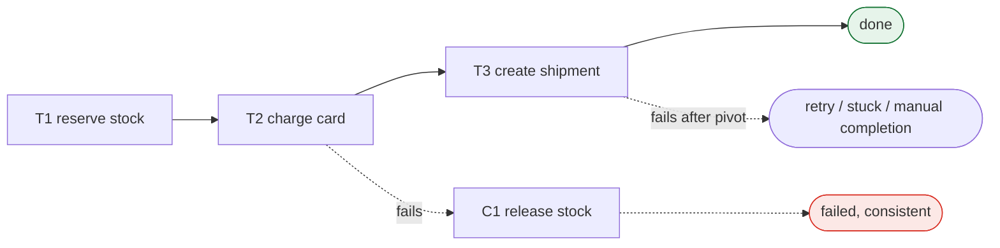

> A sequence of local transactions, each with an undo. You give up atomicity and get
> availability, and you pay for it by designing what "undo" means for every step.

| | |
|---|---|
| **Module** | [04 — Data and consistency](/modules/data-and-consistency/README) |
| **Prerequisites** | [04-01 2PC](/modules/data-and-consistency/01-distributed-transactions-and-two-phase-commit), [01-03 Idempotency](/modules/communication/03-delivery-guarantees-and-idempotency) |
| **Also known as** | long-running transaction, process manager, compensating transaction |
| **Category** | Consistency |

---

## 1. The problem

Placing a ShopFlow order requires reserving stock, charging a card, and creating a shipment,
across three services with three databases.
[2PC](/modules/data-and-consistency/01-distributed-transactions-and-two-phase-commit) would make this atomic and
would require all three services to be simultaneously available, hold locks across the whole
flow, and block indefinitely if the coordinator died.

We want the business outcome to be correct without any of that. Specifically: if the card is
declined after stock is reserved, the reservation must be released — and it must be released
even if the Order Service crashes between the decline and the release.

## 2. In plain language

Booking a holiday: a flight, a hotel, and a car. No travel agent can hold all three
simultaneously, so you book them one at a time. Each booking is final the moment you make it.

Then the car company has nothing available. You cannot un-ring the bell on the flight and the
hotel — those bookings happened. What you do is **cancel** them: a new, forward action that
compensates for the earlier one.

Two things fall out of that, and they are the whole pattern.

First, cancelling is not the same as never having booked. The airline may keep a fee. There is
a record of the booking and the cancellation. **A compensation is semantically an undo, not
literally one.**

Second, between booking the flight and cancelling it, **the world could see a booking that
was going to be cancelled**. Someone looking at the airline's system would see a passenger who
is not really going. That temporary wrongness is the price, and it must be acceptable to the
business before you choose this pattern.

**Where the analogy breaks down:** you remember what you booked. A crashed service does not,
which is why saga state must be durable before any step runs.

## 3. How it works

A saga is a sequence of local transactions T₁…Tₙ. Each Tᵢ has a compensating transaction Cᵢ
that semantically undoes it. If Tₖ fails, run Cₖ₋₁, Cₖ₋₂ … C₁ in reverse.



### Orchestration vs choreography

| | **Orchestration** | **Choreography** |
|---|---|---|
| Control | A central orchestrator calls each step | Each service reacts to the previous one's event |
| Flow is | Explicit, in one place, readable | Emergent, spread across services |
| Coupling | Orchestrator knows every participant | Participants know only events |
| Debugging | Query the orchestrator's state | Reconstruct from traces across N services |
| Adding a step | Change the orchestrator | Add a subscriber, change nothing else |
| Failure handling | Centralised, straightforward | Each service must know its own compensation triggers |
| Risk | The orchestrator becomes a god object | Nobody can answer "what happens when an order is placed?" |

**Use orchestration for anything with more than three steps or any real error handling.** The
ability to look at one file and see the whole flow is worth a great deal at 3am. Use
choreography for simple, additive fan-outs where steps are genuinely independent.

### The three kinds of step

Classifying each step is the actual design work:

- **Compensatable** — can be undone (reserve stock → release stock). Must come *first*.
- **Pivot** — the point of no return. After this, the saga must go forward. Charging the card
  is often the pivot.
- **Retriable** — cannot fail permanently; retry until it succeeds (send confirmation email,
  create shipment record). Must come *after* the pivot.

**Order your steps compensatable → pivot → retriable.** If a retriable step could fail
permanently after the pivot, you have a saga that can get stuck in an inconsistent state with
no way out.

### "Pivot" does not mean "has no compensation"

A distinction worth making precisely, because ShopFlow's example blurs it if you read quickly.

|  | Can it be undone? | Is it the pivot? |
|---|---|---|
| Reserve stock | Yes, freely — release it | No. Compensatable |
| **Charge card** | **Yes, but at real cost** — a refund is a new transaction, the fee is not returned, and the customer sees both entries | **Yes** |
| Dispatch physical goods | No, in any meaningful sense | Would be, if it came earlier |
| Create shipment record | Not undone — retried until it succeeds | No. Retriable |

The pivot is not "the first irreversible step". It is **the step after which you have decided
to go forward rather than back**, and that is a business decision as much as a technical one.
Charging a card is *technically* compensatable; ShopFlow makes it the pivot because refunding a
customer who successfully placed an order is a worse outcome than completing the order.

Two consequences follow, and both are visible in the code below:

- The pivot **may still carry a compensation**, used when the saga fails *at or before* it.
  What must never happen is compensating the pivot because something *after* it failed.
- A step whose compensation is genuinely impossible must come **after** the pivot and be
  `RETRIABLE`. If you find yourself wanting to compensate a post-pivot step, the pivot is in
  the wrong place.

### Semantic locks

Between T₁ and the end, the system is visibly inconsistent. Mitigate with a **semantic lock**:
mark the affected entity as in-progress (`PENDING_PAYMENT`, `reserved`) so other readers know
not to treat it as final. That is why `Reservation` exists in ShopFlow rather than directly
decrementing stock: reserving is a compensatable, expirable semantic lock over a decrement
that is not.

## 4. Pseudo-code

**Before — no saga, no recovery.**

```
handler place_order(cmd) -> Result<Order, OrderError>:
  r = await inventory.reserve(cmd.lines)?
  try:
    receipt = await payments.charge(cmd)?
  catch:
    await inventory.release(r.id)          # TRAP: if WE crash here, stock is
    return Err(PaymentFailed)              # reserved forever. No durable state,
                                           # so nothing can resume the compensation.
  ...
```

**The pattern — an orchestrator with durable state.**

```
enum SagaStatus: RUNNING | COMPENSATING | COMPLETED | FAILED | STUCK

record SagaState:
  id: UUID
  order_id: OrderId
  customer_id: CustomerId
  lines: List<OrderLine>          # the saga's own copy of what it needs — a step
  total: Money                    # must never re-read another service to act
  status: SagaStatus
  current_step: Int
  completed_steps: List<StepResult>
  attempts: Map<Int, Int>
  updated_at: Instant

# The three kinds are the design, so they are a field rather than a convention.
enum StepKind:
  COMPENSATABLE     # can be undone cheaply. Must come before the pivot
  PIVOT             # the point of no return. Exactly one, and it is the boundary
  RETRIABLE         # after the pivot. Must eventually succeed; cannot be undone

record StepResult:
  step_index: Int
  reservation_id: Option<ReservationId>       # whatever the step produced that its
  payment_id: Option<PaymentId>               # compensation will need to undo it
  completed_at: Instant

record Step:
  name: String
  kind: StepKind
  # `async` and bounded, like every remote call in this course (02-01).
  action: async (SagaState) => Result<StepResult, Error>
  # The compensation receives BOTH: the saga (for its id, used as the idempotency
  # key) and the step's own result (for what it produced). Passing only the result
  # is a common mistake — the compensation then has no stable key to be idempotent
  # with, and a retried compensation refunds twice.
  compensation: Option<async (SagaState, StepResult) => Result<Unit, Error>>
  max_attempts: Int = 5

service OrderSaga:
  uses sagas: Store<UUID, SagaState>
  uses inventory: Client<InventoryService>
  uses payments: Client<PaymentService>
  uses shipping: Client<ShippingService>

  fn steps() -> List<Step>:
    return [
      # --- COMPENSATABLE: cheap to undo. All of these come before the pivot. ---
      Step(name: "reserve_stock", kind: COMPENSATABLE,
           action: async (s) => await inventory.reserve(
                     s.order_id, s.lines,
                     idempotency_key: s.id + ":reserve") timeout 500ms,
           compensation: async (s, r) => await inventory.release(
                     r.reservation_id,
                     idempotency_key: s.id + ":release") timeout 500ms),

      # --- PIVOT: the boundary. Nothing after this may be compensated away. ---
      Step(name: "charge_card", kind: PIVOT,
           action: async (s) => await payments.charge(
                     s.order_id, s.total,
                     idempotency_key: s.id + ":charge") timeout 2s,
           compensation: async (s, r) => await payments.refund(
                     r.payment_id,
                     idempotency_key: s.id + ":refund") timeout 2s,
           max_attempts: 1),        # ambiguity here is resolved by reconciliation
                                    # (00-03), never by a blind retry

      # --- RETRIABLE: after the pivot. Must eventually succeed. No undo. ---
      Step(name: "create_shipment", kind: RETRIABLE,
           action: async (s) => await shipping.create(
                     s.order_id, idempotency_key: s.id + ":ship") timeout 1s,
           compensation: None,
           max_attempts: 10),
    ]

  fn pivot_index() -> Int:
    return steps().index_where(st => st.kind == PIVOT)

  @timeout(5s)
  handler start(cmd: PlaceOrder) -> Result<OrderId, OrderError>:
    # The saga carries everything its steps need. It must never call back to
    # another service mid-flow to find out what it was supposed to be doing.
    s = SagaState(id: cmd.request_id, order_id: cmd.order_id,
                  customer_id: cmd.customer_id, lines: cmd.lines,
                  total: total_of(cmd.lines),
                  status: RUNNING, current_step: 0,
                  completed_steps: [], attempts: {}, updated_at: now())
    sagas.put(s.id, s)          # WHY first: a crash after this is recoverable.
                                # A crash before it means nothing happened. Both fine.
    spawn advance(s.id)
    return Ok(cmd.order_id)     # returns immediately; the saga runs asynchronously

  async fn advance(saga_id: UUID):
    s = sagas.get(saga_id)
    if s.status != RUNNING: return

    if s.current_step >= steps().size:
      sagas.put(saga_id, s with { status: COMPLETED })
      return

    step = steps()[s.current_step]

    match await step.action(s):
      case Ok(result):
        s = s with { completed_steps: s.completed_steps + result,
                     current_step: s.current_step + 1 }
        sagas.put(saga_id, s)      # durable progress after EVERY step
        spawn advance(saga_id)

      case Err(e) if s.attempts[s.current_step] < step.max_attempts:
        s.attempts[s.current_step] += 1
        sagas.put(saga_id, s)
        after(backoff(s.attempts[s.current_step]), () => advance(saga_id))

      case Err(e):
        # Attempts exhausted. What happens now depends ONLY on which side of the
        # pivot we are on — which is why `kind` is a field and not a convention.
        if s.current_step > pivot_index():
          # Past the pivot. Compensating would mean undoing the pivot itself,
          # and everything after it was declared RETRIABLE precisely because it
          # must not be undone. There is no correct automatic action.
          sagas.put(saga_id, s with { status: STUCK })
          alert_human("saga stuck past pivot", saga: saga_id, step: step.name, error: e)
          return
        # At or before the pivot: unwind everything completed so far.
        sagas.put(saga_id, s with { status: COMPENSATING })
        spawn compensate(saga_id)

  async fn compensate(saga_id: UUID):
    s = sagas.get(saga_id)
    for result in s.completed_steps.reversed():
      step = steps()[result.step_index]
      if step.compensation is None: continue
      # Compensations MUST be idempotent and MUST retry until they succeed.
      # There is no compensation for a failed compensation.
      await retry_forever(() => step.compensation(s, result), backoff: exponential(cap: 5m))
      # Persist progress: a crash resumes from the next compensation, in reverse order.
      s = s with { completed_steps: s.completed_steps.without(result) }
      sagas.put(saga_id, s with { status: COMPENSATING })
    sagas.put(saga_id, s with { status: FAILED })  # only after every compensation completed

  # The recovery loop: this is what makes the saga survive a crash.
  every 30s:
    if lease = election.campaign(role: "saga-recovery"):        # 04-07
      for s in sagas.query(status: [RUNNING, COMPENSATING],
                           updated_at < now() - 2m):
        # An in-flight saga that hasn't moved in 2 minutes: the instance running
        # it died. Resume. Every step is idempotent, so re-running is safe.
        spawn (s.status == RUNNING ? advance(s.id) : compensate(s.id))
```

**Choreography — the same flow with no orchestrator.**

```
service InventoryService:
  on event OrderPlaced(e):
    match reserve(e.order_id, e.lines):
      case Ok(r):  bus.publish(StockReserved(e.order_id, r.id))
      case Err(_): bus.publish(StockRejected(e.order_id))

  on event PaymentFailed(e):            # each service knows its own compensation trigger
    release_reservation_for(e.order_id)

service PaymentService:
  on event StockReserved(e):
    match charge(e.order_id):
      case Ok(p):  bus.publish(PaymentCaptured(e.order_id, p.id))
      case Err(_): bus.publish(PaymentFailed(e.order_id))

service ShippingService:
  on event PaymentCaptured(e):
    create_shipment(e.order_id)

# Notice what's missing: nowhere can you read the flow. Nobody owns "what happens
# when an order is placed". Adding a fourth step means finding every service that
# might need to compensate for it. This is why orchestration wins past three steps.
```

## 5. Knobs and variants

| Knob | Guidance | Failure if wrong |
|---|---|---|
| Orchestration vs choreography | Orchestrate past 3 steps or any error handling | Choreographed complex flows become unmaintainable |
| Step ordering | compensatable → pivot → retriable | A failing non-compensatable step after the pivot has no correct resolution |
| Compensation retries | Forever, with backoff and a cap | A failed compensation leaves permanent inconsistency |
| Recovery interval | 30s–2m | Too long: stock held. Too short: duplicate execution attempts |
| Saga timeout | Absolute deadline per saga | Without one, sagas run forever and hold semantic locks |
| Semantic lock expiry | Reservations expire (e.g. 15m) | Without expiry, a stuck saga holds inventory indefinitely |
| Stuck policy | Escalate to a human | Auto-resolving a stuck saga is guessing about money |

## 6. Challenges and failure modes

- **Lack of isolation.** Concurrent sagas see each other's intermediate states. Two sagas can
  both reserve the last unit if reservation isn't atomic. Semantic locks and
  [concurrency control](/modules/performance-and-concurrency/01-concurrency-control) are
  required, not optional.
- **Compensation that cannot fully compensate.** A refund does not undo a chargeback fee; an
  email cannot be unsent. Design steps so the irreversible ones come last.
- **Failed compensations.** The most dangerous state. Retry forever; if it still fails, you
  have real inconsistency and a human must be told.
- **The pivot in the wrong place.** If a step after the pivot can fail permanently, the saga
  can get stuck by design. Re-order or make the step genuinely retriable.
- **Non-idempotent steps.** Recovery re-runs steps. Without idempotency keys, recovery
  double-charges. [01-03](/modules/communication/03-delivery-guarantees-and-idempotency) is
  a hard prerequisite, not a nice-to-have.
- **Multiple recovery loops.** N instances all recovering the same saga. Needs
  [leader election](/modules/data-and-consistency/07-consensus-and-leader-election) or a lease per saga.
- **Long-running semantic locks.** A 15-minute reservation held by a saga stuck for 3 hours.
  Expiry is what makes this self-healing.
- **Choreography's invisible flow.** Nobody can answer what happens on `OrderPlaced` without
  grepping every repository. This is a real, common, and expensive failure.
- **Testing surface.** N steps means N failure points, each with a different expected outcome.

## 7. Alternatives

- **[2PC](/modules/data-and-consistency/01-distributed-transactions-and-two-phase-commit).** Real atomicity, no
  compensations, much lower availability.
- **Redesign the boundary.** If the steps really must be atomic, they probably belong in one
  service ([08-01](/modules/microservice-architecture/01-decomposition-and-bounded-contexts)).
  Frequently the right answer and rarely the chosen one.
- **Reservation with expiry only.** For simple two-step flows, an expiring reservation plus a
  confirm removes the need for explicit compensation entirely.
- **[Process manager / routing slip](/modules/messaging-and-eip/07-process-manager-and-routing-slip).**
  The EIP framing of the same idea, often with a workflow engine (Temporal, Camunda, Step
  Functions) providing durability and recovery for you. **If you are writing an orchestrator
  from scratch, evaluate one of these first.**
- **Accept inconsistency and reconcile.** For low-value flows, detect and fix nightly.

## 8. Trade-offs

| Advantage | Disadvantage |
|---|---|
| No distributed locks; services stay independently available | No isolation — intermediate states are visible |
| Each step commits locally and immediately | Every step needs a compensation designed and tested |
| Survives any participant being temporarily down | Compensations can fail, and then you are genuinely inconsistent |
| Scales to long-running flows (minutes, days) | Business logic is spread across steps and compensations |
| Recovery is straightforward with durable state | Requires idempotency everywhere |

## 9. Complexity introduced

- **Operational.** Saga state store; dashboards for running/stuck/compensating counts; alerts
  on stuck sagas and on saga age; a human resolution queue with an owner.
- **Cognitive.** Every developer must think in terms of compensations and intermediate states.
  "What does the customer see halfway through?" becomes a design question.
- **Failure surface.** Stuck sagas, failed compensations, concurrent-saga interference,
  duplicate execution on recovery, expired semantic locks.
- **Testing.** Every step's failure needs a test asserting the correct compensations ran.
  Also: crash the orchestrator between each pair of steps and assert recovery. This is a lot
  of tests, and skipping them means the pattern does not work.

## 10. Related concepts

- **Builds on:** [04-01 2PC](/modules/data-and-consistency/01-distributed-transactions-and-two-phase-commit), [01-03 Idempotency](/modules/communication/03-delivery-guarantees-and-idempotency)
- **Composes with:** [04-03 Outbox](/modules/data-and-consistency/03-transactional-outbox) (reliable step events), [04-04 Idempotent consumer](/modules/data-and-consistency/04-idempotent-consumer-and-inbox), [05-07 Process manager](/modules/messaging-and-eip/07-process-manager-and-routing-slip)
- **Conflicts with / tension:** isolation — sagas expose intermediate state by design
- **Contrast with:** [04-01 2PC](/modules/data-and-consistency/01-distributed-transactions-and-two-phase-commit) — atomic and unavailable vs eventually consistent and available
- **Leads to:** [04-03 Transactional outbox](/modules/data-and-consistency/03-transactional-outbox)

## 11. Exercises

1. **Trace it.** The saga completes `reserve_stock`, then the orchestrator instance is killed.
   Walk through the next three minutes: what does the recovery loop find, what does it do, and
   what does the customer see meanwhile?
2. **Extend it.** Add a fraud check between reservation and charge. It can take up to 30
   seconds, may return "manual review required", and must not block the customer's response.
   Where does it go relative to the pivot, and what is its compensation?
3. **Break it.** Two sagas for the same customer run concurrently, both reserving the last
   unit of SKU-42. Find the interleaving where both succeed. Which pattern from
   [Module 10](/modules/performance-and-concurrency/README) fixes it?

## 12. References

- Garcia-Molina & Salem, "Sagas" (SIGMOD 1987) — the original paper.
- Chris Richardson, *Microservices Patterns* — Ch. 4, the definitive modern treatment.
- Caitie McCaffrey, "Applying the Saga Pattern" (GOTO 2015).
- Hohpe & Woolf, *Enterprise Integration Patterns* — Process Manager, Routing Slip.
- Temporal / Cadence documentation — durable execution as an alternative to hand-rolled orchestration.

---

**Up:** [Module 04](/modules/data-and-consistency/README) · **Previous:** [← 04-01](/modules/data-and-consistency/01-distributed-transactions-and-two-phase-commit) · **Next:** [04-03 Transactional outbox →](/modules/data-and-consistency/03-transactional-outbox)
