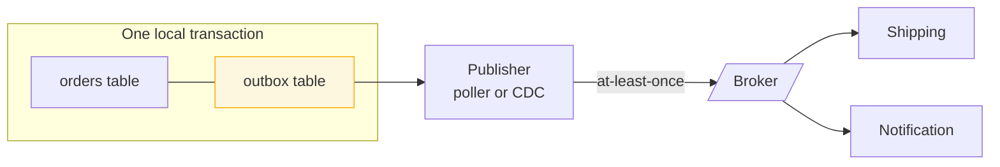

> Saving to your database and publishing to a broker are two systems. A crash between them
> loses the event silently. The outbox makes them one transaction.

| | |
|---|---|
| **Module** | [04 — Data and consistency](/modules/data-and-consistency/README) |
| **Prerequisites** | [01-02 Asynchronous messaging](/modules/communication/02-asynchronous-messaging), [04-02 Saga](/modules/data-and-consistency/02-saga) |
| **Also known as** | the dual-write problem, application outbox, change data capture (a variant) |
| **Category** | Consistency |

---

## 1. The problem

```
atomically:
  orders.put(order.id, order)     # database
bus.publish(OrderPlaced(...))     # broker — a different system
```

Four things can happen:

1. Both succeed. Fine.
2. The database write fails. Nothing published. Fine.
3. **The database commits, then the process crashes before publishing.** The order exists;
   no shipment is ever created; no confirmation email is sent. **Silent, permanent
   inconsistency.**
4. **The publish succeeds, then the transaction rolls back.** Shipping creates a shipment for
   an order that does not exist.

Reversing the order swaps case 3 for case 4. Wrapping both in a try/catch does not help: the
crash can occur between the two statements, and a crashed process runs no catch block.

Symptom: roughly one order in ten thousand has no shipment, discovered weeks later by a
customer, and reproducible only under exactly the conditions you cannot reproduce.

## 2. In plain language

A shopkeeper records a sale in the ledger and then walks to the post box to send the
warehouse a note. If they collapse on the way, the ledger says the sale happened and the
warehouse never hears. Nothing detects this — the ledger looks perfect.

The fix is old and mechanical: **write the note in the ledger itself**, as an extra line, in
the same act of writing. Later, a clerk goes through the ledger, posts every unposted note,
and ticks it off. If the shopkeeper collapses, the note is still in the ledger; when the clerk
comes round, it gets posted. If the clerk posts a note and collapses before ticking it, the
note is posted twice — which is fine, because the warehouse is set up to ignore duplicates.

That last sentence is doing important work. **The outbox converts "might be lost" into "might
be duplicated"**, and duplication is a problem you already know how to solve
([04-04](/modules/data-and-consistency/04-idempotent-consumer-and-inbox)). Loss is not.

**Where the analogy breaks down:** the clerk is a single person doing the rounds. In a
distributed system several clerks may run at once, which is where ordering and duplicates come
from.

## 3. How it works

Write the message into a table in the *same database and same transaction* as the state
change. A separate process reads unpublished rows and publishes them.



The database's own atomicity guarantees the state change and the intent-to-publish commit
together. Everything else is delivery, which is retryable.

### Two ways to get messages out

| | **Polling publisher** | **Change data capture (CDC)** |
|---|---|---|
| Mechanism | `SELECT … WHERE published = false` on a timer | Read the database's replication log |
| Latency | Poll interval (10–500ms) | Milliseconds |
| Load | A query per interval per instance | None on the database's query path |
| Complexity | ~50 lines of application code | Debezium/connector infrastructure to run |
| Ordering | Needs care | Naturally in commit order |
| Deleting published rows | Your job | Rows can be deleted immediately |

**Start with polling.** It is simple, debuggable, and adequate up to thousands of messages per
second. Move to CDC when polling latency or database load becomes a real problem.

### What it does and does not guarantee

- ✅ **No lost events.** If the state change committed, the event is durably recorded and
  **recoverable for publication**. Note the wording: the outbox guarantees the event cannot be
  *lost*, not that it will be *delivered* unaided. A record the broker permanently rejects
  (oversized, unserialisable) stops on its attempt limit and waits for an operator — see §6.
  Publication is guaranteed only in combination with a quarantine and replay policy
  ([05-06](/modules/messaging-and-eip/06-dead-letter-channel-and-poison-messages)).
- ✅ **Ordering per key**, if you publish in insertion order and partition by that key.
- ❌ **No duplicates.** A crash between publishing and marking published republishes. This is
  by design; consumers must be idempotent.
- ❌ **Not exactly-once.** See [01-03](/modules/communication/03-delivery-guarantees-and-idempotency).

### The mirror image

The receiving-side counterpart is the **inbox** ([04-04](/modules/data-and-consistency/04-idempotent-consumer-and-inbox)):
record the message id and the resulting state change in one local transaction, so processing
is idempotent. Outbox and inbox together are what people mean when they say "exactly-once
processing".

## 4. Pseudo-code

**Before — the dual write.**

```
handler place_order(cmd) -> Result<Order, OrderError>:
  order = Order(...)
  atomically:
    orders.put(order.id, order)
  bus.publish(OrderPlaced(order.id, ...))   # TRAP: a crash here loses the event
  return Ok(order)                          # permanently and silently
```

**The pattern — one transaction, then an independent publisher.**

```
record OutboxRecord:
  id: UUID
  aggregate_id: String        # the partition key — preserves per-entity ordering
  type: String
  payload: Bytes
  created_at: Instant
  published_at: Option<Instant>
  attempts: Int = 0

service OrderService:
  uses orders: Store<OrderId, Order>
  uses outbox: Store<UUID, OutboxRecord>     # SAME database as `orders`. Non-negotiable.

  handler place_order(ctx, cmd: PlaceOrder) -> Result<Order, OrderError>:
    order = Order(id: cmd.order_id, status: PAID, ...)

    atomically:
      orders.put(order.id, order)
      outbox.put(uuid(), OutboxRecord(
        aggregate_id: order.id,
        type: "OrderPlaced",
        payload: serialize(OrderPlaced(order.id, order.customer_id, order.total, now())),
        created_at: now()))
    # Both rows commit or neither does. There is no window.

    return Ok(order)


service OutboxPublisher:
  uses outbox: Store<UUID, OutboxRecord>
  uses bus: Topic<OrderEvent>
  uses election: Election

  every 100ms:
    # WHY a leader: N instances polling the same table race, publish duplicates,
    # and destroy ordering. One publisher per outbox. (Or partition by aggregate_id
    # hash and run N publishers, each owning a slice.)
    lease = election.campaign(role: "outbox-publisher")
    if lease is None: return

    with lease:
      batch = outbox.query(published_at: None, order_by: created_at, limit: 100)
      for r in batch:
        try:
          # Partitioning by aggregate_id gives per-order ordering downstream.
          bus.publish(r.payload, key: r.aggregate_id, message_id: r.id) timeout 2s

          outbox.put(r.id, r with { published_at: Some(now()) })
          # TRAP: a crash between publish and this write republishes the message.
          # That is ACCEPTED. `message_id` lets consumers dedupe (04-04).

        catch TimeoutError, ConnectionError:
          outbox.put(r.id, r with { attempts: r.attempts + 1 })
          if r.attempts > 50:
            alert("outbox record failing repeatedly", id: r.id)
          break     # WHY break, not continue: skipping ahead would publish later
                    # events for this aggregate before earlier ones. Order matters
                    # more than throughput here.

  # Bounded growth. Retain long enough to debug, not forever.
  every 1h:
    outbox.delete_where(published_at is Some and published_at < now() - 7d)

  # The alarm that catches a stalled publisher before customers do.
  every 30s:
    oldest = outbox.query(published_at: None, order_by: created_at, limit: 1)
    if oldest is Some:
      lag = now() - oldest.created_at
      metrics.gauge("outbox.lag_s", lag)
      if lag > 5m: alert("outbox publisher stalled", lag: lag)
```

**CDC — the same guarantee, no polling, no leader election.**

```
# No application change beyond writing to the outbox table. A connector tails the
# database's replication log and publishes every INSERT into `outbox`.
#
#   postgres WAL / MySQL binlog  →  Debezium  →  Kafka topic
#
# Properties that fall out for free:
#   - commit order is preserved exactly
#   - no polling load on the database
#   - latency in milliseconds
#   - the connector's offset is its "published_at", so no update-after-publish
#
# COST: a connector cluster to run, schema coupling to the outbox table, and
# duplicates on connector restart (offsets are checkpointed, not transactional).

# A tempting variant, and a trap:
#   CDC directly on the `orders` table, with no outbox at all.
#   - no application change whatsoever
#   - TRAP: consumers are now coupled to your table schema, and you publish
#     row states rather than business events. A column rename is a breaking
#     change for four teams. Keep the outbox; own your event contract.
```

**Reading your own outbox — a useful trick.**

```
handler get_order(id: OrderId) -> OrderView:
  order = orders.get(id)
  pending = outbox.query(aggregate_id: id, published_at: None)
  # Surfacing "3 events not yet propagated" makes eventual consistency visible
  # in support tools instead of mysterious.
  return OrderView(order, propagation_pending: pending.size)
```

## 5. Knobs and variants

| Knob | Guidance | Failure if wrong |
|---|---|---|
| Publisher type | Polling first, CDC when needed | Premature CDC adds infrastructure for no gain |
| Poll interval | 50–500ms | Long intervals add end-to-end latency to every event |
| Batch size | 100–1000 | Large batches increase duplicate volume on crash |
| Ordering | Stop on failure within an aggregate | Skipping ahead reorders events for that entity |
| Publisher concurrency | 1, or N partitioned by `aggregate_id` | Unpartitioned concurrency destroys ordering |
| Retention | 3–14 days after publish | Too short: no debugging. Forever: table growth |
| Same database | **Mandatory** | An outbox in a different store is the dual-write problem again |

That last row is the one people get wrong. An "outbox" in Redis while the entity is in
Postgres provides no guarantee whatsoever — it *is* the bug it was meant to fix.

## 6. Challenges and failure modes

- **Outbox in the wrong store.** As above. The whole pattern rests on one transaction.
- **Multiple publishers racing.** Duplicates and reordering. Leader election, or partitioned
  ownership.
- **Table growth.** A busy service produces millions of rows a day. Without cleanup the table
  degrades queries; with cleanup you lose debugging history. Partition the table by day and
  drop old partitions.
- **Publisher stalls silently.** No errors anywhere; the data is fine; downstream is simply
  frozen. **Alert on the age of the oldest unpublished row** — the single most important metric
  in this lesson.
- **A poison record.** One message the broker rejects (too large, bad schema) blocks the queue
  behind it if you `break` on failure. Needs a per-record attempt limit and a quarantine.
- **Ordering across aggregates is not preserved** and cannot be. Consumers must not assume
  a global order.
- **Transaction size.** Writing 50 outbox rows in one transaction makes it long and lock-heavy.
- **Duplicates are guaranteed, not hypothetical.** Any consumer without idempotency is broken.
  This is not an edge case; it happens on every deploy of the publisher.

## 7. Alternatives

- **Listen-to-yourself.** Publish to the broker first, and only apply the state change when
  your own consumer receives it. One system, no dual write. Costs: your own writes become
  asynchronous, and read-your-writes gets hard.
- **CDC on the domain table directly.** No outbox table at all. Simplest to add, and it couples
  consumers to your schema and publishes row diffs instead of business events.
- **Transactional messaging.** Some brokers (Kafka with a transactional producer plus an
  offset commit) give atomicity *within* the messaging system. Does not extend to your
  database unless that database is Kafka.
- **Event sourcing** ([04-05](/modules/data-and-consistency/05-event-sourcing)). If the event log *is* the state, there
  is no second write to be inconsistent with. The outbox problem disappears by construction.
- **Accept and reconcile.** Periodically compare orders against shipments and emit missing
  events. Necessary as a backstop regardless; insufficient as the primary mechanism.

## 8. Trade-offs

| Advantage | Disadvantage |
|---|---|
| Events can never be lost, ever | Duplicates are guaranteed; consumers must be idempotent |
| Uses only your existing database's transaction | An extra table, an extra process, extra latency |
| Per-aggregate ordering is preserved | Global ordering is not, and cannot be |
| Simple: ~50 lines, no new infrastructure | Table growth and cleanup become an operational chore |
| Works with any database and any broker | The publisher is a new component that can silently stall |

## 9. Complexity introduced

- **Operational.** A publisher process (or CDC connector); leader election; outbox lag
  monitoring and alerting; table growth management; a quarantine procedure for poison records.
- **Cognitive.** "Published" is now a separate concept from "committed", and there is a window
  between them that support and product must understand.
- **Failure surface.** Stalled publisher, duplicate storms, ordering violations from concurrent
  publishers, poison records, table bloat.
- **Testing.** Must crash between commit and publish and assert the event still arrives; and
  crash between publish and mark-published and assert the duplicate is handled downstream.

## 10. Related concepts

- **Builds on:** [01-02 Asynchronous messaging](/modules/communication/02-asynchronous-messaging)
- **Composes with:** [04-04 Idempotent consumer](/modules/data-and-consistency/04-idempotent-consumer-and-inbox) — the mandatory other half, [04-02 Saga](/modules/data-and-consistency/02-saga), [04-07 Leader election](/modules/data-and-consistency/07-consensus-and-leader-election)
- **Conflicts with / tension:** end-to-end latency — polling adds delay by design
- **Contrast with:** [04-05 Event sourcing](/modules/data-and-consistency/05-event-sourcing) — the outbox publishes events *about* state; event sourcing makes events *be* the state
- **Leads to:** [04-04 Idempotent consumer and inbox](/modules/data-and-consistency/04-idempotent-consumer-and-inbox)

## 11. Exercises

1. **Trace it.** The publisher publishes record 47 to the broker, and the process is killed
   before marking it published. Walk through what happens on restart, what Shipping receives,
   and which mechanism prevents a second shipment.
2. **Extend it.** Add per-record poison handling: three publish failures move the record to a
   quarantine table and allow the publisher to continue. What ordering guarantee did you just
   break, and for whom?
3. **Break it.** The team moves the outbox to Redis "for speed", keeping orders in Postgres.
   Write the two-line scenario that loses an event, and explain why no amount of Redis
   durability configuration fixes it.

## 12. References

- Chris Richardson, *Microservices Patterns* — Ch. 3, Transactional Outbox and Polling Publisher.
- Gunnar Morling, "Reliable Microservices Data Exchange With the Outbox Pattern" (Debezium blog).
- Debezium documentation — the outbox event router.
- Pat Helland, "Life Beyond Distributed Transactions" (2007).
- microservices.io — Transactional Outbox, Transaction Log Tailing.

---

**Up:** [Module 04](/modules/data-and-consistency/README) · **Previous:** [← 04-02](/modules/data-and-consistency/02-saga) · **Next:** [04-04 Idempotent consumer and inbox →](/modules/data-and-consistency/04-idempotent-consumer-and-inbox)
