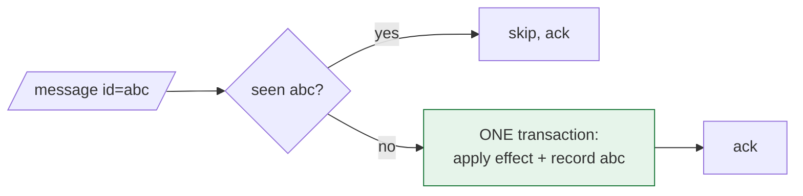

> The outbox guarantees the message arrives at least once. This is the other half: making
> sure that "at least once" has the effect of exactly once.

| | |
|---|---|
| **Module** | [04 — Data and consistency](/modules/data-and-consistency/README) |
| **Prerequisites** | [01-03 Delivery guarantees](/modules/communication/03-delivery-guarantees-and-idempotency), [04-03 Outbox](/modules/data-and-consistency/03-transactional-outbox) |
| **Also known as** | inbox pattern, message deduplication, effectively-once processing |
| **Category** | Consistency |

---

## 1. The problem

ShopFlow's Notification Service consumes `PaymentCaptured` and emails a receipt.

The broker delivers at-least-once. Duplicates arrive because:

- The consumer processed the message and crashed before acknowledging.
- The ack was lost in the network.
- The [outbox publisher](/modules/data-and-consistency/03-transactional-outbox) crashed after publishing and
  republished on restart.
- A consumer group rebalance replayed uncommitted offsets.
- An operator replayed a [dead letter queue](/modules/messaging-and-eip/06-dead-letter-channel-and-poison-messages)
  from last Tuesday.

None of these is exotic. The last two happen on every deploy. A customer receives four
identical receipts, and in the Analytics service the same order is counted four times in
revenue.

Reordering is the sibling problem: `OrderShipped` arrives before `OrderPlaced` because they
went to different partitions, and the projection crashes or — worse — silently produces
nonsense.

## 2. In plain language

A warehouse receiving instruction slips. Each slip has a number. The clerk keeps a spike with
every number they have already actioned. A slip whose number is on the spike goes straight in
the bin.

The subtlety that makes this work: **the clerk puts the number on the spike at the same moment
they complete the work — one motion, not two.** If they file the number first and then get
interrupted, the work never happens and the system believes it did. If they do the work first
and get interrupted before filing, the work happens twice. Only doing both together is safe,
and that is exactly what a database transaction is for.

And the spike cannot grow forever. The clerk clears numbers older than a month — which is
fine, unless a slip from six weeks ago turns up. That is a real risk, and the reason
retention windows must be reasoned about rather than picked.

**Where the analogy breaks down:** the clerk sees slips in the order they arrive. A consumer
receives them in whatever order the broker felt like.

## 3. How it works

### The ladder of idempotency, again

From [01-03](/modules/communication/03-delivery-guarantees-and-idempotency), applied to
consumers. Prefer the earliest option that works:

1. **Naturally idempotent handler.** `set status = SHIPPED` is safe to repeat. `balance +=
   100` is not. Reformulating as assignment removes the problem for free.
2. **Keyed upsert.** `put_if_absent(order_id, shipment)`.
3. **Version check.** Apply only if `event.version == current.version + 1`. Handles both
   duplicates *and* reordering.
4. **Explicit inbox table.** Record the message id; skip if seen. Needed when the effect is
   external (an email, a payment) or when there is no natural key.

### The inbox



**The effect and the record must commit together.** If they are in different systems you have
recreated the dual-write problem from [04-03](/modules/data-and-consistency/03-transactional-outbox), one layer down:

- Record-then-effect → a crash between them **loses** the work permanently.
- Effect-then-record → a crash between them **duplicates** the work.

Only atomicity avoids both. When the effect is external (sending an email), atomicity is
impossible and you must pick which failure you prefer — see §6.

### Ordering

Deduplication does not give you ordering. Three approaches:

| Approach | Mechanism | Cost |
|---|---|---|
| **Partition by key** | All events for one order go to one partition, consumed in order | Concurrency limited to the partition count |
| **Version gating** | Reject `version <= current`; buffer `version > current + 1` | Buffering logic; a permanently missing event stalls the key |
| **Commutative handlers** | Design so order does not matter (set-union, max, last-writer-wins by timestamp) | Constrains the data model |

Partition-by-key plus version gating is the standard combination: the partition gives you
order in the normal case, the version gate protects you when it fails.

## 4. Pseudo-code

**Before — every duplicate is a real effect.**

```
service AnalyticsService:
  on event PaymentCaptured(e):
    revenue.increment(day_of(e.occurred_at), e.amount)
    # TRAP: increment is not idempotent. Four deliveries = 4× revenue, reported
    # to the board, discovered in the quarterly close.
```

**The pattern — an inbox, committed with the effect.**

```
record InboxRecord:
  message_id: UUID
  consumer: String            # scope: two consumers must each process the message once
  processed_at: Instant

service AnalyticsService:
  uses inbox: Store<(UUID, String), InboxRecord>
  uses revenue: Store<Date, Money>          # SAME database as inbox. Required.

  @at_least_once
  on event PaymentCaptured(e, meta: MessageMeta):
    key = (meta.message_id, "analytics")

    if inbox.get(key) is Some:
      metrics.increment("inbox.duplicate")
      return                                # already applied; ack and move on

    atomically:
      # Insert first, inside the transaction. If a concurrent consumer inserted
      # the same key, this transaction fails and rolls back the increment too.
      if not inbox.put_if_absent(key, InboxRecord(meta.message_id, "analytics", now())):
        return
      revenue.increment(day_of(e.occurred_at), e.amount)
    # Effect and record commit together. A crash anywhere rolls back both, and
    # redelivery reapplies both. Correct under every interleaving.

  every 1h:
    # Window must exceed: max broker retention + max DLQ age + max replay horizon.
    inbox.delete_where(processed_at < now() - 30d)
```

**The cheaper options, which you should reach for first.**

```
service ShippingService:
  uses shipments: Store<OrderId, Shipment>

  @at_least_once
  on event PaymentCaptured(e):
    # Option 2: keyed insert. No inbox, no cleanup job, no retention window.
    shipments.put_if_absent(e.order_id, Shipment(order_id: e.order_id, status: PENDING))

  @at_least_once
  on event OrderShipped(e):
    # Option 1: assignment, not mutation. Reapplying is a no-op by construction.
    shipments.update(e.order_id, { status: SHIPPED, tracking: e.tracking_number })
```

**Version gating — handles duplicates *and* reordering.**

```
record OrderProjection:
  order_id: OrderId
  status: OrderStatus
  version: Int

# The buffer must record WHEN it buffered, or the sweeper below cannot exist.
record BufferedEvent:
  event: Event
  order_id: OrderId
  version: Int
  buffered_at: Instant

service OrderProjector:
  uses view: Store<OrderId, OrderProjection>
  uses buffer: Store<(OrderId, Int), BufferedEvent>

  @at_least_once
  on event OrderStatusChanged(e):
    p = view.get(e.order_id) ?? OrderProjection(e.order_id, DRAFT, version: 0)

    if e.version <= p.version:
      return                                # duplicate or stale. Silently correct.

    if e.version > p.version + 1:
      # A gap: an earlier event hasn't arrived. Buffer rather than apply out of order.
      buffer.put((e.order_id, e.version),
                 BufferedEvent(e, e.order_id, e.version, buffered_at: now()))
      metrics.increment("projection.gap", tags: {order: e.order_id})
      return
      # TRAP: if the missing event NEVER arrives, this key stalls forever.
      # The sweeper below is not optional.

    atomically:
      view.put(e.order_id, p with { status: e.status, version: e.version })
      buffer.delete((e.order_id, e.version))
    drain_buffer(e.order_id, e.version)     # apply any now-contiguous buffered events

  every 1m:
    # `query` on the declared buffered_at — NOT `scan`, which takes a key prefix
    # and cannot express a time predicate at all.
    for be in buffer.query(buffered_at_lt: now() - 5m):
      # A gap that has persisted for 5 minutes is a lost event, not a late one.
      alert("projection gap persisting", order: be.order_id, expected: be.version)
      # Recovery: re-request from the source, or replay the log from the last
      # known-good offset. Never silently skip — that leaves a wrong projection.
```

**The external-effect case, where atomicity is impossible.**

```
service NotificationService:
  uses inbox: Store<(UUID, String), InboxRecord>
  uses email: Client<EmailProvider>

  @at_least_once
  on event PaymentCaptured(e, meta):
    key = (meta.message_id, "notifications")
    if inbox.get(key) is Some: return

    # We CANNOT commit "email sent" and the email itself atomically. So we choose,
    # explicitly, which failure we prefer — and we shrink the window.
    #
    # Chosen: send first, record after. Risk = duplicate email on a crash in between.
    # Rejected: record first, send after. Risk = customer NEVER receives a receipt.
    # For a receipt, a rare duplicate is far better than a rare omission.
    #
    # The window is then closed by pushing idempotency into the provider:
    await email.send(to: e.customer_email, template: "receipt",
                     idempotency_key: meta.message_id) timeout 5s
    # The provider must retain this key for at least our replay/retry horizon. If it cannot,
    # retain our own delivery evidence and reconcile uncertain sends instead.

    inbox.put(key, InboxRecord(meta.message_id, "notifications", now()))
```

## 5. Knobs and variants

| Knob | Guidance | Failure if wrong |
|---|---|---|
| Dedup mechanism | Natural > keyed upsert > version > inbox table | An inbox where an upsert would do is pure overhead |
| Inbox scope | `(message_id, consumer)` | Global scope means the first consumer blocks the second |
| Inbox storage | Same DB as the effect | Different store = dual-write problem again |
| Retention | ≥ broker retention + DLQ age + replay horizon | Too short: an old replay duplicates. Common bug |
| Ordering strategy | Partition by key + version gate | Neither alone is sufficient |
| Gap handling | Buffer, then alert and recover | Silently skipping leaves a permanently wrong projection |
| External effects | Push the key to the provider | Otherwise you are choosing between loss and duplication |

## 6. Challenges and failure modes

- **Inbox and effect in different stores.** The single most common implementation error, and it
  reintroduces exactly the bug the pattern exists to fix.
- **Recording before doing.** Converts duplicates into silent loss — strictly worse. If you
  must choose, prefer duplication and make the effect idempotent downstream.
- **Retention shorter than the replay horizon.** A DLQ message replayed after 30 days finds no
  inbox record and reapplies. Align the windows explicitly and write them down.
- **Inbox table growth.** Every message ever processed. Needs partitioning and pruning; it can
  easily become larger than the domain data.
- **Message id not stable across republishing.** If the publisher generates a new id on retry,
  dedup fails completely. The id must come from the outbox record, not from the send call.
- **Concurrent consumers of the same message.** Two instances process a duplicate
  simultaneously. `put_if_absent` inside the transaction is what makes this safe; checking
  first and inserting later is a race.
- **Permanently stalled keys from version gaps.** One lost event freezes an entity's projection
  forever. The sweeper and alert are mandatory.
- **Deduplication is not commutativity.** It stops the same message being applied twice. It
  does nothing about two *different* messages arriving in the wrong order.

## 7. Alternatives

- **Broker-level deduplication.** Some brokers dedupe by producer id and sequence number
  (Kafka's idempotent producer, SQS FIFO's 5-minute dedup window). Useful, bounded, and does
  not cover the consumer crashing after processing.
- **Kafka transactions.** Exactly-once *within* a read-process-write loop entirely inside
  Kafka. Genuinely works for stream processing; does not extend to an external database or an
  email provider.
- **Idempotency at the effect.** If the downstream API accepts an idempotency key, push the
  problem to it. Best available answer for external effects.
- **Accept duplicates and reconcile.** For tolerant domains — analytics with approximate
  counts, non-critical notifications — nightly deduplication is cheaper.
- **[Event sourcing](/modules/data-and-consistency/05-event-sourcing) with deterministic replay.** Version numbers come
  built in, and gap detection is a property of the log.

## 8. Trade-offs

| Advantage | Disadvantage |
|---|---|
| At-least-once delivery becomes effectively-once processing | An extra table, an extra transaction, an extra cleanup job |
| Safe replay: DLQ recovery and reprocessing become routine | Retention windows must be aligned across systems |
| Version gating catches reordering as well as duplication | Gaps stall a key and need active monitoring |
| Cheap when the handler is naturally idempotent | The inbox table can outgrow the domain data |
| Works with any broker and any database | Cannot make an external side effect atomic |

## 9. Complexity introduced

- **Operational.** Inbox growth and pruning; duplicate-rate and gap metrics; alerts on
  persistent gaps; a documented replay procedure that accounts for the retention window.
- **Cognitive.** Every consumer author must ask "what if this runs twice, and what if this
  arrives before its predecessor?" Two questions, both easy to forget.
- **Failure surface.** Silent loss from record-before-effect, races between concurrent
  consumers, stalled keys, retention misalignment.
- **Testing.** Deliver every message twice, and deliver a pair out of order, in every
  integration test. If the suite doesn't do this, the pattern is unverified.

## 10. Related concepts

- **Builds on:** [01-03 Delivery guarantees](/modules/communication/03-delivery-guarantees-and-idempotency), [04-03 Outbox](/modules/data-and-consistency/03-transactional-outbox)
- **Composes with:** [04-02 Saga](/modules/data-and-consistency/02-saga) (every step needs this), [05-06 Dead letter channel](/modules/messaging-and-eip/06-dead-letter-channel-and-poison-messages), [04-06 CQRS](/modules/data-and-consistency/06-cqrs)
- **Conflicts with / tension:** throughput — an extra write per message, and ordering limits concurrency
- **Contrast with:** [04-03 Outbox](/modules/data-and-consistency/03-transactional-outbox) — send side vs receive side of the same guarantee
- **Leads to:** [04-05 Event sourcing](/modules/data-and-consistency/05-event-sourcing)

## 11. Exercises

1. **Trace it.** Two instances of Analytics receive the same `PaymentCaptured` 3ms apart.
   Walk both through the code. Which line prevents double counting, and what property must
   `inbox` and `revenue` share for it to hold?
2. **Extend it.** Notification Service must guarantee that a customer receives *exactly* one
   receipt. Given that email sending is not transactional, write the strongest guarantee you
   can actually provide and state the assumption it rests on.
3. **Break it.** Inbox retention is 30 days, broker retention is 7 days, and DLQ messages are
   kept for 90 days. Construct the sequence that produces a duplicate effect, then fix the
   configuration.

## 12. References

- Chris Richardson, *Microservices Patterns* — Idempotent Consumer.
- Pat Helland, "Idempotence Is Not a Medical Condition" (ACM Queue, 2012).
- Confluent, "Exactly-Once Semantics Are Possible: Here's How Kafka Does It" — and its scope limits.
- Hohpe & Woolf, *Enterprise Integration Patterns* — Idempotent Receiver, Message Sequence.
- AWS SQS FIFO documentation — deduplication IDs and the 5-minute window.

---

**Up:** [Module 04](/modules/data-and-consistency/README) · **Previous:** [← 04-03](/modules/data-and-consistency/03-transactional-outbox) · **Next:** [04-05 Event sourcing →](/modules/data-and-consistency/05-event-sourcing)
