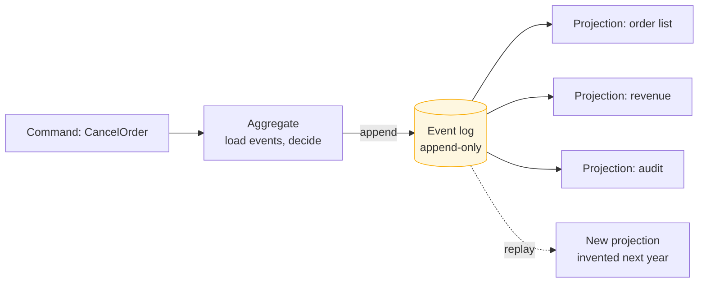

> Store the events, not the state. You gain a perfect audit trail and time travel, and you
> take on schema versioning that lasts forever.

| | |
|---|---|
| **Module** | [04 — Data and consistency](/modules/data-and-consistency/README) |
| **Prerequisites** | [04-03 Outbox](/modules/data-and-consistency/03-transactional-outbox), [01-04 Schema evolution](/modules/communication/04-serialization-and-schema-evolution) |
| **Also known as** | event log as source of truth, append-only domain model |
| **Category** | Consistency |

---

## 1. The problem

ShopFlow's `orders` table stores current state. An order is `CANCELLED`. Nobody can answer:

- Who cancelled it, when, and why?
- What was the total before the customer removed two items?
- Was the address changed before or after the payment?
- Why did the fraud score change three times last Tuesday?

An `UPDATE` destroys the previous value. Audit tables are bolted on afterwards, are always
incomplete, and drift from the real state because nothing enforces that they match.

A second, subtler problem: the business asks "how many orders were abandoned after adding a
payment method?" — a question about *behaviour*, not state. The current-state table cannot
answer it, and it cannot answer it *retrospectively* either. The data was never recorded.

## 2. In plain language

A bank statement versus a balance.

The balance says €1,240. The statement says how you got there: salary, rent, coffee, refund.
From the statement you can always compute the balance. From the balance you can compute
nothing.

If a transaction was applied wrongly, the balance-only bank must guess at a correction. The
statement-based bank appends a reversal, and both entries remain visible — which is what
auditors require and what makes the mistake explicable.

And a property nobody expects until they need it: a new question can be answered about the
past. "How much did I spend on coffee in 2019?" is answerable from a statement even though
nobody was tracking coffee in 2019. The balance-only bank can never answer it, no matter what
it builds next year.

**Where the analogy breaks down:** a bank statement has one fixed format. Your events change
shape as the business evolves, and every old event must remain readable forever.

## 3. How it works

State is derived, never stored as the truth:

```
current_state = fold(apply, initial_state, events)
```



### The write path

1. Load the aggregate's events (or a snapshot plus subsequent events).
2. Fold them into current state.
3. Validate the command against that state.
4. Append new events — **with an expected-version check**, which is how concurrency control
   works here ([10-01](/modules/performance-and-concurrency/01-concurrency-control)).

### Snapshots

Replaying 40,000 events per load is untenable. Every N events (typically 100–1,000), store a
snapshot; loading reads the latest snapshot plus subsequent events. Snapshots are a cache —
they must be discardable and rebuildable, and they must never be the source of truth.

### Versioning is forever

You cannot migrate history. An event written in 2021 with a `total` field must remain
readable in 2027. Two strategies:

- **Upcasting** — transform old event shapes into new ones on read. A chain of small
  transformations, one per version.
- **Weak schema** — additive-only changes with defaults for missing fields
  ([01-04](/modules/communication/04-serialization-and-schema-evolution)).

Both work. Both mean the *union* of every event version your system ever emitted is part of
your permanent codebase.

### GDPR and the append-only log

"Delete all my data" versus "never delete anything" is a genuine conflict, and it must be
solved at design time:

- **Crypto-shredding** — store personal data encrypted, keep the key elsewhere, and delete the
  key. The events remain; the payload becomes unreadable. The standard answer.
- **Keep personal data out of events**, holding only a reference to a mutable record.
- **Rewrite the stream** — copy events, omitting or redacting, and switch over. Expensive and
  disruptive, and it breaks the append-only property you built everything on.

**Decide this before you start.** Retrofitting crypto-shredding onto years of plaintext events
is a very bad quarter.

## 4. Pseudo-code

**Before — state-based, history destroyed.**

```
handler cancel_order(cmd: CancelOrder) -> Result<Unit, Error>:
  o = orders.get(cmd.order_id)?
  orders.put(cmd.order_id, o with { status: CANCELLED })
  # TRAP: the previous status, the reason, the actor, and the time are all gone.
```

**The pattern — events as the truth.**

```
event OrderCreated:      order_id, customer_id, occurred_at, schema_version: Int = 1
event ItemAdded:         order_id, sku, qty, unit_price, occurred_at
event ItemRemoved:       order_id, sku, qty, occurred_at
event OrderSubmitted:    order_id, total, occurred_at
event PaymentCaptured:   order_id, payment_id, amount, occurred_at
event OrderCancelled:    order_id, reason, cancelled_by, occurred_at

record OrderAggregate:
  id: OrderId
  status: OrderStatus
  lines: Map<Sku, OrderLine>
  total: Money
  version: Int              # = number of events applied

  # The fold. Pure, deterministic, and the ONLY way state comes into existence.
  fn apply(e: Event) -> OrderAggregate:
    match e:
      case OrderCreated(c):    return this with { id: c.order_id, status: DRAFT, version: version+1 }
      case ItemAdded(a):       return this with { lines: lines.add(a.sku, a.qty, a.unit_price),
                                                  total: total + a.unit_price * a.qty,
                                                  version: version+1 }
      case ItemRemoved(r):     return this with { lines: lines.remove(r.sku, r.qty), ... }
      case OrderSubmitted(s):  return this with { status: PENDING_PAYMENT, version: version+1 }
      case PaymentCaptured(p): return this with { status: PAID, version: version+1 }
      case OrderCancelled(c):  return this with { status: CANCELLED, version: version+1 }
      case _:
        # An aggregate event we cannot interpret makes this replay untrustworthy.
        # Upcast known old schemas; quarantine/fail unknown state-bearing types loudly.
        raise UnknownEventType(type_of(e))


service OrderStore:
  uses events: Log<OrderId, Event>
  uses snapshots: Store<OrderId, (Int, OrderAggregate)>
  snapshot_every: Int = 100

  async fn load(id: OrderId) -> OrderAggregate:
    (from_version, agg) = snapshots.get(id) ?? (0, OrderAggregate.empty())
    for (_, e) in events.read(stream: id, from: from_version):
      agg = agg.apply(upcast(e))          # upcasting happens on read, always
    return agg

  async fn append(id: OrderId, expected_version: Int, new_events: List<Event>)
      -> Result<Unit, ConflictError>:
    # Optimistic concurrency: this single check replaces all locking.
    # If another writer appended since we loaded, we lose and retry.
    if not events.append_if_version(stream: id, expected: expected_version, new_events):
      return Err(ConflictError)

    new_version = expected_version + new_events.size
    if new_version mod snapshot_every == 0:
      spawn snapshots.put(id, (new_version, await load(id)))   # async: a cache, not the truth
    return Ok(unit)


service OrderCommandHandler:
  uses store: OrderStore

  @timeout(1s)
  handler cancel_order(ctx, cmd: CancelOrder) -> Result<Unit, OrderError>:
    for attempt in 1..3:
      agg = await store.load(cmd.order_id)

      # Business rules are validated against the FOLDED state, not against a row.
      if agg.status == SHIPPED:  return Err(CannotCancelShipped)
      if agg.status == CANCELLED: return Ok(unit)          # naturally idempotent

      e = OrderCancelled(cmd.order_id, cmd.reason, ctx.user_id, now())

      match await store.append(cmd.order_id, expected_version: agg.version, [e]):
        case Ok(_):             return Ok(unit)
        case Err(ConflictError): continue                   # someone else won; re-read
    return Err(Contended)
```

**Projections — where reads actually come from.**

```
service OrderListProjection:
  uses view: Store<CustomerId, List<OrderSummary>>
  uses checkpoint: Store<String, Offset>

  # A projection is a fold over the log into a shape optimised for one query.
  every 100ms:
    offset = checkpoint.get("order-list")
    for (o, e) in events.read_all(from: offset, limit: 500):
      atomically:
        apply_to_view(e)
        checkpoint.put("order-list", o)     # checkpoint WITH the update — 04-04
    # Rebuilding: delete the view, reset the checkpoint to 0, let it catch up.
    # This is the superpower. A projection bug is a re-run, not a data migration.

# Answering a question nobody asked when the events were written:
service AbandonmentAnalysis:
  # Replay the ENTIRE log from the beginning to build a projection that did not
  # exist when the events were recorded. Impossible with state-based storage.
  fn build():
    for (_, e) in events.read_all(from: 0):
      ...
```

**Crypto-shredding for GDPR.**

```
event CustomerRegistered:
  customer_id: CustomerId
  encrypted_pii: Bytes         # name, email, address — encrypted with a per-customer key
  key_id: String

service KeyVault:
  uses keys: Store<CustomerId, Key>

  fn forget(customer_id: CustomerId):
    keys.delete(customer_id)
    # The events remain, immutable and append-only. Their personal payload is now
    # permanently unreadable. Aggregate counts and order history survive; identity
    # does not. This satisfies erasure without breaking the log.
```

## 5. Knobs and variants

| Knob | Guidance | Failure if wrong |
|---|---|---|
| Stream granularity | One stream per aggregate | Coarse streams serialise unrelated writes; fine ones lose invariants |
| Snapshot frequency | Every 100–1,000 events | Too rare: slow loads. Too frequent: storage churn |
| Event granularity | Business-meaningful facts | `FieldChanged` events are a database log, not a domain model |
| Versioning strategy | Upcasting or weak schema — pick one | Mixing both is unmaintainable |
| Retention | Forever (that is the point) | Truncating destroys the ability to rebuild projections |
| PII strategy | Crypto-shredding, decided up front | Retrofitting is enormously expensive |
| Scope | The few aggregates that need history | Whole-system event sourcing is a well-documented way to fail |

**That last row is the most important one in this lesson.** Event sourcing is a tool for
aggregates where history, audit, or temporal queries have real value — orders, payments,
ledgers, entitlements. Applying it to a product catalogue or a user preferences table costs
enormously and buys nothing.

## 6. Challenges and failure modes

- **Event schema versioning never ends.** Every event ever emitted must remain readable. After
  five years the upcasting chain is a significant codebase in its own right.
- **You cannot fix a bad event.** Only append a corrective one. A bug that wrote wrong events
  leaves permanent wrong entries plus corrections, and every projection must handle both.
- **Replay time grows without bound.** Rebuilding a projection over 500M events takes hours or
  days. Plan for parallel replay and partial rebuilds before you need them.
- **Eventual consistency between write and read.** The command succeeds; the list view has not
  caught up. The UI must handle it ([04-06](/modules/data-and-consistency/06-cqrs)).
- **Aggregate design errors are expensive.** Choosing the wrong stream boundary means either
  losing invariants or serialising unrelated work, and changing it means rewriting streams.
- **Non-deterministic `apply`.** If folding calls `now()`, a random source, or an external
  service, replay produces different state than the original. `apply` must be pure. Always.
- **Snapshots treated as truth.** A corrupt snapshot silently poisons every subsequent load.
  Version them, and be able to discard them all.
- **Storage growth.** Millions of events per day, kept forever. Real cost, and it must be
  budgeted.
- **The learning curve.** Most teams' first event-sourced system is their worst system. This
  is not a criticism of the pattern; it is a scheduling fact.

## 7. Alternatives

- **State-based storage plus an audit table.** 80% of the audit benefit for 5% of the cost.
  **This is the right answer far more often than event sourcing is.**
- **Temporal/bitemporal tables.** Databases with built-in `SYSTEM VERSIONING` give
  point-in-time queries with ordinary SQL.
- **[Outbox](/modules/data-and-consistency/03-transactional-outbox) + event publication.** Publish events for
  integration while keeping state-based storage internally. You get event-driven architecture
  without event sourcing — and these two are constantly confused. **Most teams who say "event
  sourcing" mean this.**
- **Change data capture.** Derive a change log from the database's replication log. Retrofits
  onto existing systems with no application change.
- **Event sourcing for one aggregate only.** Use it where history is genuinely valuable and
  nowhere else. Almost always the right scope.

## 8. Trade-offs

| Advantage | Disadvantage |
|---|---|
| Complete, immutable audit trail by construction | Every event schema version must be supported forever |
| New projections can answer questions about the past | Replay time and storage grow without bound |
| Projection bugs are fixed by rebuilding, not migrating | Reads are eventually consistent with writes |
| Optimistic concurrency comes free from stream versions | No ad-hoc SQL against current state — everything needs a projection |
| Time travel and debugging by replay | Steep learning curve; first attempts usually go badly |
| Natural fit for [CQRS](/modules/data-and-consistency/06-cqrs) and event-driven integration | GDPR erasure requires deliberate design up front |

## 9. Complexity introduced

- **Operational.** Event store sizing and growth; snapshot management; projection rebuild
  procedures with known durations; projection lag monitoring.
- **Cognitive.** The largest of any pattern in this course. Aggregates, streams, folds,
  projections, upcasting, and eventual consistency all at once.
- **Failure surface.** Non-deterministic replay, corrupt snapshots, upcasting bugs, projection
  lag, stalled rebuilds, unbounded growth.
- **Testing.** Given-events → when-command → then-events is a genuinely excellent testing
  style. But you must also test upcasting for *every* historical version, and rebuilds against
  production-sized logs.

## 10. Related concepts

- **Builds on:** [04-03 Outbox](/modules/data-and-consistency/03-transactional-outbox), [01-04 Schema evolution](/modules/communication/04-serialization-and-schema-evolution)
- **Composes with:** [04-06 CQRS](/modules/data-and-consistency/06-cqrs) — nearly always used together, [10-01 Optimistic concurrency](/modules/performance-and-concurrency/01-concurrency-control)
- **Conflicts with / tension:** ad-hoc querying, GDPR erasure, and simplicity
- **Contrast with:** [01-02 Event-driven messaging](/modules/communication/02-asynchronous-messaging) — events as *communication* between services versus events as *storage*. Independent choices, constantly conflated
- **Leads to:** [04-06 CQRS](/modules/data-and-consistency/06-cqrs)

## 11. Exercises

1. **Trace it.** An order has 5 events and a snapshot at version 4. Two concurrent
   `CancelOrder` commands arrive. Walk both through `load` and `append`. Which one wins, what
   does the loser do, and what would happen without the version check?
2. **Extend it.** `ItemAdded` gains a `discount_code` field. Write the upcaster for the 40
   million existing events that lack it, and state what value it must supply and why.
3. **Break it.** `apply` for `OrderSubmitted` calls `pricing_service.current_total()` to
   recompute the total. Explain precisely what happens when a projection is rebuilt in 2027,
   and give the rule this violates.

## 12. References

- Greg Young, "CQRS and Event Sourcing" (talks and papers) — the origin of the modern framing.
- Martin Fowler, "Event Sourcing" (2005).
- Vaughn Vernon, *Implementing Domain-Driven Design* — aggregates and event storage.
- Alexey Zimarev, *Hands-On Domain-Driven Design with .NET Core* — practical event sourcing.
- Michiel Overeem et al., "An Empirical Characterization of Event Sourced Systems and Their Schema Evolution" (2021) — what actually goes wrong.
- Martin Kleppmann, "Making sense of stream processing" — logs as the unifying abstraction.

---

**Up:** [Module 04](/modules/data-and-consistency/README) · **Previous:** [← 04-04](/modules/data-and-consistency/04-idempotent-consumer-and-inbox) · **Next:** [04-06 CQRS →](/modules/data-and-consistency/06-cqrs)
