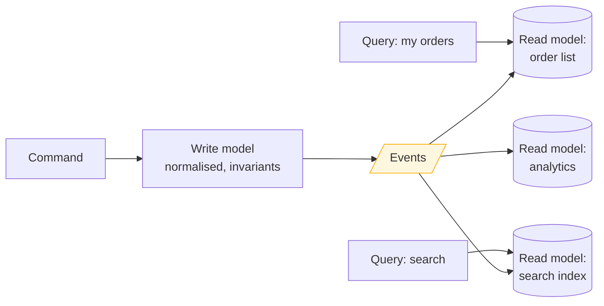

> Command Query Responsibility Segregation: separate the model you write through from the
> models you read from. The cost is staleness, and staleness is a user-experience problem.

| | |
|---|---|
| **Module** | [04 — Data and consistency](/modules/data-and-consistency/README) |
| **Prerequisites** | [04-05 Event sourcing](/modules/data-and-consistency/05-event-sourcing), [00-05 Consistency models](/modules/foundations/05-consistency-models-cap-and-pacelc) |
| **Also known as** | read model / write model separation, materialised views |
| **Category** | Consistency |

---

## 1. The problem

ShopFlow's order screen shows: order summary, customer name and tier, line items with product
images, shipment tracking, and payment status. That is a five-way join across four services'
data.

With [database per service](/modules/microservice-architecture/03-database-per-service) the
join is impossible, so the page makes five API calls and joins in the client — 400ms, five
failure modes, and a chatty interface.

Meanwhile the write side has entirely different needs: it cares about invariants ("cannot
cancel a shipped order"), needs strong consistency, and touches one order at a time.

**One model is being asked to do two incompatible jobs.** Normalise it for write correctness
and reads become expensive joins. Denormalise it for read speed and every write has to update
six places consistently.

## 2. In plain language

A library. The *shelves* are organised for the librarian: one copy of each book, in one place,
by accession number. That is the write model — precise, non-redundant, easy to keep correct.

The *catalogue* is organised for readers: by author, by subject, by title, new arrivals,
staff picks. The same book appears in five catalogues. That is fine, because the catalogues
are derived — they can be rebuilt from the shelves at any time.

Nobody thinks the catalogue is the truth. And nobody is surprised that a book shelved this
morning might not be in the printed subject index until tomorrow. **The catalogue lags, and
everyone accepts the lag because the alternative — updating five indexes before shelving the
book — would stop the library working.**

**Where the analogy breaks down:** library users are patient. A customer who clicks "cancel
order" and sees it still active two seconds later files a support ticket.

## 3. How it works

Commands change state through the write model. Queries read purpose-built read models,
updated asynchronously from the write model's events.



### Levels of CQRS

It is a spectrum, not a switch, and most systems should stop early.

| Level | Description | Cost |
|---|---|---|
| **0** | One model, one database. CRUD | None |
| **1** | Separate command and query *methods*; different DTOs | Trivial. Do this always |
| **2** | Same database, different query models (views, denormalised tables) | Small |
| **3** | Separate read database, updated asynchronously | Eventual consistency appears |
| **4** | Multiple purpose-built read stores, event-sourced write side | Full complexity |

**Level 1 is free and always correct.** Levels 3 and 4 buy real scaling and query flexibility
and cost you eventual consistency in the user interface. Do not adopt level 4 because a
conference talk described it.

### Read models are disposable

The defining property. A read model is a *derived cache* — delete it, rebuild it from the
event log or by replaying from the write model. This changes how you handle bugs: a wrong
projection is fixed by fixing the code and re-running, not by a data migration with a rollback
plan.

It also means a new read model can be added at any time, shaped for a query nobody had
thought of.

### Handling the lag

The central UX problem. The user issues a command, the response returns, they navigate to a
list — and their change isn't there. Options, in order of preference:

1. **Return the result from the command.** The write side knows what happened; send it back and
   render optimistically.
2. **Client-side merge.** Overlay the known local change on the (stale) server list.
3. **Version token.** The command returns a version; the query waits for the read model to
   reach it, up to a small budget ([00-05](/modules/foundations/05-consistency-models-cap-and-pacelc)).
4. **Synchronous projection for the critical view only.** Update one read model in the same
   transaction as the write. Breaks the purity, solves the problem, frequently correct.
5. **Show it honestly.** "Processing…" is better than a page that looks wrong.

## 4. Pseudo-code

**Before — one model, both jobs done badly.**

```
handler get_order_page(id: OrderId) -> OrderPage:
  order    = await orders.get(id)                       # normalised write model
  customer = await accounts.get(order.customer_id)      # another service
  products = await catalog.get_many(order.skus())       # another service
  shipment = await shipping.for_order(id)               # another service
  payment  = await payments.for_order(id)               # another service
  return join(order, customer, products, shipment, payment)
  # 5 sequential calls, ~400ms, and 5 things that can fail this page.
```

**The pattern — a read model shaped exactly like the page.**

```
# Denormalised on purpose. Redundant on purpose. Rebuildable on purpose.
record OrderPageView:
  order_id: OrderId
  status: OrderStatus
  placed_at: Instant
  customer_name: String          # duplicated from Accounts
  customer_tier: Tier            # duplicated from Accounts
  lines: List<LineView>          # includes product name and image URL from Catalog
  tracking_number: Option<String>
  carrier: Option<String>
  payment_status: PaymentStatus
  total: Money
  last_updated: Instant
  version: Int

service OrderPageProjection:
  uses view: Store<OrderId, OrderPageView>
  uses by_customer: Store<CustomerId, List<OrderId>>    # a second index, same data
  uses checkpoint: Store<String, Offset>

  # Each event updates only the fields it owns. No joins, ever.
  @at_least_once
  on event OrderPlaced(e, meta):
    apply_once(meta, () => {
      v = OrderPageView(order_id: e.order_id, status: PENDING_PAYMENT,
                        customer_name: e.customer_name,     # carried IN the event
                        lines: e.lines.map(to_line_view), total: e.total, version: 1)
      atomically:
        view.put(e.order_id, v)
        by_customer.append(e.customer_id, e.order_id)
    })

  @at_least_once
  on event PaymentCaptured(e, meta):
    apply_once(meta, () =>
      view.update(e.order_id, { payment_status: CAPTURED, status: PAID,
                                last_updated: now(), version: +1 }))

  @at_least_once
  on event OrderShipped(e, meta):
    apply_once(meta, () =>
      view.update(e.order_id, { status: SHIPPED, tracking_number: Some(e.tracking_number),
                                carrier: Some(e.carrier), version: +1 }))

  # Customer renames must propagate to every view that copied the name.
  # COST: this is the price of denormalisation, and it is easy to forget.
  @at_least_once
  on event CustomerRenamed(e, meta):
    apply_once(meta, () => {
      for oid in by_customer.get(e.customer_id):
        view.update(oid, { customer_name: e.new_name })
    })

  fn apply_once(meta: MessageMeta, f: () => Unit):
    atomically:
      if not inbox.put_if_absent(meta.message_id): return    # 04-04
      f()
      checkpoint.put("order-page", meta.offset)


service OrderQueryService:
  uses view: Store<OrderId, OrderPageView>

  @timeout(200ms)
  @eventually_consistent(lag: ~200ms)
  handler get_order_page(id: OrderId) -> Result<OrderPageView, Error>:
    return Ok(view.get(id)?)      # one read, no joins, ~5ms, one failure mode
```

**Closing the lag, for the one screen where it matters.**

```
service OrderCommandService:
  @timeout(2s)
  handler cancel_order(ctx, cmd: CancelOrder) -> Result<CancelResult, OrderError>:
    agg = await store.load(cmd.order_id)
    if agg.status == SHIPPED: return Err(CannotCancelShipped)

    version = await store.append(cmd.order_id, agg.version, [OrderCancelled(...)])?

    # Option 1: return the outcome so the UI can render it immediately.
    # Option 3: return the version so the next query can wait for it.
    return Ok(CancelResult(status: CANCELLED, read_version: version))

service OrderQueryService:
  handler get_order_page(id: OrderId, min_version: Option<Int>)
      -> Result<OrderPageView, Error>:
    if min_version is Some(v):
      deadline = now() + 500ms
      while now() < deadline:
        page = view.get(id)?
        if page.version >= v: return Ok(page)
        sleep(25ms)
      # Budget spent. Be honest rather than silently stale.
      return Ok(view.get(id)? with { stale: true })
    return Ok(view.get(id)?)
```

**Rebuilding — the payoff that justifies the pattern.**

```
service ProjectionRebuilder:
  fn rebuild(name: String):
    # Build into a NEW store, so the live one keeps serving throughout.
    shadow = create_store(name + "-v2")
    for (offset, e) in events.read_all(from: 0):
      project_into(shadow, e)
      if offset mod 100000 == 0: log.info("rebuild progress", offset: offset)

    # Catch up to live, then swap atomically.
    while lag(shadow) > 1s: catch_up(shadow)
    atomically: alias(name, shadow); retire(name + "-v1")
    # A projection bug is now: fix the code, rebuild, swap. No migration, no
    # rollback plan, no downtime. THIS is what CQRS buys you.
```

## 5. Knobs and variants

| Knob | Guidance | Failure if wrong |
|---|---|---|
| CQRS level | Start at 1–2; go to 3+ only with a reason | Level 4 by default is a well-known way to fail |
| Read store technology | Per query shape: SQL, search index, KV, columnar | One store for all queries defeats the point |
| Projection lag target | 100ms–2s, measured and alerted | Unmeasured lag is invisible until a customer complains |
| Lag handling | Return result from command, first | Ignoring lag produces "my change didn't save" tickets |
| Sync projection | For at most one critical view | Making them all synchronous is just a slow single model |
| Rebuild strategy | Shadow build then swap | In-place rebuild means downtime for that view |
| Denormalised references | Decide which fields propagate on change | Forgotten propagation = permanently stale names/prices |

## 6. Challenges and failure modes

- **Eventual consistency in the UI.** The single biggest source of complaints. Design the lag
  handling *before* building the projection, not after the first bug report.
- **Projection lag with no error rate.** Everything reports success while the view is an hour
  behind. Lag must be a paging metric.
- **Denormalised data going stale.** `customer_name` copied into a million order views; a
  rename must fan out to all of them. Forgetting one propagation path leaves permanent
  inconsistency.
- **Projection bugs corrupt the view silently.** Detected only when a user notices. Consistency
  checks comparing view against source are worth building.
- **Rebuild time.** A projection over 500M events may take a day. If you cannot rebuild within
  your incident tolerance, the "just rebuild it" answer is unavailable when you need it.
- **Too many read models.** Each one is code, storage, monitoring and a rebuild procedure.
  Every new one has an ongoing cost.
- **CQRS without a reason.** Level 4 on a CRUD application doubles the code and adds
  distributed-systems failure modes to a problem that had none.
- **Write-side queries.** The command side needs to read state to validate. That is fine and
  normal — do not force it through the read model, which is stale and shaped wrong.

## 7. Alternatives

- **Database views or materialised views.** Level 2 CQRS with none of the distribution.
  Frequently sufficient.
- **[Read replicas](/modules/scalability/05-replication).** Read scaling without a separate
  model. No query-shape benefit.
- **[Caching](/modules/scalability/03-caching).** Cheaper, opportunistic, and not
  rebuildable-by-design.
- **[API composition / BFF](/modules/microservice-architecture/02-api-gateway-and-backend-for-frontend).**
  Join at request time in a gateway. Simpler, always fresh, and slower with more failure modes.
  The right answer for low-traffic screens.
- **Just denormalise the write model.** Store the name alongside the order. Crude, effective,
  and much less machinery.

## 8. Trade-offs

| Advantage | Disadvantage |
|---|---|
| Reads are one lookup, shaped exactly for the query | Reads are eventually consistent with writes |
| Read and write sides scale independently | Two models to keep in sync, forever |
| Each query gets the right storage technology | Each read model is code, storage and operations |
| Projection bugs are fixed by rebuilding, not migrating | Rebuild time may exceed your incident tolerance |
| Cross-service data is joined once, offline | Denormalised copies go stale if propagation is missed |
| New queries can be added without touching the write side | The UI must handle staleness explicitly |

## 9. Complexity introduced

- **Operational.** Multiple stores to run and back up; per-projection lag dashboards and
  alerts; rebuild procedures with measured durations; consistency-check jobs.
- **Cognitive.** Two models per concept. Engineers must know which to use where, and that the
  read side is never authoritative.
- **Failure surface.** Lag, stalled projections, stale denormalised fields, corrupt views,
  rebuild failures.
- **Testing.** Projections need their own tests (events in, view out) plus consistency tests
  comparing view to source. UI tests must cover the stale-read case explicitly.

## 10. Related concepts

- **Builds on:** [04-05 Event sourcing](/modules/data-and-consistency/05-event-sourcing), [04-04 Idempotent consumer](/modules/data-and-consistency/04-idempotent-consumer-and-inbox)
- **Composes with:** [01-02 Asynchronous messaging](/modules/communication/02-asynchronous-messaging), [08-03 Database per service](/modules/microservice-architecture/03-database-per-service), [03-03 Caching](/modules/scalability/03-caching)
- **Conflicts with / tension:** read-your-writes; simplicity
- **Contrast with:** [03-03 Caching](/modules/scalability/03-caching) — a read model is durable, complete and rebuildable by design; a cache is opportunistic and partial
- **Leads to:** [04-07 Consensus and leader election](/modules/data-and-consistency/07-consensus-and-leader-election)

## 11. Exercises

1. **Trace it.** A customer cancels an order. The command succeeds; the projection is 800ms
   behind; the UI immediately navigates to the order list. Write what the customer sees, then
   apply each of the four lag-handling options and compare.
2. **Extend it.** Add a read model for "orders awaiting fraud review, sorted by value,
   filtered by region" used by 30 internal staff. Which store, which events, what lag is
   acceptable, and does it justify its ongoing cost?
3. **Break it.** `CustomerRenamed` fans out to every order view for that customer. A B2B
   customer has 400,000 orders. Describe what happens when they rename, and fix it.

## 12. References

- Greg Young, "CQRS Documents" (2010) — the definitive source.
- Martin Fowler, "CQRS" (2011) — including the warnings about overuse.
- Udi Dahan, "Clarified CQRS" (2009).
- Microsoft, "CQRS Journey" — a long, honest account of getting it wrong and then right.
- Chris Richardson, *Microservices Patterns* — Ch. 7, API composition vs CQRS views.

---

**Up:** [Module 04](/modules/data-and-consistency/README) · **Previous:** [← 04-05](/modules/data-and-consistency/05-event-sourcing) · **Next:** [04-07 Consensus and leader election →](/modules/data-and-consistency/07-consensus-and-leader-election)
