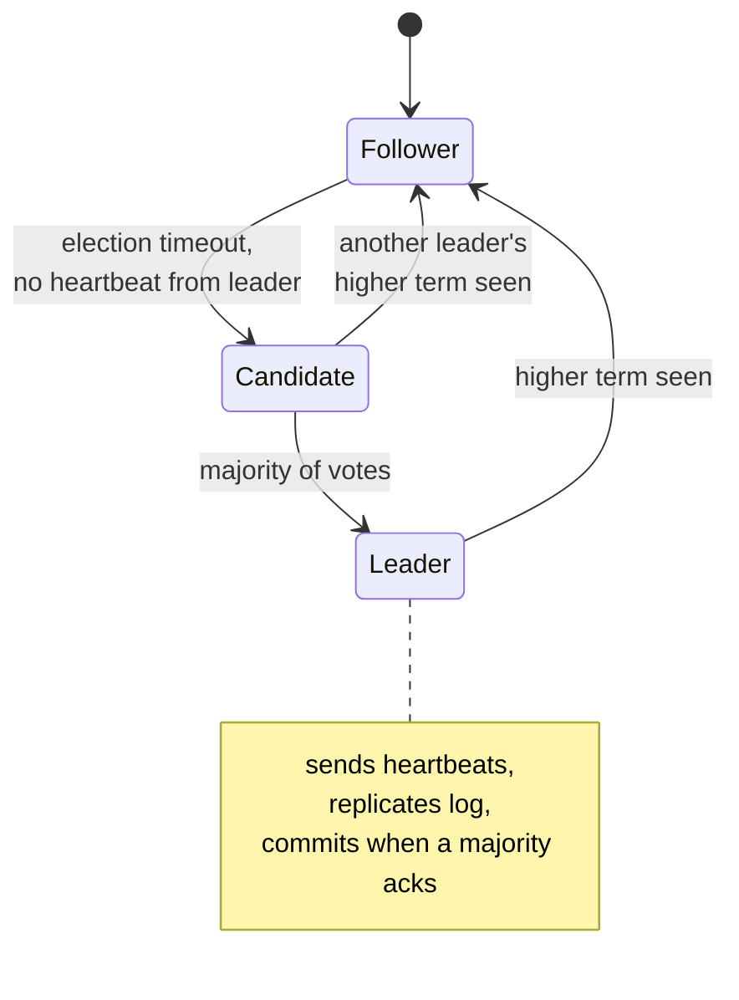

> Getting a group of unreliable machines to agree on one value. The hardest problem in the
> course, and the one you should almost never solve yourself.

| | |
|---|---|
| **Module** | [04 — Data and consistency](/modules/data-and-consistency/README) |
| **Prerequisites** | [00-03 Failure models](/modules/foundations/03-failure-models-and-partial-failure), [03-05 Replication](/modules/scalability/05-replication) |
| **Also known as** | Paxos, Raft, distributed lock, split brain prevention |
| **Category** | Consistency |

---

## 1. The problem

ShopFlow needs exactly one instance to do certain things:

- The [outbox publisher](/modules/data-and-consistency/03-transactional-outbox), or events publish twice and out of
  order.
- The nightly price import, or it runs twenty times.
- The [saga recovery loop](/modules/data-and-consistency/02-saga), or recovery races itself.
- The database leader, or two nodes accept conflicting writes.

The naive fix — a row in a table saying who the leader is, plus a timeout — fails in a
specific, expensive way. Instance A holds the lease. A's network is briefly partitioned. B
sees the lease expire and takes over. A's network heals; A has not noticed anything and
believes it is still the leader. **Two leaders.** Both publish, both import, both write. This
is split brain, and by the time you notice, the data is wrong in ways that need manual repair.

## 2. In plain language

A committee that must agree on one decision, communicating only by unreliable letters, where
members occasionally fall asleep for indeterminate periods.

The scheme that works: **majority rules, and every decision is stamped with an increasing
round number.** A proposal is accepted when more than half the committee agrees. Since two
different majorities of the same committee must share at least one member, and that member
remembers what they already agreed to, two conflicting decisions cannot both be accepted.
That overlap is the entire trick.

The round number handles the sleeper. A member who wakes after a long nap and tries to act on
round 4 is told "we are on round 9" and their instruction is discarded. **They cannot damage
anything by being late, because everyone checks the round number before obeying.**

The cost is unavoidable: nothing can be decided unless a majority is awake and reachable. With
five members and three asleep, the committee does nothing at all. It is not slow; it is
stopped. Consensus systems choose consistency over availability, deliberately, always.

**Where the analogy breaks down:** committee members know they fell asleep. A partitioned
server does not, which is why the round number must be checked by the *resource*, not by the
leader.

## 3. How it works

### The guarantees

Consensus provides: **agreement** (no two nodes decide differently), **validity** (the decided
value was proposed by someone), and **termination** (all correct nodes eventually decide, given
a majority and enough network stability).

FLP impossibility proves that termination cannot be guaranteed in a fully asynchronous network
with even one faulty process. Real algorithms sidestep this with randomised or timeout-based
leader election: they are always *safe*, and *live* whenever the network behaves.

### Raft in outline

You should be able to read this and recognise what your infrastructure is doing.



- **Terms** are monotonically increasing round numbers. Any message with a higher term
  immediately demotes the receiver.
- **Election:** a follower that hears no heartbeat becomes a candidate, increments the term,
  and requests votes. A node votes at most once per term, and only for a candidate whose log is
  at least as up to date as its own. A majority wins.
- **Replication:** the leader appends to its log and replicates. An entry is *committed* when a
  majority has stored it.
- **Safety:** a candidate needs a majority, and each voter grants its one vote only to a
  candidate whose log is at least as up to date as its own. The intersecting voter carrying a
  committed entry therefore prevents an older log from winning; a new leader has every committed
  entry.
- **Randomised election timeouts** (e.g. 150–300ms) prevent repeated split votes — jitter
  again, exactly as in [02-02](/modules/resilience/02-retries-backoff-and-jitter).

### Quorum sizes

| Nodes | Majority | Tolerates | Note |
|---|---|---|---|
| 3 | 2 | 1 failure | The standard choice |
| 5 | 3 | 2 failures | For higher availability targets |
| 4 | 3 | 1 failure | **Strictly worse than 3.** More nodes, same tolerance, slower |

Always an odd number. Even counts add latency without adding fault tolerance.

### Fencing tokens — the part that actually prevents split brain

**A lease alone is not sufficient.** The holder can be paused by GC, descheduled, or
partitioned for longer than the lease and never notice.

The fix: the lease carries a monotonically increasing token. Every write to the protected
resource includes it. **The resource rejects any token lower than the highest it has seen.** A
stale leader's writes are refused by the storage layer itself, regardless of what the stale
leader believes.

Without fencing, a distributed lock is a performance optimisation with a correctness-shaped
hole in it. With fencing, it is safe.

## 4. Pseudo-code

**Before — the lease that produces split brain.**

```
service OutboxPublisher:
  uses locks: Store<String, (String, Instant)>

  every 100ms:
    (holder, expiry) = locks.get("outbox-leader") ?? ("", epoch)
    if holder == MY_ID or now() > expiry:
      locks.put("outbox-leader", (MY_ID, now() + 30s))
      publish_batch()
    # TRAP: a 40-second GC pause. B takes the lease. A wakes, still inside
    # publish_batch(), and publishes. Two publishers, duplicate and reordered
    # events. Nothing here can detect it.
```

**The pattern — a fenced lease from a consensus service.**

```
record Lease:
  role: String
  holder: String
  token: Int              # monotonic, global per role. THE critical field.
  expires_at: Instant

service LeaderElection:
  uses consensus: Client<ConsensusService>     # etcd / ZooKeeper / Consul — not a table
  ttl: Duration = 15s
  renew_every: Duration = 5s                   # renew at ttl/3: two failures tolerated

  state lease: Option<Lease> = None

  every renew_every:
    if lease is Some(l):
      match await consensus.renew(l, ttl: ttl) timeout 2s:
        case Ok(renewed): lease = Some(renewed)
        case Err(_):
          # TRAP if you keep working here: we may have lost it. Assume we have.
          # Stopping work we still own is harmless. Continuing work we lost is not.
          lease = None
          on_leadership_lost()
    else:
      match await consensus.acquire(role, holder: MY_ID, ttl: ttl) timeout 2s:
        case Ok(l): lease = Some(l); on_leadership_gained()
        case Err(_): pass                       # someone else holds it. Fine.

  fn is_leader() -> Bool:
    return lease is Some(l) and now() < l.expires_at - CLOCK_SKEW_ALLOWANCE
    # WHY the margin: our clock and the consensus service's clock differ. Give up
    # leadership slightly early rather than slightly late.


service OutboxPublisher:
  uses election: LeaderElection
  uses outbox: Store<UUID, OutboxRecord>

  every 100ms:
    if not election.is_leader(): return
    token = election.lease.unwrap().token

    for r in outbox.query(published_at: None, limit: 100):
      # CLAIM FIRST, PUBLISH SECOND. The fenced CAS is what a zombie leader
      # fails, and it must happen BEFORE the side effect — not after it.
      if not outbox.compare_and_swap_fenced(r.id, r with { claimed_by: token,
                                                           claimed_at: now() },
                                            token: token):
        log.error("fenced out — another leader is active", our_token: token)
        election.lease = None
        return                       # we are a zombie. Publish nothing further.

      bus.publish(r.payload, key: r.aggregate_id, message_id: r.id)
      outbox.compare_and_swap_fenced(r.id, r with { published_at: Some(now()) },
                                     token: token)
```

**What fencing does and does not buy you here — read this before copying the above.**

```
# FENCED: the outbox row. A zombie leader cannot claim a record, so in the
#   overwhelmingly common case it publishes nothing at all.
#
# NOT FENCED: the broker. `bus.publish` takes no token because a broker does not
#   know what a lease is. A zombie that wins its claim, then stalls, then wakes
#   and publishes will still publish — after a new leader may have published the
#   same record.
#
#   That residual duplicate is ACCEPTED, not prevented, and it is safe for
#   exactly one reason: the outbox is already at-least-once and every consumer
#   is idempotent (04-04). `message_id: r.id` is what makes it so.
#
# THE RULE THIS ILLUSTRATES:
#   Fencing protects a RESOURCE THAT CHECKS THE TOKEN. It cannot protect a side
#   effect on a system that does not. For non-idempotent external effects —
#   charging a card, moving money, dispatching goods — a leader lease plus a
#   broker is the WRONG shape. Use an idempotency key the provider honours
#   (01-03), so the duplicate is absorbed at the only place that can absorb it.
```

**The resource side — where fencing is actually enforced.**

The token must be stored **with the resource, durably**, and the comparison must happen **inside
the same atomic write**. Anything else is theatre:

```
# ✗ WRONG — and wrong in two independent ways.
service NaiveFencedStore:
  state highest_token: Map<String, Int> = {}          # TRAP 1: process memory.
                                                      # A restart forgets every
                                                      # token, and the next stale
                                                      # write is accepted.
  fn write(resource, value, token) -> Result<Unit, FencedError>:
    if token < (highest_token.get(resource) ?? 0):
      return Err(FencedError)
    highest_token.put(resource, token)                # TRAP 2: two statements.
    store.put(resource, value)                        # A crash between them, or a
    return Ok(unit)                                   # concurrent writer between
                                                      # them, breaks the guarantee.
```

```
# ✓ RIGHT — one durable, atomic, conditional write. The token lives in the row.
record FencedRow<V>:
  value: V
  fence_token: Int              # persisted alongside the value, in the same row

service FencedStore<V>:
  uses store: Store<String, FencedRow<V>>

  fn write(resource: String, value: V, token: Int) -> Result<Unit, FencedError>:
    # ONE statement. The comparison and the write cannot be separated by a crash,
    # a restart or a concurrent writer, because the storage engine evaluates them
    # together. In SQL this is literally:
    #   UPDATE t SET value = ?, fence_token = ?
    #    WHERE id = ? AND fence_token <= ?
    ok = store.update_where(key: resource, fence_token_lte: token,
                            set: {value: value, fence_token: token})
    if not ok:
      metrics.increment("fenced.rejected", tags: {resource: resource})
      return Err(FencedError(presented: token))       # a stale leader, refused
    return Ok(unit)
    # This one statement is the whole of split-brain prevention. Without it —
    # or with the token anywhere other than the protected resource — the lease,
    # the consensus service and the leader election are all decoration.
```

**Where the token can legitimately live:** in the protected row (above); in a `fence_tokens`
table written in the *same transaction* as the protected data; or enforced by the storage
system itself (etcd's revision numbers, a DynamoDB conditional write, a Postgres row check
constraint). What it can never be is a value the *writer* remembers.

**Where consensus is worth its cost, and where it is not.**

```
# WORTH IT — small, critical, low-frequency decisions:
#   who is the leader                      (this lesson)
#   which node owns which shard            (03-04)
#   cluster membership                     (03-06)
#   feature flags and configuration        (11-03)
#   distributed locks with fencing         (10-01)
#
# NOT WORTH IT — high-frequency data-path operations:
#   every order write                      → use a single-leader database (03-05)
#   every cache write                      → eventual consistency is fine (03-03)
#   every event publication                → outbox + idempotent consumers (04-03, 04-04)
#
# The rule: consensus for METADATA, not for DATA. Every consensus decision costs a
# majority round trip. Systems that route all data through consensus are slow, and
# they are unavailable whenever a majority is unreachable.
```

## 5. Knobs and variants

| Knob | Guidance | Failure if wrong |
|---|---|---|
| Cluster size | 3 (or 5 for higher availability) | Even numbers add latency, not tolerance |
| Lease TTL | 10–30s | Short: spurious failovers on GC pauses. Long: slow recovery |
| Renewal interval | TTL / 3 | Renewing too late means losing leadership during a blip |
| Clock skew margin | 1–2s, or use monotonic clocks | Without it, two nodes disagree about expiry |
| Fencing | **Mandatory** | Without it the whole mechanism is decorative |
| Election timeout | Randomised (150–300ms in Raft) | Fixed timeouts cause repeated split votes |
| Scope | Metadata only | Consensus on the data path caps throughput and availability |

## 6. Challenges and failure modes

- **Split brain without fencing.** The failure this lesson exists to prevent, and the one most
  hand-rolled implementations still have.
- **GC pauses and descheduling.** A 30-second stop-the-world pause exceeds any reasonable lease.
  The paused leader wakes with no idea time passed. Only fencing helps.
- **Clock skew.** Lease expiry compared against unsynchronised wall clocks is unreliable. Use
  monotonic clocks locally, and a safety margin.
- **The consensus service becomes a critical dependency.** If etcd is down, no leader can be
  elected. Design for what happens then: usually "stop doing leader-only work", which must be
  safe.
- **Herd on the consensus service.** Every instance retrying acquisition every 100ms. Back off
  and jitter.
- **Leadership flapping.** Marginal network conditions cause repeated elections; during each,
  no work happens. Longer TTLs and hysteresis.
- **Work not idempotent across leadership change.** The new leader re-runs what the old one had
  half-finished. Every leader-only task must be idempotent and resumable.
- **Rolling your own.** Paxos and Raft are subtle, and every naive implementation has a safety
  bug. Use etcd, ZooKeeper, Consul, or your database's advisory locks. **This is the strongest
  recommendation in the course.**
- **Cross-datacentre consensus.** Every decision costs a WAN round trip to a majority. Fine for
  metadata, fatal for anything frequent.

## 7. Alternatives

- **A database as the coordination point.** A row with `SELECT … FOR UPDATE`, an advisory lock,
  or a conditional update with a version column. Your database is already consensus-replicated
  (or single-leader), already highly available, and already operated. **For most teams this is
  the right answer** — you get fencing free from the version column.
- **Avoid needing a leader.** Partition the work: instance *i* handles shards where
  `hash(key) mod N == i`. No election needed if membership is stable. Combine with
  [consistent hashing](/modules/scalability/06-consistent-hashing).
- **Idempotent duplicate work.** If running the job twice is harmless, do not elect a leader at
  all. Often achievable and much cheaper.
- **External schedulers.** Kubernetes CronJob, cloud schedulers, or a workflow engine that
  guarantees single execution. Someone else's consensus problem.
- **CRDTs.** For data that can be merged without agreement, no consensus is required at all.

## 8. Trade-offs

| Advantage | Disadvantage |
|---|---|
| Provable agreement despite crashes and partitions | Unavailable whenever a majority is unreachable |
| Split brain becomes impossible (with fencing) | Every decision costs a majority round trip |
| Well-understood, battle-tested implementations exist | Operating a consensus cluster is genuinely hard |
| Foundation for reliable leader election and metadata | Adds a critical dependency to everything that uses it |
| Fencing tokens compose with any storage layer | Requires storage-layer support for token checks |

## 9. Complexity introduced

- **Operational.** A consensus cluster (or a well-understood database mechanism) to run,
  monitor, back up and upgrade; election and flap metrics; alerts on leader churn and on quorum
  loss.
- **Cognitive.** Terms, quorums, fencing and the difference between "I believe I am leader" and
  "the resource accepts my writes" — a distinction that is easy to state and hard to internalise.
- **Failure surface.** Split brain if fencing is missing, flapping, quorum loss, herd effects,
  clock-skew-induced double leadership.
- **Testing.** Requires partition injection, pause injection (SIGSTOP the leader), and asserting
  that the old leader's writes are rejected. Jepsen exists because this is hard to test and easy
  to get wrong.

## 10. Related concepts

- **Builds on:** [00-03 Failure models](/modules/foundations/03-failure-models-and-partial-failure), [03-05 Replication](/modules/scalability/05-replication)
- **Composes with:** [10-01 Fencing tokens](/modules/performance-and-concurrency/01-concurrency-control), [04-03 Outbox publisher](/modules/data-and-consistency/03-transactional-outbox), [09-01 Failover](/modules/availability-and-dr/01-redundancy-and-failover)
- **Conflicts with / tension:** availability under partition — consensus is CP by construction
- **Contrast with:** [04-02 Saga](/modules/data-and-consistency/02-saga) — sagas avoid needing agreement; consensus provides it. Prefer avoiding it
- **Leads to:** [Module 05 — Messaging and enterprise integration](/modules/messaging-and-eip/README)

## 11. Exercises

1. **Trace it.** Instance A holds the lease with token 7 and suffers a 40-second GC pause. B
   acquires with token 8 and publishes. A wakes and publishes. Walk through `FencedStore.write`
   for both, and state exactly which line saves you.
2. **Extend it.** ShopFlow's consensus service (etcd) becomes unreachable for 10 minutes. List
   every leader-only task from §4 and decide, for each, whether stopping is safe, and what the
   customer experiences.
3. **Break it.** A team implements leader election with a Redis `SETNX` and a TTL, no fencing.
   Construct the timeline producing duplicate outbox publication, then show that adding a
   longer TTL does not fix it.

## 12. References

- Ongaro & Ousterhout, "In Search of an Understandable Consensus Algorithm" (Raft, 2014) — start here.
- Lamport, "Paxos Made Simple" (2001).
- Fischer, Lynch, Paterson, "Impossibility of Distributed Consensus with One Faulty Process" (1985).
- Martin Kleppmann, "How to do distributed locking" (2016) — the definitive argument for fencing tokens.
- Burrows, "The Chubby Lock Service for Loosely-Coupled Distributed Systems" (Google, OSDI 2006).
- The Raft visualisation at raft.github.io — worth ten minutes.

---

**Up:** [Module 04](/modules/data-and-consistency/README) · **Previous:** [← 04-06](/modules/data-and-consistency/06-cqrs) · **Next:** [Module 05 — Messaging and enterprise integration →](/modules/messaging-and-eip/README)
