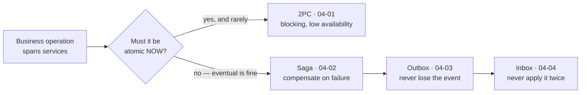

> Once data lives in more than one service, `BEGIN TRANSACTION` no longer spans your
> business operation. This module is what you use instead.

## What you will be able to do

- Explain why two-phase commit is usually the wrong answer, and when it isn't.
- Implement a multi-service business operation that is correct despite partial failure.
- Publish an event and commit a state change without ever losing either.
- Make a consumer safe against duplicates and reordering.
- Decide, with reasons, whether event sourcing and CQRS are worth their cost.
- Elect a leader without inventing your own consensus protocol.

## Lessons

| # | Lesson | The guarantee it provides |
|---|---|---|
| 04-01 | [Distributed transactions and 2PC](/modules/data-and-consistency/01-distributed-transactions-and-two-phase-commit) | Atomicity across services — at a heavy price |
| 04-02 | [Saga](/modules/data-and-consistency/02-saga) | Eventual atomicity via compensation |
| 04-03 | [Transactional outbox](/modules/data-and-consistency/03-transactional-outbox) | The state change and the intent to publish commit atomically — the event can be delayed or duplicated, never lost |
| 04-04 | [Idempotent consumer and inbox](/modules/data-and-consistency/04-idempotent-consumer-and-inbox) | Duplicates have no duplicate effect — when the dedup record commits with the effect |
| 04-05 | [Event sourcing](/modules/data-and-consistency/05-event-sourcing) | Complete, replayable history as the source of truth |
| 04-06 | [CQRS](/modules/data-and-consistency/06-cqrs) | Reads and writes optimised independently |
| 04-07 | [Consensus and leader election](/modules/data-and-consistency/07-consensus-and-leader-election) | At most one leader acts at a time — given a quorum, and fencing for the stale ones |

## The one idea

**You cannot have ACID transactions across services, and you do not need them.**

What you need is that the *business outcome* is correct. A monolith gets that from atomicity:
either everything happened or nothing did. Distributed systems get it from a weaker but
sufficient property — every step is idempotent, every step is either retryable or
compensatable, and the system converges on a correct state even though it passes through
temporarily incorrect ones.

Those three — saga, outbox, idempotent consumer — are the load-bearing patterns of every
event-driven system that works. Learn them together; individually each has a hole that another
fills.

## ShopFlow at the end of this module

Placing an order reserves stock, charges a card and creates a shipment across three services
with three databases. If the payment fails after stock is reserved, the reservation is
released automatically. If a service crashes mid-flow, the flow resumes where it stopped. No
event is ever lost, no message is ever applied twice, and no operation requires all three
services to be up simultaneously.

---

**Up:** [Curriculum](/CURRICULUM) · **Previous:** [← Module 03](/modules/scalability/README) · **Next:** [04-01 Distributed transactions and 2PC →](/modules/data-and-consistency/01-distributed-transactions-and-two-phase-commit)
