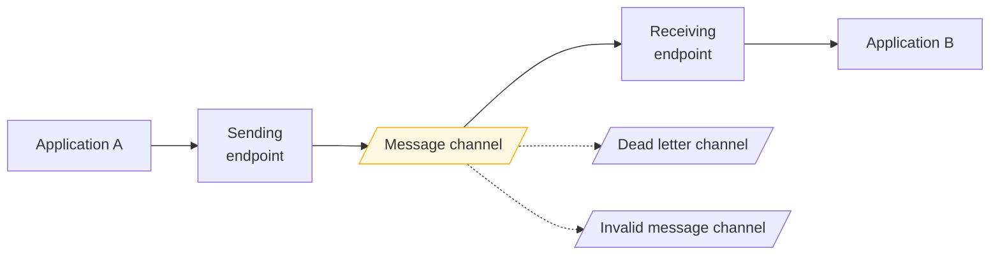

> The vocabulary of enterprise integration. Six nouns that let you describe any messaging
> system precisely enough to reason about its failure modes.

| | |
|---|---|
| **Module** | [05 — Messaging and EIP](/modules/messaging-and-eip/README) |
| **Prerequisites** | [01-02 Asynchronous messaging](/modules/communication/02-asynchronous-messaging) |
| **Also known as** | the EIP base vocabulary; messaging system anatomy |
| **Category** | Integration |

---

## 1. The problem

Two teams discuss an integration. One says "put it on the queue". The other hears "topic". A
third assumes "with ordering". Nobody says whether a second consumer will get a copy, what
happens if the consumer is down for a day, or whether a malformed message blocks the rest.

Six months later the integration works in staging and drops messages in production, and the
postmortem discovers that the two teams had different mental models the entire time and no
vocabulary precise enough to notice.

## 2. In plain language

The postal system has words for its parts, and the words carry guarantees. A *postbox* is
where you put things. A *pigeonhole* is addressed to one person. A *noticeboard* is read by
everyone who walks past. *Recorded delivery* means someone signs. *Return to sender* is what
happens to an undeliverable letter.

Say "send it" and you have specified nothing. Say "recorded delivery to the finance
pigeonhole, return to sender after three attempts" and you have specified almost everything —
including what happens when it goes wrong.

EIP is that vocabulary for software. The value is not the diagrams; it is that "dead letter
channel" means one specific thing to everyone who knows the term.

**Where the analogy breaks down:** postal guarantees are enforced by an organisation. Message
channel guarantees are enforced by whichever broker you picked, and they vary.

## 3. How it works



### The vocabulary

| Term | Definition | In practice |
|---|---|---|
| **Message** | A self-contained unit: header + body | A Kafka record, an SQS message, an AMQP delivery |
| **Message channel** | A named, one-way conduit with defined semantics | A topic, a queue, an exchange |
| **Endpoint** | The application's connection to a channel | A producer client, a `@KafkaListener`, an SQS poller |
| **Message header** | Metadata the infrastructure reads | `message_id`, `correlation_id`, `reply_to`, `content_type`, `timestamp` |
| **Message body** | The payload the application reads | The serialised event or command |
| **Channel adapter** | Connects a channel to a system that speaks something else | A CDC connector, an SFTP poller, an HTTP bridge |

**Headers versus body is a real design decision.** Anything the infrastructure needs for
routing, correlation, deduplication or tracing belongs in headers — routers and translators
can then act without deserialising the body, and the body's schema stays free to evolve.

### Channel types

| Channel type | Guarantee | Use |
|---|---|---|
| **Point-to-point** | Exactly one receiver consumes each message | Commands, work distribution ([05-02](/modules/messaging-and-eip/02-point-to-point-and-publish-subscribe)) |
| **Publish-subscribe** | Every subscriber gets a copy | Events |
| **Datatype channel** | Carries exactly one message type | Consumers need no type dispatch |
| **Invalid message channel** | For messages that are structurally wrong | A schema violation, not a processing failure |
| **Dead letter channel** | For messages the *system* could not deliver or process | [05-06](/modules/messaging-and-eip/06-dead-letter-channel-and-poison-messages) |
| **Guaranteed delivery** | Messages survive broker restart | Persistent, replicated storage |

**Invalid message and dead letter are different**, and conflating them is common. Invalid =
"I cannot understand this" (a sender problem, never retryable). Dead letter = "I understood it
and could not process it after N attempts" (possibly retryable after a fix). They need
different queues, different alerts and different people.

### The message expiry / TTL question

A message with no expiry sits in a queue forever. When the consumer recovers after four hours,
it processes four hours of stale commands — sending "your order has shipped" notifications for
orders cancelled hours ago. **A command should usually expire; an event usually should not**,
because an event is a historical fact whose truth does not decay.

## 4. Pseudo-code

**The anatomy of a message.**

```
record Message<T>:
  # --- headers: infrastructure reads these, never the body ---
  message_id: UUID              # dedup key (04-04)
  correlation_id: UUID          # ties a whole business flow together
  causation_id: Option<UUID>    # the message that caused this one
  reply_to: Option<Channel>     # for request/reply
  content_type: String          # "application/json", "application/avro"
  schema_version: Int
  timestamp: Instant
  expires_at: Option<Instant>
  trace_id: String              # distributed tracing (11-01)
  attempt: Int = 1

  # --- body: the application reads this ---
  payload: T
```

**Channels with explicit semantics.**

```
# Point-to-point: work. Exactly one consumer processes each message.
channel ship_order_commands: PointToPoint<ShipOrder>
  with delivery: at_least_once,
       ordering: none,                       # competing consumers destroy order
       retention: 7d,
       dead_letter: ship_order_dlq,
       max_attempts: 5

# Publish-subscribe: facts. Every subscriber gets its own copy.
channel order_events: PublishSubscribe<OrderEvent>
  with delivery: at_least_once,
       ordering: per_key(order_id),          # ordering only within a key
       retention: 30d,                       # long: enables replay and new consumers
       durable_subscriptions: true           # a subscriber that is down misses nothing

# Datatype channel: one type only, so consumers need no dispatch.
channel price_updates: PointToPoint<PriceChanged>

# Invalid message: structurally wrong. Never retried.
channel invalid_messages: PointToPoint<InvalidMessage>
```

**Endpoints, and where responsibility sits.**

```
service OrderService:
  uses events_out: SendingEndpoint<OrderEvent> to order_events

  fn publish(e: OrderEvent, order_id: OrderId, ctx: RequestContext):
    events_out.send(Message(
      message_id: uuid(),
      correlation_id: ctx.correlation_id,    # WHY: one id ties together the HTTP
                                             # request, the events it produced, and
                                             # the events those produced. Without it,
                                             # debugging an async flow is guesswork.
      causation_id: Some(ctx.message_id),
      trace_id: ctx.trace_id,
      schema_version: 2,
      timestamp: now(),
      payload: e), key: order_id)


service ShippingService:
  uses commands_in: ReceivingEndpoint<ShipOrder> from ship_order_commands

  on message(m: Message<ShipOrder>):
    # 1. Expiry: don't act on stale commands.
    if m.expires_at is Some(t) and now() > t:
      metrics.increment("message.expired")
      m.ack()                                # discard; do not dead-letter
      return

    # 2. Structural validity is separate from processing failure.
    match validate(m):
      case Err(SchemaViolation as e):
        invalid_messages.send(m with { reason: e })   # a SENDER bug. Never retry.
        m.ack()
        return
      case Ok(cmd): pass

    # 3. Idempotency, because delivery is at-least-once (04-04).
    if inbox.seen(m.message_id): m.ack(); return

    # 4. Propagate correlation so downstream messages remain traceable.
    ctx = RequestContext(correlation_id: m.correlation_id,
                         causation_id: Some(m.message_id),
                         trace_id: m.trace_id)
    try:
      handle(cmd, ctx)
      m.ack()
    catch TransientError:
      m.retry(after: backoff(m.attempt))     # will dead-letter after max_attempts
```

**Channel adapter — connecting a channel to something that is not a channel.**

```
# The ERP has no API. It writes a CSV to an SFTP server every 15 minutes.
# A channel adapter makes that look like a message channel to everything else.
service ErpChannelAdapter:
  uses sftp: SftpClient
  uses out: SendingEndpoint<ProductChanged> to price_updates
  uses processed: Store<String, Instant>

  every 1m:
    for f in await sftp.list("/exports/products/") timeout 30s:
      if processed.get(f.name) is Some: continue      # idempotent at the file level
      rows = parse_csv(await sftp.get(f.name))
      for row in rows:
        out.send(Message(message_id: deterministic_uuid(f.name, row.sku),
                         payload: to_product_changed(row)))
        # WHY a deterministic id: if we crash halfway and reprocess the file,
        # consumers dedupe on the same ids. See 04-04.
      processed.put(f.name, now())
```

## 5. Knobs and variants

| Knob | Guidance | Failure if wrong |
|---|---|---|
| Channel type | P2P for commands, pub-sub for events | Commands on a topic get executed N times |
| Durability | Persistent for anything business-relevant | In-memory channels lose everything on restart |
| Ordering | Per key, not global | Global ordering caps throughput at one consumer |
| Retention | Commands: days. Events: weeks–months | Short event retention blocks replay and new consumers |
| TTL | Commands expire, events don't | Stale commands executed after recovery |
| Headers vs body | Routing metadata in headers | Body-based routing forces every router to deserialise |
| Invalid vs dead letter | Separate channels | Mixing them means unfixable messages are retried forever |

## 6. Challenges and failure modes

- **Unspecified semantics.** The root problem in §1. Write the channel definition down — type,
  delivery, ordering, retention, DLQ, max attempts — as a reviewable artefact.
- **Correlation id not propagated.** Without it, an async flow across five services is
  impossible to reconstruct. Propagate it through every message and every log line.
- **Headers used for business data.** Headers are infrastructure metadata; putting a price in a
  header means it evades schema validation and versioning entirely.
- **Channel proliferation.** One channel per message type per consumer produces hundreds of
  channels nobody can enumerate. Group by aggregate or bounded context.
- **No expiry on commands.** A consumer recovering after hours executes stale instructions.
- **Adapters that are not idempotent.** A file re-read after a crash re-emits every row.
  Deterministic message ids fix it.
- **Silent consumer death.** No errors, no messages processed, nobody notices. Alert on
  "expected consumer absent" and on channel depth.
- **In-memory channels in production.** Fast, and everything in flight is lost on any restart —
  including a routine deploy.

## 7. Alternatives

- **Direct HTTP calls** ([01-01](/modules/communication/01-synchronous-request-response)).
  No channel semantics to define, and no decoupling either.
- **Shared database as a channel.** A table polled by the consumer. Crude, extremely common,
  and it works — with the coupling of a shared schema.
- **File transfer.** The oldest integration style, and still the right answer for batch
  interfaces with legacy systems. ShopFlow's ERP uses it.
- **Managed integration platforms** (MuleSoft, Apache Camel, Azure Logic Apps, Spring
  Integration). These *implement* the EIP catalogue directly, often using the same names.

## 8. Trade-offs

| Advantage of explicit channel semantics | Disadvantage |
|---|---|
| Two teams can agree on behaviour before building | Upfront design work that feels like bureaucracy |
| Failure handling is designed, not discovered | More channels to configure and monitor |
| The vocabulary transfers across every tool | The catalogue is large and mostly irrelevant to any one system |
| Headers enable routing without deserialising | Header/body split is another decision to get wrong |

## 9. Complexity introduced

- **Operational.** Channel inventory with documented semantics; depth, lag and consumer-presence
  monitoring per channel; DLQ and invalid-message alerting.
- **Cognitive.** A vocabulary to learn, and a habit of specifying semantics rather than
  assuming them.
- **Failure surface.** Misconfigured retention, missing DLQs, unpropagated correlation ids,
  non-idempotent adapters.
- **Testing.** Each channel's declared semantics should be verified: does a second consumer get
  a copy? Does a failure actually dead-letter?

## 10. Related concepts

- **Builds on:** [01-02 Asynchronous messaging](/modules/communication/02-asynchronous-messaging)
- **Composes with:** every other lesson in [Module 05](/modules/messaging-and-eip/README)
- **Conflicts with / tension:** simplicity — a two-service integration does not need this rigour
- **Contrast with:** [01-01 Synchronous request/response](/modules/communication/01-synchronous-request-response)
- **Leads to:** [05-02 Point-to-point and publish/subscribe](/modules/messaging-and-eip/02-point-to-point-and-publish-subscribe)

## 11. Exercises

1. **Trace it.** ShopFlow's Notification Service is down for 6 hours. Messages have no TTL.
   Describe what customers receive when it recovers, then decide a TTL for each ShopFlow
   message type and justify it.
2. **Extend it.** Write the full channel definition (type, delivery, ordering, retention, DLQ,
   max attempts, TTL) for every channel implied by
   [the running example](/domain/RUNNING-EXAMPLE).
3. **Break it.** `ErpChannelAdapter` crashes after emitting 400 of 800 rows and before writing
   `processed`. Walk through the restart. Which line prevents duplicate price updates, and what
   must every consumer do for it to work?

## 12. References

- Hohpe & Woolf, *Enterprise Integration Patterns* (2003) — Ch. 2–4. The source.
- enterpriseintegrationpatterns.com — the full catalogue, freely available.
- Apache Camel documentation — the EIP catalogue as executable components.
- Spring Integration reference — the same patterns, same names, in a framework.
- Gregor Hohpe, "Enterprise Integration Patterns: 20 years later" — what changed and what didn't.

---

**Up:** [Module 05](/modules/messaging-and-eip/README) · **Previous:** [← Module 04](/modules/data-and-consistency/README) · **Next:** [05-02 Point-to-point and publish/subscribe →](/modules/messaging-and-eip/02-point-to-point-and-publish-subscribe)
