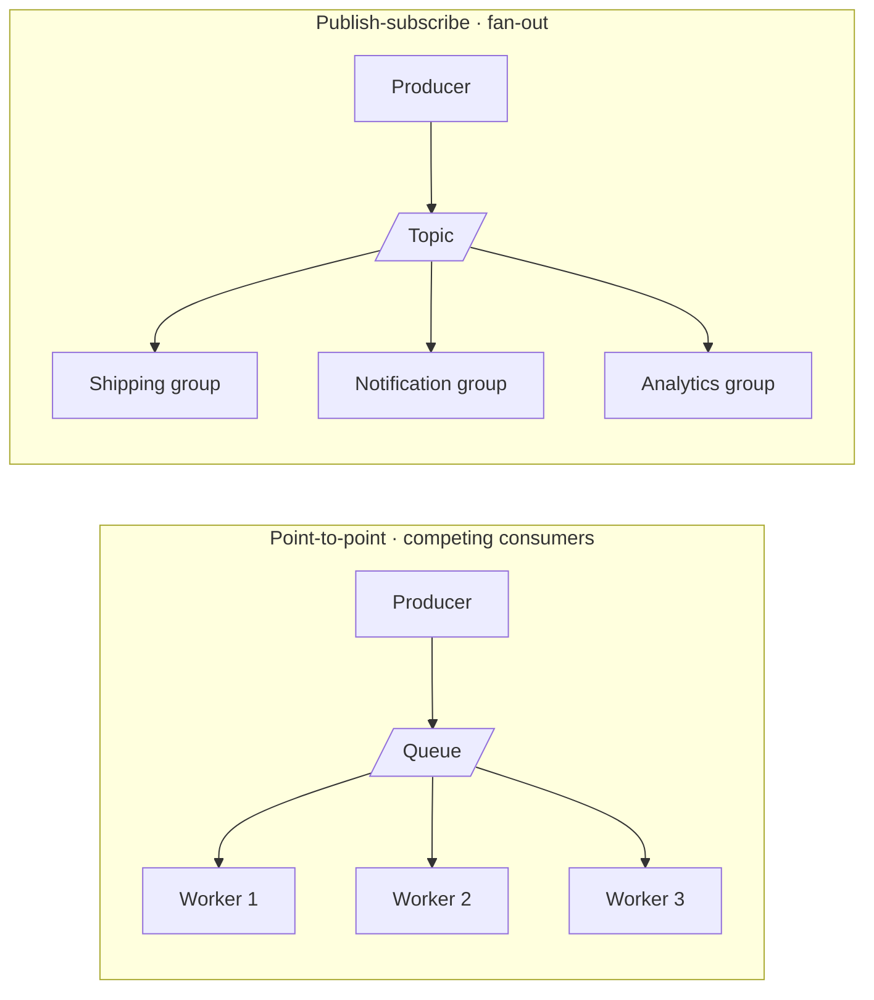

> One message, one worker — or one message, every interested party. Choosing wrongly means
> either duplicated side effects or missed ones.

| | |
|---|---|
| **Module** | [05 — Messaging and EIP](/modules/messaging-and-eip/README) |
| **Prerequisites** | [05-01 Channels and endpoints](/modules/messaging-and-eip/01-channels-and-endpoints) |
| **Also known as** | competing consumers, fan-out, durable subscription, consumer groups |
| **Category** | Integration |

---

## 1. The problem

ShopFlow publishes `OrderPlaced`. Three services care: Shipping creates a shipment,
Notification emails the customer, Analytics counts revenue.

Put it on a **queue** and only one of the three gets each message — the other two silently
never hear about most orders. Put a *command* like `ShipOrder` on a **topic** and all three
subscribers execute it, producing three shipments.

Then the scaling question: Shipping runs 6 instances. They must share the work, not each do
all of it. And Analytics must not be blocked by Shipping being slow.

## 2. In plain language

**Point-to-point** is a job tray in a workshop. Several workers take from the same tray;
whoever grabs a card does that job, and it is done once. Add workers and the tray drains
faster. That is what you want for *work*.

**Publish/subscribe** is a noticeboard. Everyone who cares reads the same notice. Adding a
reader does not stop anyone else reading it. That is what you want for *news*.

The distinction that trips people: "the parcel has shipped" is news — the warehouse should
tell everyone and not care who listens. "Ship this parcel" is work — exactly one person should
do it. Put work on a noticeboard and three people ship the parcel. Put news in a job tray and
only one department learns about it.

**Where the analogy breaks down:** a noticeboard reader who is on holiday misses the notice.
Durable subscriptions keep it for them, which is the single most important configuration
choice in this lesson.

## 3. How it works



**Modern brokers give you both at once.** A Kafka topic with consumer *groups*: each group
receives every message (pub-sub between groups), and within a group each partition is consumed
by exactly one member (point-to-point inside a group). That is why "queue or topic" is often
really "how many consumer groups".

| | Point-to-point | Publish-subscribe |
|---|---|---|
| Receivers per message | Exactly one | All subscribers |
| Carries | Commands, work items | Events, facts |
| Adding a consumer | More throughput | More behaviour |
| Producer knows receivers | Usually yes | No |
| Scaling | Add competing consumers | Add instances within a group |
| Failure of one consumer | Another takes the message | Only that subscriber falls behind |

### Durable vs non-durable subscriptions

A **non-durable** subscriber misses everything sent while it was down. A **durable**
subscription retains messages for it.

For business events, durable is almost always required — a Notification Service redeployed
for 40 seconds must not lose 40 seconds of receipts. Non-durable is right only for genuinely
ephemeral data: live dashboards, presence, telemetry sampling.

### Competing consumers and ordering

Competing consumers destroy ordering, by construction: two workers processing messages for the
same order can finish in either order. The standard resolution is **partition by key**:
messages with the same key go to the same partition, one consumer per partition. You get
ordering within a key and concurrency across keys — which is usually exactly what the domain
needs.

Consequence: **concurrency is capped at the partition count**, and partition counts are painful
to increase later (increasing them changes key→partition mapping and breaks ordering during the
change). Choose generously up front.

### Rebalancing

When a consumer joins or leaves a group, partitions are reassigned. During a rebalance,
consumption pauses; in-flight work may be reprocessed by a new owner. Consequences:

- Every handler must be idempotent ([04-04](/modules/data-and-consistency/04-idempotent-consumer-and-inbox)).
- Frequent restarts cause "rebalance storms" where the group spends more time rebalancing than
  consuming.
- Long processing times can exceed the group's session timeout, causing the member to be
  evicted mid-work — which triggers another rebalance, and a loop.

## 4. Pseudo-code

**Before — the wrong channel type, twice.**

```
channel order_events: PointToPoint<OrderPlaced>       # TRAP: a queue for events
service ShippingService:     on message(e): create_shipment(e)
service NotificationService: on message(e): send_email(e)
service AnalyticsService:    on message(e): count(e)
# Each message goes to ONE of the three. Two thirds of customers get no email,
# two thirds of orders never ship, and revenue is understated by 67%.

channel ship_commands: PublishSubscribe<ShipOrder>    # TRAP: a topic for commands
# All three fulfilment partners create a shipment. The customer gets three parcels.
```

**The pattern — events fan out, commands compete.**

```
# EVENTS: publish-subscribe, durable, partitioned by order for ordering.
channel order_events: PublishSubscribe<OrderEvent>
  with durable_subscriptions: true,
       partitions: 24,                       # caps per-group concurrency at 24
       partition_key: order_id,
       retention: 30d

service OrderService:
  uses events: SendingEndpoint<OrderEvent> to order_events

  fn publish(e: OrderEvent):
    events.send(e, key: e.order_id)          # same order → same partition → ordered


# Each subscriber is an independent group: independent offsets, independent lag,
# independent failure. Shipping being down does not delay Analytics by one message.
service ShippingService:
  subscribes order_events as group "shipping" with instances: 6
  @at_least_once
  on event OrderPlaced(e, meta):
    shipments.put_if_absent(e.order_id, Shipment(e.order_id, PENDING))   # idempotent

service NotificationService:
  subscribes order_events as group "notifications" with instances: 2
  on event OrderPlaced(e, meta): ...

service AnalyticsService:
  subscribes order_events as group "analytics" with instances: 4
  on event OrderPlaced(e, meta): ...


# COMMANDS: point-to-point, competing consumers, one active consumer per delivery.
# Delivery is still at-least-once: a redelivery can execute a handler again, so it must be idempotent.
channel ship_order_commands: PointToPoint<ShipOrder>
  with delivery: at_least_once, max_attempts: 5, dead_letter: ship_order_dlq

service ShippingWorker:                       # 6 instances competing on one queue
  uses work: ReceivingEndpoint<ShipOrder> from ship_order_commands

  every 20ms:
    d = work.receive()
    if d is None: return
    if inbox.seen(d.message_id): d.ack(); return    # 04-04: at-least-once
    try:
      await carrier.create_shipment(d.body) timeout 5s
      d.ack()
    catch TransientError:
      d.retry(after: backoff(d.attempt))
    catch PermanentError as e:
      d.dead_letter(e)                                # 05-06
```

**Adding a fourth consumer — the payoff of pub-sub.**

```
service FraudService:
  # Deployed today. Order Service is untouched, not redeployed, not even aware.
  subscribes order_events as group "fraud" with instances: 2

  on start:
    # 30-day retention means this new consumer can start from the beginning
    # and build its model from a month of history before going live.
    seek_to(offset: earliest)

  on event OrderPlaced(e, meta): score(e)
```

**Rebalance safety — the part that bites in production.**

```
service ShippingService:
  subscribes order_events as group "shipping"
    with session_timeout: 45s,
         max_poll_interval: 5m,          # must exceed the SLOWEST possible handler
         auto_commit: false               # commit offsets manually, after processing

  on event OrderPlaced(e, meta):
    # TRAP: if this takes longer than max_poll_interval, the broker assumes we died,
    # evicts us, and reassigns our partitions — triggering a rebalance, which evicts
    # others, which triggers more rebalances. A slow handler becomes a group-wide
    # outage. Move slow work to a queue instead of doing it in the subscriber.
    if estimated_duration(e) > 30s:
      slow_work.send(e)                   # hand off; keep the consumer loop fast
      commit_offset(meta.offset)
      return

    process(e)
    commit_offset(meta.offset)            # AFTER processing: at-least-once.
                                          # Committing before = at-most-once = loss.

  on partitions_revoked(partitions):
    stop_accepting(partitions)
    await finish_in_flight(partitions)    # only successfully processed records are safe to commit
    commit_processed_offsets(partitions)  # never commit a merely received record
```

## 5. Knobs and variants

| Knob | Guidance | Failure if wrong |
|---|---|---|
| Channel type | Events → pub-sub, commands → P2P | Duplicated or missed side effects |
| Durability | Durable for anything business-relevant | Deploys lose messages |
| Partitions | ≥ 2–3× expected max consumers | Caps concurrency; painful to change later |
| Partition key | The entity whose ordering matters | Wrong key = no ordering guarantee where you need it |
| Offset commit | After processing, manual | Before = at-most-once = silent loss |
| Session timeout / max poll | > slowest handler | Slow handlers trigger rebalance storms |
| Consumer group per concern | One group per logical subscriber | Sharing a group means each gets a subset |

## 6. Challenges and failure modes

- **Commands on a topic / events on a queue.** The §1 bugs. Both are silent: nothing errors.
- **Non-durable subscriptions.** Messages lost on every deploy, invisibly.
- **Rebalance storms.** Slow handlers or frequent restarts leave the group thrashing. Move slow
  work off the consumer loop.
- **Partition count as a permanent ceiling.** 6 partitions means at most 6 useful consumers
  forever; increasing it breaks key→partition stability.
- **Hot partitions.** One large customer's key sends 40% of traffic to one partition; that
  consumer lags while five idle.
- **Committing offsets before processing.** At-most-once by accident.
- **Consumer lag with no errors.** Alert on lag per group; error rate will not show it.
- **A fan-out consumer that is slow becomes everyone's problem** if groups are shared. One
  group per concern keeps failures isolated.
- **Ordering assumed across keys.** Two different orders' events have no relative ordering
  guarantee, ever.

## 7. Alternatives

- **SNS+SQS style fan-out** (a topic writing into per-consumer queues). Each consumer gets its
  own durable queue with its own DLQ and retry policy — arguably cleaner isolation than shared
  consumer groups, at the cost of more infrastructure.
- **Direct calls.** For one consumer that must be synchronous, skip the broker.
- **Polling a shared store.** Consumers query a table for new rows. No broker; coupling to
  schema; surprisingly robust for low volumes.
- **[Recipient list](/modules/messaging-and-eip/03-message-router-and-filter).** Explicitly send to a computed set
  of channels rather than broadcasting. Use when the producer legitimately must control who
  receives.

## 8. Trade-offs

| Advantage | Disadvantage |
|---|---|
| Pub-sub: new consumers with zero producer change | Producer cannot know who depends on its events |
| P2P: throughput scales by adding workers | Competing consumers destroy ordering |
| Per-group offsets isolate slow consumers | Rebalancing pauses consumption and replays work |
| Partition keys give ordering where it matters | Partition count is a hard, hard-to-change ceiling |
| Durable subscriptions survive outages and deploys | Retention costs storage and complicates GDPR |

## 9. Complexity introduced

- **Operational.** Per-group lag dashboards; rebalance-rate monitoring; partition planning;
  retention and storage management.
- **Cognitive.** Groups, partitions, offsets and rebalancing are a real model to learn, and
  their interaction with idempotency is not obvious.
- **Failure surface.** Rebalance storms, hot partitions, offset mismanagement, lost non-durable
  subscriptions.
- **Testing.** Must cover: consumer restart mid-batch, rebalance during processing, and a
  second consumer group joining.

## 10. Related concepts

- **Builds on:** [05-01 Channels and endpoints](/modules/messaging-and-eip/01-channels-and-endpoints)
- **Composes with:** [04-04 Idempotent consumer](/modules/data-and-consistency/04-idempotent-consumer-and-inbox), [05-06 Dead letter channel](/modules/messaging-and-eip/06-dead-letter-channel-and-poison-messages), [10-02 Work queues](/modules/performance-and-concurrency/02-asynchronous-processing-and-work-queues)
- **Conflicts with / tension:** ordering vs concurrency — you cannot maximise both
- **Contrast with:** [05-03 Message router](/modules/messaging-and-eip/03-message-router-and-filter) — broadcasting to all versus choosing one destination
- **Leads to:** [05-03 Message router and filter](/modules/messaging-and-eip/03-message-router-and-filter)

## 11. Exercises

1. **Trace it.** ShopFlow has 6 partitions and 10 Shipping instances. How many do useful work?
   Now one customer generates 40% of orders. Describe the lag distribution across partitions.
2. **Extend it.** Add a fifth consumer that must process the last 30 days of orders before
   going live, without affecting existing consumers. What configuration makes this possible,
   and what would prevent it?
3. **Break it.** A handler occasionally takes 8 minutes (a slow carrier API). `max_poll_interval`
   is 5 minutes. Walk through the next 30 minutes for the whole consumer group.

## 12. References

- Hohpe & Woolf, *Enterprise Integration Patterns* — Point-to-Point Channel, Publish-Subscribe Channel, Competing Consumers, Durable Subscriber.
- Apache Kafka documentation — consumer groups, partitions, rebalancing protocols.
- AWS documentation — SNS fan-out to SQS, and why per-consumer queues isolate failure.
- Chris Richardson, *Microservices Patterns* — Ch. 3, messaging.

---

**Up:** [Module 05](/modules/messaging-and-eip/README) · **Previous:** [← 05-01](/modules/messaging-and-eip/01-channels-and-endpoints) · **Next:** [05-03 Message router and filter →](/modules/messaging-and-eip/03-message-router-and-filter)
