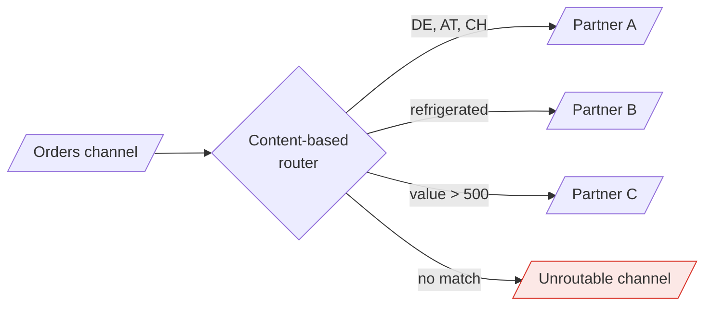

> Deciding where a message goes, without the sender knowing and without the receivers
> knowing about each other.

| | |
|---|---|
| **Module** | [05 — Messaging and EIP](/modules/messaging-and-eip/README) |
| **Prerequisites** | [05-02 Point-to-point and pub/sub](/modules/messaging-and-eip/02-point-to-point-and-publish-subscribe) |
| **Also known as** | content-based router, recipient list, dynamic router, message filter |
| **Category** | Integration |

---

## 1. The problem

ShopFlow ships through three fulfilment partners. Which one handles an order depends on
destination country, item size, whether it is refrigerated, and a contract that changes
quarterly.

The naive implementation puts that logic in Order Service:

```
if order.country in ["DE","AT","CH"] and not order.refrigerated:
  await partner_a.ship(order)
elif order.total > 500:
  await partner_c.ship(order)
...
```

Order Service now knows about fulfilment contracts. Every partner change is a deploy of the
order path. Adding a fourth partner means touching the service that takes money, which means
the change goes through payment's release process. The routing rules — genuinely a business
concern, changing quarterly — are buried in checkout code.

## 2. In plain language

A mailroom. Post arrives at one door. A clerk reads each envelope and puts it in the right
department's pigeonhole. The senders do not know the office layout. The departments do not know
each other exist. When Finance moves to the third floor, one person is told: the clerk.

Two variations matter. A **filter** is a clerk who bins junk mail — the message is dropped
because this recipient does not care about it. A **recipient list** is a clerk who photocopies
one memo into four pigeonholes because four departments need it.

The failure mode is the same as in a real mailroom: the clerk becomes the person who knows
everything and the bottleneck through which all post passes. If the rules get complicated
enough, you have moved the complexity rather than removed it.

**Where the analogy breaks down:** a clerk who cannot read an address asks someone. A router
must have a defined answer for "no rule matches", and the default answer — silently dropping —
is the most common bug in this lesson.

## 3. How it works



### The family of routing patterns

| Pattern | Behaviour | Use |
|---|---|---|
| **Content-based router** | Inspect the message, send to exactly one channel | Partner selection, tenant routing |
| **Message filter** | Forward or discard, based on a predicate | A consumer that only cares about some events |
| **Recipient list** | Send to a computed *set* of channels | Notify the 3 of 12 partners who bid on this |
| **Dynamic router** | Routing table maintained at runtime by the recipients | Plug-in architectures; self-registering consumers |
| **Splitter** | One message → many | [05-05](/modules/messaging-and-eip/05-splitter-aggregator-and-scatter-gather) |
| **Routing slip** | The route travels *with* the message | [05-07](/modules/messaging-and-eip/07-process-manager-and-routing-slip) |

### Router vs filter — where the decision lives

A **router** centralises the decision: one component knows all destinations. Changing routing
is one deployment; the router is a bottleneck and a coupling point.

A **filter** decentralises it: every consumer subscribes to everything and discards what it does
not want. No central component, and every consumer pays deserialisation cost for messages it
throws away — plus, at high volume, the broker moves a lot of data that is immediately binned.

**Broker-side filtering** is the compromise, and usually the right one: the consumer declares
a predicate and the broker evaluates it (JMS selectors, RabbitMQ topic exchanges, SNS filter
policies). No central router, no wasted transfer.

### Stateless routing

**Routing decisions should be a pure function of the message plus a routing table.** A router
that calls three services to decide is not a router; it is a business process, and it belongs
in a [process manager](/modules/messaging-and-eip/07-process-manager-and-routing-slip). Keeping routers stateless
and side-effect-free is what keeps them fast, testable and restartable.

## 4. Pseudo-code

**Before — routing rules inside the business service.**

```
service OrderService:
  handler place_order(cmd) -> Result<Order, OrderError>:
    order = charge_and_save(cmd)?
    if order.country in ["DE","AT","CH"] and not order.refrigerated:
      await partner_a.ship(order)
    elif order.refrigerated:
      await partner_b.ship(order)
    else:
      await partner_c.ship(order)
    return Ok(order)
    # TRAP: checkout now depends on three partner APIs being up, and a contract
    # change redeploys the payment path.
```

**The pattern — a content-based router with an externalised table.**

```
record RoutingRule:
  priority: Int
  predicate: (OrderPlaced) => Bool
  destination: Channel
  name: String

service FulfilmentRouter:
  uses inbound: ReceivingEndpoint<OrderPlaced> from order_events
  uses rules: Store<String, List<RoutingRule>>     # externalised: changed without deploy
  uses unroutable: SendingEndpoint<OrderPlaced> to unroutable_orders
  state table: List<RoutingRule>

  every 30s:
    table = rules.get("fulfilment").sorted_by(priority)     # hot-reloaded

  @at_least_once
  on event OrderPlaced(e, meta):
    # Pure function of the message and the table. No I/O, no side effects.
    match table.find_first(r => r.predicate(e)):
      case Some(rule):
        rule.destination.send(e, key: e.order_id, headers: {routed_by: rule.name})
        metrics.increment("router.routed", tags: {rule: rule.name})

      case None:
        # TRAP if omitted: unmatched messages vanish silently and nobody knows
        # for weeks. An unroutable channel + an alert is mandatory.
        unroutable.send(e, headers: {reason: "no matching rule"})
        metrics.increment("router.unroutable")
        alert_if_rate_exceeds("router.unroutable", threshold: 1/m)

  # Routing tables are configuration, so they need the same care as code.
  fn validate(new_table: List<RoutingRule>) -> Result<Unit, Error>:
    if new_table.any(r => r.destination not in known_channels):
      return Err(UnknownDestination)
    if not covers_all(new_table, sample_messages):
      return Err(IncompleteRules)          # would silently drop live traffic
    return Ok(unit)
```

**Filter — a consumer discarding what it does not care about.**

```
service RefrigeratedFulfilment:
  subscribes order_events as group "cold-chain"

  on event OrderPlaced(e, meta):
    # Message filter: the simplest routing pattern there is.
    if not e.requires_refrigeration:
      return                               # discard, ack, cost = one deserialisation
    handle(e)

# Better at volume: let the broker evaluate the predicate so the message is never
# transferred at all.
service RefrigeratedFulfilment:
  subscribes order_events as group "cold-chain"
    with selector: "requires_refrigeration = true"     # broker-side, from a HEADER
    # WHY a header: the broker can filter without deserialising the body. This is
    # the practical reason routing metadata belongs in headers (05-01).
```

**Recipient list — one message, a computed set of destinations.**

```
service QuoteRequestRouter:
  uses partners: Store<PartnerId, PartnerProfile>

  on event QuoteRequested(e, meta):
    # Compute WHO should receive it, then send to each. Unlike pub-sub, the sender
    # controls the set; unlike a router, there may be several.
    recipients = partners.query(
      serves_country: e.country,
      handles_weight: e.weight_kg,
      active: true)

    if recipients.is_empty():
      unroutable.send(e, headers: {reason: "no partner covers this route"})
      return

    for p in recipients:
      p.channel.send(e, headers: {correlation_id: meta.correlation_id})
    # Replies come back correlated; see the aggregator in 05-05.
    expected_replies.put(meta.correlation_id, recipients.size)
```

**Dynamic router — consumers register their own interest.**

```
service DynamicRouter:
  uses registrations: Store<String, Registration>

  # Control channel: consumers declare what they want, at runtime.
  on message(r: RegisterInterest):
    registrations.put(r.consumer_id,
      Registration(predicate: compile(r.expression), channel: r.channel,
                   expires_at: now() + 1h))    # WHY expiry: a consumer that dies
                                               # without deregistering must not
                                               # accumulate as a dead route forever

  on event OrderPlaced(e, meta):
    for r in registrations.values().filter(r => now() < r.expires_at):
      if r.predicate(e): r.channel.send(e)
    # COST: consumers can now break routing by registering a bad expression.
    # Validate expressions on registration, sandbox their evaluation, and cap
    # how many any one consumer may register.
```

## 5. Knobs and variants

| Knob | Guidance | Failure if wrong |
|---|---|---|
| Where rules live | External config, hot-reloaded | In code = a deploy per business change |
| No-match behaviour | Unroutable channel + alert | Silent drop, discovered weeks later |
| Rule evaluation | First match by priority | "All matches" duplicates unless intended |
| Router vs filter vs broker selector | Broker-side filtering where available | App-side filtering wastes transfer and CPU |
| Router statefulness | Stateless, pure | I/O in a router makes it slow and unrestartable |
| Rule validation | Validate before activation | A bad rule silently misroutes production traffic |
| Dynamic registration TTL | Expire and require renewal | Dead consumers leave permanent phantom routes |

## 6. Challenges and failure modes

- **Silent drops.** No rule matches; the message disappears. The most common and most damaging
  failure in this lesson. Always have an unroutable channel with an alert.
- **The router becomes a business-logic monolith.** Rules accumulate until it encodes the whole
  domain, and it is on the critical path of everything. Watch for routers that need to call
  other services.
- **The router as a single point of failure.** Everything flows through it. Needs the whole of
  [Module 02](/modules/resilience/README) and horizontal scaling.
- **Rule ordering bugs.** Overlapping predicates mean the result depends on priority, and a new
  rule inserted at the wrong priority silently changes existing behaviour.
- **Untested rule changes.** Routing tables are configuration and therefore often escape code
  review and testing. Treat them as code: version, review, test against sample traffic.
- **Filter cost at scale.** 12,000 msg/s deserialised and 95% discarded is a lot of CPU spent on
  nothing.
- **Routing on mutable data.** A rule reading `customer.tier` from a service makes the router
  stateful, slow, and dependent — and gives non-deterministic results on replay.
- **Dynamic routers and untrusted registrations.** A consumer registering `true` receives
  everything, including data it should not see.

## 7. Alternatives

- **Publish-subscribe with consumer-side filtering.** No router at all; each consumer decides.
  Simplest, and it costs transfer and CPU.
- **Separate channels per destination**, with the producer choosing. Explicit and simple; the
  coupling returns to the producer.
- **[Routing slip](/modules/messaging-and-eip/07-process-manager-and-routing-slip).** The route travels with the
  message. Good for variable multi-step sequences.
- **A rules engine.** For genuinely complex, frequently changing business rules, an engine with
  its own authoring UI lets non-engineers change routing. Adds a whole system, and the rules
  become invisible to normal tooling.
- **Service mesh routing.** For synchronous traffic, header-based routing in the mesh does the
  same job at the network layer ([08-04](/modules/microservice-architecture/04-sidecar-and-service-mesh)).

## 8. Trade-offs

| Advantage | Disadvantage |
|---|---|
| Senders don't know receivers; receivers don't know each other | The router knows everyone — a coupling point by design |
| Routing changes without redeploying business services | Rule changes bypass code review unless you enforce it |
| One place to understand where messages go | One place that can drop everything |
| Broker-side filters cost nothing at the consumer | Requires routing metadata in headers |
| Enables adding partners without touching checkout | Router availability becomes critical-path availability |

## 9. Complexity introduced

- **Operational.** Routing tables to version, review and deploy; unroutable-channel alerting;
  per-rule throughput metrics to spot a rule that stopped matching.
- **Cognitive.** "Where does this message go?" requires reading a table that may not be in the
  repository you are looking at.
- **Failure surface.** Silent drops, misrouting, rule-order regressions, router unavailability.
- **Testing.** Every rule needs a positive and a negative test, plus a coverage test asserting
  that a corpus of real messages all match something.

## 10. Related concepts

- **Builds on:** [05-02 Point-to-point and pub/sub](/modules/messaging-and-eip/02-point-to-point-and-publish-subscribe)
- **Composes with:** [05-04 Message translator](/modules/messaging-and-eip/04-message-translator-and-canonical-data-model) (route then translate), [05-05 Splitter](/modules/messaging-and-eip/05-splitter-aggregator-and-scatter-gather), [05-06 Dead letter channel](/modules/messaging-and-eip/06-dead-letter-channel-and-poison-messages)
- **Conflicts with / tension:** decentralisation — a router is a deliberate central point
- **Contrast with:** [05-02 pub-sub](/modules/messaging-and-eip/02-point-to-point-and-publish-subscribe) — broadcast to all versus choose the destination
- **Leads to:** [05-04 Message translator and canonical data model](/modules/messaging-and-eip/04-message-translator-and-canonical-data-model)

## 11. Exercises

1. **Trace it.** A new rule "refrigerated → Partner B" is added at priority 5. The existing
   "DE/AT/CH → Partner A" rule is at priority 3. What happens to a refrigerated order shipping
   to Austria, and is that what the business wanted?
2. **Extend it.** Partner A's contract now caps them at 500 orders/day. Add capacity-aware
   routing. What property of the router does this break, and where should the logic live
   instead?
3. **Break it.** A deploy removes a field the router's predicate reads, so the expression
   evaluates false for every message. Nothing errors. Describe what the business observes over
   the next four hours, and add the monitoring that would have caught it in four minutes.

## 12. References

- Hohpe & Woolf, *Enterprise Integration Patterns* — Ch. 7: Content-Based Router, Message Filter, Recipient List, Dynamic Router.
- Apache Camel documentation — the routing DSL as a direct implementation of these patterns.
- RabbitMQ documentation — topic exchanges and header exchanges as broker-side routers.
- AWS SNS documentation — subscription filter policies.

---

**Up:** [Module 05](/modules/messaging-and-eip/README) · **Previous:** [← 05-02](/modules/messaging-and-eip/02-point-to-point-and-publish-subscribe) · **Next:** [05-04 Message translator and canonical data model →](/modules/messaging-and-eip/04-message-translator-and-canonical-data-model)
