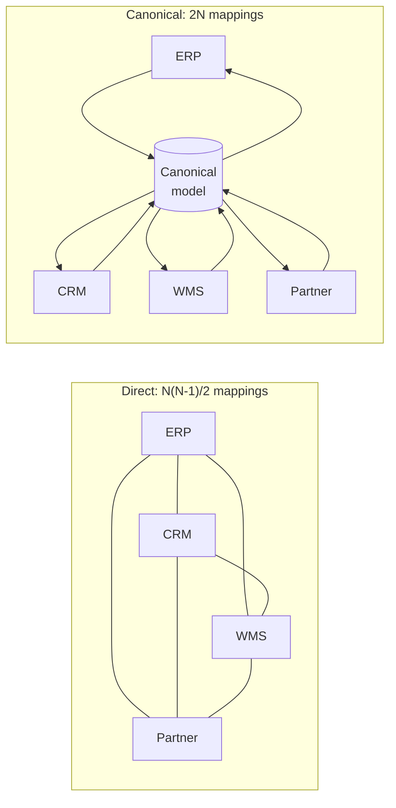

> Every system has its own idea of what a "customer" is. Translation is how they work
> together; a canonical model is how you stop writing N² translators — and how you create a
> different problem.

| | |
|---|---|
| **Module** | [05 — Messaging and EIP](/modules/messaging-and-eip/README) |
| **Prerequisites** | [05-03 Message router](/modules/messaging-and-eip/03-message-router-and-filter), [01-04 Schema evolution](/modules/communication/04-serialization-and-schema-evolution) |
| **Also known as** | data mapper, adapter, normaliser, CDM |
| **Category** | Integration |

---

## 1. The problem

ShopFlow's ERP calls it `KUNDENNR`, a 10-character fixed-width field, in EBCDIC. The CRM calls
it `customerId`, a UUID. The warehouse calls it `cust_ref`, an integer. The Dutch partner sends
`klantnummer` in XML with dates as `DD-MM-YYYY`; the German partner sends JSON with dates as
`YYYY-MM-DD` and amounts using a comma as the decimal separator.

None of them will change. Some are contractual. One is a mainframe whose last COBOL developer
retired in 2019.

With 6 systems, direct pairwise translation needs up to 30 mappings. Add a seventh and you add
12 more. Each is written by whoever needed it, in a different place, with different edge-case
handling. Nobody knows how many exist.

## 2. In plain language

Six diplomats, six languages, one meeting. Interpreting every pair directly needs 30
interpreters, and each must be fluent in a specific rare pair.

The alternative: everyone speaks *to and from* one shared language. Six interpreters instead of
thirty — each only needs their own language plus the shared one. Adding a seventh diplomat
costs one interpreter, not twelve.

The cost is real and shows up in the meeting minutes. The shared language must be able to
express everything anyone might say, so it grows enormous. Some concepts don't translate — one
delegation distinguishes formal and informal address and the shared language does not, so that
distinction is lost every time. And whoever maintains the shared language becomes the person
every delegation must negotiate with, which makes them powerful and makes them a bottleneck.

**Where the analogy breaks down:** interpreters ask for clarification. A translator receiving
a field it does not understand must decide — silently — whether to drop it, error, or pass it
through.

## 3. How it works



### The four levels of translation

Translation happens at more levels than people expect, and each has its own failures:

| Level | Example | Failure |
|---|---|---|
| **Transport** | SFTP → HTTP → AMQP | Connectivity, auth, retries |
| **Encoding** | EBCDIC → UTF-8, fixed-width → JSON | Mojibake, silent truncation |
| **Structure** | Flat record → nested object; one message → many | Field mapping errors |
| **Semantic** | "Order total" includes tax here, excludes it there | **Silent, invisible, expensive** |

**Semantic mismatch is the dangerous one.** Types line up, schemas validate, and every number
downstream is wrong by the VAT rate. No tool catches it; only a documented field-by-field
mapping with units and definitions does.

### When a canonical model helps, and when it hurts

**Helps** when: many systems (5+), overlapping concepts, a stable core domain, and one team
owning the model.

**Hurts** when: few systems, or the domains genuinely differ. Then the CDM becomes a
lowest-common-denominator model that fits nobody, every change requires negotiation with every
team, and it grows optional fields until it means nothing. This is the standard failure mode of
enterprise service buses, and it is why "canonical data model" has a bad reputation in
microservice circles.

**The microservice-friendly middle ground:** no global canonical model. Instead, each bounded
context defines its own **published language** — the schema *it* publishes for others — and
consumers translate at their own boundary using an
[anti-corruption layer](/modules/microservice-architecture/06-anti-corruption-layer).
Translation is still 2N, but ownership is distributed and no committee owns a mega-schema.

### Where to translate

| Location | Consequence |
|---|---|
| **In the producer** | Producer knows all consumers. Bad |
| **In the consumer (ACL)** | Consumer owns its mapping. Good default |
| **In a dedicated translator service** | Reusable, one more hop and one more deployable |
| **In the broker / integration platform** | Zero application code; logic hidden in vendor config |

## 4. Pseudo-code

**Before — a foreign model leaking through the codebase.**

```
service CatalogService:
  on message(erp_row: ErpProductRow):
    products.put(erp_row.ARTNR, Product(
      sku: erp_row.ARTNR,                        # ERP naming, now in our domain
      name: erp_row.BEZEICHNUNG,
      price: erp_row.PREIS / 100))               # TRAP: is PREIS gross or net?
                                                 # Nobody wrote it down.
  # ErpProductRow now appears in 40 files. When the ERP is replaced in 2028,
  # so is every one of them.
```

**The pattern — an explicit, tested, documented translator.**

```
# --- Our domain model. Owned by us. Never contains a foreign field name. ---
record Product:
  sku: Sku
  name: String
  net_price: Money            # explicit: NET, in minor units, currency carried
  vat_rate: Float
  weight_g: Int               # explicit unit in the name — cheap and effective
  requires_refrigeration: Bool

# --- The foreign model. Isolated in one file. ---
record ErpProductRow:
  ARTNR: String               # char(18), right-padded
  BEZEICHNUNG: String         # char(40), latin-1
  PREIS: String               # "1234,56" — comma decimal, GROSS (incl. VAT)
  MWST: String                # "19" or "7" — VAT percentage
  GEWICHT: String             # kilograms, 3 decimals
  KUEHL: String               # "J" / "N"

service ErpProductTranslator:
  # The mapping table lives next to the code, and is the actual specification.
  #
  #   ERP field     → domain field        notes
  #   ARTNR         → sku                 trim trailing spaces
  #   BEZEICHNUNG   → name                latin-1 → UTF-8
  #   PREIS         → net_price           comma→dot; GROSS→NET; €→cents
  #   MWST          → vat_rate            "19"→0.19, "7"→0.07; else ERROR
  #   GEWICHT       → weight_g            kg → g (×1000)
  #   KUEHL         → requires_refrig.    "J"→true, "N"→false, else ERROR
  fn translate(row: ErpProductRow) -> Result<Product, TranslationError>:
    sku = row.ARTNR.trim()
    if sku.is_empty(): return Err(MissingField("ARTNR"))

    gross_cents = parse_decimal(row.PREIS.replace(",", "."))? * 100
    vat_rate = match row.MWST:
      case "19": 0.19
      case "7": 0.07
      case other: return Err(UnknownValue("MWST", other))
    net_cents = round(gross_cents / (1 + vat_rate))
    # WHY this line is the most dangerous in the file: the ERP quotes GROSS and our
    # domain stores NET. Both are Money. Both are plausible. Nothing detects a
    # mistake except a VAT error in every downstream report.

    refrigerated = match row.KUEHL:
      case "J": true
      case "N": false
      case other:
        # TRAP if you default to false: an unexpected value silently ships frozen
        # goods at ambient temperature. Unknown enum values must FAIL, loudly.
        return Err(UnknownValue("KUEHL", other))

    return Ok(Product(
      sku: sku,
      name: decode_latin1(row.BEZEICHNUNG).trim(),
      net_price: Money(net_cents, "EUR"),
      vat_rate: vat_rate,
      weight_g: round(parse_decimal(row.GEWICHT)? * 1000),
      requires_refrigeration: refrigerated))
```

**Translation failures are not processing failures.**

```
service ErpIngestion:
  on message(m: Message<ErpProductRow>):
    match ErpProductTranslator.translate(m.payload):
      case Ok(p):
        products.put(p.sku, p)
        m.ack()
      case Err(e):
        # A translation error will NEVER succeed on retry — the input is wrong.
        # Retrying it is pure waste and delays everything behind it.
        invalid_messages.send(m, headers: {reason: e, source: "erp"})   # 05-01
        m.ack()
        metrics.increment("translation.failed", tags: {field: e.field})
        # These metrics are the early warning that the ERP changed its export.
```

**Canonical model with per-system adapters — the 2N arrangement.**

```
# The canonical model: rich enough to carry what anyone needs, owned by one team,
# versioned like any other contract (01-04).
record CanonicalOrder:
  order_ref: String
  customer: CanonicalCustomer
  lines: List<CanonicalLine>
  amounts: Amounts               # net, tax, gross — all three, always. No ambiguity.
  ship_to: CanonicalAddress
  source_system: String
  source_ref: String             # WHY: keeps the original id for reconciliation
  extensions: Map<String, Any>   # escape hatch for system-specific fields

service ErpInboundAdapter:      fn to_canonical(r: ErpOrderRow) -> CanonicalOrder: ...
service PartnerAOutboundAdapter: fn from_canonical(o: CanonicalOrder) -> PartnerAXml: ...
# 2 adapters per system, not 2 per pair. Adding a 7th system: 2 new files, and
# zero changes to the existing six.

# TRAP: `extensions` is where a canonical model goes to die. Every unmapped field
# gets dumped there, consumers start reading extensions directly, and within a
# year you have pairwise coupling again — with none of the visibility. Cap it,
# review it, and promote recurring extensions into the model properly.
```

## 5. Knobs and variants

| Knob | Guidance | Failure if wrong |
|---|---|---|
| Canonical model | Only with 5+ systems and one owner | With 2–3 systems it is pure overhead |
| Translation location | Consumer-side ACL by default | Producer-side couples producer to all consumers |
| Unknown enum values | **Fail loudly** | Defaulting silently corrupts data |
| Unmapped fields | Drop explicitly, log once per field | Silent dropping loses data invisibly |
| Units and semantics | Encode in field names (`weight_g`, `net_price`) | The single cheapest defence against semantic bugs |
| Extension fields | Cap and review | Unbounded extensions recreate pairwise coupling |
| Translation errors | Invalid message channel, never retry | Retrying unfixable input blocks the queue |

## 6. Challenges and failure modes

- **Semantic drift.** Gross vs net, inclusive vs exclusive ranges, local vs UTC, kg vs lb. The
  types match and the numbers are wrong. Only a documented mapping with units prevents it.
- **Silent field dropping.** The source adds `discount_code`; the translator ignores it; six
  months later someone asks why discounts never reach the warehouse.
- **Lossy round trips.** A → canonical → B → canonical → A does not return the original.
  Sometimes acceptable; must be known.
- **Encoding.** EBCDIC, latin-1, UTF-8, BOMs, and a name containing "ß" that becomes two
  characters and breaks a fixed-width field.
- **Timezone and date formats.** `03-04-2026` is two different days depending on who wrote it.
  Always carry timezone; always use ISO-8601 in the canonical model.
- **The canonical model as a committee.** Every change negotiated with eight teams; changes take
  months; teams route around it. The classic ESB failure.
- **Rounding.** `gross / 1.19` rounded per line does not equal the total rounded once. Financial
  reconciliation fails by cents, and cents matter.
- **The translator becomes a bottleneck**, both organisationally and operationally.
- **Untested mappings.** Translators are boring, so they are under-tested, and they are exactly
  where the expensive bugs live.

## 7. Alternatives

- **No canonical model; published language per context.** Each service publishes its own schema;
  consumers translate at their boundary
  ([08-06](/modules/microservice-architecture/06-anti-corruption-layer)). **The
  microservice-native answer, and usually the right one.**
- **Direct pairwise mapping.** For 2–4 systems, simpler and more honest than a CDM.
- **Schema-on-read.** Store the raw foreign payload; interpret when needed. Preserves
  everything, defers the problem, and pushes translation cost to every reader.
- **Industry standards** (EDIFACT, ISO 20022, FHIR, GS1). If your domain has one, adopting it
  makes partner onboarding vastly cheaper — and you inherit a large, awkward model you cannot
  change.
- **Make the other system change.** Occasionally possible, always worth asking, usually refused.

## 8. Trade-offs

| Advantage | Disadvantage |
|---|---|
| Foreign models stay out of your domain code | Every mapping is code to write, test and maintain |
| Canonical model turns N² into 2N | The canonical model becomes a shared dependency and a committee |
| Replacing a system means rewriting one adapter | Semantic mismatches remain undetectable by tooling |
| Explicit mapping tables document the integration | Documentation drifts from code unless colocated |
| Translation errors are caught at the boundary | Lossy translation may discard data you later need |

## 9. Complexity introduced

- **Operational.** Translation failure rates per field as an early-warning signal; invalid
  message channel monitoring; canonical model versioning and its change process.
- **Cognitive.** Engineers must hold two or three models in mind and know which one they are
  looking at.
- **Failure surface.** Semantic drift, encoding corruption, silent field loss, rounding
  discrepancies, canonical model rot.
- **Testing.** Golden-file tests with real production samples per source system, including the
  ugly ones. Property tests for round-tripping where round-tripping is claimed.

## 10. Related concepts

- **Builds on:** [05-03 Message router](/modules/messaging-and-eip/03-message-router-and-filter), [01-04 Schema evolution](/modules/communication/04-serialization-and-schema-evolution)
- **Composes with:** [08-06 Anti-corruption layer](/modules/microservice-architecture/06-anti-corruption-layer) — the same idea at a service boundary, [08-05 Strangler fig](/modules/microservice-architecture/05-strangler-fig)
- **Conflicts with / tension:** team autonomy — a shared canonical model requires shared agreement
- **Contrast with:** [01-04 Schema evolution](/modules/communication/04-serialization-and-schema-evolution) — evolving *your* contract over time versus mapping between *different* contracts
- **Leads to:** [05-05 Splitter, aggregator and scatter-gather](/modules/messaging-and-eip/05-splitter-aggregator-and-scatter-gather)

## 11. Exercises

1. **Trace it.** The ERP starts sending `KUEHL = "TK"` (deep-frozen) for 200 products. Walk
   through `translate`. What happens to those products, who finds out, and how quickly?
2. **Extend it.** Add support for reduced-rate VAT (7% for food). What must change in the
   translator, the domain model, and the historical data already imported at 19%?
3. **Break it.** Find the rounding scenario where a 10-line order's translated line totals do
   not sum to the translated order total. Which system's reconciliation fails, and how would you
   fix it without changing the ERP?

## 12. References

- Hohpe & Woolf, *Enterprise Integration Patterns* — Message Translator, Canonical Data Model, Normalizer.
- Eric Evans, *Domain-Driven Design* — Published Language, Anticorruption Layer, Shared Kernel.
- Gregor Hohpe, "The Canonical Data Model is dead, long live the Canonical Data Model".
- Apache Camel / Spring Integration — transformer components.
- ISO 20022 and GS1 — examples of industry canonical models and their real cost.

---

**Up:** [Module 05](/modules/messaging-and-eip/README) · **Previous:** [← 05-03](/modules/messaging-and-eip/03-message-router-and-filter) · **Next:** [05-05 Splitter, aggregator and scatter-gather →](/modules/messaging-and-eip/05-splitter-aggregator-and-scatter-gather)
