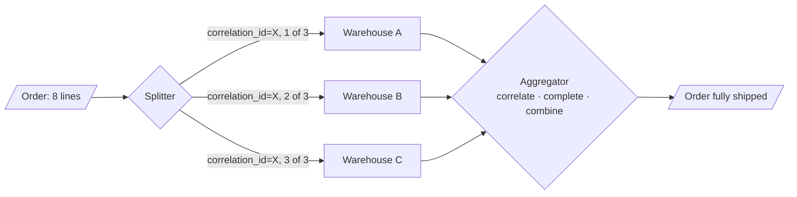

> Breaking one message into many, and putting the answers back together. The hard part is
> never the splitting; it is knowing when you have received enough.

| | |
|---|---|
| **Module** | [05 — Messaging and EIP](/modules/messaging-and-eip/README) |
| **Prerequisites** | [05-03 Message router](/modules/messaging-and-eip/03-message-router-and-filter), [05-01 Correlation](/modules/messaging-and-eip/01-channels-and-endpoints) |
| **Also known as** | fork-join, fan-out/fan-in, composed message processor, resequencer |
| **Category** | Integration |

---

## 1. The problem

Two shapes, one mechanism.

**Splitting.** A ShopFlow order has 8 lines, fulfilled from 3 different warehouses. The order
arrives as one message; each warehouse needs only its own lines; and the customer must be told
when *all* of it has shipped.

**Scatter-gather.** For a shipment, ShopFlow requests quotes from 5 carriers and picks the
cheapest. Two respond in 200ms, two in 3s, one never responds at all. The customer is waiting.

Both raise the same three questions, and they are the whole lesson:

1. How do I know which replies belong to which original request?
2. How do I know when I have all of them?
3. What do I do when I clearly never will?

## 2. In plain language

A caterer receives an order for a wedding: 40 starters, 40 mains, 40 desserts. Three kitchens
handle one course each. The order is **split**, each kitchen works independently, and at
serving time the plates are **aggregated** back into one meal.

Every ticket carries the table number. That is correlation, and without it a returning plate
belongs to nobody.

The interesting question is what the head chef does at 19:00 when the dessert kitchen has sent
nothing. Wait, and the entire wedding eats late? Serve two courses and apologise? Send out a
substitute? There is no universally correct answer — but the answer must be *decided in
advance*, because at 19:00 nobody is thinking clearly.

**Where the analogy breaks down:** the head chef can shout at the dessert kitchen. An aggregator
gets silence, and cannot distinguish "still cooking" from "burned down".

## 3. How it works



### The four decisions an aggregator makes

| Decision | Options |
|---|---|
| **Correlation** | Which messages belong together — by `correlation_id`, always |
| **Completeness** | Fixed count · all-expected-ids-seen · a terminal "last" flag · timeout · quorum · first-good-answer |
| **Combination** | Concatenate · sum · pick best · first · custom merge |
| **Incompleteness** | Wait longer · emit partial · fail the whole · substitute a default |

**Completeness is where the bugs live.** A fixed count is only correct if the splitter tells the
aggregator the count, and that message can itself be lost. Sending the expected count *with
every part* (`part 2 of 3`) is more robust than sending it separately.

### Timeout strategies

| Strategy | Behaviour | Use |
|---|---|---|
| **Wait for all, no timeout** | Blocks forever on a lost part | Never |
| **Absolute timeout** | Emit or fail at T | Simple, predictable. The default |
| **Idle timeout** | Emit after N seconds with no new part | Good for unknown-size streams |
| **Quorum** | Proceed at k of n | Carrier quotes: 3 of 5 is plenty |
| **First good answer** | Take the first acceptable reply, cancel the rest | Latency-critical reads ([10-04](/modules/performance-and-concurrency/04-tail-latency-and-hedged-requests)) |

### Scatter-gather is a fan-out, and fan-out has a tail

From [00-04](/modules/foundations/04-latency-throughput-and-back-of-envelope): waiting for
all N replies means your latency is the *maximum* of N, so you hit someone's p99 with
probability `1 - 0.99^N`. **Scatter-gather to 5 services turns a 200ms p50 into a 3s p99.** This
is why quorum and first-good-answer strategies exist, and why "wait for all" should be rare.

### Resequencer

Split parts arrive out of order. A **resequencer** buffers and re-emits in sequence — the same
mechanism as the version gate in
[04-04](/modules/data-and-consistency/04-idempotent-consumer-and-inbox), and it has the same
hazard: a permanently missing part stalls the sequence forever unless there is a timeout.

## 4. Pseudo-code

**Splitter — one message becomes many, with everything needed to reassemble.**

```
service OrderSplitter:
  uses warehouses: Client<WarehouseRouting>

  on event OrderPlaced(e, meta):
    groups = group_by(e.lines, line => warehouses.for_sku(line.sku))

    for (i, (warehouse, lines)) in enumerate(groups):
      fulfilment_requests.send(Message(
        message_id: uuid(),
        correlation_id: meta.correlation_id,      # ties every part to the original
        payload: FulfilOrder(order_id: e.order_id, warehouse: warehouse, lines: lines),
        headers: {
          sequence_number: i,
          sequence_size: groups.size,             # WHY on EVERY part: if a separate
                                                  # "expect 3" message is lost, the
                                                  # aggregator waits forever
          is_last: i == groups.size - 1,
        }))

    # The aggregator learns the expected count from the parts themselves.
    # No separate registration message means one less thing to lose.
```

**Aggregator — correlate, complete, combine, and give up on time.**

```
# One ROW per part. Not a map inside one value — see the TRAP below.
record Part:
  correlation_id: UUID
  sequence_number: Int
  sequence_size: Int
  payload: Message
  received_at: Instant

service ShipmentAggregator:
  uses parts: Store<(UUID, Int), Part>          # the parts themselves
  uses completed: Store<UUID, Instant>          # the emit-once claim
  uses outbox: Store<UUID, OutboxRecord>        # 04-03
  uses out: SendingEndpoint<OrderFullyShipped>
  timeout: Duration = 24h                    # fulfilment is slow; sized to the domain

  @at_least_once
  on event PartShipped(e, meta):
    # TRAP if written as read-modify-write on the whole Aggregation:
    #
    #   a = pending.get(id); a.received.put(seq, e); pending.put(id, a)
    #
    # Keying by sequence number makes DUPLICATE delivery of one part safe. It
    # does nothing about CONCURRENT DISTINCT parts: two handlers read the same
    # Aggregation, each adds its own part to its own copy, and the second `put`
    # silently discards the first part. The order then never completes, and the
    # only symptom is a sweeper alert 24 hours later.
    #
    # Store parts as ROWS, not as a map inside one value. Insertion is then
    # per-part and cannot lose a sibling.
    inserted = parts.put_if_absent((meta.correlation_id, meta.sequence_number),
                 Part(correlation_id: meta.correlation_id,
                      sequence_number: meta.sequence_number,
                      sequence_size: meta.sequence_size,
                      payload: e, received_at: now()))
    if not inserted:
      metrics.increment("aggregator.duplicate_part")
      return                                   # already have this part. Idempotent.

    # Completion is DERIVED from what is persisted, never from an in-memory copy.
    # Re-read inside a transaction so the check and the claim cannot interleave.
    atomically:
      have = parts.query(correlation_id: meta.correlation_id)
      if not is_complete(have): return         # not yet — another part will finish it

      # Exactly one handler wins the right to emit, whichever observes the last
      # part. The claim is the guard: a second concurrent finisher fails it.
      if not completed.put_if_absent(meta.correlation_id, now()):
        return                                 # someone else is emitting
      outbox.append(OrderFullyShipped(meta.correlation_id, have))   # 04-03

    # WHY the outbox rather than emitting here: emit + delete were two writes,
    # so a crash between them re-emitted on redelivery. Now the completion event
    # commits with the claim, and the publisher is at-least-once — which
    # downstream already tolerates (04-04). Parts are swept later, not now.

  # Derived from the persisted rows, so it cannot disagree with what is durable.
  fn is_complete(have: List<Part>) -> Bool:
    match strategy:
      case WAIT_FOR_ALL:  return have.size == have.first().sequence_size
      case QUORUM(k):     return have.size >= k
      case FIRST_GOOD:    return have.any(p => is_acceptable(p.payload))
      case IDLE(d):       return now() - have.max_by(p => p.received_at).received_at > d

  # The sweeper. Without it, one lost part leaks an aggregation forever and the
  # customer is never told their order shipped.
  every 1m:
    for cid in parts.query(received_at_lt: now() - timeout).distinct(correlation_id):
      if completed.get(cid) is Some: continue     # finished; just awaiting cleanup
      have = parts.query(correlation_id: cid)
      missing = (0..have.first().sequence_size - 1) - have.map(p => p.sequence_number)
      log.error("aggregation timed out", correlation: cid, missing: missing)
      metrics.increment("aggregation.timeout")

      # The decision that must be made in advance, per use case — and taken
      # under the same claim, so a part arriving right now cannot also emit.
      atomically:
        if not completed.put_if_absent(cid, now()): continue
        match strategy.on_timeout:
          case EMIT_PARTIAL: outbox.append(OrderFullyShipped(cid, have, partial: true))
          case FAIL:         outbox.append(AggregationFailed(cid, missing))
          case ESCALATE:     outbox.append(EscalateToHuman(cid, have, missing))

  # Cleanup is separate from completion, and runs well after it. Deleting parts
  # in the same breath as emitting would make a late duplicate part look new.
  every 1h:
    for cid in completed.query(value_lt: now() - 7d):
      parts.delete_where(correlation_id: cid)
      completed.delete(cid)
```

**Scatter-gather — and why "wait for all" is usually wrong.**

```
service CarrierQuoteService:
  uses carriers: List<Client<Carrier>>       # 5 carriers
  uses pending: Store<UUID, Aggregation>

  @timeout(2s)                                # the customer is waiting
  async fn best_quote(shipment: Shipment) -> Result<Quote, Error>:
    correlation = uuid()

    # SCATTER — concurrently, each individually bounded.
    for c in carriers:
      spawn c.request_quote(shipment, correlation_id: correlation, reply_to: quotes_in)

    # GATHER — with a quorum, not "all".
    # WHY: waiting for all 5 means our latency is the SLOWEST carrier's p99.
    # 3 quotes is enough to pick a good price, and it arrives in p50 time.
    deadline = now() + 1.5s
    while now() < deadline:
      a = pending.get(correlation)
      if a.received.size >= 3: break
      sleep(50ms)

    a = pending.get(correlation)
    if a.received.size == 0:
      # Nobody answered. Degrade rather than fail (02-07).
      return Ok(fallback_flat_rate(shipment))

    metrics.histogram("quotes.received", a.received.size)
    return Ok(a.received.values().min_by(q => q.price))
    # Late quotes still arrive; the sweeper discards them. That is fine and
    # expected — but the receiving endpoint must not crash on an unknown
    # correlation id, which is the classic scatter-gather bug.
```

**Resequencer — restoring order, with a bounded wait.**

```
# The buffer must record WHEN it buffered, or the sweeper below cannot exist.
record BufferedMessage:
  message: Message
  correlation_id: UUID
  sequence_number: Int
  buffered_at: Instant

service Resequencer:
  uses buffer: Store<(UUID, Int), BufferedMessage>
  uses next_expected: Store<UUID, Int>
  gap_timeout: Duration = 30s

  on message(m: Message):
    n = next_expected.get(m.correlation_id) ?? 0
    if m.sequence_number < n: return                  # duplicate or late. Drop.
    buffer.put((m.correlation_id, m.sequence_number),
               BufferedMessage(m, m.correlation_id, m.sequence_number, buffered_at: now()))

    while be = buffer.get((m.correlation_id, n)):
      out.send(be.message)
      buffer.delete((m.correlation_id, n))
      n += 1
    next_expected.put(m.correlation_id, n)

  every 10s:
    # `query` on the declared buffered_at — `scan` takes a key prefix and cannot
    # express "older than", which is the whole point of this sweeper.
    for be in buffer.query(buffered_at_lt: now() - gap_timeout):
      # TRAP if omitted: one lost part stalls that correlation id permanently,
      # and everything behind it queues forever.
      log.error("resequencer gap", correlation: be.correlation_id,
                waiting_for: next_expected.get(be.correlation_id))
      skip_to(be.correlation_id, be.sequence_number)  # emit out of order, but emit
```

## 5. Knobs and variants

| Knob | Guidance | Failure if wrong |
|---|---|---|
| Correlation | `correlation_id` on every part | Without it, reassembly is impossible |
| Expected count | On every part, not a separate message | A lost count message means waiting forever |
| Completion | Quorum or first-good for latency paths | "Wait for all" gives you the worst tail |
| Timeout | Sized to the domain (2s for quotes, 24h for fulfilment) | No timeout = leaked state and a silent customer |
| On timeout | Decided in advance, per use case | Deciding during an incident goes badly |
| Aggregation state | Durable | In-memory state loses everything on restart |
| Late replies | Discard silently, count them | Crashing on an unknown correlation id is a common bug |

## 6. Challenges and failure modes

- **Aggregation state leaks.** Every incomplete aggregation is retained state. Without a
  sweeper it grows forever, and each leak is a customer who was never notified.
- **The lost part.** One warehouse never reports. The aggregation stalls, the customer waits,
  and nothing errors. The timeout is what turns this into an alert instead of a mystery.
- **Fan-out tail latency.** Covered above. The single most under-appreciated cost of
  scatter-gather.
- **Duplicate parts.** At-least-once delivery means parts arrive twice. Keying by sequence
  number makes this free; counting arrivals makes it a bug.
- **Aggregator restart.** In-memory aggregations vanish. Durable state, or accept the loss
  explicitly.
- **Correlation id collision or reuse.** Two flows merge into one aggregation. Use UUIDs and
  never derive them from business keys that can repeat.
- **Late replies to a completed aggregation.** Must be discarded gracefully — and counted, since
  a rising rate means your timeout is too tight.
- **Splitting without a plan for reassembly.** Common: the split is easy and gets built; the
  aggregation is hard and gets deferred; the flow silently never completes.
- **Unbounded splits.** A 10,000-line order becomes 10,000 messages in one burst. Batch and
  throttle.

## 7. Alternatives

- **Keep it whole.** If the receiver can handle the full message, do not split.
- **Synchronous `parallel` fan-out** ([01-01](/modules/communication/01-synchronous-request-response)).
  For short, in-request fan-outs, language-level concurrency plus a deadline is far simpler
  than a durable aggregator.
- **[Process manager](/modules/messaging-and-eip/07-process-manager-and-routing-slip).** When the fan-out is one step
  in a longer stateful flow, the process manager owns the state and the aggregation is just
  part of it.
- **Stream processing windows.** Kafka Streams / Flink session and tumbling windows are
  aggregators with built-in state, time semantics and recovery. Use them rather than
  hand-rolling if you are already in that ecosystem.
- **Poll for completion.** Instead of aggregating pushes, periodically query "are all parts
  done?" Simpler, and it adds latency and query load.

## 8. Trade-offs

| Advantage | Disadvantage |
|---|---|
| Parts are processed independently and concurrently | Aggregation is durable state that can leak |
| Each receiver gets only what concerns it | Completeness is genuinely hard to determine |
| Quorum strategies cut tail latency dramatically | Partial results must be meaningful to the business |
| Failure of one part need not fail the whole | One lost part can silently stall a flow forever |
| Natural fit for heterogeneous fulfilment | More messages, more correlation, more monitoring |

## 9. Complexity introduced

- **Operational.** Pending-aggregation count and age as metrics; timeout alerts; late-reply
  rates; state store sizing.
- **Cognitive.** Correlation, completeness and timeout semantics must be understood by anyone
  changing the flow.
- **Failure surface.** Leaked aggregations, stalled sequences, duplicate parts, lost counts,
  fan-out tail latency.
- **Testing.** Must cover: a part never arriving, parts arriving twice, parts arriving out of
  order, and the aggregator restarting mid-aggregation.

## 10. Related concepts

- **Builds on:** [05-01 Correlation](/modules/messaging-and-eip/01-channels-and-endpoints), [05-03 Router](/modules/messaging-and-eip/03-message-router-and-filter)
- **Composes with:** [05-07 Process manager](/modules/messaging-and-eip/07-process-manager-and-routing-slip), [04-04 Idempotent consumer](/modules/data-and-consistency/04-idempotent-consumer-and-inbox), [10-04 Hedged requests](/modules/performance-and-concurrency/04-tail-latency-and-hedged-requests)
- **Conflicts with / tension:** latency — waiting for all replies means waiting for the slowest
- **Contrast with:** [03-04 Scatter-gather queries](/modules/scalability/04-partitioning-and-sharding) — the same shape applied to shards rather than services
- **Leads to:** [05-06 Dead letter channel and poison messages](/modules/messaging-and-eip/06-dead-letter-channel-and-poison-messages)

## 11. Exercises

1. **Trace it.** An 8-line order splits across 3 warehouses. Warehouse B ships, but its
   `PartShipped` message is lost. Walk through the next 24 hours: what does the aggregator hold,
   what does the customer see, and when does anyone find out?
2. **Extend it.** Change the carrier quote gather from quorum-of-3 to "return as soon as any
   quote under €10 arrives, otherwise best of 3 within 1.5s". Write `is_complete`.
3. **Break it.** Two orders for the same customer are placed 50ms apart, and the correlation id
   is derived as `hash(customer_id, date)`. Show how one order ships with the other's contents.

## 12. References

- Hohpe & Woolf, *Enterprise Integration Patterns* — Splitter, Aggregator, Scatter-Gather, Resequencer, Composed Message Processor, Correlation Identifier.
- Dean & Barroso, "The Tail at Scale" (CACM 2013) — why fan-out latency behaves as it does.
- Apache Camel documentation — aggregator completion strategies, an unusually good reference.
- Kafka Streams / Apache Flink documentation — windowed aggregation with state and recovery.

---

**Up:** [Module 05](/modules/messaging-and-eip/README) · **Previous:** [← 05-04](/modules/messaging-and-eip/04-message-translator-and-canonical-data-model) · **Next:** [05-06 Dead letter channel and poison messages →](/modules/messaging-and-eip/06-dead-letter-channel-and-poison-messages)
