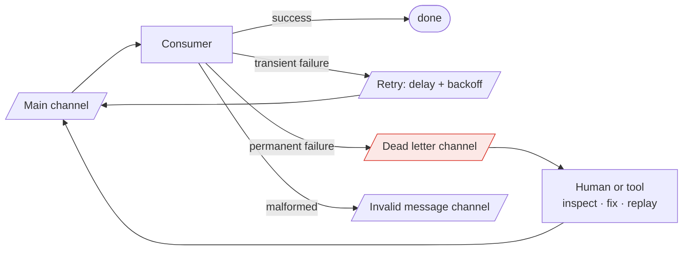

> One message that can never succeed will retry forever, block everything behind it, or be
> silently discarded. A dead letter channel is where it goes instead — and getting it back is
> the part everyone forgets to build.

| | |
|---|---|
| **Module** | [05 — Messaging and EIP](/modules/messaging-and-eip/README) |
| **Prerequisites** | [05-01 Channels](/modules/messaging-and-eip/01-channels-and-endpoints), [02-02 Retries](/modules/resilience/02-retries-backoff-and-jitter) |
| **Also known as** | DLQ, poison message queue, quarantine, parking lot |
| **Category** | Integration |

---

## 1. The problem

A partner sends an order message with `quantity: -3`. ShopFlow's consumer throws. The broker
redelivers. It throws again. Forever.

Three possible outcomes, all bad without a DLQ:

- **Infinite retry loop.** The consumer burns CPU, fills logs, and — on an ordered partition —
  **blocks every message behind it**. One malformed message from one partner stops all order
  processing.
- **Silent discard.** After N attempts the consumer gives up and acks. The order is gone. The
  partner believes it was accepted. Nobody notices for weeks.
- **Consumer crash loop.** The message kills the process; the process restarts; the message is
  redelivered; repeat. Kubernetes reports a CrashLoopBackOff and the cause is one row of data.

## 2. In plain language

A sorting office. A parcel has an illegible address. The sorter cannot deliver it and cannot
guess. If they put it back on the belt, it circles all day and blocks the belt. If they bin
it, the sender never learns and the recipient never receives.

Real postal services have a third option: the **dead letter office**. The parcel is set aside,
in a specific place, with a note about what went wrong. Delivery continues. Later, a person
looks at it — perhaps the address is decipherable, perhaps the sender can be contacted, perhaps
it is genuinely undeliverable.

The critical detail: a dead letter office that nobody ever visits is just a slower bin. The
value is entirely in the process of going through it, and that process has to be somebody's
actual job.

**Where the analogy breaks down:** a postal worker can open a parcel and read the letter
inside. A DLQ message may contain personal data an operator is not allowed to see, which makes
tooling and access control a real design problem.

## 3. How it works



### Transient vs permanent — classify before you retry

| Failure | Class | Action |
|---|---|---|
| Downstream timeout / 503 | Transient | Retry with backoff |
| Database deadlock | Transient | Retry |
| Rate limited | Transient | Retry after `Retry-After` |
| Schema violation | Permanent | Invalid message channel. Never retry |
| Business rule violation (`quantity: -3`) | Permanent | DLQ |
| Referenced entity does not exist | **Ambiguous** | Retry a few times (it may be a race), then DLQ |
| Bug in the consumer | Permanent *until fixed*, then retryable | DLQ, fix, replay |

That last row is why a DLQ must support **replay**: many DLQ messages are not bad data at all —
they are good data that met a bug. Once the bug is fixed, they should be reprocessed. A DLQ
without replay converts every consumer bug into permanent data loss.

### Retry topology

Retrying in place blocks ordered partitions. The standard structure uses **separate retry
channels with increasing delays**:

```
main → retry-5s → retry-1m → retry-15m → DLQ
```

Each retry channel is consumed by a delayed consumer that republishes to the main channel. The
main channel keeps flowing while a failing message waits. Cost: ordering for that key is
sacrificed — which is usually the right trade, since the alternative is ordering for everything
being sacrificed.

### DLQ hygiene

A DLQ needs three things beyond existing:

1. **Context.** The original message *plus* the error, stack trace, attempt count, timestamps,
   consumer version, and trace id. A DLQ containing only the payload is nearly useless.
2. **Alerting.** On the *rate* of new messages, and on the *age* of the oldest. A DLQ that grows
   unnoticed is the silent discard with extra steps.
3. **A replay tool** with filtering, dry-run, rate limiting, and an audit trail.

## 4. Pseudo-code

**Before — the three bad outcomes.**

```
service OrderConsumer:
  on message(m):
    try:
      process(m.body)
      m.ack()
    catch Error:
      m.nack()          # TRAP: redelivered immediately, forever, blocking the
                        # partition and burning CPU. Change nack() to ack() and
                        # you have silent data loss instead.
```

**The pattern — classify, retry with a topology, then quarantine with context.**

```
record DeadLetter:
  original: Message
  error_type: String
  error_message: String
  stack_trace: String
  attempts: Int
  first_failed_at: Instant
  last_failed_at: Instant
  consumer_version: String        # WHY: tells you whether a fix applies to this one
  trace_id: String
  source_channel: String

service OrderConsumer:
  uses dlq: SendingEndpoint<DeadLetter> to order_dlq
  uses invalid: SendingEndpoint<Message> to invalid_messages
  retry_schedule: List<Duration> = [5s, 30s, 2m, 10m, 1h]

  on message(m: Message<OrderReceived>):
    # 1. Structural validity is checked BEFORE any processing. It is a sender
    #    problem, is never retryable, and needs a different alert and a different
    #    owner than a processing failure.
    match validate_schema(m):
      case Err(e):
        invalid.send(m, headers: {reason: e})
        m.ack()
        metrics.increment("invalid_message", tags: {source: m.headers.source})
        return
      case Ok: pass

    try:
      process(m.body)
      m.ack()

    catch TransientError as e:
      if m.attempt <= retry_schedule.size:
        # Republish to a DELAYED channel, not in place: the main channel keeps
        # flowing while this message waits.
        retry_channel(retry_schedule[m.attempt - 1])
          .send(m with { attempt: m.attempt + 1 })
        m.ack()
      else:
        to_dlq(m, e, "transient failure exhausted")

    catch PermanentError as e:
      to_dlq(m, e, "permanent")          # do not waste attempts on the certain

    catch Error as e:
      # Unexpected: probably a bug in us, not bad data. DLQ it so it can be
      # replayed after the fix, and alert loudly — this is a code problem.
      to_dlq(m, e, "unexpected")
      alert("unexpected consumer error", error: e, trace: m.trace_id)

  fn to_dlq(m: Message, e: Error, reason: String):
    dlq.send(DeadLetter(
      original: m, error_type: type_of(e), error_message: e.message,
      stack_trace: e.stack, attempts: m.attempt,
      first_failed_at: m.headers.first_failed_at ?? now(), last_failed_at: now(),
      consumer_version: BUILD_VERSION, trace_id: m.trace_id,
      source_channel: m.channel))
    m.ack()
    metrics.increment("dlq.sent", tags: {reason: reason, type: type_of(e)})
```

**Monitoring — without this the DLQ is a slower bin.**

```
service DlqMonitor:
  every 1m:
    depth = order_dlq.depth()
    oldest = order_dlq.peek_oldest()

    metrics.gauge("dlq.depth", depth)
    metrics.gauge("dlq.oldest_age_s", now() - oldest.last_failed_at)

    # Rate matters more than depth: a sudden burst means something just broke.
    if rate_of("dlq.sent", window: 5m) > 10/m:
      page("DLQ filling rapidly — likely a deploy or an upstream change")

    # Age matters too: a message nobody has looked at in a week is a lost order.
    if now() - oldest.last_failed_at > 24h:
      alert("DLQ messages unattended for 24h", depth: depth)

    # Grouping turns 4,000 messages into "one bug and one bad partner".
    for (error_type, count) in group_by(order_dlq.sample(500), e => e.error_type):
      metrics.gauge("dlq.by_type", count, tags: {type: error_type})
```

**Replay — the half that is usually missing.**

```
service DlqReplayTool:
  uses dlq: Store<UUID, DeadLetter>
  uses main: SendingEndpoint<Message>

  fn replay(filter: Filter, dry_run: Bool, rate: Rate, operator: String)
      -> ReplayReport:
    candidates = dlq.query(filter)         # e.g. error_type = X, consumer_version < Y

    if dry_run:
      return ReplayReport(would_replay: candidates.size,
                          sample: candidates.take(10))
      # WHY dry-run first: replaying 40,000 messages into a live system with no
      # rate limit is a self-inflicted denial of service.

    limiter = RateLimiter(rate: rate)      # typically 10–100/s, well below capacity
    replayed = 0

    for d in candidates:
      limiter.acquire()

      # TRAP: replaying with the ORIGINAL message_id means consumers that have an
      # inbox record from a partially-successful earlier attempt will skip it.
      # Replaying with a NEW id means genuinely duplicate processing.
      # Correct answer: keep the original id, and ensure the inbox record is only
      # written on SUCCESS (04-04). Then replay is safe and idempotent.
      main.send(d.original with {
        attempt: 1,
        headers: d.original.headers + {replayed_from_dlq: true,
                                       replayed_at: now(),
                                       replayed_by: operator}})
      dlq.delete(d.id)
      replayed += 1

    audit.record(ReplayAudit(operator, filter, replayed, now()))
    return ReplayReport(replayed: replayed)

  # Retention: long enough to fix a bug and replay, short enough to bound storage.
  # Must be at least as long as the inbox retention (04-04), or replay duplicates.
  every 1d:
    dlq.delete_where(last_failed_at < now() - 90d)
```

## 5. Knobs and variants

| Knob | Guidance | Failure if wrong |
|---|---|---|
| Max attempts | 3–5 for transient; 0 for permanent | Too many wastes capacity; too few DLQs recoverable messages |
| Retry topology | Separate delay channels | In-place retry blocks ordered partitions |
| Backoff | Exponential with jitter | Synchronised retries hammer a recovering dependency |
| Invalid vs DLQ | Separate channels | Mixing means unfixable messages are retried |
| DLQ retention | ≥ inbox retention, ≤ 90d | Shorter than inbox = duplicates on replay |
| Replay rate | 10–100/s, dry-run first | Unlimited replay is a self-DDoS |
| Alerting | Rate *and* age | Depth alone misses a slow leak |
| Message id on replay | Keep the original | New ids defeat consumer deduplication |

## 6. Challenges and failure modes

- **The DLQ nobody looks at.** The most common failure. A DLQ with 40,000 messages and no owner
  is data loss with a paper trail. Assign ownership; alert on age.
- **No replay capability.** Every consumer bug becomes permanent data loss. Build the replay
  tool at the same time as the DLQ.
- **Poison message blocking an ordered partition.** In-place retry on a partitioned log stops
  everything behind it. Separate retry channels.
- **DLQ storms.** A deploy breaks a consumer; 100,000 messages hit the DLQ in ten minutes.
  Alert on rate, and consider pausing the consumer rather than draining into quarantine.
- **Replaying into the same bug.** Messages bounce back immediately. Always dry-run, always
  filter by `consumer_version`.
- **Replay without rate limiting** overwhelms downstream systems that were fine a moment ago.
- **PII in DLQ messages.** Operators inspecting quarantined messages may see data they should
  not. Redact, restrict access, and apply the same retention rules as production data.
- **Ordering broken by replay.** A message from Tuesday replayed today arrives after messages
  from Wednesday. Consumers must tolerate it — version gates
  ([04-04](/modules/data-and-consistency/04-idempotent-consumer-and-inbox)) do exactly this.
- **DLQ retention shorter than inbox retention.** Replay after the inbox record expired
  reprocesses successfully-handled messages. Align the windows.

## 7. Alternatives

- **Fail the consumer and stop.** For ordered, financially critical streams, halting and paging
  a human can be correct: nothing proceeds past a message that must not be skipped.
- **Skip and log.** Cheap, and it is silent data loss. Acceptable only for genuinely
  disposable data such as telemetry samples.
- **Park in a database table** rather than a queue. Easier to query, group, annotate and build
  a UI over. For low-volume, high-value quarantine this is often better than a DLQ.
- **Return to sender.** For partner integrations, reject at the API boundary so the sender's own
  monitoring catches it. **Far better than accepting and quarantining** — the party who can fix
  the data learns about it immediately.
- **Automatic remediation.** A repair step that fixes known-bad shapes and resubmits.
  Appropriate for a small set of recurring, well-understood defects.

## 8. Trade-offs

| Advantage | Disadvantage |
|---|---|
| One bad message cannot block the stream | Quarantined messages need a human process |
| Nothing is silently lost | Storage, tooling and ownership costs |
| Consumer bugs become recoverable via replay | Replay can duplicate or reorder if done carelessly |
| DLQ contents are excellent diagnostics | May contain PII, requiring access control |
| Groups of failures reveal systemic problems | A DLQ with no owner is worse than useless |

## 9. Complexity introduced

- **Operational.** DLQ per channel; depth, age and rate metrics; alerting; a documented triage
  and replay runbook; a named owner; access control and retention policy.
- **Cognitive.** Engineers must classify every failure as transient, permanent or structural —
  a judgement that is easy to get wrong.
- **Failure surface.** Unattended DLQs, replay storms, replay-into-the-same-bug, ordering
  violations, retention misalignment.
- **Testing.** Must test: a poison message reaching the DLQ with full context, a successful
  replay after a fix, and that a DLQ'd message did not partially apply.

## 10. Related concepts

- **Builds on:** [05-01 Channels](/modules/messaging-and-eip/01-channels-and-endpoints), [02-02 Retries](/modules/resilience/02-retries-backoff-and-jitter)
- **Composes with:** [04-04 Idempotent consumer](/modules/data-and-consistency/04-idempotent-consumer-and-inbox) (what makes replay safe), [11-01 Observability](/modules/operations-and-evolution/01-observability)
- **Conflicts with / tension:** ordering — quarantining a message means the stream continues without it
- **Contrast with:** [02-02 Retries](/modules/resilience/02-retries-backoff-and-jitter) — retries handle the temporary, DLQs handle the permanent. Confusing them wastes capacity or loses data
- **Leads to:** [05-07 Process manager and routing slip](/modules/messaging-and-eip/07-process-manager-and-routing-slip)

## 11. Exercises

1. **Trace it.** A partner sends 500 orders with a field the consumer's new version cannot
   parse. Walk through the retry schedule and the DLQ. How long until an alert fires, and what
   does the operator see?
2. **Extend it.** Add automatic remediation for one known defect: `quantity: -3` should become
   a rejection notice to the partner rather than a DLQ entry. Where does that logic go, and why
   not in the consumer?
3. **Break it.** DLQ retention is 90 days; inbox retention is 30 days. An operator replays a
   45-day-old message that had *partially* processed before failing. Describe the resulting
   inconsistency and fix the configuration.

## 12. References

- Hohpe & Woolf, *Enterprise Integration Patterns* — Dead Letter Channel, Invalid Message Channel.
- AWS SQS documentation — dead-letter queues, redrive policies and the redrive API.
- Uber Engineering, "Building Reliable Reprocessing and Dead Letter Queues with Apache Kafka" — the retry-topic topology in production.
- Confluent, "Error Handling Patterns in Kafka".
- Michael Nygard, *Release It!*, 2nd ed. — on failure classification.

---

**Up:** [Module 05](/modules/messaging-and-eip/README) · **Previous:** [← 05-05](/modules/messaging-and-eip/05-splitter-aggregator-and-scatter-gather) · **Next:** [05-07 Process manager and routing slip →](/modules/messaging-and-eip/07-process-manager-and-routing-slip)
