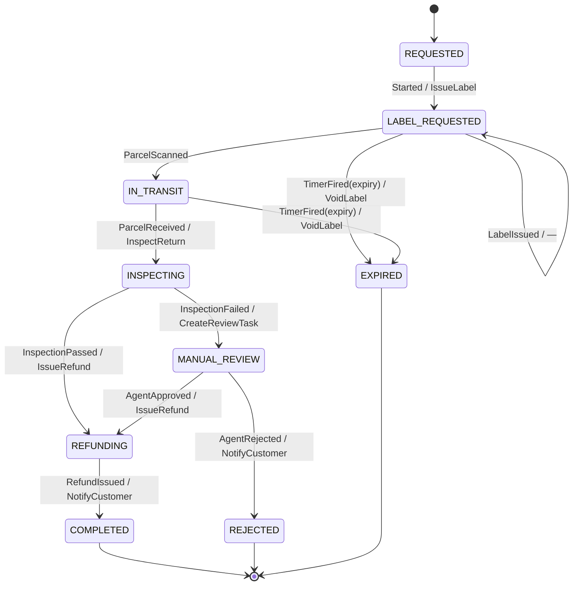

> When a business flow has state, branches and deadlines, someone has to own it. A process
> manager is that owner; a routing slip is the lightweight alternative that carries the plan
> with the message.

| | |
|---|---|
| **Module** | [05 — Messaging and EIP](/modules/messaging-and-eip/README) |
| **Prerequisites** | [05-05 Aggregator](/modules/messaging-and-eip/05-splitter-aggregator-and-scatter-gather), [04-02 Saga](/modules/data-and-consistency/02-saga) |
| **Also known as** | orchestrator, workflow, state machine, durable execution |
| **Category** | Integration |

---

## 1. The problem

ShopFlow's returns process: a customer requests a return; a label is generated; the parcel is
collected; the warehouse inspects it; if it passes, a refund is issued; if it fails,
photographs are taken and a human decides. If the parcel does not arrive within 21 days, the
return is cancelled and the customer is notified.

That is not a sequence of messages. It is a **stateful, long-running process with branches,
timers and human steps**. Choreographing it — each service reacting to the previous one's
event — spreads the logic across six services, and nobody can answer "what happens if the
inspection fails after the refund was already issued?" without reading six repositories.

Meanwhile a *different* problem: fulfilment steps vary by partner. Partner A needs
validate → customs → label. Partner B needs validate → label. Partner C adds an insurance step.
The sequence is data, not code.

## 2. In plain language

Two ways to run a workshop.

**A foreman** (process manager) holds a clipboard for each job. They know the whole plan, send
work to each station, wait for it to come back, decide what happens next, and chase anything
that has taken too long. Ask them about job 47 and they tell you exactly where it is and what
is next. Ask them to change the process and you talk to one person.

**A travelling docket** (routing slip) is attached to the item itself. It lists the stations to
visit, in order. Each station does its bit, ticks the line, and passes the item to the next
station named on the docket. No foreman is needed. The plan is decided when the docket is
written, and different items can carry different plans.

The docket is elegant and limited: it cannot branch on results, cannot wait for a timer, and if
the item is lost so is the plan. The foreman handles all of that, and is a person whose absence
stops everything.

**Where the analogy breaks down:** a foreman remembers yesterday. A process manager remembers
nothing unless its state was written to durable storage before every step.

## 3. How it works

### Process manager

A durable state machine. It receives a trigger, decides the next step, dispatches a command,
records the state, and waits for a reply or a timer.



**The state, not the code, is the process.** Every transition is persisted; the process can be
resumed on any instance after any crash; and the state store answers "where is return 47?"
directly.

**Naming: a state says what the process has done, not what the world has confirmed.**
`LABEL_REQUESTED` means *we asked for a label and are waiting* — not that one exists.
`INSPECTING` and `REFUNDING` follow the same rule: the command went out, the outcome has not
come back. Only `IN_TRANSIT` names a fact the outside world reported.

The distinction is worth the extra syllables. A state called `LABEL_ISSUED` invites the reader
to assume a label exists, so the `LabelIssued` confirmation looks like it must cause a
transition — and when it does not, the code reads as if a case is missing. Name the state for
your own knowledge and the self-loop below becomes obvious rather than suspicious.

### Process manager vs saga vs workflow engine

These overlap heavily and the distinctions are often blurred:

| | Emphasis |
|---|---|
| **[Saga](/modules/data-and-consistency/02-saga)** | Consistency: every step has a compensation |
| **Process manager** | Coordination: state, branching, timers, human steps |
| **Workflow engine** (Temporal, Camunda, Step Functions) | An implementation that provides durability, timers, retries and history for you |

An orchestrated saga *is* a process manager whose steps happen to have compensations. If you
are building a process manager by hand and it needs durable timers, retries and versioning,
**you are building a workflow engine, and you should use one instead.**

### Routing slip

The message carries an ordered list of steps. Each step processes, marks itself done, and
forwards to the next.

Good for: variable linear sequences chosen at dispatch time; no central component; trivially
parallel.

Bad for: branching on results, waiting on timers, human intervention, and — critically —
**visibility**, since the only record of a flow's state is inside a message somewhere in a
queue. If it is lost, so is the process.

### Versioning long-running processes

The problem nobody anticipates: a return started under v1 of the process is still running when
v2 deploys. Options:

- **Version the process definition**, and let in-flight instances finish on their original
  version. Correct; you run N versions.
- **Migrate in-flight instances** with an explicit state-mapping function. Hard, and sometimes
  the only option for a critical fix.
- **Drain** — stop starting new instances on v1 and wait. Only viable for short processes.

For a 21-day return process, you will always have several versions live.

## 4. Pseudo-code

**Before — choreography for a process that is not a sequence.**

```
service LabelService:      on event ReturnRequested(e):  issue_label(e)
service WarehouseService:  on event ParcelReceived(e):   inspect(e)
service RefundService:     on event InspectionPassed(e): refund(e)
# Where is the 21-day timer? Where is the manual review branch? Where does an
# operator look to find out what state return 47 is in? Nowhere. The process
# exists only as an emergent property of six services.
```

**The pattern — a process manager with durable state and timers.**

```
enum ReturnState:
  REQUESTED | LABEL_REQUESTED | IN_TRANSIT | INSPECTING
  | MANUAL_REVIEW | REFUNDING | COMPLETED | REJECTED | EXPIRED

record ReturnProcess:
  id: UUID
  order_id: OrderId
  state: ReturnState
  version: Int                     # process DEFINITION version, not instance version
  data: Map<String, Any>
  updated_at: Instant

# Timers are ROWS, not a list inside the process — see the durable timer section.
record ProcessTimer:
  process_id: UUID
  name: String
  due_at: Instant
  claimed_until: Option<Instant>
  fired_at: Option<Instant>

service ReturnProcessManager:
  uses processes: Store<UUID, ReturnProcess>
  uses timers: Store<(UUID, String), ProcessTimer>
  uses outbox: Store<UUID, OutboxRecord>        # 04-03 — commands go through here

  # ---- trigger ----
  @at_least_once
  on event ReturnRequested(e, meta):
    # TRAP if written as `processes.put(...); dispatch(p)`:
    #   1. `put` is not idempotent. At-least-once delivery of the start event
    #      RESETS a process that may already be at INSPECTING, discarding real
    #      progress — and re-dispatches its first command.
    #   2. `put` then `dispatch` is a dual write (04-03). A crash between them
    #      loses the command permanently and the return sits in REQUESTED
    #      forever, which is exactly what the stall alert below will report
    #      without ever explaining.
    #
    # TRAP, and a subtle one: do NOT hardcode the first command here.
    #   atomically:
    #     processes.put_if_absent(id, ReturnProcess(state: REQUESTED, ...))
    #     outbox.append(GenerateLabel(...))      # ✗ invented out of thin air
    #
    # That looks fine and is broken twice over. The state stays REQUESTED
    # because the transition table never ran, so the next event arrives at a
    # state the table has no case for and is swallowed by the catch-all. And
    # `GenerateLabel` is a command name that exists nowhere in `next()` — the
    # flow you can read in one place is no longer the flow that executes.
    #
    # Creation is a TRANSITION like any other. Run the same table.
    fresh = ReturnProcess(id: meta.correlation_id, order_id: e.order_id,
                          state: REQUESTED, version: CURRENT_PROCESS_VERSION,
                          data: {}, updated_at: now())

    # One transaction: create-if-absent, arm the timer, apply the opening
    # transition, and record the commands it produced.
    atomically:
      if not processes.put_if_absent(meta.correlation_id, fresh):
        metrics.increment("process.duplicate_start")
        return                                  # already running. Do nothing.

      timers.put((meta.correlation_id, "expiry"),
                 ProcessTimer(meta.correlation_id, "expiry", due_at: now() + 21d))

      # REQUESTED --Started--> LABEL_REQUESTED, emitting IssueLabel. The command
      # and the state it implies come from one place, and cannot drift apart.
      (state, cmds) = next(fresh, Started)
      processes.update(meta.correlation_id, {state: state, updated_at: now()})
      for c in cmds: outbox.append(c)

    # The outbox publisher dispatches. Nothing is sent from inside this handler,
    # so there is no window in which state and command can disagree.

  # ---- the transition table: the entire process, readable in one place ----
  fn next(p: ReturnProcess, trigger: Trigger) -> (ReturnState, List<Command>):
    match (p.state, trigger):
      case (REQUESTED, Started):
        return (LABEL_REQUESTED, [IssueLabel(p.order_id, correlation: p.id)])

      case (LABEL_REQUESTED, LabelIssued):
        # Deliberately no transition. The state already records that we asked;
        # the label service confirming does not change what the process does
        # next, and nothing branches on it. Stated explicitly rather than left
        # to the catch-all, because the catch-all also swallows genuine bugs and
        # you want those two cases distinguishable in the logs.
        return (LABEL_REQUESTED, [])

      case (LABEL_REQUESTED, ParcelScanned):
        return (IN_TRANSIT, [])

      case (IN_TRANSIT, ParcelReceived):
        return (INSPECTING, [InspectReturn(p.order_id, correlation: p.id)])

      case (INSPECTING, InspectionPassed(r)):
        return (REFUNDING, [IssueRefund(p.order_id, r.amount, correlation: p.id)])

      case (INSPECTING, InspectionFailed(r)):
        # A branch. This is exactly what a routing slip cannot express.
        return (MANUAL_REVIEW, [CreateReviewTask(p.order_id, r.photos, correlation: p.id)])

      case (MANUAL_REVIEW, AgentApproved(a)):
        return (REFUNDING, [IssueRefund(p.order_id, a.amount, correlation: p.id)])

      case (MANUAL_REVIEW, AgentRejected(a)):
        return (REJECTED, [NotifyCustomer(p.order_id, "return_rejected", a.reason)])

      case (REFUNDING, RefundIssued):
        return (COMPLETED, [NotifyCustomer(p.order_id, "refund_sent")])

      case (LABEL_REQUESTED | IN_TRANSIT, TimerFired("expiry")):
        # A timer. The other thing a routing slip cannot do.
        return (EXPIRED, [VoidLabel(p.order_id), NotifyCustomer(p.order_id, "return_expired")])

      case (s, t):
        # TRAP if you throw here: a late duplicate reply (at-least-once delivery)
        # for a state you already left would crash the process. Ignore and count.
        metrics.increment("process.unexpected_trigger", tags: {state: s, trigger: t})
        return (s, [])

  fn handle(process_id: UUID, trigger: Trigger):
    p = processes.get(process_id)
    (new_state, cmds) = next(p, trigger)

    if new_state == p.state and cmds.is_empty(): return    # idempotent no-op

    atomically:
      processes.put(process_id, p with { state: new_state, updated_at: now() })
      for c in cmds: outbox.append(c)      # 04-03: state and commands commit together
    # WHY the outbox: dispatching commands outside the transaction means a crash
    # can advance the state without sending the command, and the process stalls
    # forever in a state nobody is working on.

  # ---- timers: the reason a process manager exists ----
  #
  # A 21-day timer outlives every process, deploy and leader that armed it, so
  # "who fires it, exactly once" needs the same rigour as any other side effect.
  # Three properties, and the code below is what each one costs:
  #   claimed  — one worker owns a due timer for a bounded window
  #   fired    — firing and the state change it causes commit together
  #   retried  — a worker that dies mid-fire releases the claim by expiry
  every 1m:
    # A lease is an optimisation, not the correctness mechanism: it keeps N
    # workers from scanning the same rows. The per-timer claim below is what
    # actually prevents double-firing, and it holds even without the lease.
    if lease = election.campaign(role: "return-timers"):    # 04-07
      due = timers.query(due_at_lt: now(), fired_at: None,
                         claimed_until_lt: now(), limit: 100)
      for t in due:
        # Claim atomically. A second worker — or this one after a restart —
        # fails this and moves on. The claim expires, so a crash mid-fire
        # returns the timer to the pool rather than stranding it.
        if not timers.compare_and_swap((t.process_id, t.name),
               expected: t, value: t with { claimed_until: now() + 2m }):
          continue

        # The transition and the timer's own completion commit together, so the
        # timer cannot be marked fired without its consequence, or vice versa.
        atomically:
          handle(t.process_id, TimerFired(t.name))          # writes state + outbox
          timers.update((t.process_id, t.name), {fired_at: now()})

  # WHY not an in-memory scheduler: it forgets everything on restart, and a
  # 21-day timer will certainly outlive the process that set it. WHY not cron
  # over the process table: `processes.query(timer_due:)` cannot express "one
  # worker, once" — the claim is the part that does.

  # ---- stall detection ----
  every 5m:
    for p in processes.query(state: [INSPECTING, REFUNDING],
                             updated_at < now() - 2h):
      # A process that has not moved is a customer who is not being served.
      alert("return process stalled", id: p.id, state: p.state,
            stuck_for: now() - p.updated_at)
```

**Routing slip — when the sequence is data and there are no branches.**

```
record RoutingSlip:
  steps: List<String>            # ["validate", "customs", "insure", "label"]
  current: Int
  history: List<(String, Instant, String)>    # step, when, outcome

service FulfilmentStep:
  on message(m: Message<FulfilOrder>):
    slip = m.headers.routing_slip

    result = execute_step(slip.steps[slip.current], m.body)
    slip.history.append((slip.steps[slip.current], now(), result))
    slip.current += 1

    if slip.current < slip.steps.size:
      channel_for(slip.steps[slip.current]).send(m with { routing_slip: slip })
    else:
      completed.send(m with { routing_slip: slip })
    # No central component, no state store, and no way to answer "how many orders
    # are stuck at customs right now?" without searching every queue.

service FulfilmentDispatcher:
  fn slip_for(partner: PartnerId, order: Order) -> RoutingSlip:
    steps = ["validate"]
    if crosses_border(order): steps.append("customs")
    if order.total > 500:     steps.append("insure")
    steps.append("label")
    return RoutingSlip(steps: steps, current: 0, history: [])
    # The whole plan is decided here, once, and cannot change based on results.
```

**Process versioning — the problem that arrives on day 22.**

```
service ReturnProcessManager:
  fn next(p: ReturnProcess, trigger: Trigger) -> (ReturnState, List<Command>):
    match p.version:
      case 1: return next_v1(p, trigger)     # in-flight returns finish as they started
      case 2: return next_v2(p, trigger)     # new returns use the new rules
    # WHY not just change next(): a return started 15 days ago under v1 has state
    # that v2's transition table may not recognise, and changing the rules
    # mid-process can skip a step the customer was promised.
```

## 5. Knobs and variants

| Knob | Guidance | Failure if wrong |
|---|---|---|
| Process manager vs routing slip | PM for branches, timers, humans; slip for linear variable sequences | A slip cannot branch; forcing it produces unreadable step logic |
| State persistence | Before every dispatch | State after dispatch = commands sent for states you never recorded |
| Command dispatch | Via [outbox](/modules/data-and-consistency/03-transactional-outbox) | Direct dispatch loses commands on a crash |
| Timers | Durable, leader-driven | In-memory timers vanish on restart |
| Unexpected trigger | Ignore and count | Throwing crashes on duplicate deliveries |
| Versioning | Version the definition; let instances finish | Changing the table under running instances skips steps |
| Stall detection | Alert on age per state | Silent stalls are customers waiting forever |
| Build vs buy | Use a workflow engine past moderate complexity | Hand-rolled durable execution is a large project |

## 6. Challenges and failure modes

- **The process manager as a god object.** Every flow ends up in one service, which then knows
  the whole business. One process manager per business process, owned by the team that owns
  that process.
- **State written after dispatching.** A crash in between means a command was sent for a
  transition that was never recorded. Persist first, dispatch via the outbox.
- **Lost timers.** In-memory timers do not survive restarts; a 21-day timer certainly will not.
  Durable timers, driven by a single leader.
- **Duplicate replies.** At-least-once delivery means a reply for an already-handled transition
  arrives again. The transition function must be idempotent — the `(s, t)` catch-all above.
- **Stalled processes.** A reply never arrives; the process waits forever in `INSPECTING`.
  Every state needs a maximum age and an alert.
- **Versioning.** Long processes span deploys. Always. Plan for it before the first release.
- **Routing slip losing the plan.** The slip lives in the message; lose the message and the
  process is gone with no record it existed.
- **No visibility with routing slips.** "How many are stuck at customs?" is unanswerable.
- **Human steps have no SLA by default.** `MANUAL_REVIEW` with no timer means a customer waits
  until someone happens to look.

## 7. Alternatives

- **Choreography** ([04-02](/modules/data-and-consistency/02-saga)). No central component;
  fine for 2–3 linear steps; unmaintainable beyond that.
- **Workflow engines** — Temporal, Camunda, AWS Step Functions, Netflix Conductor. They provide
  durable state, timers, retries, versioning, replay and a visual history. **For anything
  resembling the returns process, use one.** The pseudo-code above is essentially a poor
  reimplementation of one.
- **[Saga orchestrator](/modules/data-and-consistency/02-saga).** The same shape when the
  emphasis is compensation rather than coordination.
- **A database state machine plus cron.** A `status` column, a transition function, and a
  periodic job. Unfashionable, extremely debuggable, and adequate for many processes.
- **[Routing slip](#3-how-it-works).** For linear, variable, branch-free sequences.

## 8. Trade-offs

| Advantage | Disadvantage |
|---|---|
| The whole process is readable in one place | A central component that can become a god object |
| State answers "where is X?" directly | Durable state, timers and leadership to operate |
| Timers, branches and human steps are natural | Long-running processes force version management |
| Recovery after a crash is straightforward | Every state needs a stall timeout and an alert |
| Routing slips need no central component at all | ...and give no visibility and no branching |

## 9. Complexity introduced

- **Operational.** Process state store; durable timer execution with leader election; per-state
  counts and age dashboards; stall alerting; a tool to inspect and manually advance a stuck
  process.
- **Cognitive.** A state machine to understand, plus the interaction between at-least-once
  delivery and transitions, plus multiple live versions.
- **Failure surface.** Lost commands, lost timers, stalled processes, duplicate triggers,
  version mismatches.
- **Testing.** Every transition, every timer, every duplicate trigger, and a crash between
  persist and dispatch. State machines are unusually testable — take advantage of it.

## 10. Related concepts

- **Builds on:** [04-02 Saga](/modules/data-and-consistency/02-saga), [05-05 Aggregator](/modules/messaging-and-eip/05-splitter-aggregator-and-scatter-gather)
- **Composes with:** [04-03 Outbox](/modules/data-and-consistency/03-transactional-outbox), [04-07 Leader election](/modules/data-and-consistency/07-consensus-and-leader-election), [05-03 Router](/modules/messaging-and-eip/03-message-router-and-filter)
- **Conflicts with / tension:** decentralisation — this is deliberate centralisation of flow logic
- **Contrast with:** choreography — emergent flow versus explicit flow
- **Leads to:** [Module 08 — Microservice architecture](/modules/microservice-architecture/README)

## 11. Exercises

1. **Trace it.** A return reaches `INSPECTING`. The warehouse's `InspectionPassed` reply is
   delivered twice, 4 seconds apart. Walk both through `handle`. What prevents a double refund,
   and what would happen if the catch-all case threw instead of counting?
2. **Extend it.** Add an SLA to `MANUAL_REVIEW`: if no agent decides within 48 hours,
   auto-approve refunds under €50 and escalate the rest. Write the transition and the timer.
3. **Break it.** The routing slip version has 40,000 orders in flight when the "customs" step's
   queue is accidentally deleted. Describe what is recoverable, then explain what the process
   manager version would have made recoverable instead.

## 12. References

- Hohpe & Woolf, *Enterprise Integration Patterns* — Process Manager, Routing Slip, Message Broker.
- Chris Richardson, *Microservices Patterns* — Ch. 4, saga orchestration.
- Temporal documentation — durable execution, versioning of long-running workflows.
- AWS Step Functions documentation — state machines as a managed service.
- Bernd Rücker, *Practical Process Automation* — orchestration versus choreography, argued carefully.

---

**Up:** [Module 05](/modules/messaging-and-eip/README) · **Previous:** [← 05-06](/modules/messaging-and-eip/06-dead-letter-channel-and-poison-messages) · **Next:** [Module 06 — Domain-driven design →](/modules/domain-driven-design/README)
