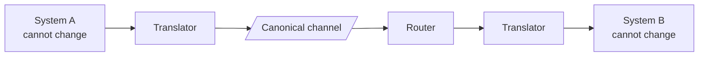

> The patterns for connecting systems you did not build, do not own, and cannot change.
> Hohpe and Woolf catalogued them in 2003; twenty years later they are still the vocabulary.

## What you will be able to do

- Name the moving parts of a messaging system precisely, and say what each guarantees.
- Route, filter, transform and correlate messages without coupling producers to consumers.
- Integrate a 20-year-old ERP that has no API, without modifying the ERP.
- Handle the message that can never be processed, and get it back afterwards.
- Recognise which EIP a modern tool is implementing under a different name.

## Lessons

| # | Lesson | The integration problem it solves |
|---|---|---|
| 05-01 | [Channels and endpoints](/modules/messaging-and-eip/01-channels-and-endpoints) | The vocabulary; what a channel guarantees |
| 05-02 | [Point-to-point and publish/subscribe](/modules/messaging-and-eip/02-point-to-point-and-publish-subscribe) | One consumer or many |
| 05-03 | [Message router and filter](/modules/messaging-and-eip/03-message-router-and-filter) | Sending each message to the right place |
| 05-04 | [Message translator and canonical data model](/modules/messaging-and-eip/04-message-translator-and-canonical-data-model) | Systems that disagree about what a "customer" is |
| 05-05 | [Splitter, aggregator and scatter-gather](/modules/messaging-and-eip/05-splitter-aggregator-and-scatter-gather) | Decomposing a message and recombining the answers |
| 05-06 | [Dead letter channel and poison messages](/modules/messaging-and-eip/06-dead-letter-channel-and-poison-messages) | The message that will never succeed |
| 05-07 | [Process manager and routing slip](/modules/messaging-and-eip/07-process-manager-and-routing-slip) | Multi-step flows with state |

## The one idea

**Enterprise integration is the discipline of connecting systems whose owners will not
cooperate with you.**

Microservice patterns assume you control both ends: you can change the producer and the
consumer, agree a schema, and deploy together. Enterprise integration assumes you control
neither. The ERP will not add an API. The partner will not change their XML. The mainframe
batch runs at 02:00 and that is that.

Every pattern here is a form of indirection that lets two unchangeable things work together:

The vocabulary is old and the implementations are new: Kafka Streams, an API gateway, an ESB,
a Lambda, and a `for` loop in a cron job are all implementing the same handful of patterns.
Knowing the names lets you recognise the pattern regardless of the tool.

## ShopFlow at the end of this module

The legacy ERP — no API, a 15-minute CSV export, its own idea of what a product is — feeds the
catalogue reliably. Orders route to three different fulfilment partners with three different
formats. Malformed partner messages land in a quarantine an operator can inspect and replay.
And nobody has modified the ERP.

---

**Up:** [Curriculum](/CURRICULUM) · **Previous:** [← Module 04](/modules/data-and-consistency/README) · **Next:** [05-01 Channels and endpoints →](/modules/messaging-and-eip/01-channels-and-endpoints)
