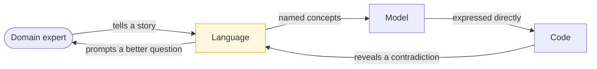

> The cheapest design tool available is insisting that code, conversation and documentation
> use the same words for the same things — and different words when the things are different.

| | |
|---|---|
| **Module** | [06 — Domain-driven design](/modules/domain-driven-design/README) |
| **Prerequisites** | none — this lesson is the entry point to DDD |
| **Also known as** | ubiquitous language, the model-driven design loop |
| **Category** | Structure |

---

## 1. The problem

A ShopFlow planning meeting. The product manager says "when the order is confirmed, notify the
customer." Four people write four different tickets, because:

- To the checkout team, "confirmed" means the customer clicked Pay.
- To the payments team, it means the provider captured the funds.
- To the warehouse team, it means stock has been picked and the order can no longer be changed.
- To finance, it means the invoice has been issued.

Nobody notices, because all four are speaking English and all four say "confirmed". The bug
appears six weeks later as a customer receiving a "your order is confirmed" email for an order
that the warehouse subsequently cancelled for lack of stock.

Meanwhile the code has three names for the same concept — `OrderDTO`, `OrderEntity`,
`OrderModel` — and one name, `status`, for a field that encodes at least three orthogonal
things: payment state, fulfilment state, and whether the customer may still edit it.

**The ambiguity is not in the software. It is in the language, and the software faithfully
reproduces it.**

## 2. In plain language

A hospital where the surgical team, the pharmacy and the billing department all say
"discharge". For the surgeon it means the patient is medically cleared. For the pharmacy it
means the take-home medication has been dispensed. For billing it means the account is closed.

For years this works, because each department mostly talks to itself. It breaks precisely at
the handovers — a patient "discharged" by the surgeon at 11am, still waiting for pharmacy at
4pm, whose bed has already been given away because the ward system trusted the surgeon's flag.

The fix is not a bigger system. It is the boring, unglamorous act of naming: *medically
cleared*, *medication dispensed*, *account closed*. Three words instead of one, and the
handover ambiguity is gone — because now you can *say* the thing that is true.

**Where the analogy breaks down:** a hospital can hold a meeting and agree the terms. Software
teams must also make the agreement *enforceable*, which means the words have to appear as
types in the code — otherwise the old ambiguity simply moves into the comments.

## 3. How it works

### The ubiquitous language

A vocabulary, developed jointly by engineers and domain experts, used *everywhere*: in
conversation, in tickets, in tests, in class names, in database columns, in the API.

Three rules:

1. **One meaning per term, within one context.** If "confirmed" means two things, you need two
   words, not a comment.
2. **No translation layer between the conversation and the code.** If the expert says "a
   reservation expires", there is a `Reservation` with an `expire()` operation. If the code
   says `OrderStatusFlag7`, the language has been lost.
3. **The language is *bounded*.** "Product" is allowed to mean something different in
   Inventory than in Catalogue. What is not allowed is for it to mean two things in the *same*
   context ([06-05](/modules/domain-driven-design/05-strategic-design-bounded-contexts-and-context-maps)).

That third rule is what separates DDD from a corporate data dictionary. The goal is not one
global vocabulary; it is **local precision with explicit translation at the edges**.

### The model-driven loop



The loop matters more than any individual artefact. **Code that cannot express something the
expert says is evidence of a modelling gap**, and it is the cheapest kind of evidence you will
ever get — far cheaper than the production incident that eventually surfaces the same gap.

### Anaemic versus rich models

The most common failure mode: classes that hold data and no behaviour, with all the rules in
"service" classes operating on them. Martin Fowler named this the *anaemic domain model*, and
it is an anti-pattern precisely because it discards the distinction-making that gives a model
value.

| Anaemic | Rich |
|---|---|
| `order.status = "PAID"` from anywhere | `order.mark_paid(receipt)` — the only legal route |
| Validation in the controller | Invariants enforced at construction and on every change |
| Rules discoverable by grepping | Rules discoverable by reading the type |
| Any field settable in any order | Illegal states unrepresentable |

The test: **can a new engineer break a business rule without noticing?** In an anaemic model,
yes — they set a field. In a rich model, there is no field to set.

### Making illegal states unrepresentable

The strongest form of the idea. Rather than validating that a combination is legal, arrange
the types so the illegal combination cannot be constructed. A `PaidOrder` that carries a
`PaymentId` cannot exist without a payment, because the type requires one. No validation, no
test, no runtime check — the compiler is the enforcement.

## 4. Pseudo-code

**Before — anaemic, and ambiguous in exactly the way §1 describes.**

```
record Order:
  id: String
  status: String              # "NEW" | "CONFIRMED" | "DONE" ... nobody is sure
  paid: Bool
  shipped: Bool
  cancelled: Bool
  payment_ref: Option<String>
  total: Float                # TRAP: floating point money. And is it gross or net?

service OrderService:
  fn confirm(o: Order):
    o.status = "CONFIRMED"     # confirmed in whose sense?
    o.paid = true              # TRAP: nothing stops paid=true, payment_ref=None
    db.save(o)

# Illegal states this permits, all reachable, none rejected:
#   cancelled = true AND shipped = true
#   paid = true AND payment_ref = None
#   status = "CONFIRMED" AND paid = false
#   status = "BANANA"
```

**After — the language, made into types.**

```
# The vocabulary, agreed with the domain experts, written down as code.
# Each name below is a word they actually use, meaning exactly one thing.

type OrderId = String
type PaymentId = String

record Money:                          # a value object: identity IS the value (06-02)
  amount: Int                          # minor units. Never a Float.
  currency: String
  invariants:
    currency in ISO_4217

# The four meanings of "confirmed" from §1, separated. Each is now sayable.
enum PaymentState:   AWAITING_PAYMENT | AUTHORISED | CAPTURED | REFUNDED | FAILED
enum FulfilmentState: NOT_STARTED | PICKING | DISPATCHED | DELIVERED
enum OrderLifecycle:  DRAFT | PLACED | CANCELLED

record Order:
  id: OrderId
  lifecycle: OrderLifecycle
  payment: PaymentState
  fulfilment: FulfilmentState
  lines: List<OrderLine>
  total: Money

  # The rules, stated once, in the only place that can enforce them.
  invariants:
    lifecycle == PLACED implies lines.size > 0
    payment == CAPTURED implies payment_id is Some
    fulfilment != NOT_STARTED implies payment == CAPTURED
    lifecycle == CANCELLED implies fulfilment in [NOT_STARTED, PICKING]
    total == sum(l.unit_price * l.qty for l in lines)

  # Behaviour lives with the data it constrains. There is no setter.
  fn place() -> Result<Order, OrderError>:
    if lifecycle != DRAFT:  return Err(AlreadyPlaced)
    if lines.is_empty():    return Err(EmptyOrder)
    return Ok(this with { lifecycle: PLACED })

  fn capture_payment(pid: PaymentId) -> Result<Order, OrderError>:
    if payment != AUTHORISED: return Err(NotAuthorised(payment))
    return Ok(this with { payment: CAPTURED, payment_id: Some(pid) })

  fn cancel(reason: CancellationReason) -> Result<Order, OrderError>:
    # The rule the business actually stated, in the words they used:
    # "you can't cancel an order that's already left the building"
    if fulfilment == DISPATCHED: return Err(AlreadyDispatched)
    if fulfilment == DELIVERED:  return Err(AlreadyDelivered)
    return Ok(this with { lifecycle: CANCELLED })
```

**Illegal states made unrepresentable — the stronger version.**

```
# Instead of one Order with flags, model the states as distinct types. Now the
# compiler rejects what the invariants above only reject at runtime.

record DraftOrder:
  id: OrderId
  lines: List<OrderLine>
  fn place() -> Result<PlacedOrder, OrderError>:
    if lines.is_empty(): return Err(EmptyOrder)
    return Ok(PlacedOrder(id: id, lines: lines, placed_at: now()))

record PlacedOrder:                    # cannot exist with zero lines
  id: OrderId
  lines: List<OrderLine>               # guaranteed non-empty by construction
  placed_at: Instant
  fn capture(pid: PaymentId, amount: Money) -> PaidOrder:
    return PaidOrder(id: id, lines: lines, payment_id: pid, paid_at: now())

record PaidOrder:                      # cannot exist without a payment_id
  id: OrderId
  lines: List<OrderLine>
  payment_id: PaymentId                # not Option. A PaidOrder HAS a payment.
  paid_at: Instant
  fn dispatch(tracking: TrackingNumber) -> DispatchedOrder: ...

record DispatchedOrder:                # note: no cancel() method exists at all.
  ...                                  # "cannot cancel a dispatched order" is not
                                       # a check — it is the absence of an operation.

# COST: more types, and a function that accepts "any order" now needs a sum type
# or an interface. Worth it exactly where the rules are load-bearing — orders,
# payments, entitlements — and overkill for a settings record.
```

**The language leaking away — what to watch for in review.**

```
# Each of these is a symptom that the language has been lost. All are real,
# all are common, and all start as a small convenience.

o.status = "CONFIRMED"                 # a setter that bypasses the rules
if o.status == "P" or o.status == "C"  # codes the business never says
fn process(o: Order)                   # "process" is not a domain word
record OrderDTO / OrderEntity / OrderVM # three names for one concept
o.flag7 = true                          # someone was in a hurry in 2019
# WHY these matter: each one moves a rule out of the model and into the head of
# whoever wrote it. The model stops being the place the answer lives.
```

## 5. Knobs and variants

| Knob | Guidance | Failure if wrong |
|---|---|---|
| Where invariants live | In the aggregate, enforced on construction and change | In the service layer: bypassable by any new call site |
| Term precision | One word per concept, per context | One word for three concepts is the §1 bug |
| Illegal states | Make unrepresentable where rules are load-bearing | Applied everywhere it is ceremony; nowhere it is CRUD |
| Naming source | The domain expert's words, not the developer's | `Manager`, `Processor`, `Handler` mean nothing to the business |
| Model depth | Rich where behaviour exists; plain records elsewhere | Not every table deserves an aggregate |
| Language scope | Bounded per context, translated at edges | A global vocabulary satisfies nobody ([05-04](/modules/messaging-and-eip/04-message-translator-and-canonical-data-model)) |

**The honest caveat:** not every part of a system deserves this. A settings table, a feature
flag store, an audit log — these are data, and a rich model adds cost without adding
distinctions. Reserve modelling effort for the **core subdomain**
([06-05](/modules/domain-driven-design/05-strategic-design-bounded-contexts-and-context-maps)), which is the part
where being better than a competitor actually matters.

## 6. Challenges and failure modes

- **The language is agreed and then not used.** A glossary in Confluence, and code that still
  says `flag7`. The language must appear in types or it does not exist.
- **Developers inventing the vocabulary.** `OrderProcessor`, `PaymentHandler`,
  `InventoryManager` — words no domain expert has ever said. If you cannot use a class name in
  a conversation with the business, it is the wrong name.
- **The expert is not available.** Frequently the real constraint. Proxies — support tickets,
  operational runbooks, the actual UI, incident history — are worse than the expert and much
  better than guessing.
- **One term genuinely means two things.** This is not a naming failure; it is a **boundary
  discovery**. You have found a context edge ([06-05](/modules/domain-driven-design/05-strategic-design-bounded-contexts-and-context-maps)).
- **Anaemic model justified as "simple".** It is simpler to write and harder to change, because
  the rules are distributed across every caller rather than located in one place.
- **Rich models fighting the ORM.** Many ORMs want public setters and no-arg constructors,
  which is precisely what a rich model refuses to provide. Resolve it in the persistence layer
  ([06-04](/modules/domain-driven-design/04-repositories-factories-and-the-application-layer)), not by weakening the model.
- **Translating for "the business".** If you find yourself maintaining two vocabularies and
  translating in meetings, the model has already diverged.
- **Renaming being treated as cosmetic.** Renaming a concept as understanding improves is the
  *most* valuable refactor available and the one most likely to be deprioritised.

## 7. Alternatives

- **CRUD / transaction script.** Procedures over a data model. **Correct for genuinely simple
  domains** — a settings screen does not need an aggregate. The failure is applying it to a
  domain with real rules and then wondering where the rules went.
- **Data-model-first design.** Normalise the tables, generate the classes. Fast to start,
  and it encodes what is *storable* rather than what is *legal*.
- **Functional core / imperative shell.** Pure functions over immutable data, side effects at
  the edge. Reaches the same destination — behaviour and data together, illegal states
  excluded — with different mechanics. Fully compatible with everything in this module.
- **Type-driven design.** Push further into the type system: refinement types, phantom types,
  parse-don't-validate. The strongest version of "illegal states unrepresentable", limited by
  the expressiveness of your language.
- **Do nothing deliberately.** For a supporting subdomain you plan to replace with a SaaS
  product within a year, a thin CRUD layer is the right economic answer.

## 8. Trade-offs

| Advantage | Disadvantage |
|---|---|
| Ambiguity surfaces in design rather than in production | Requires sustained access to domain experts |
| Business rules live in one findable place | More types, more indirection than a CRUD layer |
| Illegal states can be made impossible, not merely tested | Fights ORMs and serialisation frameworks |
| Conversations and code use one vocabulary | Renaming as understanding improves is constant work |
| Boundaries are discovered rather than guessed | Overkill for domains without real rules |

## 9. Complexity introduced

- **Operational.** None directly — this is a design-time discipline with no runtime footprint.
- **Cognitive.** Engineers must learn the domain, not just the codebase. That is a real and
  ongoing cost, and it is also the main benefit.
- **Failure surface.** None added. The model *removes* failure modes by making illegal states
  unreachable.
- **Testing.** Rich models are unusually testable — invariants are unit-testable without any
  infrastructure. But persistence tests get harder when the model refuses public setters.

## 10. Related concepts

- **Builds on:** nothing — this is the DDD entry point
- **Composes with:** [06-02 Aggregates](/modules/domain-driven-design/02-entities-value-objects-and-aggregates), [06-05 Bounded contexts](/modules/domain-driven-design/05-strategic-design-bounded-contexts-and-context-maps), [07-02 Module boundaries](/modules/modular-monolith/02-module-boundaries-and-enforcement)
- **Conflicts with / tension:** speed of initial delivery; CRUD scaffolding is faster on day one
- **Contrast with:** [05-04 Canonical data model](/modules/messaging-and-eip/04-message-translator-and-canonical-data-model) — one global vocabulary versus many local precise ones. DDD argues the second is the only one that works
- **Leads to:** [06-02 Entities, value objects and aggregates](/modules/domain-driven-design/02-entities-value-objects-and-aggregates)

## 11. Exercises

1. **Trace it.** Take the "Before" record. Write down every combination of `paid`, `shipped`,
   `cancelled` and `status` that is reachable in code but meaningless in the business. How many
   are there, and which one would be worst in production?
2. **Extend it.** ShopFlow adds partial refunds. Add the concept to the "After" model: what is
   the new vocabulary, what invariant does it introduce, and which existing invariant does it
   break?
3. **Break it.** Find the business rule that the `PaidOrder` / `DispatchedOrder` type-based
   version can no longer express easily, and that the flag-based version handled fine. What
   does that tell you about when to use each?

## 12. References

- Eric Evans, *Domain-Driven Design: Tackling Complexity in the Heart of Software* (2003) — Ch. 1–4.
- Vaughn Vernon, *Implementing Domain-Driven Design* (2013) — Ch. 1–2.
- Martin Fowler, "AnemicDomainModel" (2003).
- Scott Wlaschin, *Domain Modeling Made Functional* (2018) — the best treatment of making illegal states unrepresentable.
- Alexey Zimarev, *Hands-On Domain-Driven Design* — the modelling loop in practice.
- Eric Evans, "Domain-Driven Design Reference" (2015) — the free pattern summary.

---

**Up:** [Module 06](/modules/domain-driven-design/README) · **Previous:** [← Module 05](/modules/messaging-and-eip/README) · **Next:** [06-02 Entities, value objects and aggregates →](/modules/domain-driven-design/02-entities-value-objects-and-aggregates)
