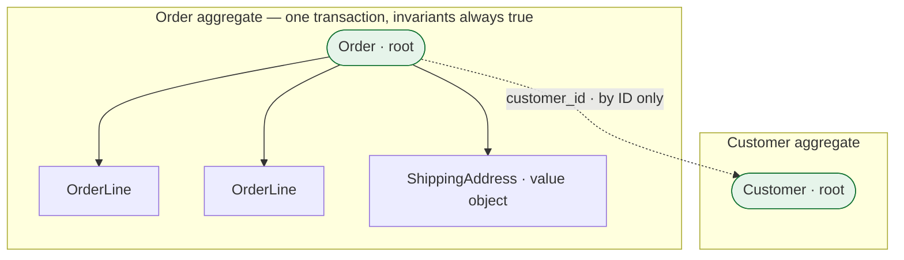

> The aggregate is the most consequential idea in DDD, because it is simultaneously your
> consistency boundary, your transaction boundary, your concurrency unit and — later — your
> partition key. Yours are probably too big.

| | |
|---|---|
| **Module** | [06 — Domain-driven design](/modules/domain-driven-design/README) |
| **Prerequisites** | [06-01 Ubiquitous language](/modules/domain-driven-design/01-ubiquitous-language-and-the-domain-model) |
| **Also known as** | tactical DDD, consistency boundaries, aggregate roots |
| **Category** | Structure |

---

## 1. The problem

ShopFlow models a `Customer` that contains their orders, which contain lines, which reference
products, which have suppliers. Loading a customer loads several thousand objects. Two support
agents editing different orders for the same customer collide, because they are both saving
"the customer".

So the team goes the other way and makes everything independent: `Order` and `OrderLine` are
separate, savable, editable objects. Now a bug in a batch job leaves an order whose lines sum
to €340 and whose `total` says €280, and nothing anywhere notices, because no code owns the
rule that those two numbers must agree.

**Both failures are the same failure: nobody decided what has to be consistent with what.**

## 2. In plain language

A paper form with carbon copies, in a filing cabinet.

Some things on the form must be right *together* — the line items and the total. If someone
changes a line, the total must change in the same act of writing, or the form is internally
contradictory. You would never let two clerks edit one form simultaneously.

Other things merely *refer* to each other. The form names a customer, but it does not contain
the customer; it has their account number. The customer moving house does not require anyone
to reopen the form. And critically, you would not fetch a customer's entire file every time
you wanted to read one order.

So: **one form is the unit you pick up, change, and put back.** Inside it, everything must
agree at all times. Between forms, you use reference numbers and accept that they are updated
at different moments.

**Where the analogy breaks down:** paper forms cannot be edited by two clerks at once because
there is physically one copy. Software needs
[optimistic concurrency](/modules/performance-and-concurrency/01-concurrency-control) to
recreate that guarantee, and the aggregate is what tells you where to put it.

## 3. How it works

### The three building blocks

| | **Value object** | **Entity** | **Aggregate** |
|---|---|---|---|
| Identity | The value itself | A stable ID | The root entity's ID |
| Equality | All fields equal | Same ID | Same root ID |
| Mutability | Immutable, always | Changes over time | Changes as a unit |
| Example | `Money`, `Address`, `SKU`, `DateRange` | `Order`, `Customer`, `Shipment` | `Order` + its lines |
| Rule of thumb | **Default to this** | Only when identity outlives the values | Only when things must change together |

**Most things that are modelled as entities should be value objects.** An address is not an
entity — you do not track "the same address over time", you replace it. Making it a value
object removes an ID, a table, a lifecycle and a class of bugs.

Value objects also carry behaviour, and this is where they earn their keep:

```
Money(1000, "EUR") + Money(500, "EUR")   →  Money(1500, "EUR")
Money(1000, "EUR") + Money(500, "USD")   →  error, at the type level
```

Currency-mismatch bugs stop being possible. Same for `Percentage`, `Quantity`, `DateRange`,
`EmailAddress` — each replaces a primitive that permitted nonsense.

### The aggregate

An aggregate is a cluster of objects treated as **one unit for the purpose of data changes**,
with one entity designated the *root*. Four rules:

1. **The root is the only entry point.** External code holds a reference to the root, never to
   an object inside it.
2. **Invariants inside the aggregate are always true.** Enforced on every change, within one
   transaction.
3. **One transaction changes one aggregate.** This is the rule people break first and regret
   most.
4. **Aggregates reference each other by ID, never by object reference.**



### Sizing: the single most important decision

The aggregate boundary is a trade between **consistency** and **contention**, and both
directions hurt:

| Too large | Too small |
|---|---|
| Loads thousands of objects per operation | Invariants span aggregates and go unenforced |
| Concurrent edits to unrelated parts collide | Every operation needs a saga or a lock |
| Cannot be partitioned later | Data can become internally contradictory |
| Transactions are long and lock-heavy | Business rules end up in application services |

**The test: what genuinely must be true at every instant, versus what must merely be true
eventually?** Only the first belongs in one aggregate.

- Order total must equal the sum of its lines — *at every instant*. Same aggregate.
- Stock level must reflect all reservations — *eventually*, within seconds. Different
  aggregates, reconciled by [events](/modules/domain-driven-design/03-domain-events-and-domain-services) or a
  [saga](/modules/data-and-consistency/02-saga).

Vernon's rule of thumb, and it is a good one: **design small aggregates.** Prefer several small
ones referencing each other by ID over one large one. When in doubt, split, and use eventual
consistency between the halves.

### Why this reaches so far outside DDD

The aggregate boundary is not only a modelling concept. It is:

| Also determines | Lesson |
|---|---|
| The transaction boundary | [04-01](/modules/data-and-consistency/01-distributed-transactions-and-two-phase-commit) |
| The unit of optimistic concurrency | [10-01](/modules/performance-and-concurrency/01-concurrency-control) |
| The natural partition/shard key | [03-04](/modules/scalability/04-partitioning-and-sharding) |
| The event-sourcing stream | [04-05](/modules/data-and-consistency/05-event-sourcing) |
| The saga step boundary | [04-02](/modules/data-and-consistency/02-saga) |
| The service boundary candidate | [08-01](/modules/microservice-architecture/01-decomposition-and-bounded-contexts) |

**Getting the aggregate wrong is therefore expensive in six places at once**, which is why it
is worth spending real design time on and worth revisiting when it hurts.

## 4. Pseudo-code

**Before — the two failures from §1.**

```
# Too large: loading a customer loads everything they have ever done.
record Customer:
  id: CustomerId
  orders: List<Order>                # thousands
  addresses: List<Address>
  payment_methods: List<PaymentMethod>
# TRAP: two agents editing two different orders both save `customer` and collide.

# Too small: nothing owns the relationship between lines and total.
record Order:      id, customer_id, total
record OrderLine:  id, order_id, sku, qty, unit_price
# TRAP: a batch job updates lines without updating total. Nothing notices, ever.
```

**The pattern — value objects, then a correctly sized aggregate.**

```
# ---------- Value objects: identity IS the value. Immutable. Behaviour included.
record Money:
  amount: Int                        # minor units
  currency: String
  invariants: currency in ISO_4217

  fn plus(o: Money) -> Money:
    if o.currency != currency: raise CurrencyMismatch(currency, o.currency)
    return Money(amount + o.amount, currency)
  fn times(n: Int) -> Money: return Money(amount * n, currency)
  # WHY a type rather than an Int: `total + shipping` where one is EUR and one is
  # USD becomes impossible instead of merely wrong.

record Quantity:
  value: Int
  invariants: value > 0              # "quantity zero" is not a quantity

record Address:                      # NOT an entity: we replace it, never track it
  line1: String
  postcode: String
  country: CountryCode

record SKU:
  value: String
  invariants: value matches "^[A-Z]{3}-[0-9]{6}$"
  # A parsed SKU cannot be an arbitrary string. Parse, don't validate.


# ---------- Aggregate: Order is the root; OrderLine exists only inside it.
aggregate Order:
  root:
    id: OrderId
    customer_id: CustomerId          # another aggregate. BY ID. Never an object.
    lines: List<OrderLine>           # inside the boundary
    ship_to: Address                 # value object, inside
    total: Money
    lifecycle: OrderLifecycle
    version: Int                     # optimistic concurrency (10-01)

  invariants:
    total == fold(lines, Money(0, currency), (acc, l) => acc.plus(l.subtotal()))
    lines.size <= 100                              # a real business rule
    lifecycle == PLACED implies lines.size > 0
    unique(l.sku for l in lines)                   # one line per SKU

  # Every change goes through the root. There is no way to reach a line directly.
  fn add_line(sku: SKU, qty: Quantity, unit_price: Money) -> Result<Order, OrderError>:
    if lifecycle != DRAFT:            return Err(OrderNotEditable)
    if lines.size >= 100:             return Err(TooManyLines)
    if lines.any(l => l.sku == sku):
      return change_quantity(sku, lines.find(sku).qty.plus(qty))

    new_lines = lines + OrderLine(sku: sku, qty: qty, unit_price: unit_price)
    # The invariant is re-established in the SAME operation, not later.
    return Ok(this with { lines: new_lines, total: sum_of(new_lines),
                          version: version + 1 })

  fn remove_line(sku: SKU) -> Result<Order, OrderError>:
    if lifecycle != DRAFT: return Err(OrderNotEditable)
    new_lines = lines.filter(l => l.sku != sku)
    return Ok(this with { lines: new_lines, total: sum_of(new_lines),
                          version: version + 1 })

record OrderLine:                    # an entity INSIDE the aggregate: it has local
  sku: SKU                           # identity (the sku) but no global lifecycle
  qty: Quantity
  unit_price: Money
  fn subtotal() -> Money: return unit_price.times(qty.value)
```

**Rule 3 in practice — one transaction, one aggregate.**

```
service PlaceOrderHandler:
  uses orders: Repository<Order>
  uses reservations: Repository<Reservation>

  # WRONG: two aggregates in one transaction.
  fn place_wrong(cmd) -> Result<Unit, Error>:
    atomically:
      order = orders.get(cmd.order_id)?
      stock = stock_levels.get(cmd.sku)?          # a DIFFERENT aggregate
      stock.decrement(cmd.qty)?                   # TRAP: this couples their
      orders.save(order.place()?)                 # lifecycles, their locks, and
      stock_levels.save(stock)                    # forbids ever splitting them

  # RIGHT: one aggregate per transaction; the rest is eventual.
  fn place_right(cmd) -> Result<Unit, Error>:
    atomically:
      order = orders.get(cmd.order_id)?
      placed = order.place()?
      orders.save(placed)
      outbox.append(OrderPlaced(placed.id, placed.lines))   # 04-03
    return Ok(unit)
    # Inventory reacts to OrderPlaced and adjusts its OWN aggregate, in its own
    # transaction. Consistency between them is eventual and that is a DECISION,
    # made here, visible in the code.
```

**Sizing, worked through — the same domain, two boundaries.**

```
# Option A — Order owns its reservations.
aggregate Order:
  root: id, lines, reservations: List<Reservation>
  invariants: every line has a matching reservation
# ✓ Stock reservation and order lines are always consistent.
# ✗ Warehouse operations on reservations now lock the whole order.
# ✗ Cannot shard reservations separately from orders, ever.

# Option B — separate aggregates, referenced by ID.
aggregate Order:        root: id, lines
aggregate Reservation:  root: id, order_id, sku, qty, expires_at
# ✓ Independent concurrency; independent scaling; independent lifecycle.
# ✗ For a window, an order exists with no reservation.
# → Resolved by a saga (04-02) plus expiry, not by merging the aggregates.

# ShopFlow chooses B. WHY: reservations expire on a timer independent of the
# order, are touched by warehouse systems that never touch orders, and are
# 40× more numerous. Merging them would make every warehouse scan contend
# with every checkout.
```

## 5. Knobs and variants

| Knob | Guidance | Failure if wrong |
|---|---|---|
| Aggregate size | As small as the true invariants allow | Large: contention. Small: unenforced rules |
| Entity vs value object | Default to value object | Needless entities add IDs, tables and lifecycles |
| Cross-aggregate refs | By ID, always | Object references invite lazy loading and hidden coupling |
| Transactions | One aggregate per transaction | Multi-aggregate transactions block future splitting |
| Invariant timing | Immediate inside, eventual outside | "Everything immediate" forces one giant aggregate |
| Concurrency | Version on the root | Versioning inner entities lets the root's invariants break |
| Collections inside | Bounded, and small | An unbounded collection makes the aggregate unloadable |

**The unbounded-collection trap deserves emphasis.** `Customer.orders` is unbounded and grows
forever; `Order.lines` is bounded by a real business rule (100). If a collection has no natural
bound, it is a signal that it belongs in a separate aggregate referenced by ID.

## 6. Challenges and failure modes

- **The god aggregate.** Everything reachable from `Customer`. Loads slowly, locks broadly,
  cannot be partitioned. Usually arrives by accretion, never by decision.
- **Multi-aggregate transactions.** Convenient today; the reason you cannot split the module
  into a service in two years ([07-05](/modules/modular-monolith/05-extracting-a-module-into-a-service)).
- **Lazy loading hiding the boundary.** An ORM that silently loads a referenced aggregate makes
  "reference by ID" look like "reference by object", and the N+1 query appears in production.
- **Invariants that span aggregates.** "A customer may not have more than three open orders" is
  not enforceable inside either aggregate. Options: move the rule into a single aggregate,
  accept eventual enforcement with compensation, or use a dedicated uniqueness/limit record.
  All three are legitimate; pretending the rule is immediate is not.
- **Modelling every table as an entity.** Most rows are values. Fewer entities, fewer bugs.
- **Version on the wrong object.** Concurrency control must be on the aggregate root, or two
  concurrent changes to different lines can both succeed and break the total.
- **Aggregates chosen for query convenience.** Aggregates are consistency boundaries, not read
  shapes. Reads that span them are a [read model](/modules/data-and-consistency/06-cqrs)
  problem, not a reason to merge.
- **Primitive obsession.** `String` for SKU, `Int` for money, `String` for country. Every one
  permits values the domain forbids.

## 7. Alternatives

- **Active Record / anaemic tables.** One class per table, no boundaries. Fine for CRUD;
  discards the consistency question entirely, which is fine until it isn't.
- **[Event sourcing](/modules/data-and-consistency/05-event-sourcing).** The aggregate
  becomes a fold over its event stream. Same boundary, different storage — and the stream
  version gives you optimistic concurrency for free.
- **Functional aggregates.** `decide(state, command) -> events` and `evolve(state, event) ->
  state`, as pure functions. Same boundary rules, no objects, exceptionally testable.
- **Database constraints.** Enforce invariants with foreign keys, check constraints and unique
  indexes. Genuinely effective, works across all call sites including scripts, and cannot
  express anything conditional or temporal.
- **Just use transactions.** In a single database, a transaction across "aggregates" works.
  It is also the decision that makes future extraction expensive — which may be an acceptable
  trade if you know you will never extract.

## 8. Trade-offs

| Advantage | Disadvantage |
|---|---|
| Invariants hold at every instant, by construction | Cross-aggregate rules become eventual and need machinery |
| Concurrency control has an obvious unit | Small aggregates mean more sagas and more events |
| The boundary becomes the shard key and the event stream | An early wrong boundary is expensive in six places |
| Value objects eliminate whole classes of bug | More types than a table-per-class design |
| Small aggregates keep transactions short | Some reads now need a read model to reassemble |

## 9. Complexity introduced

- **Operational.** None directly, though small aggregates imply more events and therefore the
  [outbox](/modules/data-and-consistency/03-transactional-outbox) and its monitoring.
- **Cognitive.** Engineers must know which aggregate they are in and resist the convenient
  multi-aggregate transaction. This requires review discipline, permanently.
- **Failure surface.** Eventual consistency between aggregates introduces windows where the
  system is observably mid-flight — which must be designed into the UI, not discovered.
- **Testing.** Aggregates are the easiest thing in this course to test — pure invariants, no
  infrastructure. Take advantage of that.

## 10. Related concepts

- **Builds on:** [06-01 Ubiquitous language](/modules/domain-driven-design/01-ubiquitous-language-and-the-domain-model)
- **Composes with:** [06-03 Domain events](/modules/domain-driven-design/03-domain-events-and-domain-services), [10-01 Optimistic concurrency](/modules/performance-and-concurrency/01-concurrency-control), [03-04 Partitioning](/modules/scalability/04-partitioning-and-sharding), [04-05 Event sourcing](/modules/data-and-consistency/05-event-sourcing)
- **Conflicts with / tension:** query convenience — aggregates are shaped for writes, not reads
- **Contrast with:** database normalisation — normal forms describe storage, aggregates describe consistency. They frequently disagree, and the aggregate wins
- **Leads to:** [06-03 Domain events and domain services](/modules/domain-driven-design/03-domain-events-and-domain-services)

## 11. Exercises

1. **Trace it.** Two support agents add a line to the same order simultaneously. Walk through
   `add_line` and the version field. What happens, and what would happen if `version` were on
   `OrderLine` instead?
2. **Extend it.** The business adds: "a customer may have at most 3 open orders." Give three
   ways to enforce it, one per approach in §6, and say which you would choose for ShopFlow and
   why.
3. **Break it.** Find the invariant in the `Order` aggregate that becomes unenforceable the
   moment ShopFlow supports multi-currency orders. What would you change?

## 12. References

- Eric Evans, *Domain-Driven Design* (2003) — Ch. 5–6, the original definitions.
- Vaughn Vernon, "Effective Aggregate Design" (2011), parts I–III. The definitive treatment of sizing; read all three parts.
- Vaughn Vernon, *Implementing Domain-Driven Design* (2013) — Ch. 5–10.
- Scott Wlaschin, *Domain Modeling Made Functional* — value objects and parse-don't-validate.
- Alexis King, "Parse, don't validate" (2019).
- Martin Fowler, "ValueObject", "DDD_Aggregate".

---

**Up:** [Module 06](/modules/domain-driven-design/README) · **Previous:** [← 06-01](/modules/domain-driven-design/01-ubiquitous-language-and-the-domain-model) · **Next:** [06-03 Domain events and domain services →](/modules/domain-driven-design/03-domain-events-and-domain-services)
