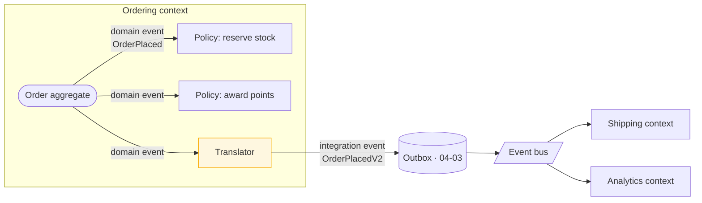

> Two homes for behaviour that belongs to no single object — and the distinction between a
> domain event and an integration event, which is the difference between a model detail and a
> public contract you can never take back.

| | |
|---|---|
| **Module** | [06 — Domain-driven design](/modules/domain-driven-design/README) |
| **Prerequisites** | [06-02 Aggregates](/modules/domain-driven-design/02-entities-value-objects-and-aggregates) |
| **Also known as** | domain events, integration events, domain services, policies |
| **Category** | Structure |

---

## 1. The problem

Two gaps in the model from [06-02](/modules/domain-driven-design/02-entities-value-objects-and-aggregates).

**First:** an order is placed. Six things must now happen — reserve stock, notify the
customer, award loyalty points, update the sales forecast, check for fraud, tell the
warehouse. None of them belongs *inside* the Order aggregate; Order does not know what loyalty
is and must not learn. But the aggregate is the only thing that knows the order was placed.

So the code ends up in the application service, which grows to 400 lines and becomes the place
where every new "and also…" requirement lands. Nobody can say what happens when an order is
placed without reading all of it.

**Second:** transferring money between two accounts belongs to neither account. Putting
`transfer_to(other)` on `Account` means one aggregate reaching into another, breaking
[rule 3](/modules/domain-driven-design/02-entities-value-objects-and-aggregates). Putting it in the application layer
means a core business rule lives outside the model.

## 2. In plain language

**Domain events** are the difference between a shop assistant who does everything themselves
and one who calls out "sold!" to the room.

In the first shop, the assistant must remember every consequence of a sale — restock the shelf,
update the ledger, note the customer's loyalty points. Adding a consequence means retraining
that assistant. In the second, the assistant's job is just to make the sale correctly and
announce it. The stockroom, the bookkeeper and the loyalty desk each listen for "sold!" and do
their own part. Adding a consequence means adding a listener, and the assistant never finds
out.

**Domain services** are the shop's *escrow agent*. When two customers swap goods, neither one
holds both items at any point — a trusted third party does the exchange. The action belongs to
the transaction, not to either party, and inventing a rule like "the customer with the
alphabetically earlier name performs the swap" would be absurd.

**Where the analogy breaks down:** everyone in the shop hears "sold!" instantly and reliably.
Software listeners can be down, can hear twice, and can hear out of order — which is
[Module 04](/modules/data-and-consistency/README)'s subject and the reason the domain/integration
distinction below matters so much.

## 3. How it works

### Domain events

A **domain event** is a record of something that happened in the domain, that domain experts
care about. Past tense, immutable, named in the ubiquitous language.

Properties:

- **Past tense.** `OrderPlaced`, not `PlaceOrder` (that is a command).
- **Immutable.** It happened. It cannot be edited or rejected.
- **Meaningful to the business.** `OrderPlaced` yes; `OrderRowUpdated` no — that is a database
  event wearing a domain event's clothes.
- **Raised by the aggregate**, because the aggregate is what knows the change was legal.

### Domain events vs integration events — the distinction that matters

Constantly conflated, with expensive consequences.

| | **Domain event** | **Integration event** |
|---|---|---|
| Scope | Inside one bounded context | Crosses context boundaries |
| Audience | Other aggregates and policies in this context | Other contexts, other teams, other systems |
| Coupling | Internal — refactor freely | **A published contract** — versioned forever |
| Payload | Rich; may reference internal concepts | Deliberately minimal and stable |
| Delivery | In-process, often synchronous, same transaction | [Outbox](/modules/data-and-consistency/03-transactional-outbox), at-least-once, async |
| Changing it | A refactor | A breaking change for four teams ([01-04](/modules/communication/04-serialization-and-schema-evolution)) |



**Publishing your domain events directly onto the bus is the mistake.** It makes every internal
modelling decision a public contract; renaming an internal field becomes a breaking change for
teams you have never met. Translate at the boundary — the same discipline as an
[anti-corruption layer](/modules/microservice-architecture/06-anti-corruption-layer), applied
outbound.

### Where events are raised and dispatched

The aggregate *records* events; it does not dispatch them. Dispatch happens after the
transaction commits, or as part of it — and the choice matters:

| Dispatch timing | Consequence |
|---|---|
| Inside the transaction, synchronously | Handlers can fail the whole operation. Strong consistency, tight coupling |
| After commit, in-process | Handler failure does not roll back the order. Needs its own retry |
| After commit, via [outbox](/modules/data-and-consistency/03-transactional-outbox) | Durable, at-least-once, survives a crash. The only safe option for cross-context |

**Same-context invariants that must hold now → synchronous. Anything crossing a boundary →
outbox.** Same-context work that may be eventual can also use durable after-commit delivery;
the required consistency, not the handler's location, chooses the timing.

### Domain services

A **domain service** holds domain logic that belongs to no single aggregate. The test — all
three must hold:

1. The operation is a genuine domain concept, in the ubiquitous language.
2. It does not naturally belong to any one entity or value object.
3. It is stateless.

Legitimate: transferring funds, pricing an order against a rules engine, allocating stock
across warehouses, checking a fraud score.

**Not** a domain service: anything ending in `Manager`, `Helper` or `Processor`; anything that
is really just orchestration (that is an *application* service —
[06-04](/modules/domain-driven-design/04-repositories-factories-and-the-application-layer)); anything that would fit
naturally on an aggregate.

**The distinction from an application service:** a domain service contains business *rules*; an
application service contains *use-case orchestration* — load, call, save, publish. If it
touches a repository, it is almost certainly an application service.

### Policies

A **policy** (or "reaction") is a rule of the form *when X happens, do Y*. Policies are
event handlers that carry domain meaning, and naming them makes the flow readable:

> *When* an order is placed, *then* reserve stock.
> *When* payment fails three times, *then* cancel the order.

Written as named policies, the answer to "what happens when an order is placed?" is a list of
policy names rather than a 400-line service. This is also exactly what
[EventStorming](/modules/domain-driven-design/06-modelling-in-practice) produces on the wall.

## 4. Pseudo-code

**Before — the 400-line application service.**

```
service PlaceOrderHandler:
  fn handle(cmd: PlaceOrder) -> Result<Order, Error>:
    order = orders.get(cmd.order_id)?.place()?
    orders.save(order)
    inventory.reserve(order.lines)              # TRAP: every new consequence
    email.send_confirmation(order)              # lands in this one function,
    loyalty.award(order.customer_id, order.total)  # which nobody dares change
    forecast.record(order)
    fraud.score(order)
    warehouse.notify(order)
    return Ok(order)
    # And: what happens when an order is placed? Read all 400 lines to find out.
```

**The pattern — aggregates raise, policies react.**

```
aggregate Order:
  root: id, customer_id, lines, total, lifecycle, version
  state raised: List<DomainEvent> = []          # recorded, not dispatched

  fn place() -> Result<Order, OrderError>:
    if lifecycle != DRAFT: return Err(AlreadyPlaced)
    if lines.is_empty():   return Err(EmptyOrder)
    placed = this with { lifecycle: PLACED, version: version + 1 }
    # The aggregate knows the change was legal, so it is what records the fact.
    placed.raised.append(OrderPlaced(order_id: id, customer_id: customer_id,
                                     lines: lines, total: total, at: now()))
    return Ok(placed)

# Domain events: internal, rich, refactorable. Named in the business's words.
event OrderPlaced:      order_id, customer_id, lines, total, at
event OrderCancelled:   order_id, reason, cancelled_by, at
event PaymentCaptured:  order_id, payment_id, amount, at


# Policies: one named rule each. THIS is the answer to "what happens when...".
policy ReserveStockWhenOrderPlaced:
  on OrderPlaced(e):
    reservations.reserve(e.order_id, e.lines)

policy AwardPointsWhenOrderPlaced:
  on OrderPlaced(e):
    loyalty.award(e.customer_id, points_for(e.total))

policy CancelOrderWhenPaymentFailsRepeatedly:
  on PaymentFailed(e) if e.attempt >= 3:
    orders.get(e.order_id)?.cancel(PAYMENT_FAILED)
# Adding a consequence adds a policy file. It does not touch Order, and it does
# not touch the handler. Nobody has to dare anything.
```

**Dispatch — and the translation to integration events.**

```
service PlaceOrderHandler:                    # an APPLICATION service: orchestration
  uses orders: Repository<Order>
  uses dispatcher: DomainEventDispatcher
  uses outbox: Store<UUID, OutboxRecord>

  fn handle(cmd: PlaceOrder) -> Result<OrderId, Error>:
    atomically:
      order = orders.get(cmd.order_id)?
      placed = order.place()?
      orders.save(placed)

      # Cross-context: translate to a PUBLIC contract and write to the outbox in
      # the same transaction. The state change and the announcement cannot diverge.
      for e in placed.raised:
        if integration_event_for(e) is Some(pub):
          outbox.append(pub)                  # 04-03

    # Same-context policies run AFTER commit: an email failure must not roll back
    # an order that the business considers placed.
    dispatcher.dispatch(placed.raised)
    return Ok(placed.id)


# The translation. Small, stable, deliberately less expressive than the internal event.
fn integration_event_for(e: DomainEvent) -> Option<IntegrationEvent>:
  match e:
    case OrderPlaced(d):
      return Some(OrderPlacedV2(                  # versioned from day one (01-04)
        order_id: d.order_id,
        customer_id: d.customer_id,
        total_minor: d.total.amount,
        currency: d.total.currency,
        line_count: d.lines.size,
        occurred_at: d.at,
        schema_version: 2))
      # TRAP if you publish the domain event directly: `lines` carries internal
      # value objects. Renaming OrderLine.unit_price then breaks four teams, and
      # you will discover it from their dead-letter queues.
    case OrderCancelled(d): return Some(OrderCancelledV1(...))
    case _: return None                           # most domain events stay internal
```

**Domain service — logic belonging to no aggregate.**

```
# The transfer belongs to neither account. Putting it on Account would mean one
# aggregate mutating another, which breaks 06-02 rule 3.
domain_service FundsTransfer:
  fn transfer(from: Account, to: Account, amount: Money)
      -> Result<(Account, Account, List<DomainEvent>), TransferError>:
    if from.currency != to.currency:  return Err(CurrencyMismatch)
    if not from.can_withdraw(amount): return Err(InsufficientFunds(from.balance))

    debited  = from.withdraw(amount)?            # each aggregate enforces its own
    credited = to.deposit(amount)?               # invariants; the service composes
    events = [FundsTransferred(from.id, to.id, amount, now())]
    return Ok((debited, credited, events))
    # Stateless. No repository. Pure domain rules. The application service is
    # what loads, saves both aggregates and handles the two-aggregate write —
    # which in a distributed setting becomes a saga (04-02).

domain_service StockAllocation:
  # A real domain rule: which warehouse fulfils which line. Nobody owns it.
  fn allocate(lines: List<OrderLine>, warehouses: List<WarehouseStock>)
      -> Result<List<Allocation>, AllocationError>:
    ...                                          # nearest-first, then split
```

**What is *not* a domain service.**

```
# ✗ Orchestration wearing a domain-service costume.
domain_service OrderProcessor:
  fn process(id):
    o = repo.get(id); o.place(); repo.save(o); bus.publish(...)
# It touches a repository and a bus. It is an APPLICATION service (06-04).

# ✗ A function that belongs on a value object.
domain_service PriceCalculator:
  fn total(lines) -> Money: return sum(l.price * l.qty for l in lines)
# This is Order.total. Put it on the aggregate.

# ✗ A word the business never says.
domain_service OrderHelper / OrderManager / OrderUtil
# If it cannot be said in a meeting, it is not a domain concept (06-01).
```

## 5. Knobs and variants

| Knob | Guidance | Failure if wrong |
|---|---|---|
| Domain vs integration events | Always translate at the boundary | Publishing domain events makes internals a public contract |
| Dispatch timing | In-transaction for same-context invariants; outbox for cross-context | In-transaction handlers let an email failure roll back an order |
| Event payload (internal) | Rich — it is refactorable | Thin internal events force handlers to re-query |
| Event payload (published) | Minimal and stable | Every field published is a field you must support forever |
| Policy granularity | One named policy per rule | A single "on OrderPlaced do everything" handler is the §1 problem |
| Event naming | Past tense, business vocabulary | `OrderUpdated` conveys nothing; it is a database event |
| Domain service scope | Stateless business rules only | Repository access means it is an application service |

## 6. Challenges and failure modes

- **Publishing domain events as integration events.** The most expensive mistake here. Internal
  refactors become breaking changes; you lose the ability to change your own model.
- **Event-driven spaghetti.** Policy A raises an event handled by policy B which raises one
  handled by policy A. Draw the graph; if it has cycles, you have a design problem, not a
  tooling problem.
- **Losing events on crash.** In-process dispatch after commit loses everything if the process
  dies between the two. Cross-context events must go through the
  [outbox](/modules/data-and-consistency/03-transactional-outbox), which is exactly the
  dual-write problem.
- **Events as commands.** `OrderShouldBeShipped` is a command with an event's grammar. If a
  handler may reject it, it is a command, and the sender knows the receiver
  ([01-02](/modules/communication/02-asynchronous-messaging)).
- **Anaemic events.** `OrderChanged(order_id)` forces every handler to call back for the
  details, which reintroduces synchronous coupling and stampedes the producer.
- **Handlers that assume ordering.** Domain events within one transaction have an order;
  integration events after crossing a bus do not, unless partitioned by key.
- **Everything becomes a domain service.** A service layer full of `XProcessor` classes and
  aggregates with no behaviour is the anaemic model with extra indirection
  ([06-01](/modules/domain-driven-design/01-ubiquitous-language-and-the-domain-model)).
- **Events used for undo.** They are facts. Correcting a mistake means a new compensating
  event, not editing history ([04-05](/modules/data-and-consistency/05-event-sourcing)).

## 7. Alternatives

- **Direct calls between aggregates via an application service.** Explicit, readable, easy to
  follow in a debugger — and every new consequence edits the same function.
- **Observer pattern in-process, no formal events.** Lighter, and it loses the vocabulary and
  the audit value.
- **[Event sourcing](/modules/data-and-consistency/05-event-sourcing).** Domain events become
  the *storage*, not just notification. A much larger commitment; the events in this lesson are
  a prerequisite for it, not the same thing.
- **Workflow engine.** For long multi-step reactions, an explicit
  [process manager](/modules/messaging-and-eip/07-process-manager-and-routing-slip) beats a
  chain of policies — it has state, timers and visibility that policies lack.
- **No events at all.** For a small domain with two consequences per action, direct calls are
  simpler and entirely defensible.

## 8. Trade-offs

| Advantage | Disadvantage |
|---|---|
| Consequences are added without touching the aggregate | Control flow is no longer visible in one place |
| "What happens when X?" is a list of named policies | Debugging requires following event chains |
| Aggregates stay focused on their own invariants | Cycles between policies are easy to create accidentally |
| The domain/integration split protects internal refactoring | Two event types and a translation layer to maintain |
| Domain services keep rules in the model | Easily abused into an anaemic service layer |

## 9. Complexity introduced

- **Operational.** Cross-context events bring the [outbox](/modules/data-and-consistency/03-transactional-outbox)
  and its lag monitoring, plus [idempotent consumers](/modules/data-and-consistency/04-idempotent-consumer-and-inbox).
- **Cognitive.** Indirection: the code that runs is not the code you are reading. Named policies
  and a documented event catalogue are what make this survivable.
- **Failure surface.** Lost events, duplicate handling, cycles, ordering assumptions.
- **Testing.** Excellent at the unit level — assert that `place()` raises `OrderPlaced`, and
  test each policy in isolation. Harder end-to-end, because the flow spans handlers.

## 10. Related concepts

- **Builds on:** [06-02 Aggregates](/modules/domain-driven-design/02-entities-value-objects-and-aggregates)
- **Composes with:** [04-03 Outbox](/modules/data-and-consistency/03-transactional-outbox), [01-02 Asynchronous messaging](/modules/communication/02-asynchronous-messaging), [05-07 Process manager](/modules/messaging-and-eip/07-process-manager-and-routing-slip)
- **Conflicts with / tension:** traceability — event-driven flow is harder to follow than a call stack
- **Contrast with:** [04-05 Event sourcing](/modules/data-and-consistency/05-event-sourcing) — events as notification versus events as storage. Independent decisions, routinely confused
- **Leads to:** [06-04 Repositories, factories and the application layer](/modules/domain-driven-design/04-repositories-factories-and-the-application-layer)

## 11. Exercises

1. **Trace it.** `AwardPointsWhenOrderPlaced` throws because the loyalty service is down. Walk
   through both dispatch strategies (in-transaction and after-commit). What does the customer
   see in each, and which is correct here?
2. **Extend it.** ShopFlow adds "when an order is cancelled within 1 hour of placement, refund
   automatically; otherwise require approval." Write it as policies. Where does the timer live,
   and what does that tell you about policies versus process managers?
3. **Break it.** `OrderPlacedV2` publishes `line_count` but not the lines. Shipping needs the
   SKUs. Give two ways to fix it and state what each costs — then say which one reintroduces
   the coupling the translation layer was meant to prevent.

## 12. References

- Eric Evans, *Domain-Driven Design* (2003) — Ch. 5 on services; domain events were added to the canon later.
- Vaughn Vernon, *Implementing Domain-Driven Design* (2013) — Ch. 8, Domain Events. The definitive treatment.
- Martin Fowler, "DomainEvent", "What do you mean by 'Event-Driven'?" (2017) — on the varieties routinely conflated.
- Microsoft, ".NET Microservices: Domain events, design and implementation" — the domain vs integration event split, worked through.
- Alberto Brandolini, *EventStorming* — where the events and policies come from.
- Udi Dahan, "Domain Events — Salvation" (2009).

---

**Up:** [Module 06](/modules/domain-driven-design/README) · **Previous:** [← 06-02](/modules/domain-driven-design/02-entities-value-objects-and-aggregates) · **Next:** [06-04 Repositories, factories and the application layer →](/modules/domain-driven-design/04-repositories-factories-and-the-application-layer)
