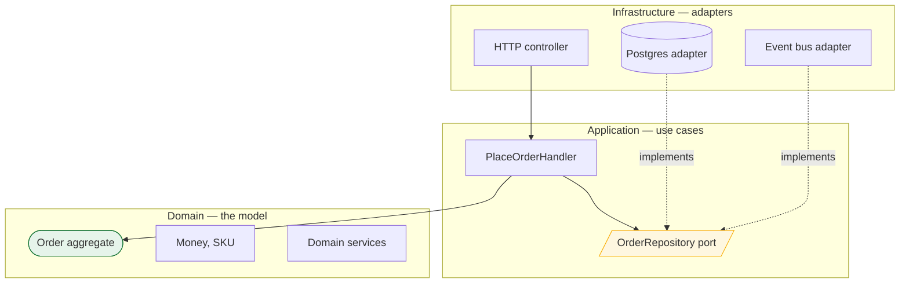

> The model is worthless if it cannot be loaded, saved and called without dragging the
> database into it. This lesson is the plumbing that keeps infrastructure out of the domain —
> and the layering that makes a module extractable later.

| | |
|---|---|
| **Module** | [06 — Domain-driven design](/modules/domain-driven-design/README) |
| **Prerequisites** | [06-02 Aggregates](/modules/domain-driven-design/02-entities-value-objects-and-aggregates), [06-03 Domain events](/modules/domain-driven-design/03-domain-events-and-domain-services) |
| **Also known as** | ports and adapters, hexagonal architecture, clean architecture, onion architecture |
| **Category** | Structure |

---

## 1. The problem

ShopFlow's `Order` aggregate is beautifully modelled. Then:

- It extends the ORM's base class, so it needs a no-arg constructor and public setters — which
  destroys the invariants from [06-02](/modules/domain-driven-design/02-entities-value-objects-and-aggregates), because
  anything can now set any field.
- `Order.place()` calls `db.save(this)`, so the aggregate depends on the database, and a unit
  test needs a database.
- Business rules leak into the controller: `if (order.getStatus() == 3 && user.isAdmin())`.
- Loading an order for a read-only page loads the full aggregate with all its lines and
  triggers four lazy-loaded queries.
- Swapping Postgres for DynamoDB means rewriting the domain model, because the model *is* the
  persistence model.

The domain and the infrastructure have grown into each other. Every one of these makes the
module harder to test today and impossible to extract tomorrow
([07-05](/modules/modular-monolith/05-extracting-a-module-into-a-service)).

## 2. In plain language

A restaurant kitchen and its suppliers.

The chef's recipes do not name a supplier. They say "two kilos of tomatoes" — an *interface*.
The kitchen has a standing arrangement with a wholesaler, but the recipe does not know or care.
Change wholesaler and no recipe changes. Try to test a recipe and you can use tomatoes from
anywhere, including a shop across the road.

Now imagine recipes written as "two kilos of tomatoes, collected personally from Giovanni's
warehouse on Tuesday, paid by the yellow card." Every recipe now depends on Giovanni, on
Tuesdays and on a payment method. Changing supplier means rewriting the cookbook. Testing a
recipe requires Giovanni.

The **repository** is the standing arrangement: "give me order 42" and "here is order 42, save
it", with no mention of tables or SQL. The **application layer** is the head chef — deciding
which recipes run in what order for a given ticket, but cooking nothing personally.

**Where the analogy breaks down:** a chef can walk to the warehouse in an emergency. Once code
depends on a concrete database, there is no walking back — the dependency is compiled in.

## 3. How it works

### The dependency rule

One rule generates the whole architecture:

> **Dependencies point inward. The domain depends on nothing.**



Note the direction of the dotted lines. The database adapter depends on the port; the port is
owned by the application. This is **dependency inversion** — and it is what lets you run the
entire domain and application layer in a unit test with in-memory adapters, in milliseconds,
with no Docker.

Hexagonal architecture, clean architecture, onion architecture and ports-and-adapters are the
same idea with different diagrams. Do not spend time choosing between them.

### Repositories

A repository provides **collection-like access to aggregates**. It hides persistence entirely.

Rules:

1. **One repository per aggregate root.** Not per table, not per entity.
2. **It returns whole aggregates**, never partial ones — a half-loaded aggregate cannot enforce
   its invariants.
3. **The interface belongs to the domain/application**; the implementation to infrastructure.
4. **It is not a query service.** Repositories serve the *write* side. Arbitrary reporting
   queries belong in a read model ([04-06](/modules/data-and-consistency/06-cqrs)), which may
   bypass the domain entirely and hit the database directly. That is allowed, and it is the
   pressure valve that stops repositories growing forty finder methods.

That fourth rule resolves the most common complaint about repositories. You are not required to
express `orders where total > 500 and country = DE sorted by date` through the aggregate — you
should not. Reads and writes have different shapes, which is the whole of
[CQRS](/modules/data-and-consistency/06-cqrs).

### The application layer

Application services (or *command handlers*, or *use cases*) orchestrate. Each one:

1. Begins a transaction / unit of work
2. Loads aggregates via repositories
3. Calls domain methods — **this is where the business rules run, not here**
4. Saves
5. Publishes integration events via the [outbox](/modules/data-and-consistency/03-transactional-outbox)
6. Returns a DTO, never the aggregate itself

**If an application service contains an `if` about business rules, that rule is in the wrong
place.** The heuristic: an application service should read like a list of steps, and each step
should be a call.

### Factories

Where construction is complex enough to be a domain concern, a factory keeps the aggregate's
constructor honest — it can enforce that an object is *never* created in an invalid state,
including reconstitution from storage. Most aggregates do not need one; a static
`Order.create(...)` returning `Result` is usually enough.

### The ORM tension

The single most common practical problem in this lesson. ORMs want public setters, no-arg
constructors, and mutable collections; rich aggregates want none of those. Options, best first:

| Approach | Cost |
|---|---|
| Separate persistence model, mapped explicitly in the repository | Mapping code to maintain — and total freedom in the domain |
| ORM with field access, private constructors, custom value-object converters | Fights the ORM's defaults; possible in most mature ORMs |
| Plain SQL in the repository | More code, complete control, no magic |
| Let the ORM shape the domain | Free today; you no longer have a domain model |

## 4. Pseudo-code

**Before — everything fused.**

```
record Order extends OrmEntity:              # TRAP: framework base class
  id: OrderId
  status: Int                                # TRAP: an int because the ORM likes ints
  lines: LazyList<OrderLine>                 # TRAP: lazy loading = N+1 in production

  fn place():
    this.status = 2                          # TRAP: no invariants, just a field
    db.save(this)                            # TRAP: the aggregate knows the database

service OrderController:
  fn post_order(req):
    o = db.query("SELECT * FROM orders WHERE id = ?", req.id)
    if o.status == 1 and req.user.is_admin:  # TRAP: business rule in the controller
      o.status = 2
    db.save(o)
    return json(o)                           # TRAP: the aggregate IS the API contract.
                                             # Renaming a field breaks every client.
```

**The pattern — ports in the middle, adapters outside.**

```
# ---------- DOMAIN: depends on nothing. No imports from infrastructure. ----------
aggregate Order:
  root: id, customer_id, lines, total, lifecycle, version
  invariants: total == sum_of(lines) ; lifecycle == PLACED implies lines.size > 0
  fn place() -> Result<Order, OrderError>: ...      # pure. No I/O. No database.


# ---------- APPLICATION: owns the PORTS (interfaces), not the implementations ----
interface OrderRepository:                   # a port. Lives with the application.
  fn get(id: OrderId) -> Result<Order, NotFound>    # whole aggregate, always
  fn save(o: Order) -> Result<Unit, ConflictError>  # optimistic concurrency (10-01)
  fn next_id() -> OrderId
  # Note what is absent: no find_by_status, no find_all_paged, no search.
  # Those are read-model concerns (04-06), not repository concerns.

interface EventPublisher:
  fn publish(events: List<IntegrationEvent>)

service PlaceOrderHandler:                   # an application service / use case
  uses orders: OrderRepository               # the PORT, not Postgres
  uses publisher: EventPublisher
  uses unit_of_work: UnitOfWork

  @timeout(2s)
  fn handle(cmd: PlaceOrder) -> Result<OrderSummary, OrderError>:
    with unit_of_work:                       # 1. transaction
      order = orders.get(cmd.order_id)?      # 2. load
      placed = order.place()?                # 3. domain decides. No `if` here.
      orders.save(placed)?                   # 4. save
      publisher.publish(translate(placed.raised))   # 5. outbox, same transaction
    return Ok(to_summary(placed))            # 6. a DTO — never the aggregate
    # Read it top to bottom: six steps, no business logic. That is the test.


# ---------- INFRASTRUCTURE: adapters, depending inward on the ports -------------
service PostgresOrderRepository implements OrderRepository:
  uses db: Store<Any, Any>

  fn get(id: OrderId) -> Result<Order, NotFound>:
    row = db.query_one("SELECT * FROM orders WHERE id = ?", id) ?? return Err(NotFound)
    lines = db.query("SELECT * FROM order_lines WHERE order_id = ?", id)
    # Explicit mapping: the persistence shape and the domain shape are allowed to
    # differ, and the domain never learns that `lifecycle` is stored as a smallint.
    return Ok(Order.reconstitute(
      id: OrderId(row.id),
      customer_id: CustomerId(row.customer_id),
      lines: lines.map(l => OrderLine(SKU(l.sku), Quantity(l.qty),
                                      Money(l.unit_price_minor, row.currency))),
      total: Money(row.total_minor, row.currency),
      lifecycle: lifecycle_from_int(row.lifecycle),
      version: row.version))

  fn save(o: Order) -> Result<Unit, ConflictError>:
    # The aggregate is the concurrency unit: one version, on the root (06-02).
    n = db.execute("UPDATE orders SET total_minor=?, lifecycle=?, version=?
                    WHERE id=? AND version=?",
                   o.total.amount, to_int(o.lifecycle), o.version + 1, o.id, o.version)
    if n == 0: return Err(ConflictError)     # someone else wrote first (10-01)
    db.execute("DELETE FROM order_lines WHERE order_id=?", o.id)
    db.batch_insert("order_lines", o.lines.map(to_row))
    return Ok(unit)


# ---------- Testing: the payoff. No database, no container, milliseconds. -------
service InMemoryOrderRepository implements OrderRepository:
  state items: Map<OrderId, Order> = {}
  fn get(id) -> Result<Order, NotFound>:
    return items.get(id) ?? Err(NotFound)
  fn save(o) -> Result<Unit, ConflictError>:
    existing = items.get(o.id)
    if existing is Some and existing.version != o.version: return Err(ConflictError)
    items.put(o.id, o); return Ok(unit)

test "placing an empty order is rejected":
  handler = PlaceOrderHandler(orders: InMemoryOrderRepository(),
                              publisher: RecordingPublisher())
  assert handler.handle(PlaceOrder(empty_order_id)) == Err(EmptyOrder)
  # Every business rule in the system is testable this way, with no infrastructure.
```

**Reads bypass the domain — deliberately.**

```
# A repository that grew forty finder methods is a repository being asked to do
# the read model's job. Split them.

interface OrderQueries:                      # read side: no aggregates involved
  fn order_summary(id: OrderId) -> Option<OrderSummaryView>
  fn orders_for_customer(id: CustomerId, page: Page) -> List<OrderListItem>
  fn high_value_orders(min: Money, since: Instant) -> List<OrderListItem>

service PostgresOrderQueries implements OrderQueries:
  fn orders_for_customer(id, page) -> List<OrderListItem>:
    # Straight to the database, shaped for the screen, no aggregate reconstruction.
    # WHY this is allowed: reading cannot violate an invariant. Only writes can.
    return db.query("""SELECT o.id, o.total_minor, o.lifecycle, count(l.id) AS lines
                       FROM orders o LEFT JOIN order_lines l ON l.order_id = o.id
                       WHERE o.customer_id = ? GROUP BY o.id
                       ORDER BY o.placed_at DESC LIMIT ? OFFSET ?""",
                    id, page.size, page.offset).map(to_list_item)
```

**Factory — when construction is itself a domain rule.**

```
factory OrderFactory:
  uses pricing: PricingService                # a domain service (06-03)

  fn create_from_basket(b: Basket, customer: CustomerSnapshot)
      -> Result<Order, OrderError>:
    if b.items.is_empty(): return Err(EmptyBasket)
    lines = []
    for item in b.items:
      price = pricing.price_for(item.sku, customer.tier)?    # a real domain rule
      lines.append(OrderLine(item.sku, item.qty, price))
    return Order.create(id: orders.next_id(), customer_id: customer.id, lines: lines)
    # WHY a factory: creating an order from a basket requires pricing rules that
    # Order must not know about. Without one, this logic lands in the handler.
```

## 5. Knobs and variants

| Knob | Guidance | Failure if wrong |
|---|---|---|
| Repository granularity | One per aggregate root | One per table drags persistence shape into the domain |
| Repository methods | `get`, `save`, `next_id`, plus a few domain finders | Forty finders means the read model is missing |
| Reads | Bypass the domain; query directly | Forcing reads through aggregates is slow and awkward |
| Persistence model | Separate and mapped, if the ORM fights you | Letting the ORM shape the domain removes the domain |
| DTO at the boundary | Always | Returning aggregates makes internals a public API |
| Unit of work | One transaction per use case | Transactions spanning use cases couple them permanently |
| Layer enforcement | Automated (import rules) | Convention alone erodes within months ([07-02](/modules/modular-monolith/02-module-boundaries-and-enforcement)) |

## 6. Challenges and failure modes

- **The ORM winning.** Public setters and no-arg constructors reintroduce every invariant
  violation the aggregate was built to prevent. Decide deliberately; do not drift.
- **Repositories that leak query objects.** Returning an ORM query builder or an `IQueryable`
  lets callers compose queries against the domain shape, coupling every caller to the schema.
- **Lazy loading.** A partially loaded aggregate cannot enforce invariants, and the N+1 appears
  in production, not in tests.
- **The application service that grew rules.** `if order.total > 500 && customer.tier == GOLD`
  in a handler is a business rule that will be duplicated in the next handler.
- **Anaemic layering.** Ports, adapters, DTOs and mappers around a domain with no behaviour —
  maximum ceremony, zero benefit. The layering is only worth it if there is a model inside.
- **Returning aggregates from APIs.** The aggregate becomes the wire contract, and every
  internal rename is a breaking change ([01-04](/modules/communication/04-serialization-and-schema-evolution)).
- **Transactions spanning use cases.** Convenient, and it couples two use cases so tightly that
  neither can move.
- **Repository per entity, not per aggregate.** `OrderLineRepository` lets code modify a line
  without going through `Order`, which silently deletes the aggregate boundary.
- **Mapping code treated as waste.** It is the price of the domain being free. The alternative
  is not "no mapping" — it is "the database shapes your model".

## 7. Alternatives

- **Active Record.** The model *is* the row. Fast, excellent for CRUD, and it fuses domain and
  persistence by design — which is fine until the domain has rules worth protecting.
- **Transaction script.** A procedure per use case, straight SQL, no model. **Genuinely correct
  for simple domains**, and honest about it.
- **Table Data Gateway / DAO.** A thin data-access layer with no domain pretensions.
- **CQRS with separate write and read stacks** ([04-06](/modules/data-and-consistency/06-cqrs)).
  The formalisation of "reads bypass the domain", taken to its conclusion.
- **Functional core / imperative shell.** Pure domain functions, all I/O at the edge. Same
  dependency rule, less machinery, no interfaces required.

## 8. Trade-offs

| Advantage | Disadvantage |
|---|---|
| Domain is testable with no infrastructure at all | More types: ports, adapters, DTOs, mappers |
| Storage technology can change without touching the model | Explicit mapping code to write and maintain |
| Business rules have exactly one home | Easy to over-apply to CRUD that never needed it |
| Layer boundaries are what make later extraction cheap | Fights ORM defaults, sometimes hard |
| Reads can be fast and ugly without corrupting the model | Two models for one concept must be kept coherent |

## 9. Complexity introduced

- **Operational.** None. This is compile-time structure with no runtime cost.
- **Cognitive.** More indirection: finding what runs means following a port to an adapter. Worth
  it when the domain has rules; pure overhead when it does not.
- **Failure surface.** None added directly, though a mapping bug between persistence and domain
  is a real and easily-missed defect class.
- **Testing.** Dramatically improved — the domain and application layers test in memory in
  milliseconds. In exchange, the mapping layer needs its own integration tests against a real
  database, or mapping bugs go undetected.

## 10. Related concepts

- **Builds on:** [06-02 Aggregates](/modules/domain-driven-design/02-entities-value-objects-and-aggregates), [06-03 Domain events](/modules/domain-driven-design/03-domain-events-and-domain-services)
- **Composes with:** [04-06 CQRS](/modules/data-and-consistency/06-cqrs), [04-03 Outbox](/modules/data-and-consistency/03-transactional-outbox), [07-02 Module boundaries](/modules/modular-monolith/02-module-boundaries-and-enforcement)
- **Conflicts with / tension:** ORM conventions, and the appeal of just writing the query inline
- **Contrast with:** Active Record — fusing model and storage versus separating them. Both are legitimate; the choice depends on whether the domain has rules
- **Leads to:** [06-05 Strategic design](/modules/domain-driven-design/05-strategic-design-bounded-contexts-and-context-maps)

## 11. Exercises

1. **Trace it.** Take the "Before" controller. List every reason the business rule inside it
   cannot be reused by a batch import, and then by a partner API. How many places will that rule
   exist in a year?
2. **Extend it.** ShopFlow moves orders from Postgres to DynamoDB. Using the "After" structure,
   list exactly which files change. Then do the same for the "Before" structure.
3. **Break it.** `PostgresOrderRepository.save` deletes and re-inserts all lines. Find the
   scenario where this loses data that a line-level update would have preserved, and decide
   whether you care.

## 12. References

- Eric Evans, *Domain-Driven Design* (2003) — Ch. 6, repositories and factories.
- Alistair Cockburn, "Hexagonal Architecture" (2005) — ports and adapters, the original.
- Robert C. Martin, "The Clean Architecture" (2012) — the dependency rule.
- Vaughn Vernon, *Implementing Domain-Driven Design* — Ch. 12 (repositories), Ch. 14 (application).
- Martin Fowler, *Patterns of Enterprise Application Architecture* — Repository, Active Record, Transaction Script, Data Mapper.
- Mark Seemann, "Dependency Injection Principles, Practices, and Patterns".

---

**Up:** [Module 06](/modules/domain-driven-design/README) · **Previous:** [← 06-03](/modules/domain-driven-design/03-domain-events-and-domain-services) · **Next:** [06-05 Strategic design →](/modules/domain-driven-design/05-strategic-design-bounded-contexts-and-context-maps)
