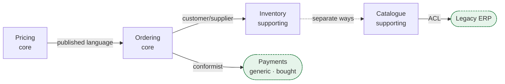

> The half of DDD that determines whether your architecture succeeds. Aggregates inside the
> wrong boundary are excellent craftsmanship applied to the wrong building.

| | |
|---|---|
| **Module** | [06 — Domain-driven design](/modules/domain-driven-design/README) |
| **Prerequisites** | [06-01 Ubiquitous language](/modules/domain-driven-design/01-ubiquitous-language-and-the-domain-model) |
| **Also known as** | strategic DDD, context mapping, subdomain distillation |
| **Category** | Structure |

---

## 1. The problem

ShopFlow has one `Product` class with 94 fields. It contains the merchandising description,
the physical weight, the tax class, the supplier contract reference, the bin location, the
price list, the SEO slug and eleven booleans whose meaning is documented nowhere.

Four teams change it. Every change requires regression-testing four subsystems. A field added
for shipping breaks a merchandising report. Nobody can delete anything, because nobody can
prove nothing reads it.

Meanwhile the same organisation spends its best engineers on a bespoke user-management system,
while the pricing engine — the thing that actually differentiates ShopFlow from its competitors
— is a 4,000-line file nobody wants to touch.

**Two distinct failures: one model trying to serve four purposes, and effort spent where it
does not matter.**

## 2. In plain language

A hospital, again, and the word "patient".

To the surgical team a patient is a body with a condition, allergies and a scheduled slot. To
billing they are an account with an insurer and a payment history. To catering they are a bed
number with dietary restrictions. To research they are an anonymised data point.

Nobody sensible tries to build one Patient Form serving all four. Each department has its own
records, its own vocabulary, and a *shared identifier* — the patient number — that lets them
talk. Where they must exchange information, there is an explicit, agreed process, and it is
usually a form.

The second idea is just as important. The hospital's reputation rests on its surgical
outcomes, not its catering. Catering matters — patients must be fed — but the hospital buys
catering software rather than building it, and puts its best people in theatre. **Knowing
which is which is a strategic decision, not a technical one.**

**Where the analogy breaks down:** hospital departments have been separate for a century.
Software teams inherit one database and must actively discover where the lines were supposed
to be.

## 3. How it works

### Subdomains: where to spend effort

The domain divides into three kinds of subdomain, and the correct engineering response is
different for each:

| Kind | Definition | Response | ShopFlow |
|---|---|---|---|
| **Core** | Why customers choose you. Your differentiator | Build it. Best people. Deep modelling | Pricing and promotions; recommendations |
| **Supporting** | Necessary, specific to you, not differentiating | Build simply, or outsource | Order management; returns |
| **Generic** | Every business needs it, nobody differentiates on it | **Buy it.** Never build | Auth, payments, email, tax calculation |

**Building a generic subdomain is the most common and most expensive strategic mistake in
software.** Bespoke authentication, a hand-rolled billing engine, a custom CMS — each consumes
a team indefinitely and produces something worse than a product costing a few hundred pounds a
month.

The distinction is also unstable, and worth revisiting yearly. Payments were core to Stripe
and generic to everyone else. Search was core to Google and generic to everyone else *until*
the moment your product became search.

### Bounded contexts

A **bounded context** is a boundary within which one model applies and one vocabulary holds.
Outside it, the same words mean different things — deliberately.

ShopFlow's 94-field `Product`, decomposed honestly:

| Context | "Product" means | Fields it cares about |
|---|---|---|
| **Catalogue** | Something browsable | name, description, images, category, slug |
| **Inventory** | A physical thing in a bin | sku, bin, quantity, unit of measure |
| **Pricing** | A price-list entry | base price, tax class, discount eligibility |
| **Shipping** | A box with mass | weight, dimensions, hazmat class |
| **Procurement** | A supplier agreement | supplier, lead time, cost price, MOQ |

Five contexts, five small models, one shared identifier (the SKU). **This is not duplication to
be eliminated — it is the correct answer.** The contexts genuinely mean different things, and
forcing them into one model is what produced the 94-field class.

The critical relationship, restated because it is the most common confusion in this course:

> **A bounded context is a linguistic boundary. A microservice is a deployment boundary.**
> A context may be a package today, a module tomorrow, a service next year, and the model does
> not change. Contexts are *discovered* in the domain; services are *chosen* for operational
> reasons ([08-01](/modules/microservice-architecture/01-decomposition-and-bounded-contexts)).

Deploying one service per context is a reasonable default, not a law. Several contexts in one
[modular monolith](/modules/modular-monolith/README) is frequently the better engineering
answer.

### Context maps: the relationships

Contexts must interact. The *relationship* is as much a design decision as the boundary, and it
is usually determined by organisational power rather than technology. The canonical
relationships:

| Relationship | Meaning | Use when |
|---|---|---|
| **Partnership** | Two teams succeed or fail together; coordinated releases | Genuinely mutual dependency, same goals |
| **Shared kernel** | A shared subset of the model, co-owned | Small, stable, two closely-aligned teams. Rare and costly |
| **Customer/Supplier** | Downstream's needs enter the upstream's backlog | The upstream team is willing and accountable |
| **Conformist** | Downstream adopts the upstream model wholesale, no translation | Upstream won't accommodate you, and their model is tolerable |
| **Anti-corruption layer** | Downstream translates to protect its own model | Upstream won't accommodate you and their model is *not* tolerable ([08-06](/modules/microservice-architecture/06-anti-corruption-layer)) |
| **Open host service** | Upstream publishes a general-purpose protocol for many consumers | Many downstreams; you cannot serve each bespoke |
| **Published language** | A well-documented shared interchange format | Cross-organisation integration ([05-04](/modules/messaging-and-eip/04-message-translator-and-canonical-data-model)) |
| **Separate ways** | No integration at all. Duplicate the little you need | Integration costs more than duplication |
| **Big ball of mud** | No boundaries; a legacy region to be quarantined | Naming it is the first step to containing it |



**"Separate ways" is underrated.** If Catalogue needs a product's weight once a day, copying it
may be cheaper than any integration. Not every relationship needs a pipe.

### Distillation

Once subdomains are classified, *distil* the core: pull the differentiating logic out of the
mud so it can be understood, tested and improved independently. The rest can stay ugly. This
is deliberate, unequal investment — and it is the point of the classification.

## 4. Pseudo-code

**Before — one model, four purposes.**

```
record Product:                     # 94 fields, four teams, no owner
  sku, name, description, images, category, slug, meta_title,       # catalogue
  weight_kg, length_cm, width_cm, height_cm, hazmat_class,          # shipping
  bin_location, qty_on_hand, qty_reserved, unit_of_measure,         # inventory
  base_price, tax_class, discount_eligible, price_list_id,          # pricing
  supplier_id, cost_price, lead_time_days, min_order_qty,           # procurement
  flag1, flag2, ... flag11                                          # ???
# TRAP: a shipping change regression-tests four subsystems. Nothing is deletable.
```

**After — five contexts, five models, one shared identifier.**

```
# ============ Catalogue context ============
context Catalogue:
  record Product:                   # "product" here means: something browsable
    sku: SKU
    name: String
    description: RichText
    images: List<ImageRef>
    category: CategoryId

# ============ Inventory context ============
context Inventory:
  record StockItem:                 # NOT called Product: inventory says "stock item"
    sku: SKU                        # the shared identifier — the ONLY shared thing
    bin: BinLocation
    on_hand: Quantity
    reserved: Quantity
    invariants: reserved <= on_hand

# ============ Pricing context (CORE — deepest modelling) ============
context Pricing:
  record PricedItem:
    sku: SKU
    base: Money
    tax_class: TaxClass
    eligible_promotions: List<PromotionId>

# ============ Shipping context ============
context Shipping:
  record ParcelItem:
    sku: SKU
    weight: Grams
    dimensions: Dimensions
    hazmat: Option<HazmatClass>

# Five models, ~5 fields each, one shared SKU. Each team changes its own without
# regression-testing anyone else's. Nothing is duplicated that isn't genuinely
# meant differently.
```

**The context map, as an artefact you can review.**

```
context_map ShopFlow:

  Ordering -> Inventory:
    relationship: CUSTOMER_SUPPLIER
    # Both teams are ours, upstream is accountable to downstream's roadmap.
    integration: synchronous reserve() + async StockReserved (01-01, 01-02)
    contract: owned by Inventory, reviewed with Ordering

  Ordering -> PaymentProvider:
    relationship: CONFORMIST
    # WHY conformist and not ACL: their model is a reasonable fit, they are a
    # market leader, and translation would cost more than it protects. This is
    # a DECISION, recorded, not an accident.
    integration: their SDK, their vocabulary, inside an adapter

  Catalogue -> LegacyERP:
    relationship: ANTI_CORRUPTION_LAYER
    # WHY ACL: EBCDIC, German field names, status codes documented in a 2009 PDF.
    # Their model must not enter ours. See 08-06.
    integration: SFTP CSV every 15 min -> translator -> Catalogue.Product

  Pricing -> Ordering:
    relationship: OPEN_HOST_SERVICE + PUBLISHED_LANGUAGE
    # Pricing has six consumers. It publishes one documented, versioned protocol
    # rather than accommodating each one. See 01-04.
    integration: PriceQuoteV3, versioned, full-transitive compatibility

  Inventory <-> Catalogue:
    relationship: SEPARATE_WAYS
    # They share nothing but a SKU. No integration exists, deliberately.
    # WHY: the one field Catalogue wanted (availability) is served from a read
    # model fed by events, not from a dependency between the two contexts.


subdomains:
  Pricing:        CORE        # our differentiator. Best engineers. Deep model.
  Recommendations: CORE
  Ordering:       SUPPORTING  # necessary, ours, not a differentiator
  Inventory:      SUPPORTING
  Catalogue:      SUPPORTING
  Payments:       GENERIC     # BOUGHT. Never build.
  Auth:           GENERIC     # BOUGHT.
  TaxCalculation: GENERIC     # BOUGHT — jurisdiction rules change weekly.
  EmailDelivery:  GENERIC     # BOUGHT.
```

**Finding a boundary: the language test in practice.**

```
# Symptom: the same word carries a qualifier that varies by speaker.
#
#   "the SHIPPING weight"      vs "the BILLING weight"
#   "the CUSTOMER'S price"     vs "the LIST price"
#   "confirmed" (paid)         vs "confirmed" (picked)      <- 06-01 §1
#
# The qualifier is the context boundary announcing itself. When a team routinely
# disambiguates a term with an adjective, they are already living in two contexts
# and compensating for it in conversation.
#
# Second test — the pronoun test:
#   Ask two people to define a term without using the word "or".
#   If they cannot, there are two concepts wearing one name.
```

## 5. Knobs and variants

| Knob | Guidance | Failure if wrong |
|---|---|---|
| Subdomain classification | Revisit yearly; be honest about "core" | Building generic subdomains consumes teams forever |
| Context size | One team can hold it in their heads | Too large: the 94-field class. Too small: chatty coupling |
| Context ↔ service mapping | Not necessarily 1:1 | Assuming 1:1 produces premature distribution |
| Relationship choice | Match organisational reality, not the ideal | An ACL where customer/supplier would work is wasted effort |
| Shared kernel | Avoid unless two teams are truly aligned | It is shared ownership, which means shared deployment |
| Conformist vs ACL | ACL when their model would damage yours | ACL everywhere is expensive ceremony |
| Integration existence | "Separate ways" is a valid answer | Not every pair of contexts needs a pipe |

## 6. Challenges and failure modes

- **One model for everything.** The 94-field class. Arrives by accretion; nobody chooses it.
- **Contexts drawn on technical layers.** "Frontend context", "database context". Layers are not
  contexts; contexts are vertical slices of meaning.
- **Assuming context = microservice.** Leads to distributing before the boundaries are proven,
  which freezes them ([00-01](/modules/foundations/01-why-distributed-systems)).
- **Building generic subdomains.** "Our auth needs are special." They are not.
- **Misclassifying core.** Teams call the thing they enjoy "core". The test is commercial: would
  a customer notice if this were merely adequate?
- **Shared kernel by accident.** A "common" library containing domain types is a shared kernel
  with no agreement, no owner, and coupled deployments
  ([08-01](/modules/microservice-architecture/01-decomposition-and-bounded-contexts)).
- **Context maps drawn once.** Relationships change with reorganisations. An 18-month-old map is
  fiction.
- **Ignoring the political reality.** Choosing "customer/supplier" when the upstream team has no
  incentive to help you produces a broken dependency and a frustrated team. The correct choice
  there is conformist or ACL — a technical response to an organisational fact.
- **Contexts smaller than a team.** If one team owns nine contexts with heavy interaction, they
  are paying boundary costs for boundaries that buy nothing.

## 7. Alternatives

- **One canonical model** ([05-04](/modules/messaging-and-eip/04-message-translator-and-canonical-data-model)).
  The explicit opposite. Works with few systems; becomes a committee and a mega-schema at scale.
- **Decompose by technical layer.** Traditional n-tier. Well understood, and a business change
  touches every layer.
- **Decompose by team, whatever they own.** Honest about Conway's Law and sometimes right —
  though teams also inherit accidental scope.
- **Don't decompose.** For a small domain with one team, one model is correct and cheapest.
- **Data mesh / domain ownership of data.** The same idea applied to analytics: domain-owned
  data products rather than one warehouse team.

## 8. Trade-offs

| Advantage | Disadvantage |
|---|---|
| Each model stays small and comprehensible | Deliberate duplication of concepts across contexts |
| Teams change their own context without coordination | Translation is needed at every boundary |
| Effort concentrates where it differentiates | Classification requires business judgement, not just technical |
| Boundaries survive re-deployment decisions | Discovering them takes workshops and access to experts |
| Relationships make organisational reality explicit | Some relationships are political and cannot be engineered away |

## 9. Complexity introduced

- **Operational.** None directly. Contexts are a design concept; their deployment is
  [Module 07](/modules/modular-monolith/README) and
  [Module 08](/modules/microservice-architecture/README)'s subject.
- **Cognitive.** Engineers must accept that the same word legitimately means different things,
  and stop trying to unify. This is the hardest idea in the module for people trained on
  normalisation.
- **Failure surface.** Translation errors at boundaries; contexts drifting out of alignment with
  teams after a reorganisation.
- **Testing.** Contract tests per relationship ([01-04](/modules/communication/04-serialization-and-schema-evolution)),
  and translation tests per boundary ([08-06](/modules/microservice-architecture/06-anti-corruption-layer)).

## 10. Related concepts

- **Builds on:** [06-01 Ubiquitous language](/modules/domain-driven-design/01-ubiquitous-language-and-the-domain-model)
- **Composes with:** [07-02 Module boundaries](/modules/modular-monolith/02-module-boundaries-and-enforcement), [08-01 Service decomposition](/modules/microservice-architecture/01-decomposition-and-bounded-contexts), [08-06 Anti-corruption layer](/modules/microservice-architecture/06-anti-corruption-layer)
- **Conflicts with / tension:** [05-04 Canonical data model](/modules/messaging-and-eip/04-message-translator-and-canonical-data-model) — one shared vocabulary versus many local ones
- **Contrast with:** database normalisation — one model with no redundancy versus many models with deliberate redundancy
- **Leads to:** [06-06 Modelling in practice](/modules/domain-driven-design/06-modelling-in-practice)

## 11. Exercises

1. **Trace it.** Take the 94-field `Product`. Assign every field group to a context. Which
   fields did you struggle to place, and what does that struggle tell you about the boundary?
2. **Extend it.** Draw ShopFlow's context map for a new requirement: same-day delivery, needing
   real-time stock, courier availability and dynamic pricing. Which contexts change, which
   relationships are new, and which are you not allowed to change?
3. **Break it.** Classify a system you work on into core/supporting/generic. Find the generic
   subdomain your organisation is building rather than buying, and estimate its annual cost in
   engineer-months.

## 12. References

- Eric Evans, *Domain-Driven Design* (2003) — Part IV, "Strategic Design". The most valuable third of the book.
- Eric Evans, "Domain-Driven Design Reference" (2015) — free, and the clearest summary of the relationship patterns.
- Vaughn Vernon, *Implementing Domain-Driven Design* — Ch. 2–3, contexts and context maps.
- Nick Tune & Scott Millett, *Patterns, Principles and Practices of Domain-Driven Design*.
- Vlad Khononov, *Learning Domain-Driven Design* (2021) — the best modern treatment of subdomain classification.
- Simon Wardley, "Wardley Maps" — a complementary way to decide what to build versus buy.

---

**Up:** [Module 06](/modules/domain-driven-design/README) · **Previous:** [← 06-04](/modules/domain-driven-design/04-repositories-factories-and-the-application-layer) · **Next:** [06-06 Modelling in practice →](/modules/domain-driven-design/06-modelling-in-practice)
