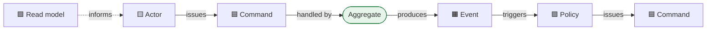

> Everything in this module assumed you already knew the boundaries and the invariants. You do
> not. This lesson is how they are actually discovered — in a room, with the people who know,
> in about six hours.

| | |
|---|---|
| **Module** | [06 — Domain-driven design](/modules/domain-driven-design/README) |
| **Prerequisites** | [06-02 Aggregates](/modules/domain-driven-design/02-entities-value-objects-and-aggregates), [06-05 Strategic design](/modules/domain-driven-design/05-strategic-design-bounded-contexts-and-context-maps) |
| **Also known as** | EventStorming, domain storytelling, knowledge crunching, refactoring toward deeper insight |
| **Category** | Structure |

---

## 1. The problem

The team agrees DDD is a good idea and sits down to define bounded contexts. Four hours later
there is a whiteboard of boxes labelled with the names of the existing database tables, and
the boundaries are exactly where they already were.

The failure mode is predictable: **you cannot discover boundaries by examining the system you
already have, because the system already encodes the boundaries you are trying to question.**
Reading the schema tells you what someone decided in 2019 under deadline pressure.

Meanwhile the person who actually knows why refunds are handled differently for marketplace
sellers is in customer support, has never been invited to an architecture meeting, and would
have answered the question in ninety seconds.

## 2. In plain language

Two ways to map an unfamiliar city.

The first is to study the existing street signs and administrative boundaries. Fast, and it
tells you what the last planning committee decided — including their mistakes, which are now
invisible because they look like facts.

The second is to follow people around for a day and watch where they actually go. You discover
that the "Northern District" is really two neighbourhoods that never interact, that everyone
crosses the river at one bridge, and that a boundary on the map runs through the middle of a
market square that functions as one place.

Modelling workshops are the second method. **You map the flow of events through the business,
not the structure of the current system**, and the boundaries reveal themselves as the places
where the flow slows down, changes vocabulary, or hands over to different people.

**Where the analogy breaks down:** a city can be observed directly. A business process lives
partly in people's heads, which is why the workshop needs those people in the room rather than
their documentation.

## 3. How it works

### EventStorming

Alberto Brandolini's format. A very long wall, sticky notes, and everyone who knows something.
The colour convention is standard and worth keeping:

| Colour | Element | Meaning |
|---|---|---|
| 🟧 Orange | **Domain event** | Something that happened. Past tense |
| 🟦 Blue | **Command** | Something someone tried to do |
| 🟨 Yellow | **Actor** | Who issued the command |
| 🟪 Lilac | **Policy** | "Whenever X, then Y" |
| 🟩 Green | **Read model** | The information someone needed to decide |
| 🟥 **Red** | **Hot spot** | Disagreement, unknown, or pain |
| 🟫 Brown | **External system** | Something outside your control |

Three levels, used for different purposes:

1. **Big Picture** — the whole business, several hours, wide audience. Output: where the
   *contexts* are, and where the pain is.
2. **Process Level** — one flow in detail. Output: commands, policies, and the read models
   people actually need.
3. **Design Level** — one context, engineers. Output: **aggregates**, directly.

The design-level step has a mechanical payoff that makes it worth the room booking:



**Commands that consistently act on the same cluster of events are one aggregate.** You do not
have to reason about aggregate boundaries in the abstract; you read them off the wall.

### The red stickies are the point

The most valuable output of any modelling workshop is the hot spots — the places where two
experts disagree, or where everyone goes quiet. Each red sticky is either a missing concept in
the model or a genuine business ambiguity that the software has been silently resolving,
usually wrongly.

**Do not resolve them in the room.** Capture, name, and take away. Resolving a red sticky
under time pressure produces a decision the least confident person in the room agreed to.

### Domain storytelling

A complementary technique, better for sequential flows and for people uncomfortable with
abstraction: draw actors, work objects and numbered arrows describing one concrete story in
the domain's own words. *"The picker (1) scans the tote, (2) the system reserves the location,
(3) the picker confirms the item…"*

Use EventStorming to find boundaries; use domain storytelling to nail down a specific flow you
already know matters.

### Refactoring toward deeper insight

Evans' term for the thing that separates a model from a diagram. The first model is always
wrong; the value comes from repeatedly noticing an implicit concept and making it explicit.

The signals that an implicit concept is hiding:

| Signal | Likely hidden concept |
|---|---|
| A boolean that requires a comment | A state machine or a named type |
| A method with four boolean parameters | A missing value object holding the intent |
| The same three fields always passed together | A value object |
| A conditional repeated in five places | A domain policy or specification |
| A comment explaining *why* a rule applies | A named domain concept |
| An expert using a word your code lacks | The concept itself |

The last row is the most reliable signal available, and it is free — it happens in every
conversation, if you listen for it.

### Who must be in the room

Engineers alone produce a model of the system. The value comes from people who know the
domain and are not usually invited: support agents who handle the exceptions, operations staff
who work around the software daily, the finance analyst who reconciles what the system gets
wrong.

## 4. Pseudo-code

**The wall, transcribed.** This is the actual output of a design-level session, and it maps
one-to-one onto the code that follows.

```
# ── ShopFlow returns process, design-level EventStorming, transcribed ─────────
#
# 🟨 Customer  🟦 RequestReturn
#              → 🟧 ReturnRequested
#                🟪 policy: whenever ReturnRequested, issue IssueLabel
#                  🟦 IssueLabel → 🟧 LabelIssued
#                  🟥 HOT SPOT: who pays postage for a faulty item vs a change
#                              of mind? Two experts disagreed. NOT RESOLVED.
#
# 🟫 Carrier   → 🟧 ParcelScanned
#                🟧 ParcelReceived
#
# 🟨 Inspector 🟦 RecordInspection
#              → 🟧 InspectionPassed | 🟧 InspectionFailed
#                🟩 read model: inspector needs original order + photos + policy
#                🟪 policy: whenever InspectionFailed, issue CreateReviewTask
#
# 🟪 policy: whenever InspectionPassed, issue IssueRefund
#            🟦 IssueRefund → 🟧 RefundIssued
#            🟥 HOT SPOT: refund to original payment method if the card has
#                        expired? Nobody in the room knew. TAKE AWAY.
#
# 🟪 policy: whenever 21 days pass with no ParcelReceived, issue ExpireReturn
#            🟥 HOT SPOT: 21 days from request or from label issue? Legal to check.
```

**Reading the aggregate off the wall.**

```
# The commands RequestReturn, RecordInspection, IssueRefund and ExpireReturn all
# act on the same cluster of events and share one identifier. That cluster IS the
# aggregate — discovered, not guessed (06-02).

aggregate Return:
  root:
    id: ReturnId
    order_id: OrderId                # another aggregate: BY ID (06-02 rule 4)
    state: ReturnState
    requested_at: Instant
    expires_at: Instant
    version: Int

  invariants:
    state == REFUNDED implies inspection == PASSED
    state == EXPIRED implies parcel_received_at is None
    expires_at == requested_at + 21d     # 🟥 pending: from request or from label?

  fn request(order_id, reason) -> Result<Return, ReturnError>: ...
  fn record_inspection(outcome) -> Result<Return, ReturnError>: ...
  fn expire() -> Result<Return, ReturnError>: ...

# The lilac stickies become policies verbatim (06-03):
policy IssueLabelWhenReturnRequested:  on ReturnRequested(e): ...
policy RefundWhenInspectionPassed:        on InspectionPassed(e): ...
policy ExpireReturnAfter21Days:           on TimerFired("expiry", e): ...
# And the timer + branching + human step tell you this needs a process manager,
# not a chain of policies. See 05-07.
```

**Refactoring toward deeper insight — three rounds on one rule.**

```
# ── Round 1: the rule as first written. It works, and it explains nothing.
fn can_return(order: Order, today: Date) -> Bool:
  return today - order.delivered_at <= 30d and not order.is_gift and order.total.amount > 0

# ── Round 2: the expert says "gifts have a longer window, and hygiene items
#    can never be returned." Two concepts were hiding inside one boolean.
enum ReturnEligibility: ELIGIBLE | WINDOW_EXPIRED(on: Date) | NEVER_RETURNABLE(why: String)

fn eligibility(order: Order, today: Date) -> ReturnEligibility:
  if order.contains_hygiene_items(): return NEVER_RETURNABLE("hygiene")
  window = order.is_gift ? 60d : 30d
  deadline = order.delivered_at + window
  return today <= deadline ? ELIGIBLE : WINDOW_EXPIRED(deadline)

# ── Round 3: the expert says "the window" as if it were a thing. It is.
#    Making it explicit lets it be tested, displayed to the customer, extended
#    for goodwill, and varied by jurisdiction — none of which the boolean allowed.
record ReturnWindow:
  opens_at: Date
  closes_at: Date
  basis: STANDARD | GIFT | GOODWILL_EXTENSION | JURISDICTION_OVERRIDE

  fn includes(d: Date) -> Bool: return opens_at <= d and d <= closes_at
  fn extend(by: Duration, reason: String) -> ReturnWindow: ...

domain_service ReturnPolicy:
  fn window_for(order: Order) -> Result<ReturnWindow, NeverReturnable>:
    if order.contains_hygiene_items(): return Err(NeverReturnable("hygiene"))
    ...
# The rule is now a noun the business uses, visible in the UI, and changeable
# without touching the aggregate. THAT is the deeper insight — and it came from
# listening to which words the expert used as nouns.
```

**Signals, in code you already have.**

```
# Each of these is an implicit concept asking to be named.

if user.is_premium and not user.is_trial and user.signed_up_at < cutoff:  # ×5 places
  → specification EligibleForFreeShipping

fn create_order(customer, lines, true, false, true, false)                # 4 booleans
  → record OrderOptions { gift_wrap, express, insured, signature_required }

fn ship(street, city, postcode, country)                                  # always together
  → record Address

o.flag7 = true    # "// means the manual review passed, see ticket SHOP-4412"
  → enum ReviewOutcome, and delete the comment
```

## 5. Knobs and variants

| Knob | Guidance | Failure if wrong |
|---|---|---|
| Who attends | Domain experts, including support and ops | Engineers only produces a model of the current system |
| Level | Big Picture → Process → Design | Starting at design level assumes the boundaries |
| Duration | 2–4h Big Picture; 2h per process | Full-day sessions lose the experts' attention and goodwill |
| Hot spots | Capture, do not resolve in the room | Rushed resolution produces decisions nobody believes |
| Notation | Sticky colours, consistently | Improvised notation makes the wall unreadable next week |
| Output | Photographs plus a transcribed model | An undocumented wall is gone within a week |
| Cadence | Re-run when the domain shifts | A one-off workshop's model decays like any other artefact |
| Starting point | The flow, never the schema | Schema-first reproduces existing boundaries exactly |

## 6. Challenges and failure modes

- **Modelling from the database.** The original sin. It guarantees you rediscover the boundaries
  you set out to question.
- **No domain expert in the room.** The most common reason workshops fail. Engineers can only
  model what they already believe.
- **Resolving hot spots under time pressure.** The red stickies are where the value is; rushing
  them converts insight into a bad decision with a false consensus.
- **The wall photographed and forgotten.** Without transcription into code or a written model
  within days, the workshop was expensive theatre.
- **Analysis paralysis.** Modelling forever without shipping. The model is a means; three rounds
  of refinement on the core subdomain beats thirty on everything.
- **Modelling generic subdomains.** Deep modelling of authentication is effort spent where it
  cannot pay back ([06-05](/modules/domain-driven-design/05-strategic-design-bounded-contexts-and-context-maps)).
- **One model, then never again.** Understanding improves; the model must be allowed to change.
  A model frozen at the first workshop is worse than no model, because it has authority.
- **Experts describing the software, not the business.** "Then you click the green button" means
  the question needs rephrasing: *what are you trying to achieve?*
- **Facilitator is the loudest engineer.** They will unconsciously steer toward the design they
  already have. Prefer a facilitator with no stake in the outcome.

## 7. Alternatives

- **Domain storytelling.** Better for a single sequential flow; gentler for non-technical
  participants.
- **Example mapping / BDD.** Concrete examples per rule. Excellent for nailing down invariants
  once the boundaries are known; poor for finding boundaries.
- **User story mapping.** Organises delivery around user journeys. Complementary; it answers
  *what to build next*, not *what the model is*.
- **Wardley mapping.** Answers build/buy/outsource and the evolution of components. Pairs well
  with subdomain classification.
- **Reading the code and the schema.** Fast, cheap, and it tells you the current design rather
  than the domain. Useful as *input*, never as the method.
- **Just start coding.** Legitimate for a small, well-understood domain. The model emerges from
  the refactoring signals in §3 rather than from a workshop.

## 8. Trade-offs

| Advantage | Disadvantage |
|---|---|
| Boundaries are discovered from the domain, not inherited from the schema | Requires domain experts' time, which is politically expensive |
| Hot spots surface ambiguities before they become defects | Ambiguities surfaced must then be resolved, which takes weeks |
| Aggregates fall out of the wall mechanically | The output decays fast unless transcribed |
| Shared understanding across roles, not just a document | A workshop can be steered by whoever facilitates |
| Cheap: a wall, sticky notes, half a day | Feels unproductive to organisations that measure output in tickets |

## 9. Complexity introduced

- **Operational.** None. This is a design activity.
- **Cognitive.** A notation to learn, and a facilitation skill that is genuinely a skill.
- **Failure surface.** None technical. The organisational risk is real: a workshop that surfaces
  a disagreement between two senior stakeholders has created work, and someone must own it.
- **Testing.** The examples produced map directly onto acceptance tests and aggregate unit
  tests — this is one of the cheapest sources of good test cases available.

## 10. Related concepts

- **Builds on:** [06-05 Strategic design](/modules/domain-driven-design/05-strategic-design-bounded-contexts-and-context-maps), [06-02 Aggregates](/modules/domain-driven-design/02-entities-value-objects-and-aggregates)
- **Composes with:** [06-03 Domain events](/modules/domain-driven-design/03-domain-events-and-domain-services) (the orange and lilac stickies become code), [05-07 Process manager](/modules/messaging-and-eip/07-process-manager-and-routing-slip)
- **Conflicts with / tension:** delivery pressure — modelling looks like not-shipping
- **Contrast with:** requirements gathering — collecting what people ask for versus discovering what is true
- **Leads to:** [Module 07 — The modular monolith](/modules/modular-monolith/README), where the model becomes a structure

## 11. Exercises

1. **Trace it.** Take the transcribed returns wall. Two hot spots are unresolved. For each,
   describe what the software will do if nobody resolves it, and who will discover the problem
   first.
2. **Extend it.** Run the signals table over a codebase you work on. Find one boolean that
   needs a comment and one function with three or more boolean parameters. Name the concepts
   hiding inside them.
3. **Break it.** A workshop is run with only engineers, using the current schema as the starting
   point. Predict the boundaries it will produce, and explain why they will look convincing.

## 12. References

- Alberto Brandolini, *EventStorming* (Leanpub, ongoing) — the source. Read the free chapters first.
- Alberto Brandolini, "Introducing EventStorming" (talks) — better than the book for the format.
- Stefan Hofer & Henning Schwentner, *Domain Storytelling* (2021).
- Eric Evans, *Domain-Driven Design* (2003) — Ch. 8–9, "Breakthrough" and "Making Implicit Concepts Explicit". The best writing on refactoring toward insight.
- Matt Wynne, "Introducing Example Mapping" (2015).
- Vlad Khononov, *Learning Domain-Driven Design* — Ch. 12 on how to actually start.

---

**Up:** [Module 06](/modules/domain-driven-design/README) · **Previous:** [← 06-05](/modules/domain-driven-design/05-strategic-design-bounded-contexts-and-context-maps) · **Next:** [Module 07 — The modular monolith →](/modules/modular-monolith/README)
