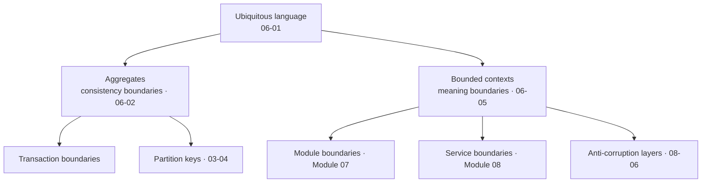

> Every boundary decision in the next two modules — module boundaries, service boundaries,
> transaction boundaries, partition keys — is a modelling decision wearing an infrastructure
> costume. This module is where those decisions are actually made.

This module is written to stand alone. If you have arrived here for DDD and nothing else, you
can read it without the preceding modules; it links outward to where each idea has
consequences, but it does not depend on them.

## What you will be able to do

- Find the boundaries in a domain, rather than guessing at them from a database schema.
- Say what an aggregate is, what it is *for*, and why yours are almost certainly too large.
- Distinguish a domain event from an integration event, and know which one crosses a boundary.
- Structure a codebase so the domain model is not smeared through controllers and ORM entities.
- Map the relationships between contexts, including the political ones you cannot change.
- Run a modelling session that produces a design rather than a diagram.

## Lessons

| # | Lesson | The question it answers |
|---|---|---|
| 06-01 | [Ubiquitous language and the domain model](/modules/domain-driven-design/01-ubiquitous-language-and-the-domain-model) | Why does the same word mean three things? |
| 06-02 | [Entities, value objects and aggregates](/modules/domain-driven-design/02-entities-value-objects-and-aggregates) | What is a consistency boundary, and how big should it be? |
| 06-03 | [Domain events and domain services](/modules/domain-driven-design/03-domain-events-and-domain-services) | Where does behaviour go when it belongs to no single object? |
| 06-04 | [Repositories, factories and the application layer](/modules/domain-driven-design/04-repositories-factories-and-the-application-layer) | How do I keep infrastructure out of the model? |
| 06-05 | [Strategic design: subdomains, bounded contexts and context maps](/modules/domain-driven-design/05-strategic-design-bounded-contexts-and-context-maps) | Where do the lines go, and what is the relationship across each one? |
| 06-06 | [Modelling in practice](/modules/domain-driven-design/06-modelling-in-practice) | How do I actually discover any of this? |

## The one idea

**The model is not the data. The model is the set of distinctions the business actually makes,
expressed in code, in language the business recognises.**

A database schema records what is true. A domain model encodes what is *allowed* — which
transitions are legal, which combinations are invalid, which facts must change together.
That second thing is the part that has value, and it is the part that a CRUD application
throws away.

Everything else in this module follows from taking that seriously:

Read the arrows out of `BC` again. **A bounded context is not a microservice**, and a
microservice is not a bounded context. A context is a *linguistic* boundary discovered in the
domain; a service is a *deployment* boundary chosen for operational reasons. The common
mistake is to assume they must be one-to-one. A context can be a module today and a service
next year without the model changing at all — which is the entire argument for
[Module 07](/modules/modular-monolith/README).

## Strategic and tactical

DDD is two toolkits, usually taught as one, and teams routinely adopt the wrong half first.

| | **Strategic design** | **Tactical design** |
|---|---|---|
| Scope | Between contexts | Inside one context |
| Concerns | Subdomains, context maps, team relationships | Aggregates, entities, value objects, events |
| Lessons | [06-05](/modules/domain-driven-design/05-strategic-design-bounded-contexts-and-context-maps), [06-06](/modules/domain-driven-design/06-modelling-in-practice) | [06-01](/modules/domain-driven-design/01-ubiquitous-language-and-the-domain-model)–[06-04](/modules/domain-driven-design/04-repositories-factories-and-the-application-layer) |
| If you skip it | Services with the wrong boundaries; a distributed monolith | An anaemic model; business rules in controllers |
| Value if you only do this | High — it prevents the expensive mistakes | Moderate — it improves the code you already have |

**If you adopt one half, adopt strategic design.** Tactical patterns applied inside wrong
boundaries produce beautifully modelled aggregates in services that should never have been
split. The reverse — correct boundaries with mediocre internals — is a far cheaper problem.

## ShopFlow at the end of this module

**Modules 06 and 07 rewind ShopFlow.** They take the same business and ask what it would look
like modelled first and contained in one deployable — the counterfactual path in
[How ShopFlow evolves](/domain/RUNNING-EXAMPLE#how-shopflow-evolves), not a later
stage of the distributed system built in Modules 01–05.

The word "product" stops meaning four things at once. Ordering, Inventory, Pricing and
Shipping each have their own model of it, sharing only a SKU. Order has an explicit aggregate
with invariants that cannot be violated by any code path. The relationships between contexts
are written down, including the one where the ERP team will not cooperate and ShopFlow must
simply defend itself.

None of it is distributed — and [Module 07](/modules/modular-monolith/README) is about giving
those contexts real, enforced boundaries while keeping them in one deployable, rather than
about distributing them. Distribution is [Module 08](/modules/microservice-architecture/README),
and only if the evidence calls for it.

---

**Up:** [Curriculum](/CURRICULUM) · **Previous:** [← Module 05](/modules/messaging-and-eip/README) · **Next:** [06-01 Ubiquitous language →](/modules/domain-driven-design/01-ubiquitous-language-and-the-domain-model)
